Okspecifikus Mortalitási Adatbázis
================
Ferenci Tamás (<https://www.medstat.hu/>)

- [Előhang: mi az, hogy
  epidemiológia?](#előhang-mi-az-hogy-epidemiológia)
- [Kik, mikor és hol betegek?](#kik-mikor-és-hol-betegek)
- [Miért betegek?](#miért-betegek)
- [A halálokok (betegségek)
  kódolásáról](#a-halálokok-betegségek-kódolásáról)
- [Az adatok begyűjtése és
  előkészítése](#az-adatok-begyűjtése-és-előkészítése)
- [Az adatok és a számítás
  validációja](#az-adatok-és-a-számítás-validációja)
- [A weboldal](#a-weboldal)
- [Továbbfejlesztési lehetőségek](#továbbfejlesztési-lehetőségek)

Az Okspecifikus Mortalitási Adatbázis a
<https://research.physcon.uni-obuda.hu/OkspecifikusMortalitasiAdatbazis/>
címen érhető el.

Jelen írás két fő célt szolgál: az első felében egy részletes, reményeim
szerint teljesen közérhető magyarázatot ad az adatok értelmezéséhez és
felhasználásához, rámutatva a limitációkra és buktatókra is. Ez utóbbit
különösen fontosnak tartom, mert az adatok hibás felhasználása sok
nehézség és félreértés forrása; igyekszem a legfontosabb ilyeneket
alaposan bemutatni.

Az írás második fele egy technikai leírás, mely az adatbázis
előkészítésének lépéseit, az adatok validációját, valamint a weboldal
felépítését mutatja be. Valamennyi felhasznált kódot teljes
terjedelmében közlöm, így az összes számításom reprodukálható. Ezt
fontosnak tartom a nyílt tudomány, a transzparencia jegyében, elsősorban
azért, hogy az esetleges hibák, illetve jobb elemzési lehetőségek
könnyebben felszínre kerüljenek.

## Előhang: mi az, hogy epidemiológia?

Régebben tanítottam népegészségtant orvostanhallgatóknak, és ezeken a
kurzusokon mindig azt a – teljesen személyes, és tudományosan lehet,
hogy nem megalapozott – definíciót adtam az epidemiológia fogalmára,
hogy az a tudomány, ami választ akar adni a következő kérdésre: *miért
betegek az emberek*? Majd azzal folytattam, hogy ha kicsit bővíteni
akarjuk a képet, akkor azt mondanám, hogy az a tudomány, ami a következő
három kérdésre igyekszik válaszolni: *kik, mikor és hol betegek*? Rögtön
hozzátéve, hogy valójában ezek a kérdések is sokszor pont azért
érdekesek, mert segítenek megoldani a fő feladatot: azt gondoljuk, hogy
ott, akkor és azok körében, akik betegek, van valami oka annak, hogy épp
ők, akkor és ott betegek – ezért fontos ezek feltárása.

Mint az a fentiekből is látható, a feladat kettős: be kell gyűjteni a
megfelelő adatokat a „kik, mikor és hol betegek?” kérdésre, majd ezek
alapján levonni a következtetést a „miért betegek?” kérdésre nézve. Első
ránézésre az előbbi csak egy technikai kérdés és a második a fogós
feladat. Valójában már az első is sok nem nyilvánvaló problémát vet fel
– de a másodiknál nehéz lenne vitatkozni a fogós jelzővel. Tekintsük
most át mindkét lépést!

## Kik, mikor és hol betegek?

Első lépésben megbeszéljük, hogy miért halálozási adatokat használunk
(noha eddig mindenhol betegségről volt szó!), utána pedig megnézzük az
adatok lebontását a három említett kérdés mentén.

### Halálozási és megbetegedési adatok

Az eddigiekben végig „betegség” szerepelt a szövegben: ami érdekes, az
az adott populációban adott időszakban fellépő új megbetegedések száma.
(Szép szóval ezt incidenciának szokták hívni.) Ehhez képest az
adatbázisunk halálozási adatokat – mortalitást, tehát az adott
időszakban adott betegségbe belehalt emberek számára vonatkozó
információkat – tartalmaz. De miért? Milyen jogon tértünk át az egyikről
a másikra, incidenciáról mortalitásra, tehát előfordulásról halálozásra?

Fontos rögzíteni, hogy ez valóban egyfajta kényszermegoldás sok
szempontból. De még ezekben az esetekben is védhető kényszermegoldás,
illetve nagyon sokszor nem is tudunk mást használni, bármennyire is jó
vagy nem jó. A következőkben az idevágó szempontokat tekintjük át.

#### Miért jók a halálozási adatok?

1.  Elérhetőek betegségek egy széles körére

Szemben a halálozással, a betegségek előfordulására vonatkozó adatok
általában sokkal szűkebb körben, azaz sokkal kevesebb betegségre
vonatkozóan érhetőek el. A halálozásokból ugyanis minden egyes esetet
besorolnak halálok szerint és nyilvánosan jelentenek, addig egy betegség
puszta fellépésére vonatkozó információ begyűjtése általában komoly
többlet-energia befektetését igényli, hiszen ilyen adatot – szemben a
halálozással – rutinszerűen nem gyűjtenek a népegészségügyi rendszerek.
Alapvetően három megoldási lehetőség jön szóba ha előfordulásra
vonatkozó adatot szeretnénk gyűjteni; hogy jobban megértsük az ezzel
kapcsolatos nehézségeket, tekintsük át ezeket röviden:

- Az egyik megoldási lehetőség ad hoc vizsgálatok szervezése. (Például
  egy mintavétellel történő felmérés – jó esetben véletlenszerűen a
  populációból, rosszabb esetben ún. kényelmi mintaként, például
  egyetlen, általunk könnyen lekérdezhető kórház adatainak
  feldolgozásával.) Ez kevesebb erőforrást igényel, de csak egy
  pillanatfelvételt ad, és semmiképp nem teljeskörű, kényelmi minta
  esetén pedig erősen kérdéses is az általánosíthatósága.
- A másik lehetőség az ún. adminisztratív/finanszírozási adatok
  felhasználása. Az alapötlet, hogy a kórházak amúgy is jelentenek
  finanszírozási célból adatokat – miért ne használjuk fel ezt
  epidemiológiai célokra is? Csakugyan, ha valaki egészségügyi
  ellátásban részesül, akkor keletkezik róla egy adatsor, amit
  beküldenek a NEAK-ba, benne a személy nemével, életkorával,
  lakhelyével, betegségével, az elvégzett beavatkozással; ebből tényleg
  kiolvasható lehet a megbetegedés fellépése. Ez nagyon csábítóan
  hangzik, hiszen az erőforrás-igénye csekély (amúgy is begyűjtött
  adatokat dolgozunk fel), de mégis teljeskörű és folyamatosan frissülő
  az adatbázis, legalábbis a közfinanszírozott ellátásokra vonatkozóan.
  Bár ez eddig nagyon jól hangzik, a módszernek vannak hátrányai is,
  egyrészt az adatminőség (ezeket a jelentéseket a kórházak rutinszerűen
  meghamisítják, hogy „optimalizálják” a finanszírozásukat), másrészt a
  klinikai adatok hiánya (azt tudjuk, hogy valakit megröntgeneztek, de
  azt nem tudjuk, hogy mi volt a röngtenképen, azt tudjuk, hogy az alany
  hány éves, de azt nem tudjuk, hogy dohányzik-e). Ezzel együtt is, ma
  már egyre több ilyen vizsgálat készül; egy példa tisztán akadémiai
  célokat szolgáló ilyen kutatásra a
  [HUNVASCDATA](https://hunvascdata.hu/)-projekt.
- Végezetül a harmadik lehetőség a betegségregiszterek használata. Ez
  szó szerint véve „a” megoldás a problémára, hiszen a regiszter
  definíció szerint azt jelenti, hogy valamely megbetegedés
  előfordulásáról a teljesség igényével történő gyűjtés. (Tipikusan
  jogszabály írja el a kötelező jelentést az egészségügyi ellátóknak.)
  Ez látszólag az ideális megoldás: teljeskörű, folyamatos, validálható
  adatminőségű, részletgazdag klinikai adatokat is tartalmazhat,
  egyetlen apró problémája van: az, hogy hatalmas az erőforrásigénye.
  Nem csak „forintban” értve, hanem az adatszolgáltatói teherre nézve
  is, hiszen ez azt is jelenti, hogy az észlelő orvosoknak a betegek
  után egy plusz jelentést is ki kell tölteniük, és feltölteni a
  regiszterbe.

A jogszabály szerint Magyarországon több mint egy tucat regiszter kell,
hogy [működjön](https://njt.hu/jogszabaly/2018-49-20-5H), ezekből
gyakorlatilag kettő az aminek értelmezhető, ténylegesen teljeskörű,
folyamatosan frissülő, kívülről is látható – publikációkban megjelenő,
weboldalon lekérdezhető – aktivitása van, a [Nemzeti
Szívinfarktusregiszter](https://nszr.gokvi.hu/ir/fooldal) és a [Nemzeti
Rákregiszter](https://onkol.hu/nemzeti-rakregiszter-es-biostatisztikai-kozpont/).
Az összes többi regiszterről még én sem tudom, hogy mit csinálnak, van
ami elvileg működik, de kívülről nézve aligha betöltve a funkcióját (a
szívelégtelenség regiszter 2021-ben eredményként [számolt
be](https://mkardio.hu/hirek.aspx?nid=106368) arról, hogy 2015 óta
összesen 1600 beteget bevontak – miközben Magyarországon majdnem 10 ezer
*halál* történik ebből, *évente*), van, aminek a nevére
[rákeresve](https://www.google.com/search?client=firefox-b-d&q=%22Feln%C5%91tt+Sz%C3%ADvseb%C3%A9szeti+Regiszter%22)
kizárólag a jogszabály szövegét kapjuk meg találatként…

Remélem a fentiekkel tudtam érzékeltetni, hogy mi az oka annak, hogy
előfordulásra vonatkozó adatok csak betegségek egy szűk körére érhetőek
el, valamint, hogy az sem várható, hogy ez lényegesen megváltozzon a
közeljövőben.

2.  Ez különösen igaz, ha időben visszafelé megyünk

Az előbbi állítás végképp igaz, ha szeretnénk múltbeli adatokat is
vizsgálni; minél messzebb megyünk vissza, annál inkább. A Nemzeti
Szívinfarktusregiszter 2014 óta működik mint teljeskörű regiszter, a
Nemzeti Rákregiszter 2000 óta. Nyugati regisztereknél van példa nagyobb
időtartamra, de összességében véve legjobb esetben is néhány évtizedről
beszélünk, ami az előfordulás-jellegű adatok elérhetőségét illeti. Ehhez
képest az angol haláloki adatok 1851-re is
[elérhetőek](http://doc.ukdataservice.ac.uk/doc/3552/mrdoc/pdf/guide.pdf),
de a londoniakat már 1603-tól (!) minden évben nyomtatásban
[közlik](https://www.thelancet.com/journals/lancet/article/PIIS0140-6736(20)30725-X/fulltext).

3.  A halálozás sokszor az egyik legfontosabb mutatója egy betegség
    terhének

Ha nem egyszerűen a betegség előfordulása érdekel minket, hanem a
betegség jelentette teher, akkor nagyon sok szempont merül fel:
szenvedés, maradványtünetekkel gyógyulás, munkából kiesés, egészségügyi
ellátórendszer igénybevétele és így tovább. Ezek közül a halálozás
azonban kiemelkedik, egyrészt mert egyértelműen definiált és
egyértelműen mérhető (mi az, hogy „szenvedés” és hogyan lehet
számszerűen lemérni?), másrészt mert sok esetben ez a legfontosabb,
legnagyobb relevanciával bíró szempont, a köznapi szóhasználatban és
népegészségügyi szempontból is.

4.  Ha a halálozási arány állandó, akkor a halálozás az incidenciát is
    jellemzi

A betegségbe belehaló emberek száma egy szorzat: a megbetegedő emberek
száma szorozva a halálozási aránnyal. Amennyiben feltételezzük, hogy ez
utóbbi állandó, akkor a halálozás valójában igenis méri az incidenciát
is! Igen, a konkrét szám nem fog stimmelni (hacsak a halálozási arány
nem 100%), de a *relatív viszonyok* rendben lesznek: ha kétszer annyi
halálozás van, akkor tudhatjuk, hogy az előfordulás is kétszeresére
nőtt. Amennyiben az „állandó” alatt azt értjük, hogy nem változik időben
egy országban, akkor az adott ország különböző időszaki adatai vethetőek
egybe ilyen módon, ha pedig különböző országokban is ugyanaz a
halálozási arány, akkor még a különböző országok adatai is
összevethetőek (mondhatjuk, hogy ahol kétszer akkorra a halálozás, ott
kétszer annyi megbetegedés is van).

#### Milyen bajai vannak a halálozási adatoknak?

1.  A haláloki besorolás problémái

Ez a kérdés a koronavírus-járvány alatt hatalmas publicitást kapott. Egy
ahhoz kapcsolódó
[írásomban](https://github.com/ferenci-tamas/ExcessMortEUR) részletesen
[kifejtettem](https://github.com/ferenci-tamas/ExcessMortEUR?tab=readme-ov-file#a-hal%C3%A1loki-statisztik%C3%A1k-probl%C3%A9m%C3%A1i)
a problémakört, itt szinte szó szerint meg tudom ismételni az akkor
leírtakat: gond az, hogy a haláloki statisztikákban mindenkit egy, és
csak egy halálokhoz kell besorolni. (Magán a halottvizsgálati
bizonyítványon ennél komplexebb haláloki helyzet is feltüntethető, de a
végső statisztikában ez nem fog látszni, csak egy pontosan definiált,
ún. előztetési eljárással kiválasztott halálok, amit statisztikai
közlésre kiválasztott elsődleges haláloknak szoktak nevezni.) A probléma
az, hogy az embereknek sokszor nem egyetlen halálokuk van: elveszítünk
egy szívelégtelen, cukorbeteg alanyt stroke-ban; ő akkor most mibe halt
bele? A szívelégetelenségbe? A cukorbetegségbe? A stroke-ba?

Ritkák a vegytiszta esetek, mégpedig mindkét irányban ritkák: hogy egy
egyébként makkegészséges alanyt elvisz egy stroke vagy hogy egy
stroke-os beteg fejére rádől egy kémény az utcán. Ezek a tiszta esetek,
amikor 100% vagy 0% a stroke hozzájárulása a halálozáshoz, de a valódi
történetek többsége nem ilyen, hanem szürke zóna, mint azt az előző
bekezdés példája is mutatja.

Ráadásul nem arról van szó, hogy ez „bonyolult” probléma (és majd jövőre
okosabbak leszünk, és megoldjuk), hanem arról, hogy ez *megoldhatatlan*
probléma. Valamennyi ok *hozzájárult* a halálához, nyilván nem tett jót,
hogy szívelégtelen, nem tett jót, hogy cukorbeteg, tehát, ha szigorúan
vesszük, valami olyasmit kellene mondani, hogy 33 százalékban a
szívelégtelenségbe halt bele, 19 százalékban a cukorbetegségbe és 48
százalékban a stroke-ba. (Természetesen ezek a számok teljesen
hasraütésszerűek.) Hiába is lenne *elvileg* ez a helyes, az orvosi
realitásnak megfelelő kép, ilyet nem csinálunk – annyiban érthető módon
is, hogy ember legyen a talpán, aki ezeket a százalékokat megmondja.

Ez tehát a probléma; annyit azért fontos hangsúlyozni, hogy a dolog egy
részletekbe menően szabályozott, egységes algoritmus alapján zajlik (ez
nyilvánosan elolvasható, mind a
[KSH-nál](https://www.ksh.hu/docs/hun/info/02osap/torveny/d159006_2.doc),
mind a
[WHO-nál](https://icd.who.int/browse10/Content/statichtml/ICD10Volume2_en_2019.pdf)),
tehát bár a problémára nincs varázsütésszerű megoldás, de legalább az
elmondható, hogy a pontos besorolási döntés, még ha nem is vitathatlan,
de jó esetben legalább egységes országok között is, és időben is.

2.  Az adatminőség kérdése

Úgy tűnhet, hogy ilyen szempontból nincs nagy gond, sőt, valójában még
jobb is a helyzet, mint az incidencia-jellegű adatoknál, hiszen míg egy
diagnózist el lehet nézni, azért legkésőbb a halálnál, felboncolva az
alanyt, csak kiderül egész bizonyosan, hogy mi baja volt. Valójában
azért ez ennyire biztosan nem igaz (kezdve azzal, hogy egyáltalán nincs
minden elhunyt felboncolva; Magyarországon 2021-ben 23% volt a
[boncolási
arány](https://gateway.euro.who.int/en/indicators/hfa_545-6410-autopsy-rate-for-all-deaths)
és ez még egy kiugróan magas szám, a legtöbb nyugati országban ez a
10%-ot sem éri el, ami [nagyon is
befolyásolhatja](https://www.frontiersin.org/journals/oncology/articles/10.3389/fonc.2022.1032366/full)
az országok közötti összehasonlítást), ráadásul további problémák is
vannak.

Az első kérdés a használt osztályozási rendszer, a Betegségek Nemzetközi
Osztályozása (röviden BNO) ami meghatározza, hogy milyen halálokok
léteznek és hogy azokba milyen algoritmus szerint kell besorolni az
elhunytakat. A gond az, hogy az orvosi tudás bővülésével ez folyamatosan
változik, tipikusan bővül, mégpedig elég drámaian: a BNO 1900-ban
bevezetett első változata 191 kódot tartalmazott, a 2022-ben elindított
11. revízió pedig 17 ezret… Közben bizonyos kódokat törölnek is, vagy
egybevonnak másokkal, a bővülés sem feltétlenül új betegségek
megjelenését jelenti, hanem meglevőek részletesebb szétbontását és így
tovább. Az [külön
tudomány](https://www.tandfonline.com/doi/abs/10.1080/01615440.1996.10112731),
hogy az eltérő verziókat hogyan kell összekapcsolni, de látszik, hogy ez
tökéletesen soha nem tehető meg. Ez eleve korlátozza az egységességet,
ha különböző időpontokról beszélünk.

Valójában ennél kicsit rosszabb a helyzet, mert egy revízió érvényességi
időtartamán belül is lehetnek változások. Ezt azért említem külön, mert
a magyar adatokat érinti: 1995-től 2022-ig a 10. revízió volt érvényben,
mégis, 2005-től érzékelhetően megváltoztak a számok. (Az össz-halálozás
természetesen adott, így ez lényegében a különböző kategóriák közötti
átrendeződést jelenti.) Ennek az oka egyrészt, hogy ekkor [tértek
át](https://www.ksh.hu/docs/hun/modsz/nep_modsz.html) a KSH-nál az
automatikus, gépi haláloki besorolási rendszerre a korábbi kézi
besorolás helyett, egy új halottvizsgálati bizonyítvány formátum,
valamint szigorúbb orvos-szakmai ellenőrzés elindításával együtt,
másrészt ekkor [vezették
át](http://diploma.uni-sopron.hu/1890/1/kplhi1604.pdf) egyben az 1995
óta a WHO által kiadott apróbb, revízión belüli változásokat. Ezek miatt
a 2005 előtti és utáni magyar adatok összehasonlítása esetén óvatosan,
erre tekintettel kell eljárni.

Természetesen a kódolás minősége is kérdés lehet, történhetnek
adminisztratív hibák, hiányos vagy téves kódolások, nem biztos, hogy
tökéletes a jelentési fegyelem stb., ez különösen igaz, ha a fejlett
világon túli [országokat
is](https://iris.who.int/bitstream/handle/10665/269355/PMC2624200.pdf)
be akarjuk vonni a vizsgálatokba. Több nemzetközi tanulmány vizsgálta a
kódolási minőséget (például az
[autóbalesetekre](https://www.ncbi.nlm.nih.gov/pmc/articles/PMC10523810/)
vagy épp az
[esésekre](https://bmcgeriatr.biomedcentral.com/articles/10.1186/s12877-021-02744-3)
vonatkozóan); de talán még érdekesebbek azok a nagyon izgalmas hazai
vizsgálatok, melyek azt [vetették
egybe](https://akjournals.com/view/journals/650/163/37/article-p1481.xml),
hogy a Nemzeti Rákregiszterben szereplő adatok hogyan viszonyulnak a –
KSH-s – haláloki besoroláshoz: egy eredményt kiemelve, 2018-ban 32 586
halálozás volt rosszindulatú dagantként besorolva, ebből 29 970-et
„sikerült megtalálni” a Rákregiszterben.

Mindezek a problémák hatványozottan igazak az emlegetett régi adatokra:
szép-szép, hogy megvan már 1603-ból is London haláloki adatbázisa, de
vajon mire megyünk azzal, hogy hányan [haltak
meg](https://worldhistorycommons.org/londons-bill-mortality)
fényemelkedésben vagy ijedtségben? (Ennél azért jobb a helyzet,
valójában sok betegség beazonosítható, bár az adatminőség nyilván ott is
hihetetlenül rossz mai szemmel nézve. De azért ne becsüljük le: például
a pestis-járványok lefolyása [kiválóan
rekonstruálható](https://journals.plos.org/plosone/article?id=10.1371/journal.pone.0008401)
ilyen adatokból is.)

3.  Csak olyan betegségeknél jó, aminél van egyáltalán releváns
    halálozás

Ha valaki a megfázással szeretne foglalkozni, akkor nem sokra megy a
halálozási adatokkal.

4.  A halálozás egybeméri az incidenciát és a gyógyítás hatásfokát

Az előnyök között említettük azt az értelmezést, ami úgy kezdődik, hogy
„ha a halálozási arány állandó” – de mi van ha nem? Ha változik időben
(például mert fejlődik az orvostudomány), akkor sajnos mégsem működik az
előnyöknél elmondott logika, és nem tudunk következtetni a halálozásból
az előfordulásnak még a relatív viszonyaira sem: ha csökken a halálozás,
akkor nem biztos, hogy csökken az előfordulás, lehet, hogy egyszerűen
csak hatékonyabbá vált a gyógyítás. Ha eltér a halálozási arány országok
között (például mert valahol jobb kezelési lehetőségek érhetőek el),
akkor nem vethetőek össze ezzel a logikával a különböző országok: nem
biztos, hogy ahol kevesebb halál van, ott kevesebb – pláne pontosan
arányban kevesebb – a megbetegedés, lehet, hogy csak hatékonyabban
gyógyítanak.

### Az adatok lebontása

Ha a fentieket elfogadva nekiállunk a halálozási adatok használatának,
akkor le kell azokat bontani a három említett szempont szerint: kik,
mikor és hol. Mindháromhoz érdemes kommentárt fűzni.

#### Mikor betegek?

A használt adatbázis éves adatokat tartalmaz. Nagyon is fontos
szempontokat vethet fel egy olyan vizsgálat is, ami használ finomabb
felbontású, például havi vagy heti adatokat (milyen az éven belüli
mintázat, az ún. szezonalitás, van-e hatása annak, hogy munkanapról
van-e szó vagy hétvégéről stb.), de a hosszabb távú elemzésekhez
általában éves adatokat szoktak használni.

#### Hol betegek?

A használt adatbázis alapvetően országokat tartalmaz, ez a legkisebb
vizsgálható egység. Itt is elmondható, hogy érdekes lehet egy olyan
vizsgálat is, ami finomabb felbontást választ, magyar viszonylatban
mondjuk megyei, de ezekről nehezebb adatot szerezni, ráadásul a
definíciós kérdések is élesednek. (Ki tekinthető zalai megyeinek? Ott
született? Ott van a lakcíme? Ott él? Van egyáltalán erről adatunk,
biztos, hogy mindenki ott él, ahol a lakcíme van?)

#### Kik betegek?

A használt adatbázis két szempont szerint bontja le az adatokat: nem és
életkor. (Ez utóbbinál a felbontás némileg függ az országtól, de
jellemzően 5 éves korcsoportokat jelent.) Mindjárt látni fogjuk, hogy
ezek szerepe nagyon fontos, mert egyszerre igaz rájuk, hogy eltérnek
országok között és kihatnak a halálozásra. A probléma inkább az, hogy
további lebontásunk nincsen, nem tudjuk, hogy az elhunytak hogyan
oszlanak meg mondjuk dohányzás, szocioökonómiai státusz vagy elhízás
szerint.

## Miért betegek?

Ezzel elérünk a témának egyfelől a sava-borsához, másfelől az egyik
legnehezebb részéhez. A következőkben néhány idézet részletes
kivesézésével igyekszem bemutatni a legfontosabb nehézségeket,
buktatókat, illetve szempontokat, amikre tekintettel kell lenni az
adatok értelmezésénél.

### Halálozás Svédországban és Chile-ben

*Egy évben az akkor 13,5 millió lakosú Chile-ben 76 261-an haltak meg
(halálozási ráta: 5,7 per 1000 fő per év), a 8,7 millió lakosú
Svédországban 97 008-an (halálozási ráta 11,2 per 1000 fő per év), tehát
Svédország mortalitása kétszerese volt Chile-ének.*

Az állítás eleve elég meglepő lehet, de nem hazudok: a számok pontosan
ezek. (Milyen sokszor előkerül ez a helyzet! Nem csak úgy lehet valami
hamis, ha nem igazak benne a számok, az interpretációval is lehet teljes
félrevezetést elérni.)

Mi történik? Azonnal megértjük – bár ettől valószínűleg még nem lesz
kevésbé meglepő, ha valaki először látja! – ha megnézzük ugyanezeket a
számokat, de lebontva életkor szerint. Az egyszerűség kedvéért csak két
életkori kategóriát használva, ezek a tényadatok:

| Korcsoport       | Svédország                  | Chile                        |
|------------------|-----------------------------|------------------------------|
| 70 év alatt      | 21 381 / 7 576 522 = 2,82   | 37 062 / 12 917 070 = 2,87   |
| 70 év és felette | 75 627 / 1 115 126 = 67,8   | 39 199 / 571 131 = 68,6      |
| *Összességében*  | *97 008 / 8 691 648 = 11,2* | *76 261 / 13 488 201 = 5,65* |

A dolog első ránézésre teljesen paradoxnak tűnik. Mármint nem
epidemiológiailag, hanem matematikailag! Hogyan lehetséges, hogy ha az
egész populációt szétosztjuk két részre, akkor mindkettőben Svédország a
jobb, viszont együttvéve meg drámaian rosszabb? Lehetséges egyáltalán
ilyen?! Sokan azt mondanák, hogy nem, ne vicceljünk, hát ha a fiatalok
körében is jobb a svéd helyzet, meg az idősek körében is, akkor
*nyilván* összességében is jobb – csakhogy ez nem így van. (Ha valaki
nem hiszi, adja össze a számokat és ellenőrizze!)

Mi a magyarázat? Jobban megnézve a számokat – tényleg érdemes e ponton
megállni, és egy percet rászánni! – kiviláglik a jelenség oka.

A magyarázat az *eltérő korfa*…! Chile-ben mutatóban volt a vizsgált
évben 70 év feletti ember (fejlődő ország, fiatal korösszetétellel),
addig Svédországban azért bőven volt ilyen lakos (fejlett ország,
idősödő társadalom). Érdemes megnézni, hogy Chile lélekszáma másfélszer
akkora, mint Svédországé, mégis mindössze feleannyi 70 évnél idősebb
lakos van! Innen már összerakható a történet: igaz, hogy külön-külön
mindkét korcsoportban jobb Svédország, de azért a svéd idősek halálozása
még mindig rosszabb, mint a chile-i fiataloké, így a több svéd idős, a
körükben mért nagyobb halálozással, „lerontja” az össz-statisztikát. Úgy
is fogalmazhatunk, hogy a halálozási ráta egy súlyozott átlag: az egyes
korcsoportok halálozási rátáinak átlaga, súlyozva a korcsoport
lélekszámával. A „súlyozott átlag” itt nem egy irodalmi szófordulat: a
szó szigorú matematikai értelmében is erről van szó. A svéd lakosság (7
576 522 / 8 691 648 = ) 87,2%-a 70 év alatti, (1 115 126 / 8 691 648 = )
12,8%-a a fölötti, és csakugyan: 87,2% $\cdot$ 2,82 + 12,8% $\cdot$ 67,8
= 11,2! Hasonlóképp a chile-i korfa szerint 95,8% 70 év alatti, 4,2% a
fölötti, és valóban, 95,8% $\cdot$ 2,87 + 4,2% $\cdot$ 68,6 = 5,7.
Látszik tehát a magyarázat: hiába jobb Svédország mindkét korcsoportban
külön-külön, ott az idősebbkori, rosszabb értékek jóval nagyobb súlyt
kapnak, mint Chile-ben!

Egy szó mint száz, előfordulhat, hogy egy országban minden korcsoportban
jobb a halálozás, összességében mégis rosszabb.

Mindez megmutatja ez első nehézséget a fejezetcímben foglalt kérdés
megválaszolásában, tehát az okok feltárásában: azt mondtuk, hogy arra
leszünk kíváncsiak (többek között), hogy hol nagyobb a halálozás,
mondván, hogy ott annak valami oka van, de mint látjuk, már annak
megállapítása sem egyértelmű, hogy *egyáltalán hol nagyobb* a
halálozás…! Látszólag Svédországban, de valójában Chile-ben.

Sőt, ez a nehézség nem csak a „hol” kérdését érinti. A fenti probléma
ugyanis nem csak különböző országok ugyanazon évben mért adatainál
jelentkezhet, hanem ugyanazon ország különböző évben mért adatainál is!
A helyzet tökéletesen ugyanaz, csak a „Chile” felirat helyett képzeljük
oda a táblázatban azt, hogy „a vizsgált ország korábban”, a „Svédország”
helyett pedig azt, hogy „a vizsgált ország később”. (Ugyanaz az ország
idősödött; noha a konkrét mérték a fenti táblázattal extrém, de maga a
jelenség teljesen tipikus a legtöbb fejlett országban.) Mit látunk? Azt,
hogy a halálozási ráta sokkal rosszabb a későbbi időpontban, miközben a
helyzet a valóságban kicsit még javult is! Tehát a „mikor” kérdéssel
próbálkozva is *teljesen fals* választ kapnánk, mert azt hisszük, hogy
akkor jobb a helyzet, amikor valójában rosszabb, tehát már ott tévútra
mennénk, hogy egyáltalán melyik időszakban kell keresnünk a rosszabb
halálozás okait.

(A fentiekben mindenhol egyszerűen a halálozások számát használtam; ez
olyan, mintha a halálok a „bármely okból bekövetkező halálozás” lenne.
Természetesen a leírtak pontosan ugyanúgy igazak akkor is, ha valamely
konkrét halálokból vagy halálokokból bekövetkező halálozások számáról
beszélünk.)

Mi lehet erre a problémára a megoldás? Az egyik lehetőséget rögtön a
táblázat mutatja: ne az összességében vett halálozási rátát használjuk,
hanem az egyes életkorokét. Tehát ne azt mondjuk, hogy „11,2 az 5,7-tel
szemben”, hanem azt, hogy „2,8 a 2,9-cel szemben *és* 68 a 69-cel
szemben”. Máris rendben vagyunk…! (Ezt a módszert szokták rétegzésnek
nevezni a biostatisztikában; jelen esetben életkor szerinti rétegekre
bontottuk a teljes populációt.) A dolog működik, ezt az előbbi mondatok
is mutatják, de azért hátránya is van ennek a módszernek. Az egyik, ami
szintén rögtön látható, hogy nem *egy* eredményt kapunk, hanem többet.
Jelen esetben kettőt, ami nem tűnik vészesnek, de ez csak azért volt,
mert nagyon széles életkor-tartományokra bontottunk; ha szűkebb életkori
csoportokat, például 5 év széles kategóriákat használunk, akkor akár
nagyon sok eredményünk is lehet. Ez minimum nem praktikus (ki szeretné,
ha arra a kérdésre, hogy „hogyan viszonyul Svédország mortalitása
Chile-hez?” egy számokkal teleírt lapot kapna, azzal, hogy tessék, ez a
válasz…), de statisztikai kérdéseket is felvet, mert ha nagyon szűk
korcsoportokat használunk, akkor kicsi lesz az egyes csoportok
lélekszáma, kevés halálozással, és így az egyes korcsoportok halálozási
rátainak a becslése bizonytalanná válik, mert kevés alanyból kell
megtennünk.

Itt jön a második megoldás ötlete. A módszer neve: standardizálás. A
standardizálás is egy rétegzéssel indít, de utána továbbmegy: az egyes
korcsoportok halálozási rátáit *újra* összerakja egyetlen számba,
súlyozott átlagként – pontosan ugyanúgy, mint a félrevezető számítás,
csak épp ügyesebben. Mert mi volt a probléma? Az, hogy az egyes
korcsoportok halálozási rátáit *különböző* súlyokkal raktuk össze – hát
akkor egyszerű a megoldás: rakjuk össze, de *ugyanazokkal* a súlyokkal!
Legyen például, hasraütésszerűen mondok valamit, a súlyozás, tehát a
korfa a következő: 70 év alattiak 90%, fölöttiek 10%. Ezt az egységes
korfát szokták referencia-populációnak vagy standard populációnak is
nevezni. És ezt fogjuk használni – most jön a lényeg! – *mindegyik*
országnál! Próbáljuk ki, az ezzel kapott eredmény Svédország esetében
90% $\cdot$ 2,82 + 10% $\cdot$ 67,8 = 9,32, míg Chile esetében 90%
$\cdot$ 2,87 + 10% $\cdot$ 68,6 = 9,44. Ezek a számok, a 9,32 és a 9,44
többé már nem bírnak közvetlen tartalommal (hiszen egy fiktív korfához
tartoznak), de, ami kulcsfontosságú: összehasonlíthatóak egymással, az
egyes országok eltérő korfái ellenére is. És nézzük meg, csakugyan: így
már Chile a rosszabb és Svédország a jobb! Ezeket a halálozási rátákat
szokták standardizált (vagy még teljesebb nevén direkt standardizált)
halálozási rátának nevezni. Ez már összehasonlítható különböző országok
között is; természetesen az értéke függ attól, hogy milyen
referencia-populációt használtunk (ezt mindig meg kell adni). A
korábbiakban kiszámolt halálozási rátákat megkülönböztetésül nyers
halálozási rátának szokták hívni.

Van még más megoldás is (például a regresszió, ami sok szempontból
korszerűbb is), de az epidemiológiai irodalomban a mai napig a
standardizált halálozási ráta a legáltalánosabban használt eszköz a
különböző országok, vagy épp különböző időpontok
összehasonlíthatóságának megteremtésére.

Egyetlen apró szépséghiba van: az, hogy valójában ez nem „általában”
teremti meg az összehasonlíthatóságot, hanem egy konkrét tényezőre, az
életkorra tekintettel. Annak a szerepét szűri ki – semmi mást nem.
Esetleg még nem szerint lehet rétegezni, vagy standardizálni, mert a
halálozási adatokat tudjuk nem szerint is lebontva. De ennyi!
Elképzelhetjük például, hogy az országok eltérnek abban, hogy a lakosság
mekkora része cukorbeteg. (Vagy épp ugyanazon országban eltér különböző
években!) Megint visszamehetünk az előző táblázatra, csak most vegyük
úgy, hogy a sorok nem az életkori csoportok, hanem az egyik az, hogy
„nem cukorbeteg”, a másik az, hogy „cukorbeteg”. Ekkor pontosan
ugyanabba a problémába futunk bele: lehet, hogy egy ország a
cukorbetegek körében is jobb halálozási rátát produkál, a nem
cukorbetegek körében is jobb halálozási rátát produkál – de
összességében mégis rosszabbat! Ezzel azonban semmit nem fogunk tudni
kezdeni. Nem azért, mert standard populáció nincsen (azt bármikor
gyárthatunk, legyen mondjuk 5% cukorbeteg, 95% nem az, tessék, máris
megvan), hanem azért, mert halálozási ráta nincsen külön cukorbetegekre
és nem cukorbetegekre! Az országok közlik a halálozási számokat nem és
életkor szerint, de nem közlik cukorbetegség szerint. Ezzel tehát nem
tudunk ilyen módszerrel mit kezdeni.

(Zárójelben érdemes hozzátenni, hogy az is egy kérdés lehet, hogy ha
lenne is ilyen adatunk, biztosan ki akarnánk-e szűrni a cukorbetegség
hatását. Lehet ugyanis a mellett érvelni, hogy ha egy országban azért
magasabb a halálozási ráta, mert több a cukorbeteg, azt a legkevésbé sem
kell „kiszűrni”, ellenkezőleg, azt ki kell mutatni, hiszen a probléma
része. Ez már végképp nagyon messzire vezető kérdéskör, de valójában az
attribúció kérdése van a háttérben: mit szeretnénk betudni az ország
hatásának és mit nem? A fenti érvelés mögött az van, hogy az ország
„tehet” arról, hogy mennyi cukorbeteg van, így azt ne szűrjük ki. Ezzel
szemben arról „nem tehet”, hogy milyen a korfa, ezért kell azt kiszűrni
az összehasonlításhoz. Amint talán érzékelhető, ezek már ingoványos, nem
egyértelműen definiált terület, de abban a részében nem szokott kétség
lenni, hogy a korfa hatását ki kell szűrni, ezért általános a
standardizált ráta használata a nyers helyett.)

Összefoglalva mindezeket, láthatjuk, hogy már az sem nyilvánvaló kérdés,
hogy egyáltalán milyen halálozási számot kell országok, vagy évek között
összehasonlítani. A problémák azonban nem érnek ezzel véget.

### Dohányzás és a rák

*A dohányzás rákot okoz, csak meg kell nézni, ahol több a dohányzó, ott
több a rákos is!*

Igaz ez, tényleg több a rákos ott, ahol több a dohányzó? Igen, igaz, az
alábbi ábra mutatja a helyzetet az Európai Unió országaiban:

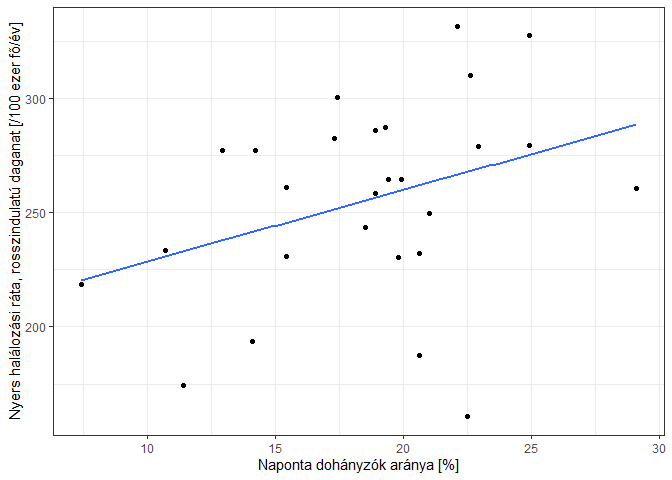<!-- -->

A pontok mindegyike egy országot jelöl; az ábrán behúztam az ezekre
legjobban illeszkedő egyenest is. Ahogy látszik, a legkevesebbet
dohányzó országok körében látható 220 körüli értékről 290 körülire
emelkedik az átlagos rák-halálozási ráta ahogy nő a dohányzók aránya. Ez
több mint 30% növekedés, avagy, másként kifejezve, 10 millió lakosra
7000-rel több rákos halálozás évente, tehát nem csak van összefüggés, de
elég drámai mértékű (Magyarországon általában évente 30 ezernél kicsit
több rákos halálozás van).

Látszólag tehát végeztünk is: valóban megmutattuk, hogy a dohányzás
rákot okoz! Immár teljesen tudományos alapon, konkrét számokkal,
adatokkal, pontokkal, legjobban illeszkedő egyenessel. Ha szeretnénk,
lehet még drámaibbá is tenni, például: „ha vissza tudnánk szorítani a
dohányzást hazánkban, 7000-rel kevesebben halnának meg rákban évente!”…

Első ránézésre úgy tűnik, hogy ezzel az elemzéssel nemhogy gond nincsen,
hanem voltaképp ezért csináltuk az egész adatgyűjtést. Hiszen mit
mondtunk az elején? Hogy azért érdekel minket, hogy hol, mikor és ki hal
meg, hogy ebből következtessünk az okozati viszonyokra. Tessék, ott ahol
többet dohányoznak, többen halnak meg rákban.

Igen ám, de. Mi van, ha elkészítjük *hajszálpontosan ugyanezt* az ábrát,
csak épp nem a dohányzást, hanem a cukorbetegek arányát ábrázoljuk?

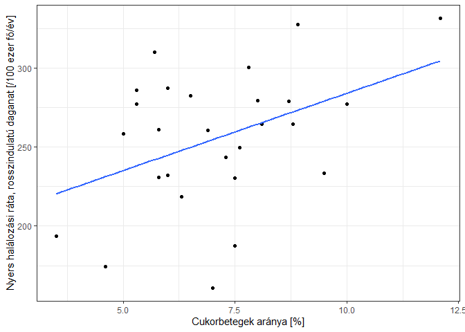<!-- -->

Tehát a cukorbetegség is hozzájárul a rákhoz: ahol több a cukorbeteg,
ott magasabb a rákhalálozás is.

Rendben, eddig semmi gond, miért ne lehetne, hogy a dohányzás is
hozzájárul a rákhoz, meg a cukorbetegség is? Teljesen logikus is. Igen
ám, csak nézzük meg ezt az ábrát:

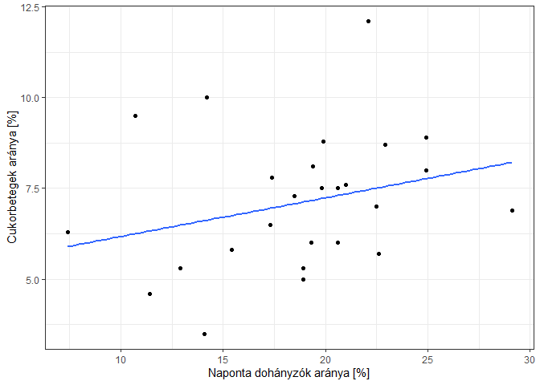<!-- -->

Úgy tűnik a kettő egymással is összefügg! Ahol több a dohányzó, ott több
a cukorbeteg is. Rendben, ez sem egy egetrengető dolog eddig…

…viszont, ha jobban elgondolkodunk ezen, akkor befészkelheti az agyunkba
magát egy nyugtalanító gondolat. Ha a dohányzás és a cukorbetegség
összefügg, és a cukorbetegség rákot okoz, akkor nem lehet, hogy a
dohányzásnak igazából nincs is szerepe, és az első ábrán csak azért
láttuk azt, mintha lenne, tehát, hogy a többet dohányzó országokban
azért volt több rákos, mert azokban az országokban *egyúttal* a
cukorbeteg is több volt? És ez volt a *valódi* oka annak, hogy ott több
a rákos, miközben a dohányzásnak nincs is semmi szerepe…?

A rövid válasz: de. Sajnos lehet. Nem *biztos*, hogy ez a magyarázat, de
lehetni lehet. És ezzel elértünk az ilyen típusú orvosi adatok
értelmezésének talán [legnagyobb
csapdájához](https://ferenci-tamas.github.io/orvosi-megismeres-modszertan/),
amit – magyarban is gyakran használt angol kifejezéssel –
confoundingnak, azaz „egybemosódásnak” szoktak hívni. A kifejezés nagyon
találó: mi van, ha a dohányzásbeli eltérés egybemosódik a
cukorbetegségbeli eltéréssel? Ez esetben simán előfordulhat, hogy csak a
dohányzást vizsgálva azt *hisszük*, hogy van kapcsolat, miközben a
valóságban nincsen – a dolog látszólagos, ami azon keresztül érvényesül,
hogy a többet dohányzó országokban több a cukorbeteg, és *az* a valódi
oka a több rák-halálozásnak.

Hogy lássuk, ez nem csak elméleti lehetőség, íme egy konkrét példa. Egy
gondolatkísérlet, a szónak abban az értelmében, hogy a következőkben
látott számok nem tényadatok, mint fent, hanem én gyártottam le ezeket a
példa kedvéért egy képletet használva – ez azért lesz nagyon jó, mert
így *biztosan* tudhatjuk, hogy mi van a háttérben, hiszen én állítottam
be. (A fenti tényadatokon ezt nem tudjuk vizsgálni, mert ott mi magunk
sem tudhatjak, hogy mi a valódi helyzet.) Hogy könnyebb legyen az
ábrázolás, a cukorbetegséget nem folytonos változónak tekintettem – hány
százalék cukorbeteg – hanem binárisnak: vagy sok cukorbeteg van (10%)
vagy kevés cukorbeteg van (5%) egy országban. Íme a szimulált adatok;
érdemes a továbbolvasás előtt jól megnézni, és kitalálni, hogy vajon mi
a valódi összefüggés, ami alapján gyártottam ezeket:

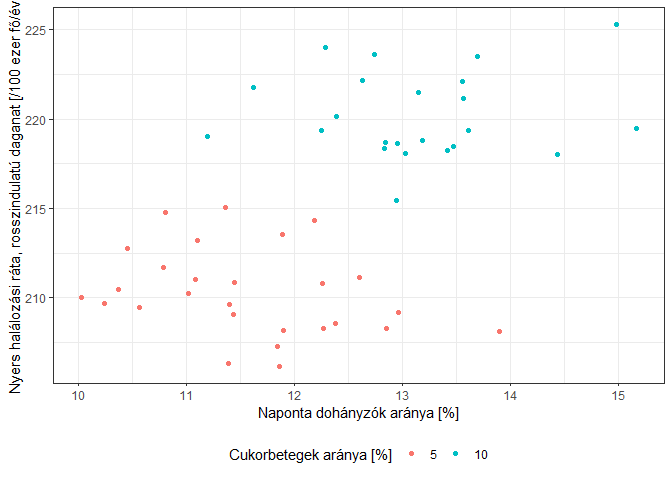<!-- -->

Mit látunk ezen az ábrán? Egyrészt azt, hogy a dohányzásnak nincs
hatása: akár sok cukorbeteg van az országban, akár kevés, a dohányzás
változása nem jár semmilyen érzékelhető változással a halálozásban. A
másik, ami rögtön látszik, hogy a cukorbetegségnek viszont nagyon is van
hatása: a több cukorbeteg magasabb halálozással jár együtt. A harmadik,
hogy a dohányzás és a cukorbetegség összefügg: a többet dohányzó
országokban inkább több a cukorbeteg is. Mindezek jelen esetben teljesen
biztosak, mert utólag elárulom, hogy így generáltam az adatokat: a
halálozási ráta egyenlő 200 plusz a cukorbetegek arányának kétszerese
plusz egy kis véletlen zaj.

És most jön a csavar: mit látunk, ha *csak* a dohányzást nézzük,
cukorbetegségről nem tudva, vagy azt figyelmen kívül hagyva? Ezt:

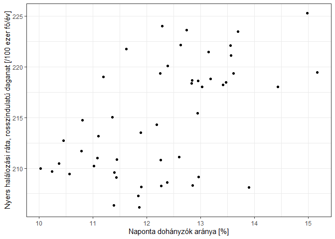<!-- -->

Ami nem más, mint a fenti ábra, csak épp színek nélkül. És mi látszik
rajta? Az, hogy a dohányzás és a rák-halálozás között pozitív
összefüggés van. Pedig valójában nincsen semmi! – és ez most ezúttal
teljesen biztos, hiszen így generáltuk az adatokat.

A helyzet tovább is durvítható:

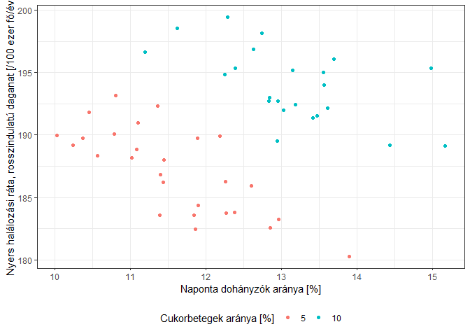<!-- -->

Mi látható itt? Ha kevés cukorbeteg van az országban, akkor a dohányzás
csökkenti (!) a rák-halálozást. Ha sok van, akkor *szintén* csökkenti. A
dohányzás tehát mindenképp jót tesz, viszont ha csak a dohányzás hatását
vizsgáljuk, elfelejtve a cukorbetegséget (azaz színek nélkül nézünk az
előbbi ábrára), akkor *itt is* azt látjuk, hogy ahol több a dohányzó,
ott több a rákos is!

A példa tartalmilag ugyan elég abszurd, de az nagyon fontos, hogy
*elvileg* ez is állhat a háttérben: mint a fenti példa bizonyítja,
*attól még*, mert több a rák-halálozás a többet dohányzó országokban,
akár az is elképzelhető, hogy a dohányzás *csökkenti* a rák-halálozást!
(Ha a többet dohányzó országokban több a cukorbeteg, ami rontja a
halálozást, annyira, hogy a rontó hatása nagyobb mint a dohányzás javító
hatása.)

Ez a confounding problémája! Az a megállapításunk (mert ez így van, ez
tényadatok kérdése), hogy a többet dohányzó országokban magasabb a
rák-halálozás, jelentheti azt, hogy a dohányzás rákot okoz, azt, hogy a
dohányzásnak nincs köze a rákhoz, és azt is, hogy a dohányzás véd a rák
ellen. Önmagában tehát ez az együttjárás jellegű megállapítás csak
nagyon-nagyon gyenge bizonyíték az okozati kapcsolatról, tehát arról,
hogy a dohányzás rákot okoz.

Fontos, hogy a „nagyon gyenge bizonyíték rá” természetesen *nem* azt
jelenti, hogy „bizonyíték az ellentétére”, tehát az, hogy valahol
szemfüles módon felismertük a confounding-ot, nem azt jelenti, hogy
bebizonyítottuk, hogy nincs összefüggés, pláne nem azt, hogy
bebizonyítottuk, hogy ellenkező összefüggés van – egyszerűen annyit
jelent, hogy az adatokból nem igazán tudtunk meg semmit. A dohányzás és
a rák-halálozás összefüggésének kiinduló idézetben szereplő bizonyítéka
valóban confounding-gal terhelt, de ennek felismerése nem jelenti azt,
hogy bebizonyítottuk, hogy nincs összefüggés a dohányzás és a rák között
között, pláne, hogy valójában véd a dohányzás. Egyszerűen annyit jelent,
hogy a fenti adatok *önmagukban* igen kevéssé bizonyítják, hogy rákot
okoz; ettől még okozhat, csak ez konkrétan egy nagyon gyenge
alátámasztása ennek.

Ássunk egy kicsit mélyebbre, hogy jobban megértsük a confounding-ot. Mi
vezetett ehhez a helyzethez…?

Az, hogy olyan országokat hasonlítottunk össze, amik nem *csak* egy
tényezőben tértek el. Összehasonlítottunk kevesebbet és többet dohányzó
országokat, és ha köztük *csak* a dohányzás ténye lett volna az egyetlen
eltérés, akkor ha találunk különbséget a rák-halálozásban, joggal
következtethettünk volna arra, hogy az a dohányzás miatt van. (Vagy a
véletlen ingadozás miatt, de ez kezelhető statisztikai eszközökkel.)
Hiszen más eltérés nincs, tehát szükségképp ez kell legyen a különbség
oka. A probléma az, hogy a többet és kevesebbet dohányzó országok nem
*csak* a dohányzás tényében térnek el. Sok minden másban is eltérnek – a
fenti példában a cukorbetegség előfordulásában – márpedig ha egyúttal
más tényezőben vagy tényezőkben is eltérnek, akkor onnantól kezdve, ha
találunk is különbséget a rák-halálozásban, nem tudhatjuk, hogy ennek mi
a *valódi* oka: a dohányzás, a dohányzással együtt járó egyéb eltérések,
vagy esetleg ezek valamilyen keveréke…?

Ez a confounding problémájának a magja, és mindig jelentkezik, ha olyan
csoportokat hasonlítunk össze, amik nem csak egyetlen tényezőben térnek
el. A valóság ráadásul ennél is sokkal, sokkal zűrösebb, hiszen az
országok nem két tényezőben térnek el, hanem sok százban, ezerben,
beláthatatlan számúban!

Egyetlen megjegyzés a végére. Ha valaki alaposan végiggondolja, akkor
feltűnhet, hogy igazából az előző, életkoros példa is hasonlít ehhez a
helyzethez: ott is összehasonlítunk csoportokat úgy, hogy nem csak az
ország ténye tér el, hanem az életkori összetétel is. A dolog nem
véletlen: valójában *az is* egy confounding! Pontosan ugyanaz a helyzet,
csak nem dohányzással és cukorbetegséggel, mint ami eltér országok
között, hanem korfával. Valójában tehát mindenhol a confounding volt a
probléma.

### Curry-evés Indiában és Magyarországon

*Indiában jóval több curry-t esznek mint Magyarországon, és nézd meg,
jóval kevesebb a halálozás emésztőrendszeri megbetegedésben! Egyél
curry-t az emésztőrendszeri betegségek megelőzésére!*

Ez lényegében az előző érv egy még gyengébb változata, hiszen nem is
több tucat országot nézve vonja le a következtetést, hanem pusztán
kettőből – mégis meglepően gyakran találkozni vele. Egyébként ezért
szeretem: még reklámot is láttam, amiben egy curry-kivonatot tartalmazó
kapszulát ilyesmi szöveggel adtak el, és azért szeretem, mert ez egy
profitorientált cég reklámja, tehát elemi érdeke, hogy működjön, hiszen
a pénze múlik rajta – nincs is kétségem, hogy tényleg működnek a
fentihez hasonló szövegek. Miközben gondoljuk végig, és ez a másik ok,
ami miatt szeretem ezt a példát, hogy itt aztán igazán nem kell hosszas
módszertani fejtegetés a confounding-ról, hogy az emberben felmerüljön:
teljesen tuti biztos, hogy India és Magyarország között az az egyedüli
és kizárólagos különbség, hogy ott sok curry-t esznek, itt meg keveset?
Semmi már eltérés nincs…? De mégis, újra mondom, működik ez a szöveg,
bármennyire is kézenfekvőnek tűnik ez a probléma! Ezért is nagyon
gyakori, hogy orvosi téren félreértések, rosszabb esetben félrevezetések
alapja a confounding (és pont ezért fontos jól ismerni!).

Hosszas magyarázat a fentiek után valószínűleg már nem szükséges: India
és Magyarország között milliónyi különbség van a curry-fogyasztás tényén
túl is, honnan tudjuk, hogy az emésztőrendszeri halálozásban tapasztalt
eltérésért a curry, és nem valamilyen egyéb eltérés (vagy ezek
valamilyen keveréke) a felelős? A probléma ugyanaz: nem *csak* egy
dologban eltérő országokat hasonlítunk össze.

Másként megfogalmazva: lehet, hogy Indiában kevesebb az emésztőrendszeri
halálozás miközben több curry-t esznek – de mi van, ha ott kevesebb
curry-t fogyasztva *még kevesebb* lenne…? Akkor a curry kimondottan
ártalmas!

Ez a gondolat elvezet minket egy másik megfogalmazáshoz: valójában nem
az az érdekes, hogy Magyarországon nagyobb-e az emésztőrendszeri
halálozás mint Indiában, hanem az, hogy egy „képzeletbeli Indiában”, ami
*csak* abban tér el Indiától, hogy kevesebb curry-t esznek, nagyobb-e!
Avagy fordítva, egy „képzeletbeli Magyarországon”, ami *csak* abban tér
el Magyarországtól, hogy több curry-t esznek, kisebb-e. Csakhogy ezt
*nem tudjuk*, mert Magyarország *nem* a fenti „képzeletbeli India”:
igen, kevesebb curry-t eszünk, eddig jó lenne, de sajnos van millió
egyéb eltérés is! És hasonlóan, India *nem* a fenti „képzeletbeli
Magyarország”, hiszen nem *csak* abban tér el, hogy több curry-t esznek.
Ha egy időgéppel visszamennénk Magyarország múltjába, és több curry-t
etetnénk (de *minden mást változatlanul* hagynánk!), akkor kevesebb
lenne az emésztőrendszeri halálozás? Avagy fordítva, ha egy időgéppel
visszamennénk India múltjába, és kevesebb curry-t etetnénk (de *minden
más változatlanul* hagynánk), akkor több lenne az emésztőrendszeri
halálozás?

Ezek a jó kérdések, csak az a probléma, hogy nincs időgép… Így
lényegében egy megfigyelhetőségi problémánk van: két dolgot kellene
összehasonlítani, de bárhogy igyekszünk, ebből egyet nem fogunk ismerni:
tudjuk, hogy mi van Magyarországon kevés curry-vel, de nem tudjuk mi
lett *volna* sokkal, és tudjuk mi van Indiában sokkal, de nem tudjuk mi
lett *volna* kevéssel. Fontos: az se megoldás, ha jövő évtől elkezdünk
rengeteg curry-t etetünk Magyarországon, hiszen akkor ugyanúgy hiányozni
fog a másik információ – soha nem tudjuk meg mi lett *volna*, ha nem
etetünk sok curry-t. Ugyanoda lyukadunk ki: a probléma, hogy nem tudjuk
mi lett *volna* ha *csak* egyetlen tényező változott *volna*.

(Zárójelben: ez a példa teljesen véletlenül egy másik korábbi
megjegyzésemre is illusztrációt szolgáltat: a curry aktív hatóanyaga, a
kurkumin jelen tudásunk szerint *tényleg* jót tehet bizonyos
emésztőrendszeri megbetegedésekben. Csak épp erre nem az a meggyőző
bizonyíték, hogy Indiában kevesebb az emésztőrendszeri betegség…)

### Infarktust okoz-e az új védőoltás?

*Tavaly bevezettek nálunk egy új oltást, és nézd meg idén mennyivel több
az infarktusos halál! Az oltás infarktust okoz!*

Mint volt róla szó, a confounding problémája akkor lép fel, ha nem
*csak* egy tényezőben eltérő csoportokat hasonlítunk össze. Ebből
fakadóan természetesen itt is igaz, hogy ez a probléma nem csak
különböző országok azonos évben vett adatainak vizsgálatakor
jelentkezhet (mint az összes fenti példában szerepelt), hanem ugyanazon
ország különböző évben vett adatainak a vizsgálatakor is. Hiszen a
jelenség ugyanaz: a különböző évek sem *csak* az oltás tényében térnek
el. Innen kezdve a probléma is ugyanaz: ha találunk is különbséget az
infarktus-halálozásban, honnan tudjuk, hogy az az oltás miatt volt, az
évek között milliónyi egyéb eltérés valamelyike miatt, vagy esetleg ezek
valamilyen keveréke miatt…?

Az előző okfejtés megfogalmazása is jól működik: a probléma az, hogy
minket valójában *nem* az érdekel, hogy a későbbi évben több-e az
infarktusos halál, hanem az, hogy egy olyan képzeletbeli évben több-e,
ami *csak* abban tér el a korábbitól, hogy ott már van oltás. Csakhogy a
későbbi év nem felel meg ennek a képzeletbeli évnek, hiszen nem *csak*
az oltás tényében tér el! Megint a megfigyelhetőségi probléma jön elő:
nem tudjuk, hogy mi lett *volna*, ha a későbbi évben nem lett *volna*
oltás – márpedig igazából ehhez kellene viszonyítani. De ezt mi sem
tudjuk, hiszen amikor már van oltás, akkor nem tudhatjuk, hogy mi lett
volna, ha nincs. Több infarktusos halál lett volna? (Az évek közötti
*egyéb* eltérések miatt.) Kevesebb? Ugyanannyi? Nem tudjuk!

Emiatt előállhat az a helyzet, hogy az oltás bevezetése után kevesebb
lett az infarktusos halálozás, de az oltás *mégis* infarktust okoz (ha
oltás bevezetése nélkül még kevesebb lett volna), vagy fordítva, több
lett, de az oltás *mégis* véd az infarktus ellen (ha oltás nélkül még
több lett volna). Ez a confounding problémája.

## A halálokok (betegségek) kódolásáról

Beszéljünk még egy látszólag technikai, de valójában fontos, és
önmagában is izgalmas kérdéskörről. Abból indultunk ki ebben az írásban,
hogy a kérdéseink vizsgálatához halálozásra vonatkozó adatokat
használunk, meg is tárgyaltuk, hogy miért, milyen módon, illetve, hogy
ennek milyen előnyei és limitációi vannak. Természetesen fontos lesz a
halálozás oka is, tehát, hogy milyen betegségbe halt bele az elhunyt,
hiszen így még finomabb elemzéseket tudunk készíteni. A haláloki
besorolás kérdését [érintettem
már](#mi%C3%A9rt-j%C3%B3k-a-hal%C3%A1loz%C3%A1si-adatok) ebben az
írásban is, hangsúlyozva, hogy ez a besorolás nem egyszerű (sőt, sokszor
nem is egyértelműen megoldható) feladat. Van azonban itt egy másik, e
problémától teljesen független kérdéskör: még ha félre is tesszük ezt,
és azt mondjuk, hogy egyértelműen meghatároztuk a halálokot, azt hogyan
adjuk meg?

Első ránézésre talán nem is érhető a probléma: hát leírjuk, hogy
„tüdőgyulladás”, aztán ennyi, nem? Valójában azonban van itt két nem
elhanyagolható apróság: az, hogy pontosnak és egységesnek kell lenni.
Mert mi az, hogy „tüdőgyulladás”? Ez nem egyetlen betegség, jó lenne
megkülönböztetni, hogy mi okozta: vírus, baktérium, gomba? Hiszen a
nagyobb felbontású, finomabb adat mélyebb elemzést tesz lehetővé.
Esetleg nem kellene még mélyebbre ásni, és megkülönböztetni azt is, hogy
pontosan milyen baktérium, pseudomonas vagy épp staphylococcus? Nem
kellene valahogy megadni, hogy milyen kiterjedt volt a tüdőgyulladás?
Vagy ennyire ne aprózzuk el, az egybevonható? Na és mi a helyzet a
veleszületett tüdőgyulladással, az is idetartozik egyáltalán? Egyszóval
nagyon gyorsan ezernyi kérdés merül fel, már egyetlen betegségnél is.
Ráadásul itt nemzetközi adatgyűjtésről van szó, tehát azt is el kell
érni, hogy a rendszert a világ összes országa elfogadja, és egységesen
használja (mellesleg tehát nyilvánvalóan valamilyen kódokra is szükség
lesz, nem lehet azt írni, hogy „tüdőgyulladás”).

A fentiekből összességében az látszik, hogy szükség volna az összes
létező betegség kellő részletezettségű, strukturált, *és* az egész
világon egységesen használt osztályozási rendszerére. Gigantikus
vállalkozásnak tűnik egy ilyen adatbázis összeállítása! És valóban az
is, de az Egészségügyi Világszervezet égisze alatt már több mint egy
évszázada folyik az ezt célzó – és véglegesen természetesen soha véget
nem érő – munka. Ennek az eredménye a Betegségek Nemzetközi
Osztályozása, röviden BNO (angolul International Classification of
Diseases, ICD).

A BNO lehetővé teszi, hogy az összes ismert, relevánsan elkülöníthető
betegséget leírjuk egyetlen kóddal, egy nemzetközileg egységes,
hierarchikus osztályozási rendszerben. A BNO-t folyamatosan
karbantartják, ám időnként teljes revíziót is tartanak, ami gyakran
fundamentálisan megváltoztatja a kódrendszert. Egyrészt mindig – és
általában igen nagy mértékben – bővül a rendszer: az 1-es revízióban
[191 betegség](https://www.meb.ki.se/svesan/ICD/icd1h.htm) szerepelt, a
11-esben nagyjából [17 ezer
van](https://www.who.int/news/item/14-02-2025-who-releases-2025-update-to-the-international-classification-of-diseases-(icd-11)).
De nem csak erről van szó: maga a felépítés, a struktrúra is gyakran
változik, ahogy igyekszik leírni az orvosi tudásunk egyre nagyobb
komplexitását. Ami azonban változatlan, hogy minden betegség egy
egyértelmű kóddal rendelkezik minden BNO verzióban (noha a kódnak a
struktúrája is változott az évtizedek alatt).

A BNO aktuális változata elvileg a 11-es, de az átállás még csak most
kezdődött meg, a mortalitási adatbázisban egyelőre még nincs 11-es
szerint jelentő ország. A 10-es verziót 1995 körül vezették be (azért
fogalmazok ilyen homályosan, mert több évnyi eltérések is vannak abban,
hogy melyik ország mikor állt át). A BNO-10-ben a kód formátuma – és
ebből fakadóan a hierarchia – a következő. A kód első karaktere egy
betű, ami a főcsoportot adja meg (pl. C: „rosszindulatú daganatok”). A
második és harmadik karakter szám, ami ezen belül adja meg a betegséget
(pl. C92: „myeloid leukémia”); ezek általában valamilyen logikus –
jellemzően anatómiai vagy klinikai – sorrendben vannak megadva (példának
okáért, C00-tól C14-ig az az ajak, a szájüreg és garat rosszindulatú
daganatai vannak, C15 a nyelőcső rosszindulatú daganata, C16 a gyomoré
és így tovább a tápcsatorna mentén). A negyedik karakter a betegség
további lebontása, jellemzően típus vagy anatómiai lokalizáció szerint
(pl. C925: „akut myelomonocytás leukémia”). A WHO ezt az első 4
karaktert kontrollálja központilag, az 5. karaktert az egyes országok
szabadon használhatják fel saját – finanszírozási,
tudományos-statisztikai vagy egyéb célt szolgáló – osztályozásukra (pl.
Magyarországon C9251: „akut myelomonocytás leukémia, alacsony-közepes
malignitás”).

A 9-es revízióban ennél sokkal szimplább volt a struktúra: egész
egyszerűen 1-től kezdődően meg voltak számozva a betegségek, azzal, hogy
az összetartozóak egymás után jöttek (tehát például 1-től 139-ig a
fertőző és parazitás betegségek szerepeltek, 140-től 239-ig a különböző
ráktípusok; tehát ezt a strukturáltságot maga a kód nem jelölte, 139 egy
fertőző betegséges kód, a 140 meg egyszercsak a nyelvrák). Ezen kívül
voltak kiegészítő kódok: E betűvel kezdődtek a mortalitás külső okai, V
betűvel lehetett egyéb eseményeket (pl. laborvizsgálat, szülés) kódolni.
Ezek mind háromjegyű kódok voltak, de elvileg a BNO-9-ben is lehetett
részletesebb kódokat használni (pl. 041 a máshová nem osztályozott
bakteriális fertőzés, 041.0 a streptococcus okozta fertőzés, 041.02 a B
csoportú streptococcus okozta fertőzés); ezt azonban ritkán használták.

Én most adottságnak vettem a BNO-t, de azért egy mondattal érdemes
megjegyezni, hogy [szó nincs
róla](https://www.sciencedirect.com/science/article/abs/pii/S1386505698001713?via%3Dihub),
hogy maga az osztályozási rendszer teljesen problémamentes volna. (És
akkor arról nem is beszéltünk, hogy ha nem haláloki, hanem megbetegedési
besorolásról beszélünk, akkor a kódolást a kórházak anyagi érdekei is
[befolyásolhatják](https://www.sciencedirect.com/science/article/abs/pii/S0168851006001369),
a finanszírozási rendszertől függő módon, még egy tökéletes osztályozási
rendszer esetén is; szerencsére ez halálozási adatoknál nem releváns.)

Egy dologról kell még szót ejteni: a felbontásról. Nem minden ország és
minden évben használta ugyanis még az aktuális revízión belül sem az
elérhető legrészletesebb kódot, néha csak nagyobb, összevontabb
kategóriákat jelentettek. (Például nem azt adták meg, hogy hány akut
myelomonocytás leukaemia, C925, volt – és külön azt, hogy mennyi akut
myeloid leukémia, C920, mennyi krónikus myeloid leukémia, C921, stb. –
hanem csak azt, hogy mennyi myeloid leukaemia, C92.) Ilyen szemmel nézve
azonnal feltűnik a BNO-10 egy nagy előnye (avagy, fordítva nézve, a 9-es
revízió nagy hátránya). Jelesül, hogy a 10-es verzióban ezeket az
összevonásokat automatikusan el lehet végezni, egyszerűen csak le kell
vágni a kód végét: C9251 az „akut myelomonocytás leukémia,
alacsony-közepes malignitás”, de ha levágom az utolsó karaktert, akkor
az „akut myelomonocytás leukémia” kódját kapom, ha még egyet levágok,
akkor a „myeloid leukémia”-ét, ha pedig csak a legeleső betűt tartom
meg, akkor azt kapom, hogy „rák”. Ez egy nagyon kellemes tulajdonsága a
BNO-10-nek, de sajnos a 9-ben, a korábban már látott egyszerű
felsorolásból adódóan, értelemszerűen nincs meg. (Kivéve a
háromjegyűeken túli kiterjesztéseket, azok így működnek, de a háromjegyű
kódok maguk nem.) Azért, hogy ezen segítsenek, és a 9-es revízióban is
lehessen nagyobb csoportokról beszélni, jobb híján erre létrehoztak egy
külön listát, amelynek a kódjai ezeket a nagyobb csoportokat
tartalmazzák; például a 22-es kód azt jelenti, hogy „idegrendszer
betegségei” és tartalmazza az összes kódot 320-tól 359-ig. Mint látható,
ezt sem a legszerencsésebben sikerült megoldani, mert a összevont lista
olyan kódokat használ, amik lehetnének az összevonás nélküli, teljes
lista kódjai is (a 22 a lépfene kódja), ezért a WHO megkülönböztetésül
egy B betűt ír az összevont listás kódok, elé, így ha B22-t látunk,
akkor lehet tudni, hogy az az összevont lista 22-es kódja, nem a sima
lista 22-ese. Ráadásul, ha szeretnénk többféle szintű, kisebb és nagyobb
összevonást, akkor azt is kézzel kell megoldani, de itt igyekeztek némi
hierarchiát tartani: B220 jelenti a különböző meningitiseket (a kódok
320-tól 329-ig).

Azt, hogy ki melyik BNO verziót, és azon belül milyen felbontást
használt adott évben, a `List` nevű, három karakterből álló mező adja
meg. E mező jellemző formátuma az, hogy az első két karakter a BNO
revíziószáma (09 a 9-es verzió, 10 a 10-es stb.), a harmadik karakter a
jelentés formátuma. Például a 104-es kód azt jelenti, hogy BNO-10
revízió szerint, az első 4 karaktert megadva. 103-as kód: BNO-10 revízió
szerint, az első 3 karaktert megadva. (Mint láttuk, ez automatikusan
jelent különféle mélységű hierarchikát, úgyhogy itt elég megadni, hogy
hány karaktert közlünk.) A 9-es revíziónál zűrösebb a helyzet. Itt négy
különböző változat is van (09A, 09B, 09C és 09N) ezek abban térnek el,
hogy pontosan milyen összevonási listát használnak: a 09A és 09B az,
amit én az imént leírtam (azzal az egészen minimális eltéréssel, hogy az
B-ben hiányzik egy speciális, egyetlen ország egyetlen évében használt
kód, de cserében szerepel benne két kód a HIV-re), a 09C és 09N pedig
még jobban összevont, nem-standard listák, előbbit Kína, az utóbbiakat a
szovjet utódállamok használták egy ideig.

Ha valakit csak az utóbbi nagyjából 30 év adatai érdekelnek, akkor
nincsen probléma, mert ez egységesen a BNO-10 érája, tehát minden adat
ugyanabban a kódrendszerben van (legfeljebb a felbontás lehet a kérdés).
Szerencsére nagyon sok problémánál ez elég is, hiszen érthető módon sok
kérdés megválaszolásához elég a utóbbi pár évtized adata. De mi a
helyzet akkor, ha szeretnénk régebbre visszamenni? Adja magát a
probléma: valahogy össze kellene kötni a különböző kódrendszereket…! Ezt
azonban könnyebb mondani, mint megcsinálni. A probléma egy része
ránézésre, már a fenti leírás alapján látszik: ha régen kevesebb kód
volt, most meg több van, akkor szükségszerűen adódik, hogy lesznek olyan
esetek, ahol több különböző mai kódnak ugyanaz a régi kód felel meg. (Ez
nem probléma akkor, ha a mai adatokat a régi rendszerben akarjuk
kifejezni – egyszerűen össze kell adni a ma különböző kódon jelentett
számokat – de probléma akkor, ha a régi adatokat a mai rendszerben
akarjuk kifejezni, hiszen nem tudjuk megmondani, hogy a régi kódon
jelentett számot milyen arányban osszuk szét a több új kód között.) Ha
csak ennyi lenne a gond, ezen még valamennyire lehetne segíteni. Az
egyik megoldás az ún. bridge-coding, ami azt jelenti, hogy ugyazon év
adatait elkódolják így is, meg úgy is, a régi rendszerben és az új
rendszerben is, ami szó szerint felesleges munka, de pont az a célja,
hogy az ilyen összekapcsolásokat támogassa (például: ki lehet belőle
olvasni a szétosztási arányokat; kérdés persze, hogy ez időben
állandó-e). Ezt meg is szokták csinálni ténylegesen, és fontos, hasznos
eszköz is, de sajnos a problémák nem érnek itt véget. Valóbaján ugyanis
olyan esetek is vannak, amikor több régi kódnak felel meg egy új,
olyanok is, amikor nem egyértelmű, hogy melyik kód melyiknek felel meg,
egyszóval a kód-szintű leképezés különböző BNO-revíziók között messze
nem triviális feladat. Vannak tanulmányok melyek – sokszor igen
fáradságos munkával – igyekeztek
[megvalósítani](https://www.tandfonline.com/doi/abs/10.1080/01615440.1996.10112731)
teljeskörűen ezt az összekapcsolást, igyekezvén
[rekonstruálni](https://link.springer.com/article/10.1007/s10680-017-9453-1)
a hosszú távú halálozási idősorokat, esetleg csak [egy
irányban](https://link.springer.com/article/10.1007/s10654-023-01027-y),
léteznek különféle [táblázatok és
adatbázisok](https://www.cms.gov/medicare/coding-billing/icd-10-codes/icd-10-cm-icd-10-pcs-gem-archive)
az összekapcsolásra, amelyek persze, az előbbiekből adódóan, soha nem
lehetnek tökéletesek, [vizsgálják
is](https://www.ahajournals.org/doi/10.1161/CIRCOUTCOMES.118.004782)
ezek jóságát; egy szó mint száz, ez egy nehéz, zűrös terület.

Azért, hogy ezeket a zűröket elkerüljem, én egy szerényebb célt tűztem
ki magam elé: nem kód-, hanem csoportszinten igyekeztem összekapcsolni a
különböző verziókat. Tehát nem arra törekedtem, hogy az „akut
myelomonocytás leukémia” megfelelőjét megtaláljam, megelégedtem azzal,
hogy a „rosszindulatú daganat” – vagy legfeljebb a „leukémia” –
megfelelőjét megtaláljam. Ez azért nagy könnyítés, mert a zűrök abszolút
túlnyomó többsége csoporton *belül* jelentkezik: régi rák-kód szinte
biztos, hogy új rák-kódnak felel meg, és viszont (még ha nem is
egyértelmű vagy egyszerű, hogy melyiknek). Ezért a csoportszintű
megfeleltetés sokkal egyszerűbb, reálisabb – és sokkal aggálytalanabbul
elvégezhető – feladat. (Azt csak halkan teszem hozzá, hogy a BNO-9
esetében a WHO adatbázisában kizárólag összevont listás kódok vannak,
tehát ott, ha akarnánk sem tudnánk legfinomabb kód-szinten
összekapcsolni, ez a kérdés fel sem merül.) Az általam használt
összekapcsolást a lenti kód `ICDGroups` változója mutatja. Ehhez alapul
vettem egy releváns kanadai
[publikációt](https://www150.statcan.gc.ca/n1/pub/84-548-x/84-548-x2005001-eng.htm)
(különösen a [2.
táblázatát](https://www150.statcan.gc.ca/n1/pub/84-548-x/2005001/t/4078901-eng.htm)
és a [4.
táblázatát](https://www150.statcan.gc.ca/n1/pub/84-548-x/2005001/t/4158977-eng.htm)),
egy kanadai tartomány
[tanulmányát](https://open.alberta.ca/dataset/0778534944) és egy holland
[publikációt](https://link.springer.com/article/10.1007/s10680-013-9307-4)
(különösen a [2.
táblázatát](https://link.springer.com/article/10.1007/s10680-013-9307-4/tables/2));
de ebben az esetben valójában legtöbbször józan ésszel is egyértelmű
volt a helyzet.

Jelen állás szerint a 104-es kódú adatokat használtam teljeskörűen, az
összes többiből pedig azokat, amiknél elkészült a megfeleltetési tábla.
(Technikailag ez úgy néz ki, hogy minden adatot beolvasok, de amikhez az
`ICDGroups` táblában nincs bejegyzés, azok nem fognak látszódni a
felületen.)

És még egyetlen megjegyzés a végére. A fentiekben végig a BNO különböző
revízióiról volt szó (ami nagyon ritkán változik, évtizedes az a
nagyságrend, amíg új készül), de említettem, hogy egy revízión belül is
vannak frissítések. Ezek hatása sem feltétlenül elhanyagolható, erre
nagyon jó példa pont Magyarország, ahol 2005-ben történt – ugyanazon
BNO-revízió éráján belül! – egy nagyon komoly
[változás](https://www.ksh.hu/evkonyvek/2020/demografiai-evkonyv-2020/pdf/valtozasok_2005_2020.pdf),
ami miatt érzékelhetően megváltoztak, egyik évről a másikra, a haláloki
besorolások (bizonyos halálokok visszaszorultak, másokból több lett).
Azért is hangsúlyozom, hogy egyik évről a másikra, mert jól mutatja,
hogy ez a halálokok közötti átrendeződés nem valamiféle természetes
változás eredménye, hanem tisztán az osztályozási rendszer
(változásának) hatása.

## Az adatok begyűjtése és előkészítése

Az adatok előkészítése két alapvető feladatot jelent: a mortalitási
adatbázis és a lélekszámra vonatkozó adatok előkészítését. Ezt egészíti
ki a BNO-kódok és az országnevek előkészítése.

A feladatot az [R statisztikai
környezet](https://ferenci-tamas.github.io/r-nyelv/) alatt oldottam meg,
a `data.table` csomagot használva:

``` r
library(data.table)
```

### A mortalitási adatbázis előkészítése

A mortalitási adatok (halálozások számai) az Egészségügyi Világszervezet
(WHO) mortalitási
[adatbázisából](https://www.who.int/data/data-collection-tools/who-mortality-database)
származnak. Ez tartalmazza az egyes jelentést adó országok halálozási
számait év, halálok, életkor és nem szerint lebontva. A haláloki
besorolás az – éppen aktuális – BNO szerint történt; e rendszer
részleteit korábban már tárgyaltam. Ami a maradék két tényezőt illeti:

- Az életkori felbontás nem biztos, hogy ugyanaz minden országban,
  illetve évben. A WHO 9 különböző életkori lebontási lehetőséget
  használ, a `Frmat` nevű változó adja meg, hogy egy adott ország egy
  adott évben melyiket alkalmazta. A 0-s a legfinomabb felbontás (0-tól
  4 évig évente, onnantól 5 évente 95-ig, a fölött egyben), az 1-es
  ugyanaz, de már 85 felett egyben, és így tovább, a 8-asban 1-4 után
  már 10 éves csoportok jönnek, és az is csak 65 évig, a fölött egyben,
  míg a 9-es az, ha nincs életkori lebontás. Én most, a későbbi
  elemzések miatt, csak a 0-s, 1-es és 2-es kategóriájú adatokat fogom
  használni; szerencsére ez az országok nagy részét jelenti, pláne a
  fejlett világban. (Ez megfelelő, tehát ehhez passzoló részletezettségű
  lélekszám adatokat is igényel, és persze odafigyelést a kódolás során
  arra, hogy melyik ország/év melyik csoportba tartozik. Az sem biztos,
  hogy egy ország minden évben ugyanazt a bontást használja.)
- A nem változó az alany születési nemét jelenti, 1 (férfi) vagy 2 (nő)
  értéket vehet fel, ezen kívül a 9-es (ismeretlen) fordul elő, de
  nagyon kis számban, ezeket elhagytam.

Az adatok (adott esetben több) tömörített fájlban érhetőek el,
BNO-revíziók szerint külön-külön. Ezeket a fájlokat letöltjük, kibontjuk
egy ideiglenes mappába, majd beolvassuk. Szerencsére a formátumuk
állandó, és a `data.table::fread` pontosan felismeri:

``` r
td <- tempdir()

unzip("./inputdata/morticd10_part1.zip", exdir = td)
unzip("./inputdata/morticd10_part2.zip", exdir = td)
unzip("./inputdata/morticd10_part3.zip", exdir = td)
unzip("./inputdata/morticd10_part4.zip", exdir = td)
unzip("./inputdata/morticd10_part5.zip", exdir = td)
unzip("./inputdata/morticd10_part6.zip", exdir = td)

unzip("./inputdata/morticd09.zip", exdir = td)

RawData <- rbindlist(lapply(list.files(td, pattern = "Morticd*",
                                       full.names = TRUE), fread))
```

Problémát jelenthetnek az ország-kódok, amelyek egy elég szokatlan,
szerintem egyedül a WHO által használt kódrendszerrel vannak kódolva
(pl. Magyarország kódja 4150). Szerencsére a WHO honlapjáról letölthető
egy olyan
[táblázat](https://apps.who.int/gho/data/node.metadata.COUNTRY?lang=en),
melyben a szokásosabb kódok is megtalálhatóak e mellett, így ez
lecserélhető valamilyen bevettebb kódra; én most a [háromjegyű ISO
kódot](https://www.iso.org/iso-3166-country-codes.html) fogom a
későbbiekben használni az egyértelmű azonosításhoz:

``` r
# CountryCodes <- fread(
#   "https://apps.who.int/gho/athena/data/xmart.csv?target=COUNTRY&profile=xmart")
CountryCodes <- fread("xmart.csv")
```

Nézzük meg, hogy ez összekapcsolható-e a korábbi táblával, azaz, minden
ország(kód) megvan-e:

``` r
unique(merge(RawData,
             CountryCodes[, .(Country = MORT, CountryName = DisplayString,
                              iso3c = ISO, Region = WHO_REGION_CODE)],
             by = "Country", all.x = TRUE)[is.na(iso3c)]$Country)
```

    ## [1] 1303 3283

Ez két egészen minimális eltérés, de a teljesség kedvéért pótoljuk ki
(pláne, mert a WHO táblázatában igazából megtalálhatóak, csak a
mortalitási tábla szerinti kód nincs feltüntetve valamiért):

``` r
CountryCodes[DisplayString == "Mayotte"]$MORT <- 1303
CountryCodes[DisplayString == "occupied Palestinian territory, including east Jerusalem"]$MORT <- 3283
```

Most már végrehajthatjuk veszteség nélkül az összekapcsolást:

``` r
RawData <- merge(RawData,
                 CountryCodes[, .(Country = MORT, CountryName = DisplayString,
                                  iso3c = ISO, Region = WHO_REGION_CODE)],
                 by = "Country")
```

Javítsunk még két elég nyilvánvaló elírást:

``` r
RawData[iso3c == "CYM" & Year == 2014]$Frmat <- 2
RawData[iso3c == "IRL" & Year %in% c(2016, 2017, 2019, 2020)]$Frmat <- 2
```

Dobjuk ki az életkori bontás nélküli országokat/éveket, illetve azokat
is, ahol nincs legalább 85 éves korig legalább 5 évente felbontva az
elhunyt életkora (ez azt jelenti, hogy csak a 0, 1 és 2 életkori
formátumkódú országokat/éveket tartjuk meg):

``` r
RawData <- RawData[Frmat %in% c(0, 1, 2)]
```

Van összesen 3668443 életkorhoz nem rendelt halálozás, de ezek aránya
nagyon egyenetlenül oszlik ezl az országok között. Most kidobjuk azokat
az országokat, ahol a halálesetek több mint 5 ezreléke nincs életkorhoz
rendelve:

``` r
RawData <- RawData[!iso3c %in% RawData[
  , .(sum(Deaths26, na.rm = TRUE)/sum(Deaths1) > 0.005),
  .(iso3c)][V1 == TRUE]$iso3c]
```

A maradéknál az életkorhoz nem rendelt halálozásokat automatikusan el
fogjuk majd hagyni (később, amikor majd long formátumra váltunk).

Van 84604 nemhez nem rendelt halálozás, ezeknek pláne kicsi a száma
(egyik országnál sincs 5 ezrelék felett), úgyhogy egyszerűen elhagyjuk:

``` r
RawData <- RawData[Sex != 9]
```

A következő feladat a három különböző életkori felbontás kezelése.

Először is, a `Deaths23` tartalma problémás, ugyanis függ a formátumtól:
0-s formátumban azt jelenti, hogy „85-89”, viszont 1-es és 2-es
formátumban azt, hogy „85 vagy afölött”. Azért, hogy ettől
megszabaduljunk, bevezetünk egy új változót, mely nevében is utal arra,
hogy összevont életkori kategória, ebbe belementjük az 1-est és a 2-est,
és az eredeti `Deaths23`-at ezeknél `NA`-ra állítjuk, így a `Deaths23`
jelentése tiszta lesz. Az újonnan bevezett változót meg természetesen a
0-snál állítjuk `NA`-ra:

``` r
RawData$Deaths232425 <- ifelse(RawData$Frmat == 0, NA, RawData$Deaths23)
RawData$Deaths23 <- ifelse(RawData$Frmat == 0, RawData$Deaths23, NA)
```

Ugyanez a helyzet a `Deaths3`-mal, ami a 2-es formátumnál jelent mást.
Itt viszont az összevont kategóriát az összesnél elmentjük, de ennek
teljesen más oka van (a referencia-populáció is csak az összevont
életkori kategóriát fogja tartalmazni):

``` r
RawData$Deaths3456 <- ifelse(
  RawData$Frmat == 2, RawData$Deaths3,
  RawData$Deaths3 + RawData$Deaths4 + RawData$Deaths5 + RawData$Deaths6)
RawData$Deaths3 <- ifelse(RawData$Frmat == 2, NA, RawData$Deaths3)
```

Ezután átalakítjuk az adatokat a későbbi feldolgozást lényegesen
megkönnyítő long formátumra, a WHO által megadott wide formátumról. Itt
hagyjuk el a korábban már említett `Deaths26`-ot (egyszerűen azáltal,
hogy nem választjuk ki), illetve hasonlóan a `Deaths1`-et, ami az összes
halálozás, de erre nincs szükség, mert redundáns, ezt úgyis elő tudjuk
állítani később:

``` r
RawData <- melt(RawData[
  , c("iso3c", "Year", "List", "Cause", "Sex", "Frmat",
      paste0("Deaths", 2:25), "Deaths3456", "Deaths232425")],
  id.vars = c("iso3c", "Year", "List", "Cause", "Sex", "Frmat"),
  variable.name = "Age")
```

Ahol `NA` van az életkornál, az a fenti manőverjeink miatt van: ez jelzi
azt, hogy az adott életkori bontásnál a kérdéses kategória nem
jelentett. Long formátumban viszont egyszerűen elhagyhatjuk ezeket:

``` r
RawData <- RawData[!is.na(value)]
```

Még egy előkészítő lépést teszünk. A 104-es formátum esetében a W00-Y34
kódok kilenc kivételtől eltekintve (W26, X34, X47, X59, X67, X88, Y06,
Y07, Y17) nincsenek alábontva három karakteren túl, ennek ellenére néhol
szerepel az adatbázisban negyedik karakter is. Ennek az az oka, hogy a
kód-kézikönyv ezekben az esetekben megengedi egy ún. „előfordulás helye”
kód alkalmazását (0: otthon, 1: bentlakásos intézmény stb.); ez kerülhet
a 4. karakter pozíciójába. Mivel ennek az alkalmazása nem egységes (van
ország, ami ilyen kódra is jelentett eseményt, de az alábontás nélküli,
három karakteresre is – noha a 9-es kód az, hogy nem meghatározott
helyen), ráadásul elvileg itt egy tevékenység-kód is szerepelhet, ami
azt adja meg, hogy milyen tevékenység közben következett be az esemény,
így ezeket most össze fogjuk vonni (magyarán eldobjuk ezeket a további
információkat). Ez tudatos információvesztés, bár vélhetően szinte nulla
jelentőségű; ha valakinek mégis kellene ez, akkor a nyers adatbázisból
természetesen kiolvasható. Az átalakítás:

``` r
RawData[List == "104" & substring(Cause, 1, 1) == "W",
        Cause := substring(Cause, 1, 3)]
RawData[List == "104" & substring(Cause, 1, 1) == "X",
        Cause := substring(Cause, 1, 3)]
RawData[List == "104" & substring(Cause, 1, 3) %in%
          paste0("Y", sprintf("%02d", setdiff(0:34, 6:7))),
        Cause := substring(Cause, 1, 3)]
```

(Mint látható, a kilenc kivételből hétnél mégis összevontam az adatokat,
csak kettőnél – Y06 és Y07 – nem. Ennek az az oka, hogy nagyon úgy
tűnik, hogy a maradék hétnél, hiába is van hivatalos alábontás, nem azt
használták, hanem az előfordulás helye kódot, ugyanis megjelennek
ezeknél olyan negyedik számjegyek, amik a hivatalos alábontás szerint
nem is létezhetnének – viszont az előfordulás helye szerint igen.
Akárhogy is, ez nem volt egyértelműen beazonosítható, úgyhogy a
háromkarakteres főcsoportra redukáltam őket, ami viszont már az.)

Természetesen nem elég pusztán a kódokat összevonni, hiszen így
duplikátumok keletkeznek a sorokban, amiket szintén össze kell vonni,
szummázással:

``` r
RawData <- RawData[, .(value = sum(value)),
                   .(iso3c, Year, List, Cause, Sex, Frmat, Age)]
```

A WHO adatbázisában a BNO-kódok még a 104-es formátumban sem mind 4
jegyűek. Ennek az az oka, hogy amelyik kódnál nincs alábontás, tehát nem
is szerepel 4 jegyű kategória alatta, ott a kód három karakterrel
szerepel. (Sajnos ez nem konzisztens, de erről majd később, a
BNO-kódoknál.) A magyar szokás azonban az, hogy a kódok mindenképp 5
jegyűek legyenek, ezért a 4 jegyűek végére „0”-t, a 3 jegyűek végére
„H0”-t kell fűzni a hazai konvenció szerint; tegyük ezt most meg, hogy
később össze tudjuk kapcsolni a WHO-s mortalitási táblákat a magyar BNO
táblával:

``` r
RawData[List == "104" & nchar(Cause) == 3,
        Cause := paste0(Cause, "H0")]
RawData[List == "104" & nchar(Cause) == 4,
        Cause := paste0(Cause, "0")]
```

Ezután már csak technikai apróság van hátra: a kategoriális változókat
alakítsuk tényleg faktorrá (ez a nem esetén fontosabb, mert ott így
címkét is adhatunk, de a többinél is érdemes, mert jelentősen csökkenti
a tárigényt, mivel nem szövegeket kell tárolni). Ugyanez okból állítsunk
be egy kulcsot is:

``` r
RawData$iso3c <- as.factor(RawData$iso3c)
RawData$List <- as.factor(RawData$List)
RawData$Cause <- as.factor(RawData$Cause)
RawData$Sex <- factor(RawData$Sex, levels = 1:2, labels = c("Férfi", "Nő"))
RawData$Frmat <- as.factor(RawData$Frmat)
```

A WHO adatbázisának megvan az a problémája, hogy a 0-s adatok – az
életkor kivételével – nem 0-val szerepelnek, hanem egyszerűen
hiányoznak. (Magyarán, ha például egy BNO-ból egyáltalán nem volt adott
országban és adott évben halálozás, akkor nem 0-val fog szerepelni az
adott BNO, hanem nem lesz benne a BNO a kérdéses országban és évnél. Az
életkor azért kivétel, mert az külön oszlopokban van az eredeti
táblában, így ott a 0-k is mindenképp ki vannak írva.) Ahhoz, hogy ezt
később tudjuk kezelni, muszáj tudnunk, hogy egyáltalán milyen
kombinációk léteznek. Ehhez az sem elég, ha változónként külön-külön
feljegyezzük, hogy mik a lehetséges értékeik – ami R-ben a faktorral
könnyen megvalósítható lenne – hiszen azoknak meg nem minden
kombinációja lesz valid, például egy országnak egy évben csak egyféle
életkor-formátuma lesz, nem mindhárom. Ezért itt nincs más lehetőség,
egyszerűen megnézzük a konkrét kombinációkat. Egyedül a nemet kell külön
kezelni: mivel elképzelhető, hogy a nem sincs beírva (ha abból nem volt
halálozás), így ott kézzel tesszük hozzá, hogy gondoskodjunk róla, hogy
biztos mindkettő meglegyen. Felmerülhet, hogy a BNO-kódokat miért nem
mentjük el – ennek az az oka, hogy hatalmas táblát eredményezne, és
feleslegesen, mert a `List`-ből úgyis kiolvasható, hogy milyen kódok
lehetségesek, így azt racionálisabb lesz majd csak a ténylegesen
szükséges kódokkal felfújni. Így a végleges megvalósítás:

``` r
RawDataAll <- unique(RawData[, .(iso3c, Year, List, Age, Frmat)])
RawDataAll[, .N, .(iso3c, Year, List, Age, Frmat)][N > 1]
```

    ## Empty data.table (0 rows and 6 cols): iso3c,Year,List,Age,Frmat,N

``` r
RawDataAll <- rbind(cbind(RawDataAll, Sex = "Férfi"),
                    cbind(RawDataAll, Sex = "Nő"))
setkey(RawDataAll, iso3c, Year, Sex, Age)
saveRDS(RawDataAll, "./procdata/RawDataAll.rds")
```

Visszatérve a fő-fájlra, érdemes kulcsot beállítani a későbbi gyorsabb
leválogatás érdekében (ez egyúttal fizikailag is sorbarendezi az
adatbázist, ami a későbbi kimentésnél, helyigény szempontjából is jobb):

``` r
setkey(RawData, iso3c, Year, Sex, Age)
```

Ezután már kimenthetjük a végleges adatbázist. Fontos észrevétel:
nyugodtan megtehetjük, hogy csak azokat mentjük ki, ahol nem 0 az érték!
(Gondoljunk bele: ha valahol nem volt az adott BNO vagy nem, az amúgy is
0 lenne! A kulcs itt az, hogy a `RawDataAll`-nak köszönhetően tudjuk
rekonstruálni a vázat, 0-któl függetlenül is, így sokkal takarékosabb,
ha azt nem is mentjük ki). Azaz:

``` r
saveRDS(RawData[value > 0], "./procdata/WHO-MDB.rds")
```

Mentsük ki `feather` formátumban is, a weboldal később ezt fogja
használni (mert gyorsabb beolvasni):

``` r
arrow::write_feather(RawData[value > 0], "./procdata/WHO-MDB.feather")
```

### Az országnevek és -azonosítók előkészítése

A későbbiekhez jól fog jönni egy lista az országokról (kóddal és
névvel). A `countries` csomaggal magyar fordítást is kérünk; néhány
kivétellel (ezeket a kódokat nem ismeri) mindenhol működik. Ezeket a
kivételeket mentsük el kézzel külön:

``` r
CountryCodes <- CountryCodes[
  ISO %in% unique(RawData$iso3c) &
    !ISO%in%c("X10", "X11", "X12", "XOD", "ANT", "SCG", "X13", "XX5",
              "XX6", "XX7", "XX9")]
CountryCodes <- CountryCodes[
  , .(iso3c = ISO,
      Country = countries::country_name(DisplayString, to = "name_hu"))]
CountryCodes <- rbind(
  CountryCodes,
  data.table(
    iso3c = c("X10", "X11", "X12", "XOD", "ANT", "SCG", "X13", "XX5", "XX6",
              "XX7", "XX9"),
    Country = c("Anglia és Wales", "Észak-Írország", "Skócia", "Rodrigues",
                "Holland Antillák", "Szerbia és Montenegró", "Jugoszlávia",
                "Csehszlovákia", "Német Demokratikus Köztársaság",
                "Német Szövetségi Köztársaság", "Szovjetunió")))
```

Ezután kimenthetjük az adatokat:

``` r
CountryCodes <- setNames(CountryCodes$iso3c, CountryCodes$Country)
saveRDS(CountryCodes, "./procdata/CountryCodes.rds")
```

A későbbiekhez jól fog jönni ha az európai országokat besoroljuk nagyobb
régiók szerint is:

``` r
EUCountries <- list(
  "EU27" = countrycode::countrycode(eurostat::eu_countries$code,
                                    "eurostat", "iso3c"),
  "EU15" = c("AUT", "BEL", "DNK", "FIN", "FRA", "DEU", "GRC", "IRL", "ITA",
             "LUX", "NLD", "PRT", "ESP", "SWE", "GBR"),
  "EU11" = c("CZE", "EST", "HUN", "LVA", "LTU", "POL", "SVK", "SVN", "BGR",
             "ROU", "HRV"),
  "V4" = c("SVK", "CZE", "HUN", "POL")
)
```

### A BNO adatok előkészítése

A BNO-k tulajdonképpen jelen állapotukban is használhatóak lennének,
csak két baj van: nincsenek hozzájuk – pláne magyar – neveink, valamint
nem tudjuk szemantikusan kezelni őket (pl. a főcsoportra, vagy adott
betegségre szűrni), hiszen jelenleg egyetlen sztringként egyben kezeljük
a kódokat. Oldjuk ezeket meg!

Elsőként beolvassuk a hivatalos magyar 10-es revíziójú BNO-törzset a
[NEAK
honlapjáról](https://www.neak.gov.hu/felso_menu/szakmai_oldalak/gyogyito_megeleozo_ellatas/adatbazisok/torzsek/torzsek),
figyelve a jó kódolásra:

``` r
ICDData <- data.table(foreign::read.dbf("./inputdata/BNOTORZS.DBF", as.is = TRUE))
ICDData$NEV <- stringi::stri_encode(ICDData$NEV, "windows-852", "UTF-8")
```

Ebben vannak már nem érvényes kódok is, szerencsére ezek az `ERV_VEGE`
nevű változó alapján könnyen azonosíthatóak:

``` r
ICDData <- ICDData[ERV_VEGE == "29991231"]
```

Ahogy már korábban is említettem, ebben a táblában minden BNO-kód
pontosan 5 karakter, elvileg tehát illeszthető a WHO-s táblával (a fenti
átalakításaink után). A gyakorlatban azonban sajnos lesznek olyan kódok,
amik a WHO-táblában szerepelnek, de a magyar BNO-törzsben mégsem. Nézzük
meg, hogy mik ezek (természetesen csak a 104-es kódú tábla érdekes):

``` r
unique(merge(RawData[List == 104], ICDData[, .(Cause = KOD10, Nev = NEV)],
             by = "Cause", all.x = TRUE)[is.na(Nev)]$Cause)
```

    ##   [1] "A01H0" "A02H0" "A03H0" "A04H0" "A05H0" "A06H0" "A07H0" "A08H0" "A0900"
    ##  [10] "A0990" "A15H0" "A16H0" "A17H0" "A18H0" "A19H0" "A21H0" "A23H0" "A24H0"
    ##  [19] "A26H0" "A27H0" "A32H0" "A36H0" "A37H0" "A40H0" "A41H0" "A43H0" "A48H0"
    ##  [28] "A49H0" "A51H0" "A52H0" "A66H0" "A79H0" "A81H0" "A83H0" "A84H0" "A85H0"
    ##  [37] "A87H0" "A88H0" "A9250" "A92H0" "A96H0" "A9700" "A9710" "A9720" "A9790"
    ##  [46] "AAAH0" "B07H0" "B15H0" "B16H0" "B1790" "B17H0" "B18H0" "B19H0" "B20H0"
    ##  [55] "B22H0" "B25H0" "B27H0" "B3340" "B34H0" "B44H0" "B47H0" "B4850" "B48H0"
    ##  [64] "B55H0" "B57H0" "B58H0" "B6530" "B67H0" "B69H0" "B71H0" "B74H0" "B87H0"
    ##  [73] "B88H0" "B90H0" "B94H0" "B9800" "B9810" "C00H0" "C02H0" "C03H0" "C04H0"
    ##  [82] "C05H0" "C06H0" "C08H0" "C09H0" "C10H0" "C11H0" "C13H0" "C14H0" "C15H0"
    ##  [91] "C16H0" "C17H0" "C18H0" "C21H0" "C22H0" "C24H0" "C25H0" "C26H0" "C30H0"
    ## [100] "C31H0" "C32H0" "C34H0" "C38H0" "C39H0" "C40H0" "C41H0" "C43H0" "C44H0"
    ## [109] "C45H0" "C46H0" "C47H0" "C48H0" "C49H0" "C50H0" "C51H0" "C53H0" "C54H0"
    ## [118] "C57H0" "C62H0" "C63H0" "C67H0" "C68H0" "C69H0" "C70H0" "C71H0" "C72H0"
    ## [127] "C74H0" "C75H0" "C7990" "C8000" "C8090" "C8140" "C81H0" "C8230" "C8240"
    ## [136] "C8250" "C8260" "C82H0" "C83H0" "C8460" "C8470" "C8480" "C8490" "C84H0"
    ## [145] "C8520" "C85H0" "C8600" "C8610" "C8620" "C8630" "C8640" "C8650" "C8660"
    ## [154] "C86H0" "C8840" "C88H0" "C9030" "C90H0" "C9160" "C9180" "C91H0" "C9260"
    ## [163] "C9280" "C92H0" "C9330" "C93H0" "C9460" "C94H0" "C95H0" "C9640" "C9650"
    ## [172] "C9660" "C9680" "C96H0" "D00H0" "D01H0" "D02H0" "D03H0" "D04H0" "D05H0"
    ## [181] "D06H0" "D07H0" "D09H0" "D10H0" "D12H0" "D13H0" "D15H0" "D1640" "D16H0"
    ## [190] "D18H0" "D21H0" "D22H0" "D28H0" "D29H0" "D30H0" "D32H0" "D33H0" "D35H0"
    ## [199] "D36H0" "D37H0" "D38H0" "D39H0" "D40H0" "D41H0" "D43H0" "D44H0" "D4650"
    ## [208] "D4660" "D46H0" "D4740" "D4750" "D47H0" "D48H0" "D50H0" "D51H0" "D53H0"
    ## [217] "D55H0" "D56H0" "D57H0" "D58H0" "D59H0" "D60H0" "D61H0" "D64H0" "D66H0"
    ## [226] "D67H0" "D6850" "D6860" "D68H0" "D69H0" "D72H0" "D73H0" "D75H0" "D76H0"
    ## [235] "D80H0" "D81H0" "D82H0" "D83H0" "D84H0" "D86H0" "D8930" "D89H0" "E00H0"
    ## [244] "E03H0" "E04H0" "E05H0" "E10H0" "E11H0" "E12H0" "E13H0" "E14H0" "E1640"
    ## [253] "E16H0" "E20H0" "E21H0" "E22H0" "E23H0" "E26H0" "E27H0" "E29H0" "E30H0"
    ## [262] "E31H0" "E34H0" "E43H0" "E44H0" "E51H0" "E55H0" "E64H0" "E66H0" "E70H0"
    ## [271] "E71H0" "E72H0" "E73H0" "E74H0" "E75H0" "E76H0" "E77H0" "E78H0" "E80H0"
    ## [280] "E83H0" "E84H0" "E85H0" "E87H0" "E8830" "E88H0" "F01H0" "F05H0" "F06H0"
    ## [289] "F10H0" "F20H0" "F23H0" "F25H0" "F31H0" "F32H0" "F41H0" "F44H0" "F51H0"
    ## [298] "F70H0" "F71H0" "F72H0" "F73H0" "F78H0" "F79H0" "F90H0" "G00H0" "G03H0"
    ## [307] "G04H0" "G06H0" "G11H0" "G12H0" "G14H0" "G2140" "G21H0" "G2330" "G23H0"
    ## [316] "G24H0" "G25H0" "G30H0" "G31H0" "G36H0" "G37H0" "G40H0" "G41H0" "G44H0"
    ## [325] "G45H0" "G47H0" "G50H0" "G51H0" "G54H0" "G58H0" "G60H0" "G61H0" "G62H0"
    ## [334] "G70H0" "G71H0" "G72H0" "G80H0" "G81H0" "G82H0" "G8350" "G8360" "G83H0"
    ## [343] "G9040" "G9050" "G9060" "G9070" "G90H0" "G91H0" "G93H0" "G95H0" "G96H0"
    ## [352] "H18H0" "H25H0" "H44H0" "H5490" "H57H0" "H60H0" "H70H0" "H80H0" "H81H0"
    ## [361] "I01H0" "I02H0" "I05H0" "I06H0" "I07H0" "I08H0" "I09H0" "I11H0" "I12H0"
    ## [370] "I13H0" "I15H0" "I20H0" "I21H0" "I24H0" "I25H0" "I26H0" "I2720" "I27H0"
    ## [379] "I28H0" "I30H0" "I31H0" "I33H0" "I34H0" "I35H0" "I36H0" "I37H0" "I40H0"
    ## [388] "I42H0" "I44H0" "I45H0" "I47H0" "I4800" "I4810" "I4820" "I4830" "I4840"
    ## [397] "I4890" "I49H0" "I50H0" "I51H0" "I60H0" "I61H0" "I62H0" "I63H0" "I67H0"
    ## [406] "I69H0" "I70H0" "I71H0" "I7250" "I7260" "I72H0" "I73H0" "I74H0" "I77H0"
    ## [415] "I80H0" "I82H0" "I85H0" "I86H0" "I87H0" "I88H0" "I89H0" "I95H0" "J01H0"
    ## [424] "J03H0" "J05H0" "J06H0" "J09H0" "J10H0" "J11H0" "J1230" "J12H0" "J15H0"
    ## [433] "J16H0" "J18H0" "J20H0" "J2110" "J21H0" "J37H0" "J38H0" "J39H0" "J41H0"
    ## [442] "J43H0" "J44H0" "J45H0" "J62H0" "J63H0" "J65H0" "J68H0" "J69H0" "J70H0"
    ## [451] "J80H0" "J84H0" "J85H0" "J86H0" "J92H0" "J93H0" "J94H0" "J96H0" "J9870"
    ## [460] "J98H0" "K0250" "K03H0" "K07H0" "K11H0" "K1230" "K12H0" "K13H0" "K14H0"
    ## [469] "K21H0" "K2270" "K22H0" "K25H0" "K26H0" "K27H0" "K28H0" "K29H0" "K3170"
    ## [478] "K31H0" "K3520" "K3530" "K3580" "K35H0" "K38H0" "K40H0" "K41H0" "K42H0"
    ## [487] "K4320" "K4330" "K4340" "K4350" "K4360" "K4370" "K43H0" "K44H0" "K45H0"
    ## [496] "K46H0" "K50H0" "K51H0" "K5230" "K52H0" "K5530" "K55H0" "K56H0" "K57H0"
    ## [505] "K5810" "K5820" "K5880" "K58H0" "K59H0" "K60H0" "K61H0" "K62H0" "K6350"
    ## [514] "K63H0" "K6400" "K6410" "K6420" "K6430" "K6440" "K6450" "K6480" "K6490"
    ## [523] "K64H0" "K65H0" "K6620" "K66H0" "K70H0" "K71H0" "K72H0" "K73H0" "K74H0"
    ## [532] "K7540" "K75H0" "K76H0" "K80H0" "K81H0" "K82H0" "K8340" "K83H0" "K8500"
    ## [541] "K8510" "K8520" "K8530" "K8580" "K8590" "K86H0" "K90H0" "K92H0" "L00H0"
    ## [550] "L02H0" "L03H0" "L04H0" "L08H0" "L10H0" "L11H0" "L12H0" "L13H0" "L21H0"
    ## [559] "L23H0" "L24H0" "L25H0" "L26H0" "L30H0" "L40H0" "L50H0" "L51H0" "L53H0"
    ## [568] "L55H0" "L63H0" "L64H0" "L72H0" "L73H0" "L8900" "L8910" "L8920" "L8930"
    ## [577] "L8990" "L92H0" "L93H0" "L94H0" "L95H0" "L9870" "L98H0" "M00H0" "M05H0"
    ## [586] "M06H0" "M13H0" "M18H0" "M25H0" "M3170" "M31H0" "M32H0" "M33H0" "M34H0"
    ## [595] "M35H0" "M40H0" "M41H0" "M43H0" "M4590" "M46H0" "M48H0" "M50H0" "M54H0"
    ## [604] "M60H0" "M62H0" "M65H0" "M70H0" "M71H0" "M7260" "M72H0" "M7970" "M79H0"
    ## [613] "M80H0" "M81H0" "M83H0" "M84H0" "M85H0" "M86H0" "M87H0" "M88H0" "M89H0"
    ## [622] "M95H0" "N00H0" "N02H0" "N03H0" "N04H0" "N05H0" "N07H0" "N11H0" "N13H0"
    ## [631] "N14H0" "N15H0" "N17H0" "N1810" "N1820" "N1830" "N1840" "N1850" "N18H0"
    ## [640] "N20H0" "N21H0" "N25H0" "N28H0" "N30H0" "N32H0" "N34H0" "N39H0" "N40H0"
    ## [649] "N41H0" "N4230" "N42H0" "N45H0" "N47H0" "N49H0" "N62H0" "N64H0" "N82H0"
    ## [658] "N84H0" "N88H0" "N90H0" "N91H0" "N93H0" "O06H0" "O1420" "O4320" "O6000"
    ## [667] "O6010" "O6020" "O6030" "O72H0" "O9600" "O9610" "O9690" "O9700" "O9710"
    ## [676] "O9790" "O9870" "P00H0" "P01H0" "P02H0" "P05H0" "P07H0" "P08H0" "P10H0"
    ## [685] "P12H0" "P15H0" "P20H0" "P21H0" "P22H0" "P23H0" "P24H0" "P25H0" "P26H0"
    ## [694] "P27H0" "P28H0" "P29H0" "P35H0" "P36H0" "P37H0" "P50H0" "P52H0" "P54H0"
    ## [703] "P56H0" "P59H0" "P61H0" "P70H0" "P72H0" "P76H0" "P78H0" "P80H0" "P83H0"
    ## [712] "P9160" "P9170" "P91H0" "P92H0" "P94H0" "P96H0" "Q00H0" "Q01H0" "Q03H0"
    ## [721] "Q04H0" "Q05H0" "Q07H0" "Q10H0" "Q20H0" "Q21H0" "Q22H0" "Q23H0" "Q24H0"
    ## [730] "Q25H0" "Q26H0" "Q27H0" "Q28H0" "Q30H0" "Q3150" "Q31H0" "Q32H0" "Q33H0"
    ## [739] "Q34H0" "Q35H0" "Q36H0" "Q37H0" "Q39H0" "Q40H0" "Q41H0" "Q42H0" "Q43H0"
    ## [748] "Q44H0" "Q45H0" "Q55H0" "Q56H0" "Q60H0" "Q61H0" "Q62H0" "Q63H0" "Q64H0"
    ## [757] "Q66H0" "Q67H0" "Q68H0" "Q72H0" "Q74H0" "Q75H0" "Q76H0" "Q77H0" "Q78H0"
    ## [766] "Q79H0" "Q80H0" "Q81H0" "Q82H0" "Q85H0" "Q86H0" "Q87H0" "Q89H0" "Q90H0"
    ## [775] "Q91H0" "Q92H0" "Q93H0" "Q95H0" "Q96H0" "Q99H0" "R0030" "R04H0" "R06H0"
    ## [784] "R07H0" "R09H0" "R10H0" "R16H0" "R1700" "R1790" "R23H0" "R2630" "R26H0"
    ## [793] "R2960" "R40H0" "R41H0" "R45H0" "R46H0" "R47H0" "R5020" "R5080" "R50H0"
    ## [802] "R52H0" "R56H0" "R57H0" "R60H0" "R61H0" "R62H0" "R6360" "R63H0" "R6520"
    ## [811] "R6530" "R68H0" "R78H0" "R82H0" "R83H0" "R84H0" "R85H0" "R86H0" "R87H0"
    ## [820] "R89H0" "R90H0" "R93H0" "R94H0" "R9500" "R9590" "R96H0" "U0490" "U0700"
    ## [829] "U0990" "U1090" "U1290" "V02H0" "V03H0" "V04H0" "V05H0" "V12H0" "V13H0"
    ## [838] "V14H0" "V18H0" "V20H0" "V22H0" "V23H0" "V24H0" "V27H0" "V28H0" "V29H0"
    ## [847] "V40H0" "V41H0" "V43H0" "V44H0" "V47H0" "V48H0" "V49H0" "V53H0" "V54H0"
    ## [856] "V58H0" "V63H0" "V64H0" "V67H0" "V68H0" "V69H0" "V73H0" "V74H0" "V76H0"
    ## [865] "V78H0" "V80H0" "V90H0" "W46H0" "Y06H0" "Y07H0" "Y35H0" "Y36H0" "Y40H0"
    ## [874] "Y43H0" "Y44H0" "Y45H0" "Y46H0" "Y49H0" "Y57H0" "Y59H0" "Y60H0" "Y63H0"
    ## [883] "Y7000" "Y7010" "Y7020" "Y7030" "Y7080" "Y7100" "Y7110" "Y7120" "Y7130"
    ## [892] "Y7180" "Y7200" "Y7210" "Y7220" "Y7230" "Y7280" "Y7300" "Y7310" "Y7320"
    ## [901] "Y7330" "Y7380" "Y7400" "Y7410" "Y7420" "Y7430" "Y7480" "Y7500" "Y7510"
    ## [910] "Y7520" "Y7530" "Y7580" "Y7610" "Y7620" "Y7630" "Y7680" "Y7700" "Y7720"
    ## [919] "Y7800" "Y7810" "Y7820" "Y7880" "Y7900" "Y7910" "Y7920" "Y7930" "Y7980"
    ## [928] "Y8000" "Y8010" "Y8020" "Y8030" "Y8080" "Y8100" "Y8110" "Y8120" "Y8130"
    ## [937] "Y8180" "Y8200" "Y8210" "Y8220" "Y8230" "Y8280" "Y83H0" "Y84H0" "Y85H0"
    ## [946] "Y87H0" "Y88H0" "Y89H0"

Végignézve ezeket a kódokat, a következő problémák azonosíthatóak:

<!-- Ezt újra végig kell nézni a 2025-ös frissítés fényében. -->

- A magyar BNO-tábla néha nem tartalmazza az alábontásokat (és H0
  végződést alkalmaz helyettük), pedig léteznek. Ilyen az A09, amiből
  csak A09H0 van a magyar táblában, holott a WHO-nál két alábontás is
  van, az A090 és az A099. További példa ilyenre a C80, I48, K85, L89,
  O60, O96, O97, R17, R95, Y70, Y71, Y72, Y73, Y74, Y75, Y76, Y77, Y78,
  Y79, Y80, Y81, Y82.
- A WHO nem alkalmazza konzisztensen az „ahol nincs alábontás, ott 3
  karakter van, ahol van, ott 4” szabályt. Ilyen például az A16, aminek
  egy egész sor alkategóriája van, mégis szerepel önmagában az A16 is.
  (Ami a fenti konverzióval A16H0-ba fog menni, csakhogy ilyet nem
  talál, mert a magyar törzsben – immár helyesen – csak az alábontott
  kódok szerepelnek.) Talán arról lehet szó, hogy vannak országok, amik
  nem használnak finom felbontást, bár az furcsa, hogy ez hogyan fér
  össze a 104-es kóddal, ami pont azt jelenti, hogy ahol van, ott 4
  jegyet kell használni. További példa ilyenre a C22, C25, C34, C43,
  C45, C57, C71, C94, E11, E14, E78, E85, F05, F10, F73, G30, G40, G80,
  G90, G91, G93, I11, I12, I21, I25, I26, I40, I49, I51, I60, I63, I70,
  I71, I80, J15, J18, J20, J44, K25, K31, K35, K55, K58, K70, K92, L00,
  N47, Q21, R09, V03, V04, V05, V12, V13, Y06, Y07, Y60, Y63, Y85, Y88.
- Azok az esetek, ahol a magyar rendszer elhasználja az 5. karaktert is
  valamilyen alábontásra, szintén zavart okoznak. Ilyen a B07, ami a
  WHO-nál – alábontás nélküli – „vírusos szemölcsök”, csakhogy a magyar
  törzs bevezett egy alkategóriát (B0701) arra, hogy „vírusos szemölcsök
  talpi lokalizációban 10 db felett”. Ezzel nincs is gond, a probléma
  az, hogy emiatt az eredeti kategória B0700 kódot kapott, holott
  logikusabb lenne a B07H0 (és a fenti mechanizmus is ezt fogja keresni,
  hiszen a WHO-nál csak a háromjegyű B07 van meg). További példa ilyenre
  a D66, D67, E43, L26, N40, N62.
- Az előző egy alfaja, amikor a magyar rendszerben csak az öt jegyű
  alábontás szerepel, a négyjegyű kategória nem is. Erre példa a D164,
  ami az arc- és agykoponya csontjainak jóindulatú daganata a WHO-nál,
  de a magyar rendszerben D1640 nincs, csak D1641 (agykoponya
  csontjainak jóindulatú daganata) és D1642 (arckoponya csontjainak
  jóindúlatú daganata). További példa ilyenre a K834.
- A legbizarrabb példa az A97. Ez a WHO táblája szerint a Dengue-láz,
  tehát nem is egy nagyon speciális egzotikum, miközben a magyar
  BNO-törzsben ilyen kód *nem is szerepel*… Hogy végképp teljes legyen a
  zavar, a Dengue-láz valójában *benne van* a magyar BNO-törzsben, csak
  épp A90-es kóddal – ami viszont a hivatalos WHO-törzsben nem létezik!
  Hasonlóképp komplettül hiányzik a B98, C86, G14, J09, K64, R65, W46.
- Az előbbi enyhébb esete, amikor egy alábontás hiányzik: a B17-ből a
  WHO-nál B170, B171, B172, B178 és B179 van, de a magyar táblából egész
  egyszerűen hiányzik a B179! Nem mindig a 9-essel (k.m.n) van a baj, a
  B33-nál a B334 hiányzik a magyar táblából (holott a WHO-nál megvan).
  További példa ilyenre a B485, C799, C814, C823, C824, C825, C826,
  C846, C847, C848, C849, C852, C884, C903, C916, C918, C926, C928,
  C933, C946, C964, C965, C966, C968, D465, D466, D474, D475, D685,
  D686, D893, E164, E883, G214, G233, G835, G836, G04, G905, G906, G907,
  H549, I272, I725, I726, J123, J211, J987, K025, K123, K227, K317,
  K352, K353, K358, K432, K433, K434, K435, K436, K437, K523, K553,
  K581, K582, K588, K635, K662, K754, L987, M317, M459, M726, M797,
  N181, N182, N183, N184, N185, N423, O142, O432, O987, P916, P917,
  Q315, R003, R263, R296, R502, R508, R636.
- Érdekes módon van példa az ellentétére is: amikor a magyar tábla
  szerint van lebontás, de a WHO-nál valójában nincs, ilyen a J65. (A
  dolog azért gond, mert a lebontás léte miatt hiányozni fog a J65H0,
  holott a valóságban ez lesz az egyetlen kód itt.) További példa
  ilyenre a J80.
- Az U kódok az ún. „különleges célú kódok”; itt valószínűleg nem
  hibáztatható a magyar tábla, hogy ezeket nem tartalmazza (a WHO-é
  sem). Öt ilyen fordult elő: U049, U070, U099, U109, U129.

Jó lenne kideríteni, hogy a fentieknek mi az oka!

Jobb híján ezeket úgy javítottam, hogy hozzáadtam a magyar táblához a
hiányzó kódokat, névként megadva a kódot (hiszen nevem nincsen, pont ez
a probléma, de így nem fogunk adatot veszíteni – az ilyen kódoknál
névként is a kód fog megjelenni):

``` r
ICDData <- rbind(ICDData, data.table(
  KOD10 = unique(merge(RawData[List == 104],
                       ICDData[, .(Cause = KOD10, Nev = NEV)], by = "Cause",
                       all.x = TRUE)[is.na(Nev)]$Cause),
  JEL = NA, NEV = unique(merge(RawData[List == 104],
                               ICDData[, .(Cause = KOD10, Nev = NEV)],
                               by = "Cause", all.x = TRUE)[is.na(Nev)]$Cause),
  NEM = 0, KOR_A = 0, KOR_F = 99, ERV_KEZD = "19950101",
  ERV_VEGE = "29991231"))
```

Dobjuk ki a – nem is valid – „AAA” kódot, amit a WHO az „összes kód
együtt” kategóriára használ; ez amúgy is felesleges:

``` r
ICDData <- ICDData[KOD10 != "AAAH0"]
```

A későbbi feldolgozhatóság kedvéért az 1. karaktert és a 2-3. számot
mentsük ki külön, ez utóbbit tényleges számmá is alakítva:

``` r
ICDData$Kod1 <- substring(ICDData$KOD10, 1, 1)
ICDData$Kod23 <- as.numeric(substring(ICDData$KOD10, 2, 3))
```

Így már definiálhatóak a nagyobb csoportok; én most az [Eurostat
listáját](https://ec.europa.eu/eurostat/cache/metadata/Annexes/hlth_cdeath_sims_an_2.pdf)
használtam:

``` r
ICDGroups <- list(
  Groups =
    list(
      data.table(rbind(data.table(Cause = ICDData[Kod1!="Z"&(Kod1!="Y"|Kod23<=89)]$KOD10, List = "104"),
                       data.table(Cause = "B00", List = "09B")),
                 EurostatCode = "A-R_V-Y", CauseGroup = "Összes halálok (A00-Y89)"),
      data.table(rbind(data.table(Cause = ICDData[Kod1%in%c("A", "B")]$KOD10, List = "104")),
                 EurostatCode = "A_B", CauseGroup = "Fertőző és parazitás betegségek (A00-B99)"),
      data.table(rbind(data.table(Cause = ICDData[(Kod1=="A"&Kod23>=15&Kod23<=19)|(Kod1=="B"&Kod23==90)]$KOD10, List = "104")),
                 EurostatCode = "A15-A19_B90", CauseGroup = "Gümőkór (A15-A19, B90)"),
      data.table(rbind(data.table(Cause = ICDData[KOD10 %in% c("B1800", "B1810", "B1820")]$KOD10, List = "104")),
                 EurostatCode = "B180-B182",
                 CauseGroup = "Idült vírusos B- és C-típusú hepatitis (B180-B182)"),
      data.table(rbind(data.table(Cause = ICDData[Kod1=="B"&Kod23>=20&Kod23<=24]$KOD10, List = "104")),
                 EurostatCode = "B20-B24",
                 CauseGroup = "Humán immunodeficiencia vírus (HIV) betegség (B20-B24)"),
      data.table(rbind(data.table(Cause = ICDData[(Kod1=="B"&Kod23>=15&Kod23<=19)|KOD10=="B9420"]$KOD10, List = "104")),
                 EurostatCode = "B15-B19_B942", CauseGroup = "Vírusos májgyulladás (B15-B19, B94.2)"),
      data.table(rbind(data.table(Cause = ICDData[(Kod1=="A"&(Kod23<=9|Kod23>=20))|
                                                    (Kod1=="B"&(Kod23<=9|
                                                                  (Kod23>=25&Kod23<=89)|
                                                                  (Kod23>=91&Kod23<=93)|
                                                                  (Kod23>=95&Kod23<=99)|
                                                                  (KOD10%in%c("B940", "B941", "B948",
                                                                              "B949", "B9481"))))]$KOD10, List = "104")),
                 EurostatCode = "A_B_OTH",
                 CauseGroup = paste0("Egyéb fertőző és parazitás betegségek (A00-A09, A20-B09, B25-B89, ",
                                     "B91-B94.1, B94.8-B99)")),
      data.table(rbind(data.table(Cause = ICDData[Kod1=="C"|(Kod1=="D"&Kod23<=48)]$KOD10, List = "104")),
                 EurostatCode = "C00-D48", CauseGroup = "Daganatok (C00-D48)"),
      data.table(rbind(data.table(Cause = ICDData[Kod1=="C"]$KOD10, List = "104")),
                 EurostatCode = "C", CauseGroup = "Rosszindulatú daganatok (C00-C97)"),
      data.table(rbind(data.table(Cause = ICDData[Kod1=="C"&(Kod23>=0&Kod23<=14)]$KOD10, List = "104")),
                 EurostatCode = "C00-C14",
                 CauseGroup = "Az ajak, a szájüreg és garat rosszindulatú daganatai (C00-C14)"),
      data.table(rbind(data.table(Cause = ICDData[Kod1=="C"&Kod23==15]$KOD10, List = "104")),
                 EurostatCode = "C15", CauseGroup = "A nyelőcső rosszindulatú daganata (C15)"),
      data.table(rbind(data.table(Cause = ICDData[Kod1=="C"&Kod23==16]$KOD10, List = "104")),
                 EurostatCode = "C16", CauseGroup = "A gyomor rosszindulatú daganata (C16)"),
      data.table(rbind(data.table(Cause = ICDData[Kod1=="C"&Kod23>=18&Kod23<=21]$KOD10, List = "104")),
                 EurostatCode = "C18-C21",
                 CauseGroup = "A vastagbél, végbél és a végbélnyílás rosszindulatú daganatai (C18-C21)"),
      data.table(rbind(data.table(Cause = ICDData[Kod1=="C"&Kod23==22]$KOD10, List = "104")),
                 EurostatCode = "C22",
                 CauseGroup = "A máj és intrahepaticus epeutak rosszindulatú daganata (C22)"),
      data.table(rbind(data.table(Cause = ICDData[Kod1=="C"&Kod23==25]$KOD10, List = "104")),
                 EurostatCode = "C25", CauseGroup = "A hasnyálmirigy rosszindulatú daganata (C25)"),
      data.table(rbind(data.table(Cause = ICDData[Kod1=="C"&Kod23==32]$KOD10, List = "104")),
                 EurostatCode = "C32", CauseGroup = "A gége rosszindulatú daganata (C32)"),
      data.table(rbind(data.table(Cause = ICDData[Kod1=="C"&Kod23>=33&Kod23<=34]$KOD10, List = "104")),
                 EurostatCode = "C33_C34",
                 CauseGroup = "A légcső, a hörgő és a tüdő rosszindulatú daganatai (C33-C34)"),
      data.table(rbind(data.table(Cause = ICDData[Kod1=="C"&Kod23==43]$KOD10, List = "104")),
                 EurostatCode = "C43", CauseGroup = "A bőr rosszindulatú melanomája (C43)"),
      data.table(rbind(data.table(Cause = ICDData[Kod1=="C"&Kod23==50]$KOD10, List = "104")),
                 EurostatCode = "C50", CauseGroup = "Az emlő rosszindulatú daganata (C50)"),
      data.table(rbind(data.table(Cause = ICDData[Kod1=="C"&Kod23==53]$KOD10, List = "104")),
                 EurostatCode = "C53", CauseGroup = "A méhnyak rosszindulatú daganata (C53)"),
      data.table(rbind(data.table(Cause = ICDData[Kod1=="C"&Kod23>=54&Kod23<=55]$KOD10, List = "104")),
                 EurostatCode = "C54_C55",
                 CauseGroup = paste0("A méhtest és a méh nem meghatározott részének rosszindulatú ",
                                     "daganatai (C54-55)")),
      data.table(rbind(data.table(Cause = ICDData[Kod1=="C"&Kod23==56]$KOD10, List = "104")),
                 EurostatCode = "C56", CauseGroup = "A petefészek rosszindulatú daganata (C56)"),
      data.table(rbind(data.table(Cause = ICDData[Kod1=="C"&Kod23==61]$KOD10, List = "104")),
                 EurostatCode = "C61", CauseGroup = "A prostata rosszindulatú daganata (C61)"),
      data.table(rbind(data.table(Cause = ICDData[Kod1=="C"&Kod23==64]$KOD10, List = "104")),
                 EurostatCode = "C64",
                 CauseGroup = "A vese rosszindulatú daganata, kivéve a vesemedencét (C64)"),
      data.table(rbind(data.table(Cause = ICDData[Kod1=="C"&Kod23==67]$KOD10, List = "104")),
                 EurostatCode = "C67", CauseGroup = "A húgyhólyag rosszindulatú daganata (C67)"),
      data.table(rbind(data.table(Cause = ICDData[Kod1=="C"&Kod23>=70&Kod23<=72]$KOD10, List = "104")),
                 EurostatCode = "C70-C72",
                 CauseGroup = paste0("Az agyburkok, az agy, a gerincvelő, az agyidegek és a központi ",
                                     "idegrendszer egyéb részeinek rosszindulatú daganatai (C70-C72)")),
      data.table(rbind(data.table(Cause = ICDData[Kod1=="C"&Kod23==73]$KOD10, List = "104")),
                 EurostatCode = "C73", CauseGroup = "A pajzsmirigy rosszindulatú daganata (C73)"),
      data.table(rbind(data.table(Cause = ICDData[Kod1=="C"&Kod23>=81&Kod23<=86]$KOD10, List = "104")),
                 EurostatCode = "C81-C86", CauseGroup = "Hodgkin kór és lymphomák (C81-C86)"),
      data.table(rbind(data.table(Cause = ICDData[Kod1=="C"&Kod23>=91&Kod23<=95]$KOD10, List = "104")),
                 EurostatCode = "C91-C95", CauseGroup = "Leukémia (C91-C95)"),
      data.table(rbind(data.table(Cause = ICDData[Kod1=="C"&(Kod23==88|Kod23==90|Kod23==96)]$KOD10, List = "104")),
                 EurostatCode = "C88_C90_C96",
                 CauseGroup = paste0("A nyirok-, a vérképző- és kapcsolódó szövetek egyéb rosszindulatú ",
                                     "daganatai (C88, C90, C96)")),
      data.table(rbind(data.table(Cause = ICDData[Kod1=="C"&
                                                    (Kod23==17|(Kod23>=23&Kod23<=24)|(Kod23>=26&Kod23<=31)|
                                                       (Kod23>=37&Kod23<=41)|(Kod23>=44&Kod23<=49)|
                                                       (Kod23>=51&Kod23<=52)|(Kod23>=57&Kod23<=60)|
                                                       (Kod23>=62&Kod23<=63)|(Kod23>=65&Kod23<=66)|
                                                       (Kod23>=68&Kod23<=69)|(Kod23>=74&Kod23<=80)|Kod23==97)]$KOD10, List = "104")),
                 EurostatCode = "C_OTH",
                 CauseGroup = paste0("Egyéb rosszindulatú daganatok (C17, C23-C24, C26-C31, C37-C41, ",
                                     "C44-C49, C51-C52, C57-C60, C62-C63, C65-C66, C68-C69, C74-C80, ",
                                     "C97)")),
      data.table(rbind(data.table(Cause = ICDData[Kod1=="D"&Kod23>=0&Kod23<=48]$KOD10, List = "104")),
                 EurostatCode = "D00-D48",
                 CauseGroup = paste0("In situ, jóindulatú, vagy bizonytalan vagy ismeretlen viselkedésű ",
                                     "daganatok (D00-D48)")),
      data.table(rbind(data.table(Cause = ICDData[Kod1=="D"&Kod23>=50&Kod23<=89]$KOD10, List = "104")),
                 EurostatCode = "D50-D89",
                 CauseGroup = paste0("A vér és a vérképző szervek betegségei és az immunrendszert érintő ",
                                     "egyéb rendellenességek (D50-D89)")),
      data.table(rbind(data.table(Cause = ICDData[Kod1=="E"&Kod23>=0&Kod23<=89]$KOD10, List = "104")),
                 EurostatCode = "E",
                 CauseGroup = "Endokrin, táplálkozási és anyagcsere betegségek (E00-E89)"),
      data.table(rbind(data.table(Cause = ICDData[Kod1=="E"&Kod23>=10&Kod23<=14]$KOD10, List = "104")),
                 EurostatCode = "E10-E14", CauseGroup = "Cukorbetegség (E10-E14)"),
      data.table(rbind(data.table(Cause = ICDData[Kod1=="E"&((Kod23>=0&Kod23<=7)|(Kod23>=15&Kod23<=89))]$KOD10, List = "104")),
                 EurostatCode = "E_OTH",
                 CauseGroup = "Egyéb endokrin, táplálkozási és anyagcsere betegségek (E00-E07, E15-E89)"),
      data.table(rbind(data.table(Cause = ICDData[Kod1=="F"&Kod23>=1&Kod23<=99]$KOD10, List = "104")),
                 EurostatCode = "F", CauseGroup = "Mentális- és viselkedészavarok (F01-F99)"),
      data.table(rbind(data.table(Cause = ICDData[Kod1=="F"&(Kod23==1|Kod23==3)]$KOD10, List = "104")),
                 EurostatCode = "F01_F03", CauseGroup = "Dementia (F01, F03)"),
      data.table(rbind(data.table(Cause = ICDData[Kod1=="F"&Kod23==10]$KOD10, List = "104")),
                 EurostatCode = "F10", CauseGroup = "Alkohol okozta mentális- és viselkedészavarok (F10)"),
      data.table(rbind(data.table(Cause = ICDData[Kod1=="F"&((Kod23>=11&Kod23<=16)|(Kod23>=18&Kod23<=19))]$KOD10, List = "104")),
                 EurostatCode = "TOXICO",
                 CauseGroup = paste0("Drog és pszichoaktív anyagok használata által okozott mentális- és ",
                                     "viselkedészavarok (F11-F16, F18-F19)")),
      data.table(rbind(data.table(Cause = ICDData[Kod1=="F"&((Kod23>=4&Kod23<=9)|(Kod23==17)|
                                                               (Kod23>=20&Kod23<=99))]$KOD10, List = "104")),
                 EurostatCode = "F_OTH",
                 CauseGroup = "Egyéb mentális- és viselkedészavarok (F04-F09, F17, F20-F99)"),
      data.table(rbind(data.table(Cause = ICDData[Kod1=="G"|Kod1=="H"]$KOD10, List = "104")),
                 EurostatCode = "G_H",
                 CauseGroup = "Az idegrendszer és az érzékszervek betegségei (G00-H95)"),
      data.table(rbind(data.table(Cause = ICDData[Kod1=="G"&Kod23==20]$KOD10, List = "104")),
                 EurostatCode = "G20", CauseGroup = "Parkinson-kór (G20)"),
      data.table(rbind(data.table(Cause = ICDData[Kod1=="G"&Kod23==30]$KOD10, List = "104")),
                 EurostatCode = "G30", CauseGroup = "Alzheimer-kór (G30)"),
      data.table(rbind(data.table(Cause = ICDData[(Kod1=="G"&((Kod23>=0&Kod23<=12)|(Kod23==14)|(Kod23>=21&Kod23<=25)|
                                                                (Kod23>=31)))|Kod1=="H"]$KOD10, List = "104")),
                 EurostatCode = "G_H_OTH",
                 CauseGroup = paste0("Az idegrendszer és az érzékszervek egyéb betegségei (G00-G12, G14, ",
                                     "G21-G25, G31-H95)")),
      data.table(rbind(data.table(Cause = ICDData[Kod1=="I"&Kod23>=0&Kod23<=99]$KOD10, List = "104")),
                 EurostatCode = "I", CauseGroup = "A keringési rendszer betegségei (I00-I99)"),
      data.table(rbind(data.table(Cause = ICDData[Kod1=="I"&Kod23>=20&Kod23<=25]$KOD10, List = "104")),
                 EurostatCode = "I20-I25", CauseGroup = "Ischaemiás szívbetegségek (I20-I25)"),
      data.table(rbind(data.table(Cause = ICDData[Kod1=="I"&Kod23>=21&Kod23<=22]$KOD10, List = "104")),
                 EurostatCode = "I21_I22",
                 CauseGroup = "Heveny szívizomelhalás és ismétlődő szívizomelhalás (I21-I22)"),
      data.table(rbind(data.table(Cause = ICDData[Kod1=="I"&((Kod23==20)|(Kod23>=23&Kod23<=25))]$KOD10, List = "104")),
                 EurostatCode = "I20_I23-I25",
                 CauseGroup = "Egyéb ischaemiás szívbetegségek (I20, I23-I25)"),
      data.table(rbind(data.table(Cause = ICDData[Kod1=="I"&Kod23>=30&Kod23<=51]$KOD10, List = "104")),
                 EurostatCode = "I30-I51", CauseGroup = "A szívbetegség egyéb formái (I30-I51)"),
      data.table(rbind(data.table(Cause = ICDData[Kod1=="I"&Kod23>=60&Kod23<=69]$KOD10, List = "104")),
                 EurostatCode = "I60-I69", CauseGroup = "Cerebrovaszkuláris betegségek (I60-I69)"),
      data.table(rbind(data.table(Cause = ICDData[Kod1=="I"&((Kod23>=0&Kod23<=15)|(Kod23>=26&Kod23<=28)|
                                                               (Kod23>=70&Kod23<=99))]$KOD10, List = "104")),
                 EurostatCode = "I_OTH",
                 CauseGroup = "A keringési rendszer egyéb betegségei (I00-I15, I26-I28, I70-I99)"),
      data.table(rbind(data.table(Cause = ICDData[Kod1=="J"&Kod23>=0&Kod23<=99]$KOD10, List = "104")),
                 EurostatCode = "J", CauseGroup = "A légzőrendszer betegségei (J00-J99)"),
      data.table(rbind(data.table(Cause = ICDData[Kod1=="J"&Kod23>=9&Kod23<=11]$KOD10, List = "104")),
                 EurostatCode = "J09-J11", CauseGroup = "Influenza (J09-J11)"),
      data.table(rbind(data.table(Cause = ICDData[Kod1=="J"&Kod23>=12&Kod23<=18]$KOD10, List = "104")),
                 EurostatCode = "J12-J18", CauseGroup = "Tüdőgyulladás (J12-J18)"),
      data.table(rbind(data.table(Cause = ICDData[Kod1=="J"&Kod23>=40&Kod23<=47]$KOD10, List = "104")),
                 EurostatCode = "J40-J47", CauseGroup = "Idült alsó légúti betegségek (J40-J47)"),
      data.table(rbind(data.table(Cause = ICDData[Kod1=="J"&Kod23>=45&Kod23<=46]$KOD10, List = "104")),
                 EurostatCode = "J45_J46", CauseGroup = "Asztma (J45-J46)"),
      data.table(rbind(data.table(Cause = ICDData[Kod1=="J"&((Kod23>=40&Kod23<=44)|(Kod23==47))]$KOD10, List = "104")),
                 EurostatCode = "J40-J44_J47",
                 CauseGroup = "Egyéb idült alsó légúti megbetegedések (J40-J44, J47)"),
      data.table(rbind(data.table(Cause = ICDData[Kod1=="J"&((Kod23>=0&Kod23<=6)|(Kod23>=20&Kod23<=39)|
                                                               (Kod23>=60&Kod23<=99))]$KOD10, List = "104")),
                 EurostatCode = "J_OTH",
                 CauseGroup = "A légzőrendszer egyéb betegségei (J00-J06, J20-J39, J60-J99)"),
      data.table(rbind(data.table(Cause = ICDData[Kod1=="K"&Kod23>=0&Kod23<=92]$KOD10, List = "104")),
                 EurostatCode = "K", CauseGroup = "Az emésztőrendszer betegségei (K00-K92)"),
      data.table(rbind(data.table(Cause = ICDData[Kod1=="K"&Kod23>=25&Kod23<=28]$KOD10, List = "104")),
                 EurostatCode = "K25-K28",
                 CauseGroup = "Gyomor-, nyombél-, pepticus- és gastrojejunalis fekély (K25-K28)"),
      data.table(rbind(data.table(Cause = ICDData[Kod1=="K"&((Kod23==70)|(Kod23>=73&Kod23<=74))]$KOD10, List = "104")),
                 EurostatCode = "K70_K73_K74",
                 CauseGroup = paste0("Idült májgyulladás, májfibrózis és májzsugorodás, valamint ",
                                     "alkoholos májbetegség (K70, K73-K74)")),
      data.table(rbind(data.table(Cause = ICDData[Kod1=="K"&(Kod23>=72&Kod23<=75)]$KOD10, List = "104")),
                 EurostatCode = "K72-K75",
                 CauseGroup = paste0("Idült májbetegség, kivéve az alkoholos és toxikus ",
                                     "májbetegséget (K72-K75)")),
      data.table(rbind(data.table(Cause = ICDData[Kod1=="K"&((Kod23>=0&Kod23<=22)|(Kod23>=29&Kod23<=66)|
                                                               (Kod23>=71&Kod23<=72)|(Kod23>=75&Kod23<=92))]$KOD10, List = "104")),
                 EurostatCode = "K_OTH",
                 CauseGroup = "Az emésztőrendszer egyéb betegségei (K00-K22, K29-K66, K71-K72, K75-K92)"),
      data.table(rbind(data.table(Cause = ICDData[Kod1=="L"&Kod23>=0&Kod23<=99]$KOD10, List = "104")),
                 EurostatCode = "L", CauseGroup = "A bőr és a bőralatti szövet betegségei (L00-L99)"),
      data.table(rbind(data.table(Cause = ICDData[Kod1=="M"&Kod23>=0&Kod23<=99]$KOD10, List = "104")),
                 EurostatCode = "M",
                 CauseGroup = "A csont-izomrendszer és kötőszövet betegségei (M00-M99)"),
      data.table(rbind(data.table(Cause = ICDData[Kod1=="M"&((Kod23>=05&Kod23<=06)|(Kod23>=15&Kod23<=19))]$KOD10, List = "104")),
                 EurostatCode = "RHEUM_ARTHRO",
                 CauseGroup = "Rheumatoid arthritis és arthrosis (M05-M06, M15-M19)"),
      data.table(rbind(data.table(Cause = ICDData[Kod1=="M"&((Kod23>=0&Kod23<=2)|(Kod23>=8&Kod23<=13)|
                                                               (Kod23>=20&Kod23<=99))]$KOD10, List = "104")),
                 EurostatCode = "M_OTH",
                 CauseGroup = paste0("A csont-izomrendszer és kötőszövet egyéb betegségei (M00-M02, ",
                                     "M08-M13, M20-M99)")),
      data.table(rbind(data.table(Cause = ICDData[Kod1=="N"&Kod23>=0&Kod23<=99]$KOD10, List = "104")),
                 EurostatCode = "N", CauseGroup = "Az urogenitális rendszer megbetegedései (N00-N99)"),
      data.table(rbind(data.table(Cause = ICDData[Kod1=="N"&Kod23>=0&Kod23<=29]$KOD10, List = "104")),
                 EurostatCode = "N00-N29", CauseGroup = "Vese és az ureter betegségei (N00-N29)"),
      data.table(rbind(data.table(Cause = ICDData[Kod1=="N"&Kod23>=30&Kod23<=99]$KOD10, List = "104")),
                 EurostatCode = "N_OTH",
                 CauseGroup = "Az urogenitális rendszer egyéb betegségei (N30-N99)"),
      data.table(rbind(data.table(Cause = ICDData[Kod1=="O"&Kod23>=0&Kod23<=99]$KOD10, List = "104")),
                 EurostatCode = "O",
                 CauseGroup = "A terhesség, a szülés és a gyermekágy komplikációi (O00-O99)"),
      data.table(rbind(data.table(Cause = ICDData[Kod1=="P"&Kod23>=0&Kod23<=96]$KOD10, List = "104")),
                 EurostatCode = "P",
                 CauseGroup = "A perinatális szakban keletkező bizonyos állapotok (P00-P96)"),
      data.table(rbind(data.table(Cause = ICDData[Kod1=="Q"&Kod23>=0&Kod23<=99]$KOD10, List = "104")),
                 EurostatCode = "Q",
                 CauseGroup = paste0("Veleszületett rendellenességek, deformitások és ",
                                     "kromoszómaabnormitások (Q00-Q99)")),
      data.table(rbind(data.table(Cause = ICDData[Kod1=="R"&Kod23>=0&Kod23<=99]$KOD10, List = "104")),
                 EurostatCode = "R",
                 CauseGroup = paste0("Máshova nem osztályozott panaszok, tünetek és kóros klinikai és ",
                                     "laboratóriumi leletek (R00-R99)")),
      data.table(rbind(data.table(Cause = ICDData[Kod1=="R"&Kod23==95]$KOD10, List = "104")),
                 EurostatCode = "R95", CauseGroup = "Hirtelen csecsemőhalál szindróma  (R95)"),
      data.table(rbind(data.table(Cause = ICDData[Kod1=="R"&Kod23>=96&Kod23<=99]$KOD10, List = "104")),
                 EurostatCode = "R96-R99",
                 CauseGroup = paste0("Egyéb hirtelen halál ismeretlen okból, halál tanú nélkül, a ",
                                     "halálozás rosszul meghatározott és külön megnevezés nélküli okai ",
                                     "(R96-R99)")),
      data.table(rbind(data.table(Cause = ICDData[Kod1=="R"&Kod23>=0&Kod23<=94]$KOD10, List = "104")),
                 EurostatCode = "R_OTH",
                 CauseGroup = paste0("Egyéb máshova nem osztályozott panaszok, tünetek és kóros klinikai ",
                                     "és laboratóriumi leletek (R00-R94)")),
      data.table(rbind(data.table(Cause = ICDData[Kod1=="U"]$KOD10, List = "104")), EurostatCode = "U",
                 CauseGroup = "Speciális kódok, beleértve a COVID-19-et (U)"),
      data.table(rbind(data.table(Cause = ICDData[KOD10 == "U0710"]$KOD10, List = "104")), EurostatCode = "U071",
                 CauseGroup = "COVID-19, kimutatott vírussal (U071)"),
      data.table(rbind(data.table(Cause = ICDData[KOD10 == "U0720"]$KOD10, List = "104")), EurostatCode = "U072",
                 CauseGroup = "COVID-19, vírus kimutatása nélkül (U072)"),
      data.table(rbind(data.table(Cause = ICDData[KOD10 %in% c("U0990", "U1090")]$KOD10, List = "104")),
                 EurostatCode = "U_COV19_OTH", CauseGroup = "COVID-19, egyéb (U099, U109)"),
      data.table(rbind(data.table(Cause = ICDData[(Kod1=="V")|(Kod1=="W")|(Kod1=="X")|(Kod1=="Y"&Kod23>=0&Kod23<=89)]$KOD10, List = "104")),
                 EurostatCode = "V01-Y89", CauseGroup = "A morbiditás és mortalitás külső okai (V00-Y89)"),
      data.table(rbind(data.table(Cause = ICDData[(Kod1=="V")|(Kod1=="W")|(Kod1=="X"&Kod23>=0&Kod23<=59)|
                                                    (Kod1=="Y"&Kod23>=85&Kod23<=86)]$KOD10, List = "104")),
                 EurostatCode = "ACC", CauseGroup = "Balesetek (V01-X59, Y85-Y86)"),
      data.table(rbind(data.table(Cause = ICDData[Kod1=="V"|(Kod1=="Y"&Kod23==85)]$KOD10, List = "104")),
                 EurostatCode = "V_Y85", CauseGroup = "Közlekedési balesetek (V01-V99, Y85)"),
      data.table(rbind(data.table(Cause = ICDData[Kod1=="W"&Kod23>=0&Kod23<=19]$KOD10, List = "104")),
                 EurostatCode = "W00-W19", CauseGroup = "Esések (W00-W19)"),
      data.table(rbind(data.table(Cause = ICDData[Kod1=="W"&Kod23>=65&Kod23<=74]$KOD10, List = "104")),
                 EurostatCode = "W65-W74",
                 CauseGroup = "Balesetszerű vízbefulladás vagy elmerülés (W65-W74)"),
      data.table(rbind(data.table(Cause = ICDData[Kod1=="X"&Kod23>=40&Kod23<=49]$KOD10, List = "104")),
                 EurostatCode = "X40-X49",
                 CauseGroup = "Káros anyagok által okozott balesetszerű mérgezés (X40-X49)"),
      data.table(rbind(data.table(Cause = ICDData[(Kod1=="W"&Kod23>=20&Kod23<=64)|(Kod1=="W"&Kod23>=75)|
                                                    (Kod1=="X"&Kod23<=39)|(Kod1=="X"&Kod23>=50&Kod23<=59)|
                                                    (Kod1=="Y"&Kod23==86)]$KOD10, List = "104")),
                 EurostatCode = "ACC_OTH",
                 CauseGroup = "Egyéb balesetek (W20-W64, W75-X39, X50-X59, Y86)"),
      data.table(rbind(data.table(Cause = ICDData[(Kod1=="X"&Kod23>=60&Kod23<=84)|(KOD10=="Y8700")]$KOD10, List = "104")),
                 EurostatCode = "X60-X84_Y870", CauseGroup = "Szándékos önártalom (X60-X84, Y87.0)"),
      data.table(rbind(data.table(Cause = ICDData[(Kod1=="X"&Kod23>=85)|(Kod1=="Y"&Kod23<=9)|(KOD10=="Y8710")]$KOD10, List = "104")),
                 EurostatCode = "X85-Y09_Y871", CauseGroup = "Testi sértés (X85-Y09, Y87.1)"),
      data.table(rbind(data.table(Cause = ICDData[(Kod1=="Y"&Kod23>=10&Kod23<=34)|(KOD10=="Y8720")]$KOD10, List = "104")),
                 EurostatCode = "Y10-Y34_Y872",
                 CauseGroup = "Nem meghatározott szándékú esemény (Y10-Y34, Y87.2)"),
      data.table(rbind(data.table(Cause = ICDData[(Kod1=="Y"&Kod23>=35&Kod23<=84)|
                                                    (Kod1=="Y"&Kod23>=88&Kod23<=89)]$KOD10, List = "104")),
                 EurostatCode = "V01-Y89_OTH",
                 CauseGroup = paste0("Törvényes beavatkozás és háborús cselekmények, az orvosi ellátás ",
                                     "szövődményei, egyéb külső ok (Y35-Y84, Y88-Y89)"))),
  Individual = lapply(1:nrow(ICDData), function(i)
    data.table(Cause = ICDData[i]$KOD10, EurostatCode = NA,
               CauseGroup = paste0(ICDData[i]$KOD10, " - ", ICDData[i]$NEV))),
  Avoidable = list(
    "Megelőzhető halálozás" =
      data.table(Cause = ICDData[
        (Kod1=="A"&((Kod23>=0&Kod23<=9)|(Kod23>=50&Kod23<=60)|
                      (Kod23>=15&Kod23<=19)|
                      Kod23%in%c(35, 36, 80, 37, 39, 63, 64, 33, 34)|
                      KOD10%in%c("A4030", "A4130", "A4920")))|
          (Kod1=="B"&((Kod23>=15&Kod23<=19)|(Kod23>=20&Kod23<=24)|
                        (Kod23>=50&Kod23<=54)|Kod23%in%c(1, 5, 6, 90)))|
          (Kod1=="C"&((Kod23>=0&Kod23<=14)|(Kod23>=33&Kod23<=34)|
                        Kod23%in%c(15, 16, 22, 45, 43, 67, 53)))|
          (Kod1=="D"&((Kod23>=50&Kod23<=53)))|
          (Kod1=="E"&((Kod23>=10&Kod23<=14)|KOD10=="E2440"))|
          (Kod1=="F"&(Kod23==10|(Kod23>=11&Kod23<=16)|(Kod23>=18&Kod23<=19)))|
          (Kod1=="G"&(KOD10%in%c("G0000", "G0010", "G3120", "G6210", "G7210")))|
          (Kod1=="I"&((Kod23>=10&Kod23<=13)|(Kod23>=20&Kod23<=25)|
                        (Kod23>=60&Kod23<=69)|
                        Kod23%in%c(71, 15, 70)|KOD10%in%c("I7390", "I4260")))|
          (Kod1=="J"&((Kod23>=9&Kod23<=11)|(Kod23>=13&Kod23<=14)|
                        (Kod23>=40&Kod23<=44)|(Kod23>=60&Kod23<=64)|
                        (Kod23>=66&Kod23<=70)|Kod23%in%c(65, 82, 92)))|
          (Kod1=="K"&(Kod23%in%c(70, 73)|
                        KOD10%in%c("K2920", "K8520", "K8600", "K7400",
                                   "K7410", "K7420", "K7460")))|
          (Kod1=="Q"&(Kod23%in%c(0, 1, 5)|KOD10=="Q8600"))|
          (Kod1=="R"&(KOD10=="R7800"))|
          (Kod1=="U"&(KOD10%in%c("U0710", "U0720")))|
          (Kod1=="V"&((Kod23>=0&Kod23<=99)))|
          (Kod1=="W")|
          (Kod1=="X"&((Kod23<=39)|(Kod23>=46&Kod23<=59)|(Kod23>=66&Kod23<=84)|
                        (Kod23>=40&Kod23<=44)|(Kod23>=60&Kod23<=64)|(Kod23>=86)|
                        Kod23%in%c(45, 65, 85)))|
          (Kod1=="Y"&((Kod23<=9)|(Kod23>=16&Kod23<=34)|
                        (Kod23>=10&Kod23<=14)|Kod23==15))]$KOD10,
        EurostatCode = NA, CauseGroup = "Megelőzhető halálozás"),
    "Kezeléssel elkerülhető halálozás" =
      data.table(Cause = ICDData[
        (Kod1=="A"&((Kod23>=15&Kod23<=19)|Kod23%in%c(38, 46)|(Kod23==40&KOD10!="A4030")|
                      (Kod23==41&KOD10!="A4130")|KOD10%in%c("A4810", "A4910")))|
          (Kod1=="B"&(Kod23==90))|
          (Kod1=="D"&((Kod23>=10&Kod23<=36)))|
          (Kod1=="E"&(Kod23==27|(Kod23>=10&Kod23<=14)|(Kod23>=0&Kod23<=7)|
                        (Kod23>=24&Kod23<=25&KOD10!="E2440")))|
          (Kod1=="C"&(Kod23%in%c(53, 50, 54, 55, 62, 73, 81)|(Kod23>=18&Kod23<=21)|
                        KOD10%in%c("C9100", "C9101", "C9102", "C9110")))|
          (Kod1=="G"&(KOD10%in%c("G0020", "G0030", "G0080", "G0090")|Kod23%in%c(3, 40, 41)))|
          (Kod1=="I"&((Kod23%in%c(71, 15, 70, 26, 80))|(Kod23>=10&Kod23<=13)|(Kod23>=20&Kod23<=25)|
                        (Kod23>=60&Kod23<=69)|(Kod23>=0&Kod23<=9)|KOD10%in%c("I7390", "I8290")))|
          (Kod1=="J"&(Kod23%in%c(65, 12, 15, 80, 81, 85, 86, 90, 93, 94)|(Kod23>=0&Kod23<=6)|
                        (Kod23>=30&Kod23<=39)|(Kod23>=16&Kod23<=18)|(Kod23>=20&Kod23<=22)|
                        (Kod23>=45&Kod23<=47)))|
          (Kod1=="K"&((Kod23>=25&Kod23<=28)|(Kod23>=35&Kod23<=38)|(Kod23>=40&Kod23<=46)|
                        (Kod23>=80&Kod23<=81)|(Kod23>=82&Kod23<=83)|
                        KOD10%in%c("K8500", "K8510", "K8530", "K8580", "K8590",
                                   "K8610", "K8620", "K8630", "K8680", "K8681", "K8690")))|
          (Kod1=="L"&(Kod23==3))|
          (Kod1=="N"&(Kod23%in%c(13, 35, 23, 25, 40)|(Kod23>=0&Kod23<=7)|(Kod23>=20&Kod23<=21)|
                        (Kod23>=17&Kod23<=19)|(Kod23>=26&Kod23<=27)|(Kod23>=70&Kod23<=73)|
                        KOD10%in%c("N3410", "N7500", "N7510", "N7640", "N7660")))|
          (Kod1=="O"&((Kod23>=0&Kod23<=99)))|
          (Kod1=="P"&((Kod23>=0&Kod23<=96)))|
          (Kod1=="Q"&((Kod23>=20&Kod23<=28)))|
          (Kod1=="Y"&((Kod23>=40&Kod23<=59)|(Kod23>=60&Kod23<=69)|(Kod23>=83&Kod23<=84)|
                        (Kod23>=70&Kod23<=82)))]$KOD10,
        EurostatCode = NA, CauseGroup = "Kezeléssel elkerülhető halálozás")))

ICDGroups$Groups <- setNames(ICDGroups$Groups, sapply(ICDGroups$Groups, function(gr) gr$CauseGroup[1]))
ICDGroups$Individual <- setNames(ICDGroups$Individual, sapply(ICDGroups$Individual, function(gr) gr$CauseGroup[1]))

ICDGroups$Individual <- lapply(ICDGroups$Individual, function(l) cbind(l, List = "104"))
ICDGroups$Avoidable <- lapply(ICDGroups$Avoidable, function(l) cbind(l, List = "104"))

ICDGroups$Groups <- lapply(ICDGroups$Groups, function(l) cbind(l, Weight = 1))
ICDGroups$Individual <- lapply(ICDGroups$Individual, function(l) cbind(l, Weight = 1))
ICDGroups$Avoidable <- lapply(ICDGroups$Avoidable, function(l) cbind(l, Weight = 1))

ICDGroups$Avoidable$`Megelőzhető halálozás`[
  Cause %in% ICDData[
    (Kod1=="A"&((Kod23>=15&Kod23<=19)))|(Kod1=="B"&(Kod23==90))|(Kod1=="J"&(Kod23==65))|
      (Kod1=="C"&(Kod23==53))|(Kod1=="E"&((Kod23>=10&Kod23<=14)))|
      (Kod1=="I"&(Kod23%in%c(71, 15, 70)|(Kod23>=10&Kod23<=13)|(Kod23>=20&Kod23<=25)|
                    (Kod23>=60&Kod23<=69)|(KOD10=="I7390")))]$KOD10
]$Weight <- 0.5

ICDGroups$Avoidable$`Kezeléssel elkerülhető halálozás`[
  Cause %in% ICDData[
    (Kod1=="A"&((Kod23>=15&Kod23<=19)))|(Kod1=="B"&(Kod23==90))|(Kod1=="J"&(Kod23==65))|
      (Kod1=="C"&(Kod23==53))|(Kod1=="E"&((Kod23>=10&Kod23<=14)))|
      (Kod1=="I"&(Kod23%in%c(71, 15, 70)|(Kod23>=10&Kod23<=13)|(Kod23>=20&Kod23<=25)|
                    (Kod23>=60&Kod23<=69)|(KOD10=="I7390")))]$KOD10
]$Weight <- 0.5
```

Három nagy kategóriát hoztam létre: szerepeltettem az egyedi kódokat, az
említett nagy kategóriákat, és itt hoztam létre az elkerülhető halálozás
[kódjait](https://ec.europa.eu/eurostat/cache/metadata/Annexes/hlth_cdeath_sims_an_5.pdf)
is.

Mint látható, a dolog nagyon szabályos: az összevont kódoknál mindenhol
megadom a `List`-et is, ami azonosítja, hogy melyik formátumról van szó
– ez azért is fontos, mert így lehet ott többféle formátumot is megadni!
Az egyedi kódoknál és az elkerülhető halálozásnál nem adtam meg ilyet,
azért, mert azok mindenképp a 104-es kódra vonatkoznak (ez esetleg
később fejleszthető, bővíthető).

Ezután az adatok kimenthetőek:

``` r
saveRDS(ICDGroups, "./procdata/ICDGroups.rds")
```

### A lélekszám adatok előkészítése

Bármilyen furcsa, a lélekszámok kérdése egyáltalán nem triviális. Sőt.
Az ember azt gondolná, hogy ha valamit, akkor azt azért lehet tudni
(legalábbis a fejlett világban), hogy mennyi egy ország lélekszáma,
esetleg nem és életkor szerint lebontva, de a valóság – első ránézésre
igen meglepő módon – nem ilyen egyszerű. Egész viccesnek tűnhet, de a
helyzet az, hogy sokkal kevésbé egyértelműen lehet tudni, hogy hányan
laktak tavaly január 1-én egy országban, mint azt, hogy hányan haltak
meg tavaly szövettanilag igazolt kétoldali TBC kiújulásában… (Félretéve
most az adatok megbízhatóságának a kérdését – itt most pusztán arról
beszélek, hogy magát a számot ismerjük-e, bárhogy is viszonyuljon az a
valósághoz.)

A probléma oka az, hogy a lélekszámokra több adatforrás érhető el,
köztük jó minőségűek is, amik azonban, nagyon meglepő módon, *nem* adnak
tökéletesen azonos eredményt. (Nagyjából azonosat igen, ezért is fogom
majd azt mondani, hogy ebből hatalmas probléma szerencsére nincsen, de
azért ez akkor is meghökkentő, azt gondolná az ember, hogy abban a
kérdésben, hogy mennyi volt Magyarország lélekszáma tavaly, nem csak
„nagyjából” kellene egyezniük a különböző adatforrásoknak…) Én négy nagy
adatforrásról tudok, melyek szóba jöhetnek egy ilyen projekthez, tehát
kellő hosszúságú, sok országra kiterjedő, lehetőleg egységes metodikájú,
nem szerinti és kellő finomságú életkori lebontást is tartalmazó
adatbázisok:

1.  A Human Mortality Database (HMD). Ez egy elképesztő méretű
    vállalkozás, mely visszamenve a primer adatforrásokig rekonstruálja
    számos ország lélekszámát, sok egyéb mortalitási adata mellett. A
    rekonstrukcióhoz kifinomult módszertant használ, melyet az összes
    országra egységesen alkalmaz. A projekt a <https://mortality.org/>
    címen érhető el (az adatok letöltése regisztrációt igényel).
2.  Az Eurostat. Az Európai Unió statisztikai szerve az unió országaira
    gyűjti a lélekszám adatokat is; a mi szempontunkból a talán
    legfontosabb tábla a `demo_pjan`, mely tartalmazza az életkori és
    nemi lebontást
    (<https://ec.europa.eu/eurostat/databrowser/view/demo_pjan/default/table?lang=en>).
3.  Az ENSZ World Population Prospects (WPP) adatai. Ez egy érdekes
    adatforrás, ugyanis a WPP alapvetően népességszámra vonatkozó
    előrevetítéseket tartalmaz, de benne vannak a múltbeli tényadatok
    is, így a mi céljainkra is használható. A WPP a
    <https://population.un.org/wpp/> címen érhető el.
4.  A WHO által a mortalitási adatbázishoz mellékelt lélekszám adatok. A
    WHO a mortalitási adatokat tartalmazó honlapján lélekszám adatokat
    is elérhetővé tesz
    (<https://www.who.int/data/data-collection-tools/who-mortality-database>).

A HMD előnye, hogy nagyon hosszú idősort ad, számos országra, teljesen
egységes módszertannal számolva. Tulajdonképpen ez lenne a legjobb
választás; két problémától eltekintve. A kisebbik, hogy bár sok országra
érhető el, de azért az egész világtól nagyon messze van (ráadásul ami
benne van, az szinte kivétel nélkül mind fejlett világbeli ország). A
nagyobb probléma, hogy nem frissül sűrűn – Magyarországra például 2025
közepén is csak a 2021-es adatok érhetőek el! Ez viszont nagy baj, mert
így épp a legújabb – és így sok szempontból a legfontosabb és
legizgalmasabb – halálozási adatok vesznének el, ha ezt használnánk a
lélekszám adatforrásaként.

Az Eurostat ilyen szempontból jobb: sűrűn frissül (Magyarországra 2025
közepén már a 2024-es adat is elérhető), az esetleges nemzeti
frissítéseket is gyorsan átvezetik, hátránya viszont, hogy ez sem
világszintű, sőt, ez pláne nem az, hiszen értelemszerűen csak az európai
uniós országokat tartalmazza, egy-két közeli országgal kiegészítve. Az
Eurostat fő problémája ezen túl az életkori felbontás esetlegessége:
Magyarországra például csak 2013-tól van meg a lebontás 99 évig
életévente. De a dologra tényleg az esetleges a jó szó, ugyanis 2012-ben
csak 89 évig ment (és felette volt egybevonva az összes korév), előtte
pedig csak 84 évig, de 2006-tól valamiért megint megvan legalább 89
évig…

Hadd tegyek még egy érdekes, és potenciálisan meglepő megjegyzést az
Eurostat és a HMD viszonylatában. Az Eurostat a „tényadatokat”
tartalmazza, olyan értelemben, hogy ezek az országok statisztikai
hivatalai által jelentett konkrét számok. (Ennek megfelelően ez egyezik
a KSH-s adatközléssel Magyarországra vonatkozóan.) De akkor mi van a
HMD-ben, ha nem a tényadatok? – kérdezhetné valaki. Nem véletlenül
fogalmaztam fent úgy, hogy a HMD „számolja” a lélekszámokat: a HMD is a
statisztikai hivatalok által közölt számokból indul ki, de aztán azokat
különböző matematikai modellekkel finomítja. Az érdekes az, hogy ezt a
fejlett országoknál is megteszi: a fejlődő világnál ez könnyen érthető
lenne, ott nem megbízhatóak vagy hiányosak az adatok és ezért kell
valamilyen közelítés, de a HMD minden országnál egységesen végrehajt
ilyen korrekciókat. (Hogy egész pontos legyek, 80 éves kor felett [teszi
ezt](https://mortality.org/File/GetDocument/Public/Docs/MP-Summary.pdf).
Indoklásként azt [hozzák
fel](https://www.demographic-research.org/volumes/vol13/14/13-14.pdf),
hogy a nagyon magas életkoroknál még a fejlett országokban is
problémásak lehetnek a hivatalos statisztikák.) E simítások miatt a
HMD-ben szereplő számok nem egyeznek teljesen pontosan az Eurostat-nál –
és így a KSH-nál – elérhető számokkal.

A WPP adatok szintén számításon alapulnak (szemben az Eurostat-tal és
hasonlóan a HMD-hez), bár a számítási metodikája egy fokkal talán
kevésbé kifinomult és részletes mint a HMD-é. (Hozzá kell tenni, hogy
bizonyos adatokat a HMD-től vesz át, de nem mindent.) Van viszont két
hatalmas előnye: ez már tényleg minden országra elérhető, továbbá friss
és gyorsan aktualizálódó. Ezen előnyök miatt ezt használtam fel a
számításokhoz, de a következőkben bemutatom a kódot valamennyi adatbázis
letöltéséhez, illetve egy gyors összehasonlítást is végzek közöttük (ez
már csak a validáció miatt is fontos, hogy ne fordulhasson elő semmi
kirívó különbség, ami kérdéseket vetne fel valamelyik adatbázis
helyességét illetően).

A végére hagytam a talán legkézenfekvőbb lehetőséget: a WHO által a
mortalitási adatbázis „mellé adott” lélekszám-adatokat. Kézenfekvő lenne
a használata, nem csak azért, mert ugyanarról a helyről rögtön és
kényelmesen elérhető, hanem azért is, mert az ember azt várná, hogy ez
az adatbázis akkor minden bizonnyal harmonizál (földrajzi és időbeli
lefedését, életkori felbontását tekintve) a mortalitási adatokkal –
csakhogy ez nincs így. Magyarországnál például csak 85 évig megy az
életkori lebontás (miközben a halálozási adatoké 95 évig), de a még
durvább, hogy bizonyos évek egyszerűen hiányoznak, például 2020 és 2022
közötti adat nincsen (de 2019 és 2023 van). Mindezen okok miatt ezt az
adatbázist nem használtam fel semmilyen formában.

Még egyetlen megjegyzés a végére. A HMD és az Eurostat adatbázisa az ún.
január 1. lélekszámokat tartalmazza. (A lélekszám adott időpontra
vonatkozó adat: nincs értelme azt mondani, hogy „tavaly mennyi volt a
lélekszám”, csak azt, hogy tavaly adott napon mennyi volt, hiszen lehet,
sőt biztos, hogy a különböző napokon nem ugyanannyi volt. Klasszikusan
ezért használják a január 1-et, vagyis, hogy január 1-én mennyi volt a
lélekszám; ez persze csak a számítási módszernek beadott elméleti
időpont, nem arról van szó, hogy konkrétan egy nap alatt megszámoltak
mindenkit, minden évben. A lélekszám meghatározása egyébként is külön
tudomány, vannak népszámlálások, de csak ritkán, 10 évente, közte
valamilyen módon tovább kell vezetni a népességet, amihez rendelkezésre
állnak születési, halálozás és vándorlási adatok…) Mortalitás
számításakor azonban a január 1. lélekszám nem feltétlenül szerencsés.
Kezdjük a történetet az elején: az eleve egy összevonás, hogy éves
mortalitásról beszélünk. Elvileg lehetne finomítani, mondjuk havi
mortalitást nézni: az adott hónapban elhunytak száma (esetleg adott
halálokra szűkítve) osztva a hónap lélekszámával. Sőt, mehetünk tovább,
és nézhetnénk akár napi mortalitást is. Ekkor már érezhetően nem lesz
jelentősége a lélekszám változásának (attól minden bizonnyal
eltekinthetünk a legtöbb esetben, hogy egy nap reggel nem ugyanaz az
ország lélekszáma, mint este). De mi a helyzet az éves mortalitásnál? Mi
legyen a lélekszám éves mortalitásnál, ha közben minden nap más volt az
aznapi lélekszám? A legjobb amit tehetünk, ha az átlagos lélekszámot
használjuk, tehát összeadjuk mind a 365 napon az aznapi lélekszámot,
majd azt elosztjuk 365-tel. A probléma az, hogy ezt nem tudjuk, hiszen
nincsen napi lélekszámunk. Akkor használjuk a január 1-én érvényeset? Ez
nem a legjobb gondolat: a baj az, hogy mi van, ha a népesség változik,
mondjuk folyamatosan csökken – ekkor a január 1. lélekszám túl magas
lesz, mert az éves átlag, amit igazából használnunk kellene, alatta lesz
(növekvő lélekszámnál pont fordítva). Az ötlet azonban egyszerű: vegyük
a *jövő* év január 1-én érvényes lélekszámot, és képezzük a kettő
átlagát! Ezt évközepi lélekszámnak szokták hívni, hiszen ha egyenletes
az átmenet a két érték között, akkor ez pont az év közepén érvényes
lélekszám lesz. Számunkra azonban van ennek a lélekszámnak egy másik,
sokkal fontosabb tulajdonsága: ebben az esetben, tehát az egyenletes
változásnál, ennyi lesz az átlagos lélekszám is! Fontos hangsúlyozni,
hogy ez csak akkor igaz egzaktan, ha egyenletes az átmenet, de további
információ híján ez a legjobb, amit használhatunk. Úgyhogy a mortalitás
számítását érdemes az évközepi lélekszámra alapozni. (Vegyük észre, hogy
ennek egy ára azért van: egy évet elveszítünk, hiszen az utolsó évhez
csak január 1. lélekszámot tudunk mondani, évközepit nem, nem lévén adat
a következő január 1-ről.) A HMD és az Eurostat január 1. lélekszámokat
tartalmaz, így azokat előbb át kellene számítani, még ha ez nem is
bonyolult. Azonban a WPP egy további előnye, hogy az eleve évközepi
lélekszámokat ad meg, így ott semmilyen számításra nincsen szükség.

Jöjjenek most az egyes adatbázisok! Egyetlen megjegyzés mielőtt
belevágunk: mivel a halálozási adatok úgy vannak megadva, hogy
legfeljebb 95 évig van lebontva az életkor a mortalitási adatbázisban (a
fölötte lévők mindenképp egyetlen életkori kategóriába összesítve
szerepelnek), így a lélekszám-adatoknál is e szerint végzem az
előfeldolgozást, a 95 és afölötti kategóriákat eleve egybevonom.

#### Human Mortality Database

A HMD letöltése és előfeldolgozása:

``` r
unzip("./inputdata/population.zip", exdir = td)

PopDataHMD <- fread(paste0(td, "/Population/Population.txt"),
                    na.strings = ".")

PopDataHMD[PopName == "DEUTNP"]$PopName <- "DEU" # a kód 4085, egész Németország
PopDataHMD[PopName == "DEUTE"]$PopName <- "XX6" # NDK
PopDataHMD[PopName == "DEUTW"]$PopName <- "XX7" # NSZK
PopDataHMD[PopName == "FRATNP"]$PopName <- "FRA"
PopDataHMD[PopName == "GBR_NP"]$PopName <- "GBR"
PopDataHMD[PopName == "GBRTENW"]$PopName <- "X10"
PopDataHMD[PopName == "GBR_NIR"]$PopName <- "X11"
PopDataHMD[PopName == "GBR_SCO"]$PopName <- "X12"
PopDataHMD[PopName == "NZL_NP"]$PopName <- "NZL"

names(PopDataHMD)[names(PopDataHMD) == "PopName"] <- "iso3c"

PopDataHMD$YearSign <- substring(PopDataHMD$Year, 5, 5)
PopDataHMD$Year <- as.numeric(substring(PopDataHMD$Year, 1, 4))

PopDataHMD <- PopDataHMD[iso3c %in% unique(RawData$iso3c)]
PopDataHMD <- PopDataHMD[Year %in% unique(RawData$Year)]

unique(PopDataHMD[YearSign != "", .(Year, iso3c)])
```

    ##      Year  iso3c
    ##     <num> <char>
    ##  1:  2010    BEL
    ##  2:  2011    BEL
    ##  3:  2016    XX6
    ##  4:  2016    XX7
    ##  5:  1981    ITA
    ##  6:  1991    NZL
    ##  7:  2001    POL
    ##  8:  1993    RUS
    ##  9:  1995    RUS
    ## 10:  2003    RUS

``` r
plot(`+` ~ `-`, data = dcast(PopDataHMD[YearSign!=""], iso3c + Age + Year ~ YearSign,
                             value.var = "Total"))
abline(0, 1)
```

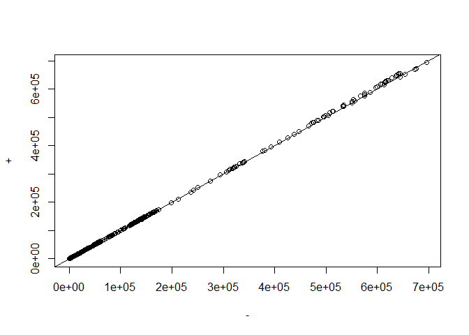<!-- -->

``` r
plot(log(`+`) ~ log(`-`), data = dcast(PopDataHMD[YearSign!=""], iso3c + Age + Year ~ YearSign,
                                       value.var = "Total"))
abline(0, 1)
```

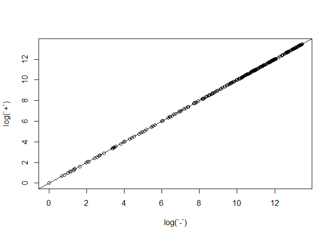<!-- -->

``` r
dcast(PopDataHMD[YearSign!=""], iso3c + Age + Year ~ YearSign, value.var = "Total")[
  , .(iso3c, Age, Year, `+`, `-`, `+`/`-`)][order(V6)]
```

    ##        iso3c    Age  Year         +         -        V6
    ##       <char> <char> <num>     <num>     <num>     <num>
    ##    1:    ITA    109  1981      1.00      1.13 0.8849558
    ##    2:    ITA    101  1981    239.00    260.32 0.9181008
    ##    3:    ITA    100  1981    440.00    478.79 0.9189833
    ##    4:    ITA    103  1981     63.00     68.47 0.9201110
    ##    5:    RUS    101  1993   1550.09   1682.40 0.9213564
    ##   ---                                                  
    ## 1106:    XX6     22  2016 124376.00  99130.00 1.2546757
    ## 1107:    XX6     23  2016 134165.00 106742.00 1.2569092
    ## 1108:    ITA    108  1981      0.00      0.00       NaN
    ## 1109:    ITA   110+  1981      0.00      0.00       NaN
    ## 1110:    NZL   110+  1991      0.00      0.00       NaN

``` r
dcast(PopDataHMD[YearSign!=""], iso3c + Age + Year ~ YearSign, value.var = "Total")[
  , .(iso3c, Age, Year, `+`, `-`, `+` - `-`)][order(V6)]
```

    ##        iso3c    Age  Year       +         -        V6
    ##       <char> <char> <num>   <num>     <num>     <num>
    ##    1:    RUS      2  1993 1940992 1978784.0 -37792.00
    ##    2:    RUS      3  1993 2094744 2131622.0 -36878.00
    ##    3:    XX7     27  2016  874635  911203.8 -36568.83
    ##    4:    XX7     51  2016 1148308 1184340.1 -36032.15
    ##    5:    XX7     28  2016  851057  886914.3 -35857.26
    ##   ---                                                
    ## 1106:    XX6     52  2016  283638  248299.0  35339.00
    ## 1107:    XX6     29  2016  219441  184022.0  35419.00
    ## 1108:    XX6     28  2016  226394  190537.0  35857.00
    ## 1109:    XX6     51  2016  277909  241877.0  36032.00
    ## 1110:    XX6     27  2016  224442  187873.0  36569.00

``` r
# marginális különbség, a mínuszt használjuk
PopDataHMD <- PopDataHMD[(YearSign == "")|(YearSign == "-")]

PopDataHMD <- melt(PopDataHMD[, -"YearSign"], id.vars = c("iso3c", "Year", "Age"),
                   variable.name = "Sex", variable.factor = FALSE)[Sex != "Total"]

PopDataHMD$Sex <- factor(PopDataHMD$Sex, levels = c("Male", "Female"), labels = c("Férfi", "Nő"))
names(PopDataHMD)[names(PopDataHMD) == "value"] <- "PopHMD"

unique(PopDataHMD$Age)
```

    ##   [1] "0"    "1"    "2"    "3"    "4"    "5"    "6"    "7"    "8"    "9"   
    ##  [11] "10"   "11"   "12"   "13"   "14"   "15"   "16"   "17"   "18"   "19"  
    ##  [21] "20"   "21"   "22"   "23"   "24"   "25"   "26"   "27"   "28"   "29"  
    ##  [31] "30"   "31"   "32"   "33"   "34"   "35"   "36"   "37"   "38"   "39"  
    ##  [41] "40"   "41"   "42"   "43"   "44"   "45"   "46"   "47"   "48"   "49"  
    ##  [51] "50"   "51"   "52"   "53"   "54"   "55"   "56"   "57"   "58"   "59"  
    ##  [61] "60"   "61"   "62"   "63"   "64"   "65"   "66"   "67"   "68"   "69"  
    ##  [71] "70"   "71"   "72"   "73"   "74"   "75"   "76"   "77"   "78"   "79"  
    ##  [81] "80"   "81"   "82"   "83"   "84"   "85"   "86"   "87"   "88"   "89"  
    ##  [91] "90"   "91"   "92"   "93"   "94"   "95"   "96"   "97"   "98"   "99"  
    ## [101] "100"  "101"  "102"  "103"  "104"  "105"  "106"  "107"  "108"  "109" 
    ## [111] "110+"

``` r
which(is.na(as.numeric(unique(PopDataHMD[Age != "110+"]$Age))))
```

    ## integer(0)

``` r
PopDataHMD[Age %in% c(95:109, "110+")]$Age <- 95
PopDataHMD <- PopDataHMD[, .(PopHMD = sum(PopHMD)), .(iso3c, Year, Sex, Age)]
PopDataHMD$Age <- as.numeric(PopDataHMD$Age)
```

#### Eurostat

Az Eurostat adatbázis letöltése és előfeldolgozása:

``` r
PopDataES <- data.table(eurostat::get_eurostat("demo_pjan", use.data.table = TRUE, cache = FALSE))
PopDataES$Year <- lubridate::year(PopDataES$TIME_PERIOD)
PopDataES <- PopDataES[!geo%in%c("EA19", "EA20", "EEA30_2007", "EEA31", "EFTA", "EU27_2007",
                                 "EU27_2020", "EU28", "FX", "XK", "DE_TOT")]
PopDataES$iso3c <- countrycode::countrycode(PopDataES$geo, "eurostat", "iso3c")
PopDataES[iso3c == "DEU" & Year <= 1990]$iso3c <- "XX7" # NSZK

PopDataES <- PopDataES[iso3c %in% unique(RawData$iso3c)]
PopDataES <- PopDataES[Year %in% unique(RawData$Year)]

PopDataES <- PopDataES[age != "TOTAL" & sex != "T"]
# Málta 1991 és 2000 között sok, azt elhagyjuk, a többi maradhat (csak
# töröljünk az UNK életkorúakat)
# PopDataES[age == "UNK"&values>0][order(values)]
sum(PopDataES[age == "UNK"]$values) 
```

    ## [1] 140198

``` r
PopDataES[,.(values[age=="UNK"]/sum(values)*100) , .(iso3c, Year, sex)][V1!=0][order(V1)]
```

    ##       iso3c  Year    sex           V1
    ##      <char> <num> <char>        <num>
    ##   1:    HRV  2011      M 4.833832e-05
    ##   2:    HRV  2010      F 1.346381e-04
    ##   3:    HRV  2010      M 1.446026e-04
    ##   4:    HRV  2009      F 2.239111e-04
    ##   5:    HRV  2008      F 3.132020e-04
    ##  ---                                 
    ## 113:    MLT  1991      F 2.442405e+00
    ## 114:    MLT  1995      F 2.477607e+00
    ## 115:    MLT  1992      F 2.560900e+00
    ## 116:    MLT  1993      F 2.636535e+00
    ## 117:    MLT  1994      F 2.744405e+00

``` r
PopDataES <- PopDataES[!(iso3c == "MLT" & Year >= 1991 & Year <= 2000)]
PopDataES <- PopDataES[age != "UNK"]
PopDataES$age <- substring(PopDataES$age, 2)
PopDataES[age == "_LT1"]$age <- "0"
PopDataES$sex <- factor(PopDataES$sex, levels = c("M", "F"), labels = c("Férfi", "Nő"))

# Most csak azt őrizzük meg, ami 95-ig itt is megvan
PopDataES <- merge(PopDataES, PopDataES[
  , .(!any(!(0:94) %in% age) & "_OPEN" %in% age),
  .(iso3c, Year, sex)], by = c("iso3c", "Year", "sex"))[V1 == TRUE, -"V1"]

unique(PopDataES$age)
```

    ##   [1] "1"     "10"    "11"    "12"    "13"    "14"    "15"    "16"    "17"   
    ##  [10] "18"    "19"    "2"     "20"    "21"    "22"    "23"    "24"    "25"   
    ##  [19] "26"    "27"    "28"    "29"    "3"     "30"    "31"    "32"    "33"   
    ##  [28] "34"    "35"    "36"    "37"    "38"    "39"    "4"     "40"    "41"   
    ##  [37] "42"    "43"    "44"    "45"    "46"    "47"    "48"    "49"    "5"    
    ##  [46] "50"    "51"    "52"    "53"    "54"    "55"    "56"    "57"    "58"   
    ##  [55] "59"    "6"     "60"    "61"    "62"    "63"    "64"    "65"    "66"   
    ##  [64] "67"    "68"    "69"    "7"     "70"    "71"    "72"    "73"    "74"   
    ##  [73] "75"    "76"    "77"    "78"    "79"    "8"     "80"    "81"    "82"   
    ##  [82] "83"    "84"    "85"    "86"    "87"    "88"    "89"    "9"     "90"   
    ##  [91] "91"    "92"    "93"    "94"    "95"    "96"    "97"    "98"    "0"    
    ## [100] "_OPEN" "99"

``` r
which(is.na(as.numeric(unique(PopDataES[age != "_OPEN"]$age))))
```

    ## integer(0)

``` r
PopDataES[age %in% c(95:99, "_OPEN")]$age <- 95
PopDataES <- PopDataES[, .(values = sum(values)), .(iso3c, Year, sex, age)]
PopDataES$age <- as.numeric(PopDataES$age)

table(PopDataES$age, cut(PopDataES$age, c(0:5, seq(10, 95, 5), Inf), right = FALSE))
```

    ##     
    ##      [0,1) [1,2) [2,3) [3,4) [4,5) [5,10) [10,15) [15,20) [20,25) [25,30)
    ##   0   2622     0     0     0     0      0       0       0       0       0
    ##   1      0  2622     0     0     0      0       0       0       0       0
    ##   2      0     0  2622     0     0      0       0       0       0       0
    ##   3      0     0     0  2622     0      0       0       0       0       0
    ##   4      0     0     0     0  2622      0       0       0       0       0
    ##   5      0     0     0     0     0   2622       0       0       0       0
    ##   6      0     0     0     0     0   2622       0       0       0       0
    ##   7      0     0     0     0     0   2622       0       0       0       0
    ##   8      0     0     0     0     0   2622       0       0       0       0
    ##   9      0     0     0     0     0   2622       0       0       0       0
    ##   10     0     0     0     0     0      0    2622       0       0       0
    ##   11     0     0     0     0     0      0    2622       0       0       0
    ##   12     0     0     0     0     0      0    2622       0       0       0
    ##   13     0     0     0     0     0      0    2622       0       0       0
    ##   14     0     0     0     0     0      0    2622       0       0       0
    ##   15     0     0     0     0     0      0       0    2622       0       0
    ##   16     0     0     0     0     0      0       0    2622       0       0
    ##   17     0     0     0     0     0      0       0    2622       0       0
    ##   18     0     0     0     0     0      0       0    2622       0       0
    ##   19     0     0     0     0     0      0       0    2622       0       0
    ##   20     0     0     0     0     0      0       0       0    2622       0
    ##   21     0     0     0     0     0      0       0       0    2622       0
    ##   22     0     0     0     0     0      0       0       0    2622       0
    ##   23     0     0     0     0     0      0       0       0    2622       0
    ##   24     0     0     0     0     0      0       0       0    2622       0
    ##   25     0     0     0     0     0      0       0       0       0    2622
    ##   26     0     0     0     0     0      0       0       0       0    2622
    ##   27     0     0     0     0     0      0       0       0       0    2622
    ##   28     0     0     0     0     0      0       0       0       0    2622
    ##   29     0     0     0     0     0      0       0       0       0    2622
    ##   30     0     0     0     0     0      0       0       0       0       0
    ##   31     0     0     0     0     0      0       0       0       0       0
    ##   32     0     0     0     0     0      0       0       0       0       0
    ##   33     0     0     0     0     0      0       0       0       0       0
    ##   34     0     0     0     0     0      0       0       0       0       0
    ##   35     0     0     0     0     0      0       0       0       0       0
    ##   36     0     0     0     0     0      0       0       0       0       0
    ##   37     0     0     0     0     0      0       0       0       0       0
    ##   38     0     0     0     0     0      0       0       0       0       0
    ##   39     0     0     0     0     0      0       0       0       0       0
    ##   40     0     0     0     0     0      0       0       0       0       0
    ##   41     0     0     0     0     0      0       0       0       0       0
    ##   42     0     0     0     0     0      0       0       0       0       0
    ##   43     0     0     0     0     0      0       0       0       0       0
    ##   44     0     0     0     0     0      0       0       0       0       0
    ##   45     0     0     0     0     0      0       0       0       0       0
    ##   46     0     0     0     0     0      0       0       0       0       0
    ##   47     0     0     0     0     0      0       0       0       0       0
    ##   48     0     0     0     0     0      0       0       0       0       0
    ##   49     0     0     0     0     0      0       0       0       0       0
    ##   50     0     0     0     0     0      0       0       0       0       0
    ##   51     0     0     0     0     0      0       0       0       0       0
    ##   52     0     0     0     0     0      0       0       0       0       0
    ##   53     0     0     0     0     0      0       0       0       0       0
    ##   54     0     0     0     0     0      0       0       0       0       0
    ##   55     0     0     0     0     0      0       0       0       0       0
    ##   56     0     0     0     0     0      0       0       0       0       0
    ##   57     0     0     0     0     0      0       0       0       0       0
    ##   58     0     0     0     0     0      0       0       0       0       0
    ##   59     0     0     0     0     0      0       0       0       0       0
    ##   60     0     0     0     0     0      0       0       0       0       0
    ##   61     0     0     0     0     0      0       0       0       0       0
    ##   62     0     0     0     0     0      0       0       0       0       0
    ##   63     0     0     0     0     0      0       0       0       0       0
    ##   64     0     0     0     0     0      0       0       0       0       0
    ##   65     0     0     0     0     0      0       0       0       0       0
    ##   66     0     0     0     0     0      0       0       0       0       0
    ##   67     0     0     0     0     0      0       0       0       0       0
    ##   68     0     0     0     0     0      0       0       0       0       0
    ##   69     0     0     0     0     0      0       0       0       0       0
    ##   70     0     0     0     0     0      0       0       0       0       0
    ##   71     0     0     0     0     0      0       0       0       0       0
    ##   72     0     0     0     0     0      0       0       0       0       0
    ##   73     0     0     0     0     0      0       0       0       0       0
    ##   74     0     0     0     0     0      0       0       0       0       0
    ##   75     0     0     0     0     0      0       0       0       0       0
    ##   76     0     0     0     0     0      0       0       0       0       0
    ##   77     0     0     0     0     0      0       0       0       0       0
    ##   78     0     0     0     0     0      0       0       0       0       0
    ##   79     0     0     0     0     0      0       0       0       0       0
    ##   80     0     0     0     0     0      0       0       0       0       0
    ##   81     0     0     0     0     0      0       0       0       0       0
    ##   82     0     0     0     0     0      0       0       0       0       0
    ##   83     0     0     0     0     0      0       0       0       0       0
    ##   84     0     0     0     0     0      0       0       0       0       0
    ##   85     0     0     0     0     0      0       0       0       0       0
    ##   86     0     0     0     0     0      0       0       0       0       0
    ##   87     0     0     0     0     0      0       0       0       0       0
    ##   88     0     0     0     0     0      0       0       0       0       0
    ##   89     0     0     0     0     0      0       0       0       0       0
    ##   90     0     0     0     0     0      0       0       0       0       0
    ##   91     0     0     0     0     0      0       0       0       0       0
    ##   92     0     0     0     0     0      0       0       0       0       0
    ##   93     0     0     0     0     0      0       0       0       0       0
    ##   94     0     0     0     0     0      0       0       0       0       0
    ##   95     0     0     0     0     0      0       0       0       0       0
    ##     
    ##      [30,35) [35,40) [40,45) [45,50) [50,55) [55,60) [60,65) [65,70) [70,75)
    ##   0        0       0       0       0       0       0       0       0       0
    ##   1        0       0       0       0       0       0       0       0       0
    ##   2        0       0       0       0       0       0       0       0       0
    ##   3        0       0       0       0       0       0       0       0       0
    ##   4        0       0       0       0       0       0       0       0       0
    ##   5        0       0       0       0       0       0       0       0       0
    ##   6        0       0       0       0       0       0       0       0       0
    ##   7        0       0       0       0       0       0       0       0       0
    ##   8        0       0       0       0       0       0       0       0       0
    ##   9        0       0       0       0       0       0       0       0       0
    ##   10       0       0       0       0       0       0       0       0       0
    ##   11       0       0       0       0       0       0       0       0       0
    ##   12       0       0       0       0       0       0       0       0       0
    ##   13       0       0       0       0       0       0       0       0       0
    ##   14       0       0       0       0       0       0       0       0       0
    ##   15       0       0       0       0       0       0       0       0       0
    ##   16       0       0       0       0       0       0       0       0       0
    ##   17       0       0       0       0       0       0       0       0       0
    ##   18       0       0       0       0       0       0       0       0       0
    ##   19       0       0       0       0       0       0       0       0       0
    ##   20       0       0       0       0       0       0       0       0       0
    ##   21       0       0       0       0       0       0       0       0       0
    ##   22       0       0       0       0       0       0       0       0       0
    ##   23       0       0       0       0       0       0       0       0       0
    ##   24       0       0       0       0       0       0       0       0       0
    ##   25       0       0       0       0       0       0       0       0       0
    ##   26       0       0       0       0       0       0       0       0       0
    ##   27       0       0       0       0       0       0       0       0       0
    ##   28       0       0       0       0       0       0       0       0       0
    ##   29       0       0       0       0       0       0       0       0       0
    ##   30    2622       0       0       0       0       0       0       0       0
    ##   31    2622       0       0       0       0       0       0       0       0
    ##   32    2622       0       0       0       0       0       0       0       0
    ##   33    2622       0       0       0       0       0       0       0       0
    ##   34    2622       0       0       0       0       0       0       0       0
    ##   35       0    2622       0       0       0       0       0       0       0
    ##   36       0    2622       0       0       0       0       0       0       0
    ##   37       0    2622       0       0       0       0       0       0       0
    ##   38       0    2622       0       0       0       0       0       0       0
    ##   39       0    2622       0       0       0       0       0       0       0
    ##   40       0       0    2622       0       0       0       0       0       0
    ##   41       0       0    2622       0       0       0       0       0       0
    ##   42       0       0    2622       0       0       0       0       0       0
    ##   43       0       0    2622       0       0       0       0       0       0
    ##   44       0       0    2622       0       0       0       0       0       0
    ##   45       0       0       0    2622       0       0       0       0       0
    ##   46       0       0       0    2622       0       0       0       0       0
    ##   47       0       0       0    2622       0       0       0       0       0
    ##   48       0       0       0    2622       0       0       0       0       0
    ##   49       0       0       0    2622       0       0       0       0       0
    ##   50       0       0       0       0    2622       0       0       0       0
    ##   51       0       0       0       0    2622       0       0       0       0
    ##   52       0       0       0       0    2622       0       0       0       0
    ##   53       0       0       0       0    2622       0       0       0       0
    ##   54       0       0       0       0    2622       0       0       0       0
    ##   55       0       0       0       0       0    2622       0       0       0
    ##   56       0       0       0       0       0    2622       0       0       0
    ##   57       0       0       0       0       0    2622       0       0       0
    ##   58       0       0       0       0       0    2622       0       0       0
    ##   59       0       0       0       0       0    2622       0       0       0
    ##   60       0       0       0       0       0       0    2622       0       0
    ##   61       0       0       0       0       0       0    2622       0       0
    ##   62       0       0       0       0       0       0    2622       0       0
    ##   63       0       0       0       0       0       0    2622       0       0
    ##   64       0       0       0       0       0       0    2622       0       0
    ##   65       0       0       0       0       0       0       0    2622       0
    ##   66       0       0       0       0       0       0       0    2622       0
    ##   67       0       0       0       0       0       0       0    2622       0
    ##   68       0       0       0       0       0       0       0    2622       0
    ##   69       0       0       0       0       0       0       0    2622       0
    ##   70       0       0       0       0       0       0       0       0    2622
    ##   71       0       0       0       0       0       0       0       0    2622
    ##   72       0       0       0       0       0       0       0       0    2622
    ##   73       0       0       0       0       0       0       0       0    2622
    ##   74       0       0       0       0       0       0       0       0    2622
    ##   75       0       0       0       0       0       0       0       0       0
    ##   76       0       0       0       0       0       0       0       0       0
    ##   77       0       0       0       0       0       0       0       0       0
    ##   78       0       0       0       0       0       0       0       0       0
    ##   79       0       0       0       0       0       0       0       0       0
    ##   80       0       0       0       0       0       0       0       0       0
    ##   81       0       0       0       0       0       0       0       0       0
    ##   82       0       0       0       0       0       0       0       0       0
    ##   83       0       0       0       0       0       0       0       0       0
    ##   84       0       0       0       0       0       0       0       0       0
    ##   85       0       0       0       0       0       0       0       0       0
    ##   86       0       0       0       0       0       0       0       0       0
    ##   87       0       0       0       0       0       0       0       0       0
    ##   88       0       0       0       0       0       0       0       0       0
    ##   89       0       0       0       0       0       0       0       0       0
    ##   90       0       0       0       0       0       0       0       0       0
    ##   91       0       0       0       0       0       0       0       0       0
    ##   92       0       0       0       0       0       0       0       0       0
    ##   93       0       0       0       0       0       0       0       0       0
    ##   94       0       0       0       0       0       0       0       0       0
    ##   95       0       0       0       0       0       0       0       0       0
    ##     
    ##      [75,80) [80,85) [85,90) [90,95) [95,Inf)
    ##   0        0       0       0       0        0
    ##   1        0       0       0       0        0
    ##   2        0       0       0       0        0
    ##   3        0       0       0       0        0
    ##   4        0       0       0       0        0
    ##   5        0       0       0       0        0
    ##   6        0       0       0       0        0
    ##   7        0       0       0       0        0
    ##   8        0       0       0       0        0
    ##   9        0       0       0       0        0
    ##   10       0       0       0       0        0
    ##   11       0       0       0       0        0
    ##   12       0       0       0       0        0
    ##   13       0       0       0       0        0
    ##   14       0       0       0       0        0
    ##   15       0       0       0       0        0
    ##   16       0       0       0       0        0
    ##   17       0       0       0       0        0
    ##   18       0       0       0       0        0
    ##   19       0       0       0       0        0
    ##   20       0       0       0       0        0
    ##   21       0       0       0       0        0
    ##   22       0       0       0       0        0
    ##   23       0       0       0       0        0
    ##   24       0       0       0       0        0
    ##   25       0       0       0       0        0
    ##   26       0       0       0       0        0
    ##   27       0       0       0       0        0
    ##   28       0       0       0       0        0
    ##   29       0       0       0       0        0
    ##   30       0       0       0       0        0
    ##   31       0       0       0       0        0
    ##   32       0       0       0       0        0
    ##   33       0       0       0       0        0
    ##   34       0       0       0       0        0
    ##   35       0       0       0       0        0
    ##   36       0       0       0       0        0
    ##   37       0       0       0       0        0
    ##   38       0       0       0       0        0
    ##   39       0       0       0       0        0
    ##   40       0       0       0       0        0
    ##   41       0       0       0       0        0
    ##   42       0       0       0       0        0
    ##   43       0       0       0       0        0
    ##   44       0       0       0       0        0
    ##   45       0       0       0       0        0
    ##   46       0       0       0       0        0
    ##   47       0       0       0       0        0
    ##   48       0       0       0       0        0
    ##   49       0       0       0       0        0
    ##   50       0       0       0       0        0
    ##   51       0       0       0       0        0
    ##   52       0       0       0       0        0
    ##   53       0       0       0       0        0
    ##   54       0       0       0       0        0
    ##   55       0       0       0       0        0
    ##   56       0       0       0       0        0
    ##   57       0       0       0       0        0
    ##   58       0       0       0       0        0
    ##   59       0       0       0       0        0
    ##   60       0       0       0       0        0
    ##   61       0       0       0       0        0
    ##   62       0       0       0       0        0
    ##   63       0       0       0       0        0
    ##   64       0       0       0       0        0
    ##   65       0       0       0       0        0
    ##   66       0       0       0       0        0
    ##   67       0       0       0       0        0
    ##   68       0       0       0       0        0
    ##   69       0       0       0       0        0
    ##   70       0       0       0       0        0
    ##   71       0       0       0       0        0
    ##   72       0       0       0       0        0
    ##   73       0       0       0       0        0
    ##   74       0       0       0       0        0
    ##   75    2622       0       0       0        0
    ##   76    2622       0       0       0        0
    ##   77    2622       0       0       0        0
    ##   78    2622       0       0       0        0
    ##   79    2622       0       0       0        0
    ##   80       0    2622       0       0        0
    ##   81       0    2622       0       0        0
    ##   82       0    2622       0       0        0
    ##   83       0    2622       0       0        0
    ##   84       0    2622       0       0        0
    ##   85       0       0    2622       0        0
    ##   86       0       0    2622       0        0
    ##   87       0       0    2622       0        0
    ##   88       0       0    2622       0        0
    ##   89       0       0    2622       0        0
    ##   90       0       0       0    2622        0
    ##   91       0       0       0    2622        0
    ##   92       0       0       0    2622        0
    ##   93       0       0       0    2622        0
    ##   94       0       0       0    2622        0
    ##   95       0       0       0       0     2622

``` r
PopDataES <- PopDataES[, .(iso3c, Year, Sex = sex, Age = age, PopES = values)]
PopDataES <- PopDataES[order(iso3c, Year, Sex, Age)]
```

#### World Population Prospects

A World Population Prospects letöltése és előfeldolgozása:

``` r
PopDataUN <- fread(paste0(
  "https://population.un.org/wpp/assets/Excel%20Files/",
  "1_Indicator%20(Standard)/CSV_FILES/",
  "WPP2024_PopulationBySingleAgeSex_Medium_1950-2023.csv.gz"))

table(PopDataUN$AgeGrpSpan) # csak 1 és -1
```

    ## 
    ##      -1       1 
    ##   41070 4107000

``` r
table(PopDataUN[AgeGrpSpan == -1]$AgeGrpStart) # a -1 az csak a 100+ kategória
```

    ## 
    ##   100 
    ## 41070

``` r
# tökéletes a megfeleltetés AgeGrp és AgeGrpStart között
table(apply(table(PopDataUN$AgeGrp, PopDataUN$AgeGrpStart), 1, function(x) sum(x>0)))
```

    ## 
    ##   1 
    ## 101

``` r
table(apply(table(PopDataUN$AgeGrp, PopDataUN$AgeGrpStart), 2, function(x) sum(x>0)))
```

    ## 
    ##   1 
    ## 101

``` r
PopDataUN <- melt(
  PopDataUN[ISO3_code != "", .(iso3c = ISO3_code, Year = Time,
                               Age = AgeGrpStart, PopMale, PopFemale)],
  id.vars = c("iso3c", "Year", "Age"), variable.name = "Sex", variable.factor = FALSE)
PopDataUN$Sex <- factor(PopDataUN$Sex, levels = c("PopMale", "PopFemale"), labels = c("Férfi", "Nő"))
PopDataUN$value <- PopDataUN$value * 1000

PopDataUN <- PopDataUN[iso3c %in% unique(RawData$iso3c)]
PopDataUN <- PopDataUN[Year %in% unique(RawData$Year)]

PopDataUN[Age %in% 95:100]$Age <- 95
PopDataUN <- PopDataUN[, .(value = sum(value)), .(iso3c, Year, Sex, Age)]

names(PopDataUN)[names(PopDataUN) == "value"] <- "PopUN"
```

#### Összevetés

Elsőként nézzük meg, hogy a három adatbázis páronként mennyire hasonló:

``` r
temp <- Reduce(function(...) merge(..., by = c("iso3c", "Year", "Age", "Sex"), all = TRUE),
               list(PopDataHMD, PopDataUN, PopDataES))

plot(PopHMD ~ PopES, data = temp[!is.na(PopHMD) & !is.na(PopES)])
```

<!-- -->

``` r
plot(PopHMD ~ PopUN, data = temp[!is.na(PopHMD) & !is.na(PopUN)])
```

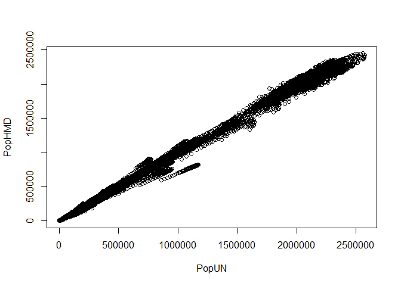<!-- -->

``` r
plot(PopUN ~ PopES, data = temp[!is.na(PopUN) & !is.na(PopES)])
```

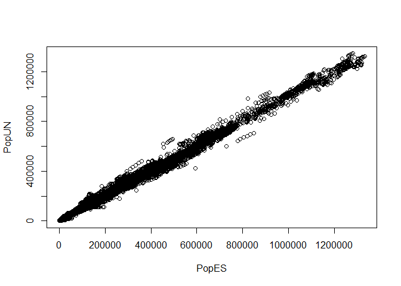<!-- -->

Megnézhetünk konkrét kategóriákat is, mondjuk a magyar 0-1 évesek
alakulása:

``` r
temp <- melt(temp, id.vars = c("iso3c", "Year", "Age", "Sex"))

ggplot2::ggplot(temp[iso3c == "HUN" & Age == 0 & !is.na(value)],
                ggplot2::aes(x = Year, y = value, group = variable,
                             color = variable)) +
  ggplot2::facet_wrap(~Sex) +
  ggplot2::geom_line() + ggplot2::geom_point()
```

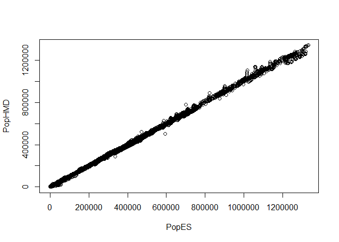<!-- -->

Érdekes módon az Eurostat adat eltér a másik kettőtől, de a még
érdekesebb, hogy ez az eltérés az 1-2 éves kategóriában eltűnik:

``` r
ggplot2::ggplot(temp[iso3c == "HUN" & Age == 1 & !is.na(value)],
                ggplot2::aes(x = Year, y = value, group = variable, color = variable)) +
  ggplot2::facet_wrap(~Sex) +
  ggplot2::geom_line() + ggplot2::geom_point()
```

<!-- -->

Megnézhetünk több életkort is egyben, ennek inkább csak az ábra
zsúfoltsága szab határt:

``` r
ggplot2::ggplot(temp[iso3c == "HUN" & Age <= 5 & !is.na(value)],
                ggplot2::aes(x = Year, y = value, group = variable, color = variable)) +
  ggplot2::facet_grid(Age ~ Sex) +
  ggplot2::geom_line() + ggplot2::geom_point()
```

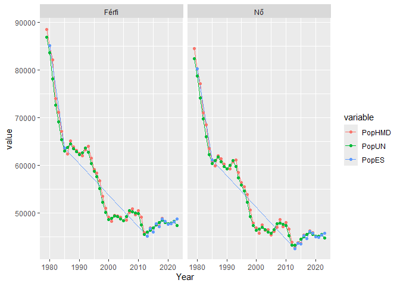<!-- -->

Egy másik összevetési lehetőség az, ha az ország teljes lélekszámának a
változását nézzük a különböző adatbázisok szerint:

``` r
ggplot2::ggplot(temp[iso3c == "HUN", .(sum(value)),
                     .(Year, variable)][!is.na(V1)],
                ggplot2::aes(x = Year, y = V1, group = variable,
                             color = variable)) +
  ggplot2::geom_line() + ggplot2::geom_point()
```

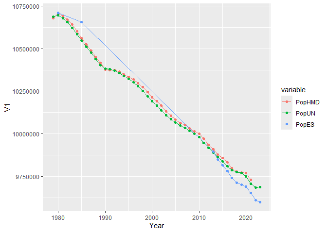<!-- -->

#### Végleges adatbázis konvertálása, kimentése

Ahogy fent is írtam, a későbbiekben az adatbázisok közül a WPP-t fogjuk
használni. Vegyük ezt elő, és konvertáljuk olyan formátumra, ami majd
illeszthető a halálozási adatokkal (magyarán, kategorizáljuk az
életkorokat):

``` r
PopData <- PopDataUN
names(PopData)[names(PopData) == "PopUN"] <- "Pop"

PopData$Age <- cut(PopData$Age, c(0:5, seq(10, 95, 5), Inf), right = FALSE,
                   labels = paste0("Deaths", 2:25))
PopData <- PopData[, .(Pop = sum(Pop)), .(iso3c, Year, Age, Sex)]

PopData <- rbind(PopData, PopData[Age %in% paste0("Deaths", 3:6),
                                  .(Pop = sum(Pop), Age = "Deaths3456") , .(iso3c, Year, Sex)])

PopData <- rbind(
  cbind(PopData, Frmat = 0),
  cbind(rbind(PopData[!Age %in% paste0("Deaths", 23:25)],
              PopData[Age %in% paste0("Deaths", 23:25),
                      .(Pop = sum(Pop), Age = "Deaths232425"), .(iso3c, Year, Sex)]), Frmat = 1),
  cbind(rbind(PopData[!Age %in% paste0("Deaths", 23:25) & !Age %in% paste0("Deaths", 3:6)],
              PopData[Age %in% paste0("Deaths", 23:25),
                      .(Pop = sum(Pop), Age = "Deaths232425"), .(iso3c, Year, Sex)]), Frmat = 2)
)

PopData$Aggregated <- ifelse(PopData$Frmat == 2, FALSE, PopData$Age == "Deaths3456")
```

Végül a szokásos módon kimentjük:

``` r
PopData$iso3c <- as.factor(PopData$iso3c)
PopData$Frmat <- as.factor(PopData$Frmat)
PopData$Age <- as.factor(PopData$Age)

saveRDS(PopData, "./procdata/WHO-MDB-Population.rds")
```

A későbbiekben szükségünk lesz egy referencia-populációra is az életkor
szerinti standardizáláshoz; használjuk most az
[ESP2013](https://ec.europa.eu/eurostat/web/products-manuals-and-guidelines/-/ks-ra-13-028)-at:

``` r
StdPop <- fread("./inputdata/ESP2013.csv", dec = ",")
StdPop$Frmat <- as.factor(StdPop$Frmat)
```

### A dimenzióredukciós vizualizáció adatainak előkészítése

Ennek a lépésnek nagy a számítási időigénye, viszont a végeredményének a
mérete kicsi, így érdemes előre, off-line elvégezni, hogy aztán a
weboldal majd csak beolvassa az előre letárolt eredményt:

``` r
rd <- merge(RawData[iso3c %in% EUCountries$EU27], PopData,
            by = c("iso3c", "Year", "Sex", "Age", "Frmat"))

rd <- merge(rd, StdPop, by = c("Frmat", "Age"))[
  , as.list(epitools::ageadjust.direct(value, Pop, stdpop = StdPop)),
  c("iso3c", "Year", "Sex", "Cause")]

rd <- dcast(rd, iso3c + Year + Sex ~ Cause, value.var = "adj.rate")
setnafill(rd, type = "const", fill = 0, cols = 4:ncol(rd))
res <- rbind(cbind(rd[, 1:3], Rtsne::Rtsne(rd[, -(1:3)])$Y, Method = "t-SNE"),
             cbind(rd[, 1:3], cmdscale(dist(rd[, -(1:3)])), Method = "MDS"),
             cbind(rd[, 1:3], unname(prcomp(t(rd[, -(1:3)]))$rotation[, 1:2]), Method = "PCA"))

saveRDS(res, "./procdata/dimredvizData.rds")
```

## Az adatok és a számítás validációja

Az adatok és a számításokat nagyrészt tudjuk validálni az Eurostat
adatszolgáltatásának köszönhetően. (A „nagyrészt” azt jelenti, hogy az
egyedi kódokat nem lehet az Eurostat-tól lekérdezni, így az nem
validálható, csak a fő kategóriák, de mivel a fő kategóriákat most
manuálisan számoljuk az egyedi kódokból, így ha az előbbiek stimmelnek,
akkor igen valószínű, hogy az utóbbiak is. A másik hátrány, hogy csak
egyes éveket kérhetünk le, több év aggregált adatát nem.) Külön Eurostat
táblából kérdezhetjük le a mortalitást (ezen belül is külön lesz az
abszolút szám, a nyers ráta és a standardizált ráta), az elvesztett
életéveket és a megelőzhető halálozást.

Elsőként betöltjük a weboldal mögött lévő kód számításokat végző részét:

``` r
dataInputFun <- function(category, multipleICD, ICDSingle, ICDMultiple,
                           multipleCountry, countrySingle, countryMultiple,
                           indicator, yllMethod, yllPyllTarget,
                           strat, metric, ordVar, byvarAdd,
                           yearFilter, sexFilter, ageFilter, comp, valid) {

    icd <- if(multipleICD == "Single") ICDSingle else ICDMultiple
    if(is.null(icd)) return(NULL)
    icdtable <- rbindlist(ICDGroups[[category]][icd])
    
    if(!is.na(multipleCountry)) {
      iso3cSel <- if((multipleICD == "MultiIndiv" && is.na(comp) && !valid) || (multipleCountry == "Single"))
        countrySingle else countryMultiple
      if(is.null(iso3cSel)) return(NULL)
    } else iso3cSel <- as.character(unique(RawData$iso3c))
    
    yearSel <- if(!any(is.na(yearFilter))) seq(yearFilter[1], yearFilter[2], 1) else min(RawData$Year):max(RawData$Year)
    if(sexFilter == "Összesen") sexFilter <- c("Férfi", "Nő")

    if(ageFilter == "Összesen" || metric == "adjrate") {
      rd <- RawData[CJ(iso3cSel, yearSel, sexFilter), nomatch = NULL]
      skeleton <- RawDataAll[CJ(iso3cSel, yearSel, sexFilter), nomatch = NULL]
    } else {
      rd <- RawData[CJ(iso3cSel, yearSel, sexFilter, ageFilter), nomatch = NULL]
      skeleton <- RawDataAll[CJ(iso3cSel, yearSel, sexFilter, ageFilter), nomatch = NULL]
    }
    
    if(multipleICD == "MultiSum") icdtable[, c("CauseGroup", "EurostatCode") := list("Összeg", NA)]

    skeleton <- unique(icdtable[, .(List, EurostatCode, CauseGroup)])[skeleton, on = .(List), nomatch = NULL, allow.cartesian = TRUE]
    
    rd <- icdtable[rd, on = .(List, Cause), nomatch = NULL, allow.cartesian = TRUE][
      skeleton, on = .(iso3c, Year, List, Frmat, Age, Sex, CauseGroup, EurostatCode),
      .(value = round(sum(value * Weight, na.rm = TRUE))), by = .EACHI]

    rd <- merge(rd, PopData, by = c("iso3c", "Year", "Sex", "Age", "Frmat"))
    
    if(category == "Avoidable") rd <- rd[AgeNum < yllPyllTarget]
    
    if(indicator == "yll" && yllMethod == "pyll")
      rd$value <- rd$value * pmax(0, yllPyllTarget - rd$AgeNum)
    
    byvars <- "iso3c"
    if(!any(is.na(byvarAdd))) byvars <- c(byvars, byvarAdd)
    if(multipleICD != "MultiIndiv" && !is.na(strat) && multipleCountry == "Single")
      byvars <- c(byvars, strat[strat != "None"])
    
    if(!is.na(comp)) rd$iso3c <- ifelse(rd$iso3c == comp, "Investigated", "Comparator")
    rd <- rd[, .(value = sum(value), Pop = sum(Pop)), setdiff(names(rd), c("value", "Pop"))]
    
    if(nrow(rd) != 0) {
      rd <- switch(
        metric,
        "count" = rd[Aggregated == FALSE, .(value = sum(value)), byvars],
        "cruderate" = rd[Aggregated == FALSE,
                         .(value = sum(value)/sum(Pop)*1e5), byvars],
        "adjrate" = merge(
          rd[, .(value = sum(value), Pop = sum(Pop)),
             c(byvars, "Frmat", "Age")],
          StdPop, by = c("Frmat", "Age"))[
            , as.list(epitools::ageadjust.direct(value, Pop, stdpop = StdPop)),
            byvars][, c(.SD, .(value = adj.rate*1e5))])
      
      if(!is.na(ordVar)) rd <- rd[order(rd[[ordVar]])]
      
      if(is.na(comp)) rd <- merge(rd, data.table(iso3c = CountryCodes,
                                                 CountryName = names(CountryCodes)))
    }
    
    return(list(rd = rd, icd = icd, country = iso3cSel))
  }
```

Kezdjük a mortalitási adatok validációjával, azon belül is az abszolút
számokkal! Betöltjük az Eurostat adatokat és kikódoljuk a szükséges
oszlopokat, hogy a saját adatformátumunkkal összekapcsolható legyen:

``` r
ESres <- as.data.table(eurostat::get_eurostat("hlth_cd_aro"))
```

    ## indexed 0B in  0s, 0B/sindexed 25.43MB in  0s, 126.96MB/sindexed 25.56MB in  0s, 127.03MB/sindexed 25.69MB in  0s, 127.07MB/sindexed 25.82MB in  0s, 126.96MB/sindexed 25.95MB in  0s, 126.87MB/sindexed 26.08MB in  0s, 126.85MB/sindexed 26.21MB in  0s, 126.71MB/sindexed 26.35MB in  0s, 126.59MB/sindexed 26.48MB in  0s, 126.63MB/sindexed 26.61MB in  0s, 126.66MB/sindexed 26.74MB in  0s, 126.72MB/sindexed 26.87MB in  0s, 126.63MB/sindexed 27.00MB in  0s, 126.49MB/sindexed 27.13MB in  0s, 126.36MB/sindexed 27.26MB in  0s, 126.36MB/sindexed 27.39MB in  0s, 126.47MB/sindexed 27.52MB in  0s, 126.46MB/sindexed 27.66MB in  0s, 126.42MB/sindexed 27.79MB in  0s, 126.44MB/sindexed 27.92MB in  0s, 126.37MB/sindexed 28.05MB in  0s, 126.33MB/sindexed 28.18MB in  0s, 126.38MB/sindexed 28.31MB in  0s, 126.40MB/sindexed 28.44MB in  0s, 126.44MB/sindexed 28.57MB in  0s, 126.52MB/sindexed 28.70MB in  0s, 126.53MB/sindexed 28.84MB in  0s, 126.63MB/sindexed 28.97MB in  0s, 126.54MB/sindexed 29.10MB in  0s, 126.53MB/sindexed 29.23MB in  0s, 126.54MB/sindexed 29.36MB in  0s, 126.36MB/sindexed 29.49MB in  0s, 126.35MB/sindexed 29.62MB in  0s, 126.34MB/sindexed 29.75MB in  0s, 126.26MB/sindexed 29.88MB in  0s, 126.23MB/sindexed 30.02MB in  0s, 126.15MB/sindexed 30.15MB in  0s, 126.09MB/sindexed 30.28MB in  0s, 126.01MB/sindexed 30.41MB in  0s, 126.02MB/sindexed 30.54MB in  0s, 126.10MB/sindexed 30.67MB in  0s, 126.08MB/sindexed 30.80MB in  0s, 125.98MB/sindexed 30.93MB in  0s, 125.88MB/sindexed 31.06MB in  0s, 125.81MB/sindexed 31.19MB in  0s, 125.74MB/sindexed 31.33MB in  0s, 125.74MB/sindexed 31.46MB in  0s, 125.24MB/sindexed 31.59MB in  0s, 125.13MB/sindexed 31.72MB in  0s, 125.16MB/sindexed 31.85MB in  0s, 125.09MB/sindexed 31.98MB in  0s, 125.11MB/sindexed 32.11MB in  0s, 125.07MB/sindexed 32.24MB in  0s, 124.97MB/sindexed 32.37MB in  0s, 124.96MB/sindexed 32.51MB in  0s, 124.95MB/sindexed 32.64MB in  0s, 124.98MB/sindexed 32.77MB in  0s, 125.07MB/sindexed 32.90MB in  0s, 125.01MB/sindexed 33.03MB in  0s, 125.01MB/sindexed 33.16MB in  0s, 124.99MB/sindexed 33.29MB in  0s, 125.02MB/sindexed 33.42MB in  0s, 124.96MB/sindexed 33.55MB in  0s, 124.94MB/sindexed 33.69MB in  0s, 124.93MB/sindexed 33.82MB in  0s, 124.93MB/sindexed 33.95MB in  0s, 124.94MB/sindexed 34.08MB in  0s, 124.95MB/sindexed 34.21MB in  0s, 124.96MB/sindexed 34.34MB in  0s, 124.86MB/sindexed 34.47MB in  0s, 124.95MB/sindexed 34.60MB in  0s, 124.95MB/sindexed 34.73MB in  0s, 125.06MB/sindexed 34.86MB in  0s, 125.02MB/sindexed 35.00MB in  0s, 125.03MB/sindexed 35.13MB in  0s, 125.04MB/sindexed 35.26MB in  0s, 125.07MB/sindexed 35.39MB in  0s, 125.11MB/sindexed 35.52MB in  0s, 125.16MB/sindexed 35.65MB in  0s, 125.20MB/sindexed 35.78MB in  0s, 125.25MB/sindexed 35.91MB in  0s, 125.27MB/sindexed 36.04MB in  0s, 125.28MB/sindexed 36.18MB in  0s, 125.31MB/sindexed 36.31MB in  0s, 125.37MB/sindexed 36.44MB in  0s, 125.33MB/sindexed 36.57MB in  0s, 125.31MB/sindexed 36.70MB in  0s, 125.26MB/sindexed 36.83MB in  0s, 125.27MB/sindexed 36.96MB in  0s, 124.64MB/sindexed 37.09MB in  0s, 124.47MB/sindexed 37.22MB in  0s, 124.43MB/sindexed 37.36MB in  0s, 124.45MB/sindexed 37.49MB in  0s, 124.46MB/sindexed 37.62MB in  0s, 124.50MB/sindexed 37.75MB in  0s, 124.41MB/sindexed 37.88MB in  0s, 124.25MB/sindexed 38.01MB in  0s, 124.23MB/sindexed 38.14MB in  0s, 124.16MB/sindexed 38.27MB in  0s, 124.15MB/sindexed 38.40MB in  0s, 124.27MB/sindexed 38.53MB in  0s, 124.32MB/sindexed 38.67MB in  0s, 124.36MB/sindexed 38.80MB in  0s, 124.40MB/sindexed 38.93MB in  0s, 124.42MB/sindexed 39.06MB in  0s, 124.37MB/sindexed 39.19MB in  0s, 124.43MB/sindexed 39.32MB in  0s, 124.36MB/sindexed 39.45MB in  0s, 124.37MB/sindexed 39.58MB in  0s, 124.47MB/sindexed 39.71MB in  0s, 124.59MB/sindexed 39.85MB in  0s, 124.55MB/sindexed 39.98MB in  0s, 124.45MB/sindexed 40.11MB in  0s, 124.45MB/sindexed 40.24MB in  0s, 124.43MB/sindexed 40.37MB in  0s, 124.48MB/sindexed 40.50MB in  0s, 124.57MB/sindexed 40.63MB in  0s, 124.71MB/sindexed 40.76MB in  0s, 124.85MB/sindexed 40.89MB in  0s, 124.95MB/sindexed 41.03MB in  0s, 125.01MB/sindexed 41.16MB in  0s, 124.97MB/sindexed 41.29MB in  0s, 125.06MB/sindexed 41.42MB in  0s, 125.11MB/sindexed 41.55MB in  0s, 125.14MB/sindexed 41.68MB in  0s, 125.22MB/sindexed 41.81MB in  0s, 125.31MB/sindexed 41.94MB in  0s, 125.35MB/sindexed 42.07MB in  0s, 125.37MB/sindexed 42.20MB in  0s, 125.29MB/sindexed 42.34MB in  0s, 125.20MB/sindexed 42.47MB in  0s, 125.19MB/sindexed 42.60MB in  0s, 125.16MB/sindexed 42.73MB in  0s, 125.06MB/sindexed 42.86MB in  0s, 125.07MB/sindexed 42.99MB in  0s, 125.05MB/sindexed 43.12MB in  0s, 119.08MB/sindexed 43.25MB in  0s, 119.00MB/sindexed 43.38MB in  0s, 119.00MB/sindexed 43.52MB in  0s, 118.96MB/sindexed 43.65MB in  0s, 118.98MB/sindexed 43.78MB in  0s, 119.05MB/sindexed 43.91MB in  0s, 119.08MB/sindexed 44.04MB in  0s, 118.87MB/sindexed 44.17MB in  0s, 118.87MB/sindexed 44.30MB in  0s, 118.84MB/sindexed 44.43MB in  0s, 118.82MB/sindexed 44.56MB in  0s, 118.86MB/sindexed 44.70MB in  0s, 118.91MB/sindexed 44.83MB in  0s, 118.89MB/sindexed 44.96MB in  0s, 118.93MB/sindexed 45.09MB in  0s, 118.88MB/sindexed 45.22MB in  0s, 118.77MB/sindexed 45.35MB in  0s, 118.69MB/sindexed 45.48MB in  0s, 118.74MB/sindexed 45.61MB in  0s, 118.73MB/sindexed 45.74MB in  0s, 118.65MB/sindexed 45.87MB in  0s, 118.63MB/sindexed 46.01MB in  0s, 118.67MB/sindexed 46.14MB in  0s, 118.63MB/sindexed 46.27MB in  0s, 118.60MB/sindexed 46.40MB in  0s, 118.67MB/sindexed 46.53MB in  0s, 118.73MB/sindexed 46.66MB in  0s, 118.79MB/sindexed 46.79MB in  0s, 118.88MB/sindexed 46.92MB in  0s, 118.97MB/sindexed 47.05MB in  0s, 119.03MB/sindexed 47.19MB in  0s, 119.10MB/sindexed 47.32MB in  0s, 119.07MB/sindexed 47.45MB in  0s, 119.17MB/sindexed 47.58MB in  0s, 119.18MB/sindexed 47.71MB in  0s, 119.22MB/sindexed 47.84MB in  0s, 119.22MB/sindexed 47.97MB in  0s, 119.28MB/sindexed 48.10MB in  0s, 119.33MB/sindexed 48.23MB in  0s, 119.41MB/sindexed 48.37MB in  0s, 119.45MB/sindexed 48.50MB in  0s, 119.51MB/sindexed 48.63MB in  0s, 119.50MB/sindexed 48.76MB in  0s, 119.54MB/sindexed 48.89MB in  0s, 119.61MB/sindexed 49.02MB in  0s, 119.63MB/sindexed 49.15MB in  0s, 119.72MB/sindexed 49.28MB in  0s, 119.80MB/sindexed 49.41MB in  0s, 119.80MB/sindexed 49.54MB in  0s, 119.87MB/sindexed 49.68MB in  0s, 119.92MB/sindexed 49.81MB in  0s, 119.98MB/sindexed 49.94MB in  0s, 119.97MB/sindexed 50.07MB in  0s, 119.90MB/sindexed 50.20MB in  0s, 119.98MB/sindexed 50.33MB in  0s, 120.01MB/sindexed 50.46MB in  0s, 120.02MB/sindexed 50.59MB in  0s, 120.01MB/sindexed 50.72MB in  0s, 120.00MB/sindexed 50.86MB in  0s, 120.03MB/sindexed 50.99MB in  0s, 120.05MB/sindexed 51.12MB in  0s, 120.05MB/sindexed 51.25MB in  0s, 120.06MB/sindexed 51.38MB in  0s, 120.08MB/sindexed 51.51MB in  0s, 120.13MB/sindexed 51.64MB in  0s, 120.12MB/sindexed 51.77MB in  0s, 120.11MB/sindexed 51.90MB in  0s, 120.14MB/sindexed 52.04MB in  0s, 120.16MB/sindexed 52.17MB in  0s, 120.18MB/sindexed 52.30MB in  0s, 120.22MB/sindexed 52.43MB in  0s, 120.26MB/sindexed 52.56MB in  0s, 120.34MB/sindexed 52.69MB in  0s, 120.33MB/sindexed 52.82MB in  0s, 120.33MB/sindexed 52.95MB in  0s, 120.37MB/sindexed 53.08MB in  0s, 120.40MB/sindexed 53.21MB in  0s, 120.44MB/sindexed 53.35MB in  0s, 120.46MB/sindexed 53.48MB in  0s, 120.49MB/sindexed 53.61MB in  0s, 120.46MB/sindexed 53.74MB in  0s, 120.42MB/sindexed 53.87MB in  0s, 120.38MB/sindexed 54.00MB in  0s, 120.46MB/sindexed 54.13MB in  0s, 120.47MB/sindexed 54.26MB in  0s, 120.49MB/sindexed 54.39MB in  0s, 120.53MB/sindexed 54.53MB in  0s, 120.58MB/sindexed 54.66MB in  0s, 120.58MB/sindexed 54.79MB in  0s, 120.57MB/sindexed 54.92MB in  0s, 120.57MB/sindexed 55.05MB in  0s, 120.58MB/sindexed 55.18MB in  0s, 120.63MB/sindexed 55.31MB in  0s, 120.65MB/sindexed 55.44MB in  0s, 120.74MB/sindexed 55.57MB in  0s, 120.77MB/sindexed 55.71MB in  0s, 120.80MB/sindexed 55.84MB in  0s, 120.74MB/sindexed 55.97MB in  0s, 120.73MB/sindexed 56.10MB in  0s, 120.79MB/sindexed 56.23MB in  0s, 120.81MB/sindexed 56.36MB in  0s, 120.85MB/sindexed 56.49MB in  0s, 120.93MB/sindexed 56.62MB in  0s, 120.97MB/sindexed 56.75MB in  0s, 121.00MB/sindexed 56.88MB in  0s, 120.97MB/sindexed 57.02MB in  0s, 120.98MB/sindexed 57.15MB in  0s, 120.99MB/sindexed 57.28MB in  0s, 121.03MB/sindexed 57.41MB in  0s, 121.04MB/sindexed 57.54MB in  0s, 121.09MB/sindexed 57.67MB in  0s, 121.10MB/sindexed 57.80MB in  0s, 121.14MB/sindexed 57.93MB in  0s, 121.17MB/sindexed 58.06MB in  0s, 121.22MB/sindexed 58.20MB in  0s, 121.21MB/sindexed 58.33MB in  0s, 121.21MB/sindexed 58.46MB in  0s, 121.15MB/sindexed 58.59MB in  0s, 121.19MB/sindexed 58.72MB in  0s, 121.24MB/sindexed 58.85MB in  0s, 121.27MB/sindexed 58.98MB in  0s, 121.25MB/sindexed 59.11MB in  0s, 121.31MB/sindexed 59.24MB in  0s, 121.32MB/sindexed 59.38MB in  0s, 121.34MB/sindexed 59.51MB in  0s, 121.37MB/sindexed 59.64MB in  0s, 121.38MB/sindexed 59.77MB in  0s, 121.36MB/sindexed 59.90MB in  0s, 121.28MB/sindexed 60.03MB in  0s, 121.27MB/sindexed 60.16MB in  0s, 121.30MB/sindexed 60.29MB in  0s, 121.29MB/s                                                                              indexed 2.15GB in  1s, 2.15GB/s                                                                              

    ## Table hlth_cd_aro cached at C:\Users\FERENC~1\AppData\Local\Temp\RtmpeYcd14/eurostat/f939ed30d2103096f8705822425a7007.rds

``` r
ESres <- ESres[!geo %in% c("EU27_2020", "EU28", "FX")]
ESres <- ESres[resid == "TOT_IN"]
ESres$Year <- lubridate::year(ESres$TIME_PERIOD)
names(ESres)[names(ESres) == "icd10"] <- "EurostatCode"
ESres$iso3c <- countrycode::countrycode(ESres$geo, "eurostat", "iso3c")
ESres <- merge(ESres, data.table(sex = c("T", "F", "M"), Sex = c("Összesen", "Nő", "Férfi")),
               by = "sex")
ESres <- merge(ESres, data.table(age = c("TOTAL", "Y_LT1", "Y1-4", "Y5-9", "Y10-14", "Y15-19",
                                         "Y20-24", "Y25-29", "Y30-34", "Y35-39", "Y40-44",
                                         "Y45-49", "Y50-54", "Y55-59", "Y60-64", "Y65-69",
                                         "Y70-74", "Y75-79", "Y80-84", "Y85-89", "Y90-94",
                                         "Y_GE95", "Y_GE85"),
                                 Age = c("Összesen", "Deaths2", "Deaths3456",
                                         paste0("Deaths", 7:25), "Deaths232425")), by = "age")
```

Mindenekelőtt leellenőrizzük, hogy jól működik-e a többszörös
kód-lekérdezés (tehát, ha több kódot kérdezünk le egyszerre, akkor az
eredmény ugyanaz-e, mintha külön-külön kérdeztük volna le):

``` r
temp2 <- rbindlist(lapply(names(ICDGroups$Groups), function(icd)
  dataInputFun(category = "Groups",
               multipleICD = "Single",
               ICDSingle = icd,
               ICDMultiple = NA,
               multipleCountry = "Single",
               countrySingle = "HUN",
               countryMultiple = NA,
               indicator = "death",
               yllMethod = NA,
               yllPyllTarget = NA,
               strat = "None",
               metric = "count",
               ordVar = "Year",
               byvarAdd = c("Year", "CauseGroup", "EurostatCode"),
               yearFilter = NA,
               sexFilter = "Összesen",
               ageFilter = "Összesen",
               comp = NA,
               valid = FALSE)$rd))
temp2 <- temp2[order(Year, CauseGroup)]

temp <- dataInputFun(category = "Groups",
                     multipleICD = "MultiIndiv",
                     ICDSingle = NA,
                     ICDMultiple = names(ICDGroups$Groups),
                     multipleCountry = "Single",
                     countrySingle = "HUN",
                     countryMultiple = NA,
                     indicator = "death",
                     yllMethod = NA,
                     yllPyllTarget = NA,
                     strat = "None",
                     metric = "count",
                     ordVar = "Year",
                     byvarAdd = c("Year", "CauseGroup", "EurostatCode"),
                     yearFilter = NA,
                     sexFilter = "Összesen",
                     ageFilter = "Összesen",
                     comp = NA,
                     valid = FALSE)$rd
temp <- temp[order(Year, CauseGroup)]

identical(temp, temp2)
```

    ## [1] TRUE

Mivel igen, így a továbbiakban csak a többszörös lekérdezést használjuk.

Nézzük meg az eredményeket, először abban az esetben, ha csak
Magyarországot nézzük, de az összes betegségcsoport:

``` r
res <- merge(ESres[age == "TOTAL"& geo == "HU" & sex == "T"], temp,
             by = c("Year", "EurostatCode"))

plot(values ~ value, data = res)
abline(0, 1)
```

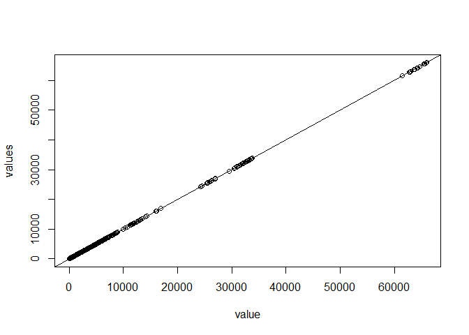<!-- -->

Szinte tökéletes az egyezés, minden kategóriánál jól egyezik a saját
számunk az Eurostat-éval! (Teljesen egzakt egyezés valószínűleg nem
várható az adatok utólagos korrekciói miatt.)

Következő lépésben bővítsük a validációt: ne csak Magyarországot
vizsgáljuk, hanem a többi országot is! Először itt is nézzük meg, hogy
működik-e a többszörös (ország)lekérdezés:

``` r
temp2 <- rbindlist(lapply(
  intersect(unique(ESres$iso3c), unique(RawData$iso3c)),
  function(country)
    dataInputFun(category = "Groups",
                 multipleICD = "MultiIndiv",
                 ICDSingle = NA,
                 ICDMultiple = names(ICDGroups$Groups),
                 multipleCountry = "Single",
                 countrySingle = country,
                 countryMultiple = NA,
                 indicator = "death",
                 yllMethod = NA,
                 yllPyllTarget = NA,
                 strat = "None",
                 metric = "count",
                 ordVar = "Year",
                 byvarAdd = c("Year", "CauseGroup", "EurostatCode"),
                 yearFilter = NA,
                 sexFilter = "Összesen",
                 ageFilter = "Összesen",
                 comp = NA,
                 valid = FALSE)$rd))
temp2 <- temp2[value != 0]
temp2 <- temp2[order(iso3c, Year, CauseGroup)]

temp <- dataInputFun(category = "Groups",
                     multipleICD = "MultiIndiv",
                     ICDSingle = NA,
                     ICDMultiple = names(ICDGroups$Groups),
                     multipleCountry = "Multiple",
                     countrySingle = NA,
                     countryMultiple = intersect(unique(ESres$iso3c),
                                                 unique(RawData$iso3c)),
                     indicator = "death",
                     yllMethod = NA,
                     yllPyllTarget = NA,
                     strat = "None",
                     metric = "count",
                     ordVar = "Year",
                     byvarAdd = c("Year", "CauseGroup", "EurostatCode"),
                     yearFilter = NA,
                     sexFilter = "Összesen",
                     ageFilter = "Összesen",
                     comp = NA,
                     valid = TRUE)$rd
temp <- temp[value != 0]
temp <- temp[order(iso3c, Year, CauseGroup)]

identical(temp, temp2)
```

    ## [1] TRUE

Itt is rendben vagyunk. Nézzük most az eredményeket:

``` r
res <- merge(ESres[age == "TOTAL" & sex == "T"], temp,
             by = c("Year", "EurostatCode", "iso3c"))

plot(values ~ value, data = res)
abline(0, 1)
```

<!-- -->

Továbbra is jó az egyezés! A kevés eltérést olyan adatok adják, ahol
egyértelmű, hogy az Eurostat adatbázisban van hiba (a K72_75 és a
B180_182 egy sor országban 0 értékű 2017-ben, de egyedül abban az évben,
2016-ban és 2018-ban is normális, országtól függően akár sok ezres
számok vannak, ezen kívül az U072 értékei valamiért 0-k Törökországra
mindhárom éven keresztül, ami szintén nem reális).

Végezetül utolsó lépésben tegyünk még egy bővítést: ne csak egyben
nézzük az életkorokat és a nemeket, hanem vizsgáljuk meg ezen túlmenően
az összes életkori és nemi kategóriát külön-külön is! Az eredmény:

``` r
pargrid <- CJ(Age = setdiff(c("Összesen", as.character(unique(RawData$Age))),
                            paste0("Deaths", 3:6)),
              Sex = c("Összesen", as.character(unique(RawData$Sex))))

temp <- rbindlist(lapply(1:nrow(pargrid), function(i)
  cbind(dataInputFun(category = "Groups",
                     multipleICD = "Multiple",
                     ICDSingle = NA,
                     ICDMultiple = names(ICDGroups$Groups),
                     multipleCountry = "Multiple",
                     countrySingle = NA,
                     countryMultiple = intersect(unique(ESres$iso3c),
                                                 unique(RawData$iso3c)),
                     indicator = "death",
                     yllMethod = NA,
                     yllPyllTarget = NA,
                     strat = "None",
                     metric = "count",
                     ordVar = "Year",
                     byvarAdd = c("Year", "CauseGroup", "EurostatCode"),
                     yearFilter = NA,
                     sexFilter = pargrid$Sex[i],
                     ageFilter = pargrid$Age[i],
                     comp = NA,
                     valid = TRUE)$rd,
        Age = pargrid$Age[i], Sex = pargrid$Sex[i])))

res <- merge(ESres, temp,
             by = c("Year", "EurostatCode", "iso3c", "Sex", "Age"))

plot(values ~ value, data = res)
abline(0, 1)
```

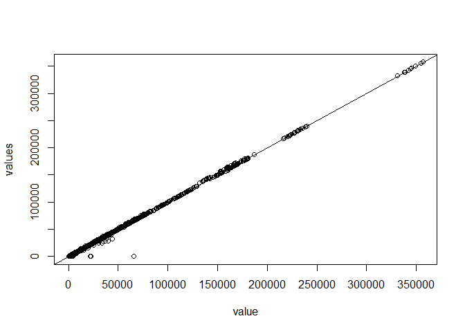<!-- -->

Az eltérést úgy tűnik itt is csak ugyanazok a tényezők okozzák.

## A weboldal

A weboldal [R Shiny](https://shiny.posit.co/) segítségével készült. Ez a
rendszer lehetővé teszi az R webre történő „kiinterfészelését”, azaz egy
olyan weboldal létrehozását, mely fogadja a felhasználótól a bemenetet,
azt átadja az R-nek, lefuttatja, fogadja a számítások eredményét, majd
azt megfelelően megjeleníti az oldalon. Ezzel lényegében hozzáférhetővé
teszi az R erejét bárki számára, minden R ismeret nélkül is, egy jól
kezelhető és az előbbiekből adódóan interaktív formában. (Ráadásul a
weboldal maga is megírható R alatt minden webes tudás nélkül.)

Az oldal forráskódja letölhető innen:
[app.R](https://github.com/ferenci-tamas/OkspecifikusMortalitasiAdatbazis/blob/main/app.R).

## Továbbfejlesztési lehetőségek

- [ ] További BNO-kódolási rendszerek bekapcsolása.
- [ ] További validációk.
