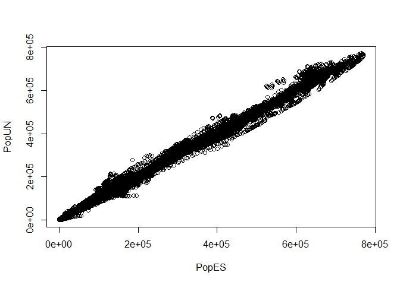
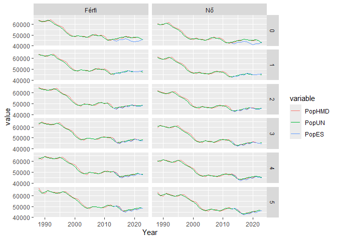

Okspecifikus Mortalitási Adatbázis
================
Ferenci Tamás (<https://www.medstat.hu/>)

- [Előhang: mi az, hogy
  epidemiológia?](#előhang-mi-az-hogy-epidemiológia)
- [Kik, mikor és hol betegek?](#kik-mikor-és-hol-betegek)
- [Miért betegek?](#miért-betegek)
- [Az adatok begyűjtése és
  előkészítése](#az-adatok-begyűjtése-és-előkészítése)
- [Az adatok és a számítás
  validációja](#az-adatok-és-a-számítás-validációja)
- [A weboldal](#a-weboldal)
- [Továbbfejlesztési lehetőségek](#továbbfejlesztési-lehetőségek)

Az Okspecifikus Mortalitási Adatbázis a
<https://research.physcon.uni-obuda.hu/OkspecifikusMortalitasiAdatbazis/>
címen érhető el.

Jelen írás két fő célt szolgál: az első felében egy részletes, reményeim
szerint teljesen közérhető magyarázatot ad az adatok értelmezéséhez és
felhasználásához, rámutatva a limitációkra és buktatókra is. Ez utóbbit
különösen fontosnak tartom, mert az adatok hibás felhasználása sok
nehézség és félreértés forrása; igyekszem a legfontosabb ilyeneket
alaposan bemutatni.

Az írás második fele egy technikai leírás, mely az adatbázis
előkészítésének lépéseit, az adatok validációját, valamint a weboldal
felépítését mutatja be. Valamennyi felhasznált kódot teljes
terjedelmében közlöm, így az összes számításom reprodukálható. Ezt
fontosnak tartom a nyílt tudomány, a transzparencia jegyében, elsősorban
azért, hogy az esetleges hibák, illetve jobb elemzési lehetőségek
könnyebben felszínre kerüljenek.

## Előhang: mi az, hogy epidemiológia?

Régebben tanítottam népegészségtant orvostanhallgatóknak, és ezeken a
kurzusokon mindig azt a – teljesen személyes, és tudományosan lehet,
hogy nem megalapozott – definíciót adtam az epidemiológia fogalmára,
hogy az a tudomány, ami választ akar adni a következő kérdésre: *miért
betegek az emberek*? Majd azzal folytattam, hogy ha kicsit bővíteni
akarjuk a képet, akkor azt mondanám, hogy az a tudomány, ami a következő
három kérdésre igyekszik válaszolni: *kik, mikor és hol betegek*? Rögtön
hozzátéve, hogy valójában ezek a kérdések is sokszor pont azért
érdekesek, mert segítenek megoldani a fő feladatot: azt gondoljuk, hogy
ott, akkor és azok körében, akik betegek, van valami oka annak, hogy épp
ők, akkor és ott betegek – ezért fontos ezek feltárása.

Mint az a fentiekből is látható, a feladat kettős: be kell gyűjteni a
megfelelő adatokat a „kik, mikor és hol betegek?” kérdésre, majd ezek
alapján levonni a következtetést a „miért betegek?” kérdésre nézve. Első
ránézésre az előbbi csak egy technikai kérdés és a második a fogós
feladat. Valójában már az első is sok nem nyilvánvaló problémát vet fel
– de a másodiknál nehéz lenne vitatkozni a fogós jelzővel. Tekintsük
most át mindkét lépést!

## Kik, mikor és hol betegek?

Első lépésben megbeszéljük, hogy miért halálozási adatokat használunk
(noha eddig mindenhol betegségről volt szó!), utána pedig megnézzük az
adatok lebontását a három említett kérdés mentén.

### Halálozási és megbetegedési adatok

Az eddigiekben végig „betegség” szerepelt a szövegben: ami érdekes, az
az adott populációban adott időszakban fellépő új megbetegedések száma.
(Szép szóval ezt incidenciának szokták hívni.) Ehhez képest az
adatbázisunk halálozási adatokat – mortalitást, tehát az adott
időszakban adott betegségbe belehalt emberek számára vonatkozó
információkat – tartalmaz. De miért? Milyen jogon tértünk át az egyikről
a másikra, incidenciáról mortalitásra, tehát előfordulásról halálozásra?

Fontos rögzíteni, hogy ez valóban egyfajta kényszermegoldás sok
szempontból. De még ezekben az esetekben is védhető kényszermegoldás,
illetve nagyon sokszor nem is tudunk mást használni, bármennyire is jó
vagy nem jó. A következőkben az idevágó szempontokat tekintjük át.

#### Miért jók a halálozási adatok?

1.  Elérhetőek betegségek egy széles körére

    Szemben a halálozással, a betegségek előfordulására vonatkozó adatok
    általában sokkal szűkebb körben, azaz sokkal kevesebb betegségre
    vonatkozóan érhetőek el. A halálozásokból ugyanis minden egyes
    esetet besorolnak halálok szerint és nyilvánosan jelentenek, addig
    egy betegség puszta fellépésére vonatkozó információ begyűjtése
    általában komoly többlet-energia befektetését igényli, hiszen ilyen
    adatot – szemben a halálozással – rutinszerűen nem gyűjtenek a
    népegészségügyi rendszerek. Alapvetően három megoldási lehetőség jön
    szóba ha előfordulásra vonatkozó adatot szeretnénk gyűjteni; hogy
    jobban megértsük az ezzel kapcsolatos nehézségeket, tekintsük át
    ezeket röviden:

    - Az egyik megoldási lehetőség ad hoc vizsgálatok szervezése.
      (Például egy mintavétellel történő felmérés – jó esetben
      véletlenszerűen a populációból, rosszabb esetben ún. kényelmi
      mintaként, például egyetlen, általunk könnyen lekérdezhető kórház
      adatainak feldolgozásával.) Ez kevesebb erőforrást igényel, de
      csak egy pillanatfelvételt ad, és semmiképp nem teljeskörű,
      kényelmi minta esetén pedig erősen kérdéses is az
      általánosíthatósága.
    - A másik lehetőség az ún. adminisztratív/finanszírozási adatok
      felhasználása. Az alapötlet, hogy a kórházak amúgy is jelentenek
      finanszírozási célból adatokat – miért ne használjuk fel ezt
      epidemiológiai célokra is? Csakugyan, ha valaki egészségügyi
      ellátásban részesül, akkor keletkezik róla egy adatsor, amit
      beküldenek a NEAK-ba, benne a személy nemével, életkorával,
      lakhelyével, betegségével, az elvégzett beavatkozással; ebből
      tényleg kiolvasható lehet a megbetegedés fellépése. Ez nagyon
      csábítóan hangzik, hiszen az erőforrás-igénye csekély (amúgy is
      begyűjtött adatokat dolgozunk fel), de mégis teljeskörű és
      folyamatosan frissülő az adatbázis, legalábbis a közfinanszírozott
      ellátásokra vonatkozóan. Bár ez eddig nagyon jól hangzik, a
      módszernek vannak hátrányai is, egyrészt az adatminőség (ezeket a
      jelentéseket a kórházak rutinszerűen meghamisítják, hogy
      „optimalizálják” a finanszírozásukat), másrészt a klinikai adatok
      hiánya (azt tudjuk, hogy valakit megröntgeneztek, de azt nem
      tudjuk, hogy mi volt a röngtenképen, azt tudjuk, hogy az alany
      hány éves, de azt nem tudjuk, hogy dohányzik-e). Ezzel együtt is,
      ma már egyre több ilyen vizsgálat készül; egy példa tisztán
      akadémiai célokat szolgáló ilyen kutatásra a
      [HUNVASCDATA](https://hunvascdata.hu/)-projekt.
    - Végezetül a harmadik lehetőség a betegségregiszterek használata.
      Ez szó szerint véve „a” megoldás a problémára, hiszen a regiszter
      definíció szerint azt jelenti, hogy valamely megbetegedés
      előfordulásáról a teljesség igényével történő gyűjtés. (Tipikusan
      jogszabály írja el a kötelező jelentést az egészségügyi
      ellátóknak.) Ez látszólag az ideális megoldás: teljeskörű,
      folyamatos, validálható adatminőségű, részletgazdag klinikai
      adatokat is tartalmazhat, egyetlen apró problémája van: az, hogy
      hatalmas az erőforrásigénye. Nem csak „forintban” értve, hanem az
      adatszolgáltatói teherre nézve is, hiszen ez azt is jelenti, hogy
      az észlelő orvosoknak a betegek után egy plusz jelentést is ki
      kell tölteniük, és feltölteni a regiszterbe.

    A jogszabály szerint Magyarországon több mint egy tucat regiszter
    kell, hogy [működjön](https://njt.hu/jogszabaly/2018-49-20-5H),
    ezekből gyakorlatilag kettő az aminek értelmezhető, ténylegesen
    teljeskörű, folyamatosan frissülő, kívülről is látható –
    publikációkban megjelenő, weboldalon lekérdezhető – aktivitása van,
    a [Nemzeti Szívinfarktusregiszter](https://nszr.gokvi.hu/ir/fooldal)
    és a [Nemzeti
    Rákregiszter](https://onkol.hu/nemzeti-rakregiszter-es-biostatisztikai-kozpont/).
    Az összes többi regiszterről még én sem tudom, hogy mit csinálnak,
    van ami elvileg működik, de kívülről nézve aligha betöltve a
    funkcióját (a szívelégtelenség regiszter 2021-ben eredményként
    [számolt be](https://mkardio.hu/hirek.aspx?nid=106368) arról, hogy
    2015 óta összesen 1600 beteget bevontak – miközben Magyarországon
    majdnem 10 ezer *halál* történik ebből, *évente*), van, aminek a
    nevére
    [rákeresve](https://www.google.com/search?client=firefox-b-d&q=%22Feln%C5%91tt+Sz%C3%ADvseb%C3%A9szeti+Regiszter%22)
    kizárólag a jogszabály szövegét kapjuk meg találatként…

    Remélem a fentiekkel tudtam érzékeltetni, hogy mi az oka annak, hogy
    előfordulásra vonatkozó adatok csak betegségek egy szűk körére
    érhetőek el, valamint, hogy az sem várható, hogy ez lényegesen
    megváltozzon a közeljövőben.

2.  Ez különösen igaz, ha időben visszafelé megyünk

    Az előbbi állítás végképp igaz, ha szeretnénk múltbeli adatokat is
    vizsgálni; minél messzebb megyünk vissza, annál inkább. A Nemzeti
    Szívinfarktusregiszter 2014 óta működik mint teljeskörű regiszter, a
    Nemzeti Rákregiszter 2000 óta. Nyugati regisztereknél van példa
    nagyobb időtartamra, de összességében véve legjobb esetben is néhány
    évtizedről beszélünk, ami az előfordulás-jellegű adatok
    elérhetőségét illeti. Ehhez képest az angol haláloki adatok 1851-re
    is
    [elérhetőek](http://doc.ukdataservice.ac.uk/doc/3552/mrdoc/pdf/guide.pdf),
    de a londoniakat már 1603-tól (!) minden évben nyomtatásban
    [közlik](https://www.thelancet.com/journals/lancet/article/PIIS0140-6736(20)30725-X/fulltext).

3.  A halálozás sokszor az egyik legfontosabb mutatója egy betegség
    terhének

    Ha nem egyszerűen a betegség előfordulása érdekel minket, hanem a
    betegség jelentette teher, akkor nagyon sok szempont merül fel:
    szenvedés, maradványtünetekkel gyógyulás, munkából kiesés,
    egészségügyi ellátórendszer igénybevétele és így tovább. Ezek közül
    a halálozás azonban kiemelkedik, egyrészt mert egyértelműen
    definiált és egyértelműen mérhető (mi az, hogy „szenvedés” és hogyan
    lehet számszerűen lemérni?), másrészt mert sok esetben ez a
    legfontosabb, legnagyobb relevanciával bíró szempont, a köznapi
    szóhasználatban és népegészségügyi szempontból is.

4.  Ha a halálozási arány állandó, akkor a halálozás az incidenciát is
    jellemzi

    A betegségbe belehaló emberek száma egy szorzat: a megbetegedő
    emberek száma szorozva a halálozási aránnyal. Amennyiben
    feltételezzük, hogy ez utóbbi állandó, akkor a halálozás valójában
    igenis méri az incidenciát is! Igen, a konkrét szám nem fog
    stimmelni (hacsak a halálozási arány nem 100%), de a *relatív
    viszonyok* rendben lesznek: ha kétszer annyi halálozás van, akkor
    tudhatjuk, hogy az előfordulás is kétszeresére nőtt. Amennyiben az
    „állandó” alatt azt értjük, hogy nem változik időben egy országban,
    akkor az adott ország különböző időszaki adatai vethetőek egybe
    ilyen módon, ha pedig különböző országokban is ugyanaz a halálozási
    arány, akkor még a különböző országok adatai is összevethetőek
    (mondhatjuk, hogy ahol kétszer akkorra a halálozás, ott kétszer
    annyi megbetegedés is van).

#### Milyen bajai vannak a halálozási adatoknak?

1.  A haláloki besorolás problémái

    Ez a kérdés a koronavírus-járvány alatt hatalmas publicitást kapott.
    Egy ahhoz kapcsolódó
    [írásomban](https://github.com/tamas-ferenci/ExcessMortEUR)
    részletesen
    [kifejtettem](https://github.com/tamas-ferenci/ExcessMortEUR?tab=readme-ov-file#a-hal%C3%A1loki-statisztik%C3%A1k-probl%C3%A9m%C3%A1i)
    a problémakört, itt szinte szó szerint meg tudom ismételni az akkor
    leírtakat: gond az, hogy a haláloki statisztikákban mindenkit egy,
    és csak egy halálokhoz kell besorolni. (Magán a halottvizsgálati
    bizonyítványon ennél komplexebb haláloki helyzet is feltüntethető,
    de a végső statisztikában ez nem fog látszni, csak egy pontosan
    definiált, ún. előztetési eljárással kiválasztott halálok, amit
    statisztikai közlésre kiválasztott elsődleges haláloknak szoktak
    nevezni.) A probléma az, hogy az embereknek sokszor nem egyetlen
    halálokuk van: elveszítünk egy szívelégtelen, cukorbeteg alanyt
    stroke-ban; ő akkor most mibe halt bele? A szívelégetelenségbe? A
    cukorbetegségbe? A stroke-ba?

    Ritkák a vegytiszta esetek, mégpedig mindkét irányban ritkák: hogy
    egy egyébként makkegészséges alanyt elvisz egy stroke vagy hogy egy
    stroke-os beteg fejére rádől egy kémény az utcán. Ezek a tiszta
    esetek, amikor 100% vagy 0% a stroke hozzájárulása a halálozáshoz,
    de a valódi történetek többsége nem ilyen, hanem szürke zóna, mint
    azt az előző bekezdés példája is mutatja.

    Ráadásul nem arról van szó, hogy ez „bonyolult” probléma (és majd
    jövőre okosabbak leszünk, és megoldjuk), hanem arról, hogy ez
    *megoldhatatlan* probléma. Valamennyi ok *hozzájárult* a halálához,
    nyilván nem tett jót, hogy szívelégtelen, nem tett jót, hogy
    cukorbeteg, tehát, ha szigorúan vesszük, valami olyasmit kellene
    mondani, hogy 33 százalékban a szívelégtelenségbe halt bele, 19
    százalékban a cukorbetegségbe és 48 százalékban a stroke-ba.
    (Természetesen ezek a számok teljesen hasraütésszerűek.) Hiába is
    lenne *elvileg* ez a helyes, az orvosi realitásnak megfelelő kép,
    ilyet nem csinálunk – annyiban érthető módon is, hogy ember legyen a
    talpán, aki ezeket a százalékokat megmondja.

    Ez tehát a probléma; annyit azért fontos hangsúlyozni, hogy a dolog
    egy részletekbe menően szabályozott, egységes algoritmus alapján
    zajlik (ez nyilvánosan elolvasható, mind a
    [KSH-nál](https://www.ksh.hu/docs/hun/info/02osap/torveny/d159006_2.doc),
    mind a
    [WHO-nál](https://icd.who.int/browse10/Content/statichtml/ICD10Volume2_en_2019.pdf)),
    tehát bár a problémára nincs varázsütésszerű megoldás, de legalább
    az elmondható, hogy a pontos besorolási döntés, még ha nem is
    vitathatlan, de jó esetben legalább egységes országok között is, és
    időben is.

2.  Az adatminőség kérdése

    Úgy tűnhet, hogy ilyen szempontból nincs nagy gond, sőt, valójában
    még jobb is a helyzet, mint az incidencia-jellegű adatoknál, hiszen
    míg egy diagnózist el lehet nézni, azért legkésőbb a halálnál,
    felboncolva az alanyt, csak kiderül egész bizonyosan, hogy mi baja
    volt. Valójában azért ez ennyire biztosan nem igaz (kezdve azzal,
    hogy egyáltalán nincs minden elhunyt felboncolva; Magyarországon
    2021-ben 23% volt a [boncolási
    arány](https://gateway.euro.who.int/en/indicators/hfa_545-6410-autopsy-rate-for-all-deaths)
    és ez még egy kiugróan magas szám, a legtöbb nyugati országban ez a
    10%-ot sem éri el), ráadásul további problémák is vannak.

    Az első kérdés a használt osztályozási rendszer, a Betegségek
    Nemzetközi Osztályozása (röviden BNO) ami meghatározza, hogy milyen
    halálokok léteznek és hogy azokba milyen algoritmus szerint kell
    besorolni az elhunytakat. A gond az, hogy az orvosi tudás
    bővülésével ez folyamatosan változik, tipikusan bővül, mégpedig elég
    drámaian: a BNO 1900-ban bevezetett első változata 191 kódot
    tartalmazott, a 2022-ben elindított 11. revízió pedig 17 ezret…
    Közben bizonyos kódokat törölnek is, vagy egybevonnak másokkal, a
    bővülés sem feltétlenül új betegségek megjelenését jelenti, hanem
    meglevőek részletesebb szétbontását és így tovább. Az [külön
    tudomány](https://www.tandfonline.com/doi/abs/10.1080/01615440.1996.10112731),
    hogy az eltérő verziókat hogyan kell összekapcsolni, de látszik,
    hogy ez tökéletesen soha nem tehető meg. Ez eleve korlátozza az
    egységességet, ha különböző időpontokról beszélünk.

    Valójában ennél kicsit rosszabb a helyzet, mert egy revízió
    érvényességi időtartamán belül is lehetnek változások. Ezt azért
    említem külön, mert a magyar adatokat érinti: 1995-től 2022-ig a 10.
    revízió volt érvényben, mégis, 2005-től érzékelhetően megváltoztak a
    számok. (Az össz-halálozás természetesen adott, így ez lényegében a
    különböző kategóriák közötti átrendeződést jelenti.) Ennek az oka
    egyrészt, hogy ekkor [tértek
    át](https://www.ksh.hu/docs/hun/modsz/nep_modsz.html) a KSH-nál az
    automatikus, gépi haláloki besorolási rendszerre a korábbi kézi
    besorolás helyett, egy új halottvizsgálati bizonyítvány formátum,
    valamint szigorúbb orvos-szakmai ellenőrzés elindításával együtt,
    másrészt ekkor [vezették
    át](http://diploma.uni-sopron.hu/1890/1/kplhi1604.pdf) egyben az
    1995 óta a WHO által kiadott apróbb, revízión belüli változásokat.
    Ezek miatt a 2005 előtti és utáni magyar adatok összehasonlítása
    esetén óvatosan, erre tekintettel kell eljárni.

    Természetesen a kódolás minősége is kérdés lehet, történhetnek
    adminisztratív hibák, hiányos vagy téves kódolások, nem biztos, hogy
    tökéletes a jelentési fegyelem stb., ez különösen igaz, ha a fejlett
    világon túli [országokat
    is](https://iris.who.int/bitstream/handle/10665/269355/PMC2624200.pdf)
    be akarjuk vonni a vizsgálatokba. Több nemzetközi tanulmány
    vizsgálta a kódolási minőséget (például az
    [autóbalesetekre](https://www.ncbi.nlm.nih.gov/pmc/articles/PMC10523810/)
    vagy épp az
    [esésekre](https://bmcgeriatr.biomedcentral.com/articles/10.1186/s12877-021-02744-3)
    vonatkozóan); de talán még érdekesebbek azok a nagyon izgalmas hazai
    vizsgálatok, melyek azt [vetették
    egybe](https://akjournals.com/view/journals/650/163/37/article-p1481.xml),
    hogy a Nemzeti Rákregiszterben szereplő adatok hogyan viszonyulnak a
    – KSH-s – haláloki besoroláshoz: egy eredményt kiemelve, 2018-ban 32
    586 halálozás volt rosszindulatú dagantként besorolva, ebből 29
    970-et „sikerült megtalálni” a Rákregiszterben.

    Mindezek a problémák hatványozottan igazak az emlegetett régi
    adatokra: szép-szép, hogy megvan már 1603-ból is London haláloki
    adatbázisa, de vajon mire megyünk azzal, hogy hányan [haltak
    meg](https://worldhistorycommons.org/londons-bill-mortality)
    fényemelkedésben vagy ijedtségben? (Ennél azért jobb a helyzet,
    valójában sok betegség beazonosítható, bár az adatminőség nyilván
    ott is hihetetlenül rossz mai szemmel nézve. De azért ne becsüljük
    le: például a pestis-járványok lefolyása [kiválóan
    rekonstruálható](https://journals.plos.org/plosone/article?id=10.1371/journal.pone.0008401)
    ilyen adatokból is.)

3.  Csak olyan betegségeknél jó, aminél van egyáltalán releváns
    halálozás

    Ha valaki a megfázással szeretne foglalkozni, akkor nem sokra megy a
    halálozási adatokkal.

4.  A halálozás egybeméri az incidenciát és a gyógyítás hatásfokát

    Az előnyök között említettük azt az értelmezést, ami úgy kezdődik,
    hogy „ha a halálozási arány állandó” – de mi van ha nem? Ha változik
    időben (például mert fejlődik az orvostudomány), akkor sajnos mégsem
    működik az előnyöknél elmondott logika, és nem tudunk következtetni
    a halálozásból az előfordulásnak még a relatív viszonyaira sem: ha
    csökken a halálozás, akkor nem biztos, hogy csökken az előfordulás,
    lehet, hogy egyszerűen csak hatékonyabbá vált a gyógyítás. Ha eltér
    a halálozási arány országok között (például mert valahol jobb
    kezelési lehetőségek érhetőek el), akkor nem vethetőek össze ezzel a
    logikával a különböző országok: nem biztos, hogy ahol kevesebb halál
    van, ott kevesebb – pláne pontosan arányban kevesebb – a
    megbetegedés, lehet, hogy csak hatékonyabban gyógyítanak.

### Az adatok lebontása

Ha a fentieket elfogadva nekiállunk a halálozási adatok használatának,
akkor le kell azokat bontani a három említett szempont szerint: kik,
mikor és hol. Mindháromhoz érdemes kommentárt fűzni.

#### Mikor betegek?

A használt adatbázis éves adatokat tartalmaz. Nagyon is fontos
szempontokat vethet fel egy olyan vizsgálat is, ami használ finomabb
felbontású, például havi vagy heti adatokat (milyen az éven belüli
mintázat, az ún. szezonalitás, van-e hatása annak, hogy munkanapról
van-e szó vagy hétvégéről stb.), de a hosszabb távú elemzésekhez
általában éves adatokat szoktak használni.

#### Hol betegek?

A használt adatbázis alapvetően országokat tartalmaz, ez a legkisebb
vizsgálható egység. Itt is elmondható, hogy érdekes lehet egy olyan
vizsgálat is, ami finomabb felbontást választ, magyar viszonylatban
mondjuk megyei, de ezekről nehezebb adatot szerezni, ráadásul a
definíciós kérdések is élesednek. (Ki tekinthető zalai megyeinek? Ott
született? Ott van a lakcíme? Ott él? Van egyáltalán erről adatunk,
biztos, hogy mindenki ott él, ahol a lakcíme van?)

#### Kik betegek?

A használt adatbázis két szempont szerint bontja le az adatokat: nem és
életkor. (Ez utóbbinál a felbontás némileg függ az országtól, de
jellemzően 5 éves korcsoportokat jelent.) Mindjárt látni fogjuk, hogy
ezek szerepe nagyon fontos, mert egyszerre igaz rájuk, hogy eltérnek
országok között és kihatnak a halálozásra. A probléma inkább az, hogy
további lebontásunk nincsen, nem tudjuk, hogy az elhunytak hogyan
oszlanak meg mondjuk dohányzás, szocioökonómiai státusz vagy elhízás
szerint.

## Miért betegek?

Ezzel elérünk a témának egyfelől a sava-borsához, másfelől az egyik
legnehezebb részéhez. A következőkben néhány idézet részletes
kivesézésével igyekszem bemutatni a legfontosabb nehézségeket,
buktatókat, illetve szempontokat, amikre tekintettel kell lenni az
adatok értelmezésénél.

### Halálozás Svédországban és Chile-ben

*Egy évben az akkor 13,5 millió lakosú Chile-ben 76 261-an haltak meg
(halálozási ráta: 5,7 per 1000 fő per év), a 8,7 millió lakosú
Svédországban 97 008-an (halálozási ráta 11,2 per 1000 fő per év), tehát
Svédország mortalitása kétszerese volt Chile-ének.*

Az állítás eleve elég meglepő lehet, de nem hazudok: a számok pontosan
ezek. (Milyen sokszor előkerül ez a helyzet! Nem csak úgy lehet valami
hamis, ha nem igazak benne a számok, az interpretációval is lehet teljes
félrevezetést elérni.)

Mi történik? Azonnal megértjük – bár ettől valószínűleg még nem lesz
kevésbé meglepő, ha valaki először látja! – ha megnézzük ugyanezeket a
számokat, de lebontva életkor szerint. Az egyszerűség kedvéért csak két
életkori kategóriát használva, ezek a tényadatok:

| Korcsoport       | Svédország                  | Chile                        |
|------------------|-----------------------------|------------------------------|
| 70 év alatt      | 21 381 / 7 576 522 = 2,82   | 37 062 / 12 917 070 = 2,87   |
| 70 év és felette | 75 627 / 1 115 126 = 67,8   | 39 199 / 571 131 = 68,6      |
| *Összességében*  | *97 008 / 8 691 648 = 11,2* | *76 261 / 13 488 201 = 5,65* |

A dolog első ránézésre teljesen paradoxnak tűnik. Mármint nem
epidemiológiailag, hanem matematikailag! Hogyan lehetséges, hogy ha az
egész populációt szétosztjuk két részre, akkor mindkettőben Svédország a
jobb, viszont együttvéve meg drámaian rosszabb? Lehetséges egyáltalán
ilyen?! Sokan azt mondanák, hogy nem, ne vicceljünk, hát ha a fiatalok
körében is jobb a svéd helyzet, meg az idősek körében is, akkor
*nyilván* összességében is jobb – csakhogy ez nem így van. (Ha valaki
nem hiszi, adja össze a számokat és ellenőrizze!)

Mi a magyarázat? Jobban megnézve a számokat – tényleg érdemes e ponton
megállni, és egy percet rászánni! – kiviláglik a jelenség oka.

A magyarázat az *eltérő korfa*…! Chile-ben mutatóban volt a vizsgált
évben 70 év feletti ember (fejlődő ország, fiatal korösszetétellel),
addig Svédországban azért bőven volt ilyen lakos (fejlett ország,
idősödő társadalom). Érdemes megnézni, hogy Chile lélekszáma másfélszer
akkora, mint Svédországé, mégis mindössze feleannyi 70 évnél idősebb
lakos van! Innen már összerakható a történet: igaz, hogy külön-külön
mindkét korcsoportban jobb Svédország, de azért a svéd idősek halálozása
még mindig rosszabb, mint a chile-i fiataloké, így a több svéd idős, a
körükben mért nagyobb halálozással, „lerontja” az össz-statisztikát. Úgy
is fogalmazhatunk, hogy a halálozási ráta egy súlyozott átlag: az egyes
korcsoportok halálozási rátáinak átlaga, súlyozva a korcsoport
lélekszámával. A „súlyozott átlag” itt nem egy irodalmi szófordulat: a
szó szigorú matematikai értelmében is erről van szó. A svéd lakosság (7
576 522 / 8 691 648 = ) 87,2%-a 70 év alatti, (1 115 126 / 8 691 648 = )
12,8%-a a fölötti, és csakugyan: 87,2% $\cdot$ 2,82 + 12,8% $\cdot$ 67,8
= 11,2! Hasonlóképp a chile-i korfa szerint 95,8% 70 év alatti, 4,2% a
fölötti, és valóban, 95,8% $\cdot$ 2,87 + 4,2% $\cdot$ 68,6 = 5,7.
Látszik tehát a magyarázat: hiába jobb Svédország mindkét korcsoportban
külön-külön, ott az idősebbkori, rosszabb értékek jóval nagyobb súlyt
kapnak, mint Chile-ben!

Egy szó mint száz, előfordulhat, hogy egy országban minden korcsoportban
jobb a halálozás, összességében mégis rosszabb.

Mindez megmutatja ez első nehézséget a fejezetcímben foglalt kérdés
megválaszolásában, tehát az okok feltárásában: azt mondtuk, hogy arra
leszünk kíváncsiak (többek között), hogy hol nagyobb a halálozás,
mondván, hogy ott annak valami oka van, de mint látjuk, már annak
megállapítása sem egyértelmű, hogy *egyáltalán hol nagyobb* a
halálozás…! Látszólag Svédországban, de valójában Chile-ben.

Sőt, ez a nehézség nem csak a „hol” kérdését érinti. A fenti probléma
ugyanis nem csak különböző országok ugyanazon évben mért adatainál
jelentkezhet, hanem ugyanazon ország különböző évben mért adatainál is!
A helyzet tökéletesen ugyanaz, csak a „Chile” felirat helyett képzeljük
oda a táblázatban azt, hogy „a vizsgált ország korábban”, a „Svédország”
helyett pedig azt, hogy „a vizsgált ország később”. (Ugyanaz az ország
idősödött; noha a konkrét mérték a fenti táblázattal extrém, de maga a
jelenség teljesen tipikus a legtöbb fejlett országban.) Mit látunk? Azt,
hogy a halálozási ráta sokkal rosszabb a későbbi időpontban, miközben a
helyzet a valóságban kicsit még javult is! Tehát a „mikor” kérdéssel
próbálkozva is *teljesen fals* választ kapnánk, mert azt hisszük, hogy
akkor jobb a helyzet, amikor valójában rosszabb, tehát már ott tévútra
mennénk, hogy egyáltalán melyik időszakban kell keresnünk a rosszabb
halálozás okait.

(A fentiekben mindenhol egyszerűen a halálozások számát használtam; ez
olyan, mintha a halálok a „bármely okból bekövetkező halálozás” lenne.
Természetesen a leírtak pontosan ugyanúgy igazak akkor is, ha valamely
konkrét halálokból vagy halálokokból bekövetkező halálozások számáról
beszélünk.)

Mi lehet erre a problémára a megoldás? Az egyik lehetőséget rögtön a
táblázat mutatja: ne az összességében vett halálozási rátát használjuk,
hanem az egyes életkorokét. Tehát ne azt mondjuk, hogy „11,2 az 5,7-tel
szemben”, hanem azt, hogy „2,8 a 2,9-cel szemben *és* 68 a 69-cel
szemben”. Máris rendben vagyunk…! (Ezt a módszert szokták rétegzésnek
nevezni a biostatisztikában; jelen esetben életkor szerinti rétegekre
bontottuk a teljes populációt.) A dolog működik, ezt az előbbi mondatok
is mutatják, de azért hátránya is van ennek a módszernek. Az egyik, ami
szintén rögtön látható, hogy nem *egy* eredményt kapunk, hanem többet.
Jelen esetben kettőt, ami nem tűnik vészesnek, de ez csak azért volt,
mert nagyon széles életkor-tartományokra bontottunk; ha szűkebb életkori
csoportokat, például 5 év széles kategóriákat használunk, akkor akár
nagyon sok eredményünk is lehet. Ez minimum nem praktikus (ki szeretné,
ha arra a kérdésre, hogy „hogyan viszonyul Svédország mortalitása
Chile-hez?” egy számokkal teleírt lapot kapna, azzal, hogy tessék, ez a
válasz…), de statisztikai kérdéseket is felvet, mert ha nagyon szűk
korcsoportokat használunk, akkor kicsi lesz az egyes csoportok
lélekszáma, kevés halálozással, és így az egyes korcsoportok halálozási
rátainak a becslése bizonytalanná válik, mert kevés alanyból kell
megtennünk.

Itt jön a második megoldás ötlete. A módszer neve: standardizálás. A
standardizálás is egy rétegzéssel indít, de utána továbbmegy: az egyes
korcsoportok halálozási rátáit *újra* összerakja egyetlen számba,
súlyozott átlagként – pontosan ugyanúgy, mint a félrevezető számítás,
csak épp ügyesebben. Mert mi volt a probléma? Az, hogy az egyes
korcsoportok halálozási rátáit *különböző* súlyokkal raktuk össze – hát
akkor egyszerű a megoldás: rakjuk össze, de *ugyanazokkal* a súlyokkal!
Legyen például, hasraütésszerűen mondok valamit, a súlyozás, tehát a
korfa a következő: 70 év alattiak 90%, fölöttiek 10%. Ezt az egységes
korfát szokták referencia-populációnak vagy standard populációnak is
nevezni. És ezt fogjuk használni – most jön a lényeg! – *mindegyik*
országnál! Próbáljuk ki, az ezzel kapott eredmény Svédország esetében
90% $\cdot$ 2,82 + 10% $\cdot$ 67,8 = 9,32, míg Chile esetében 90%
$\cdot$ 2,87 + 10% $\cdot$ 68,6 = 9,44. Ezek a számok, a 9,32 és a 9,44
többé már nem bírnak közvetlen tartalommal (hiszen egy fiktív korfához
tartoznak), de, ami kulcsfontosságú: összehasonlíthatóak egymással, az
egyes országok eltérő korfái ellenére is. És nézzük meg, csakugyan: így
már Chile a rosszabb és Svédország a jobb! Ezeket a halálozási rátákat
szokták standardizált (vagy még teljesebb nevén direkt standardizált)
halálozási rátának nevezni. Ez már összehasonlítható különböző országok
között is; természetesen az értéke függ attól, hogy milyen
referencia-populációt használtunk (ezt mindig meg kell adni). A
korábbiakban kiszámolt halálozási rátákat megkülönböztetésül nyers
halálozási rátának szokták hívni.

Van még más megoldás is (például a regresszió, ami sok szempontból
korszerűbb is), de az epidemiológiai irodalomban a mai napig a
standardizált halálozási ráta a legáltalánosabban használt eszköz a
különböző országok, vagy épp különböző időpontok
összehasonlíthatóságának megteremtésére.

Egyetlen apró szépséghiba van: az, hogy valójában ez nem „általában”
teremti meg az összehasonlíthatóságot, hanem egy konkrét tényezőre, az
életkorra tekintettel. Annak a szerepét szűri ki – semmi mást nem.
Esetleg még nem szerint lehet rétegezni, vagy standardizálni, mert a
halálozási adatokat tudjuk nem szerint is lebontva. De ennyi!
Elképzelhetjük például, hogy az országok eltérnek abban, hogy a lakosság
mekkora része cukorbeteg. (Vagy épp ugyanazon országban eltér különböző
években!) Megint visszamehetünk az előző táblázatra, csak most vegyük
úgy, hogy a sorok nem az életkori csoportok, hanem az egyik az, hogy
„nem cukorbeteg”, a másik az, hogy „cukorbeteg”. Ekkor pontosan
ugyanabba a problémába futunk bele: lehet, hogy egy ország a
cukorbetegek körében is jobb halálozási rátát produkál, a nem
cukorbetegek körében is jobb halálozási rátát produkál – de
összességében mégis rosszabbat! Ezzel azonban semmit nem fogunk tudni
kezdeni. Nem azért, mert standard populáció nincsen (azt bármikor
gyárthatunk, legyen mondjuk 5% cukorbeteg, 95% nem az, tessék, máris
megvan), hanem azért, mert halálozási ráta nincsen külön cukorbetegekre
és nem cukorbetegekre! Az országok közlik a halálozási számokat nem és
életkor szerint, de nem közlik cukorbetegség szerint. Ezzel tehát nem
tudunk ilyen módszerrel mit kezdeni.

(Zárójelben érdemes hozzátenni, hogy az is egy kérdés lehet, hogy ha
lenne is ilyen adatunk, biztosan ki akarnánk-e szűrni a cukorbetegség
hatását. Lehet ugyanis a mellett érvelni, hogy ha egy országban azért
magasabb a halálozási ráta, mert több a cukorbeteg, azt a legkevésbé sem
kell „kiszűrni”, ellenkezőleg, azt ki kell mutatni, hiszen a probléma
része. Ez már végképp nagyon messzire vezető kérdéskör, de valójában az
attribúció kérdése van a háttérben: mit szeretnénk betudni az ország
hatásának és mit nem? A fenti érvelés mögött az van, hogy az ország
„tehet” arról, hogy mennyi cukorbeteg van, így azt ne szűrjük ki. Ezzel
szemben arról „nem tehet”, hogy milyen a korfa, ezért kell azt kiszűrni
az összehasonlításhoz. Amint talán érzékelhető, ezek már ingoványos, nem
egyértelműen definiált terület, de abban a részében nem szokott kétség
lenni, hogy a korfa hatását ki kell szűrni, ezért általános a
standardizált ráta használata a nyers helyett.)

Összefoglalva mindezeket, láthatjuk, hogy már az sem nyilvánvaló kérdés,
hogy egyáltalán milyen halálozási számot kell országok, vagy évek között
összehasonlítani. A problémák azonban nem érnek ezzel véget.

### Dohányzás és a rák

*A dohányzás rákot okoz, csak meg kell nézni, ahol több a dohányzó, ott
több a rákos is!*

Igaz ez, tényleg több a rákos ott, ahol több a dohányzó? Igen, igaz, az
alábbi ábra mutatja a helyzetet az Európai Unió országaiban:

<!-- -->

A pontok mindegyike egy országot jelöl; az ábrán behúztam az ezekre
legjobban illeszkedő egyenest is. Ahogy látszik, a legkevesebbet
dohányzó országok körében látható 220 körüli értékről 290 körülire
emelkedik az átlagos rák-halálozási ráta ahogy nő a dohányzók aránya. Ez
több mint 30% növekedés, avagy, másként kifejezve, 10 millió lakosra
7000-rel több rákos halálozás évente, tehát nem csak van összefüggés, de
elég drámai mértékű (Magyarországon általában évente 30 ezernél kicsit
több rákos halálozás van).

Látszólag tehát végeztünk is: valóban megmutattuk, hogy a dohányzás
rákot okoz! Immár teljesen tudományos alapon, konkrét számokkal,
adatokkal, pontokkal, legjobban illeszkedő egyenessel. Ha szeretnénk,
lehet még drámaibbá is tenni, például: „ha vissza tudnánk szorítani a
dohányzást hazánkban, 7000-rel kevesebben halnának meg rákban évente!”…

Első ránézésre úgy tűnik, hogy ezzel az elemzéssel nemhogy gond nincsen,
hanem voltaképp ezért csináltuk az egész adatgyűjtést. Hiszen mit
mondtunk az elején? Hogy azért érdekel minket, hogy hol, mikor és ki hal
meg, hogy ebből következtessünk az okozati viszonyokra. Tessék, ott ahol
többet dohányoznak, többen halnak meg rákban.

Igen ám, de. Mi van, ha elkészítjük *hajszálpontosan ugyanezt* az ábrát,
csak épp nem a dohányzást, hanem a cukorbetegek arányát ábrázoljuk?

<!-- -->

Tehát a cukorbetegség is hozzájárul a rákhoz: ahol több a cukorbeteg,
ott magasabb a rákhalálozás is.

Rendben, eddig semmi gond, miért ne lehetne, hogy a dohányzás is
hozzájárul a rákhoz, meg a cukorbetegség is? Teljesen logikus is. Igen
ám, csak nézzük meg ezt az ábrát:

<!-- -->

Úgy tűnik a kettő egymással is összefügg! Ahol több a dohányzó, ott több
a cukorbeteg is. Rendben, ez sem egy egetrengető dolog eddig…

…viszont, ha jobban elgondolkodunk ezen, akkor befészkelheti az agyunkba
magát egy nyugtalanító gondolat. Ha a dohányzás és a cukorbetegség
összefügg, és a cukorbetegség rákot okoz, akkor nem lehet, hogy a
dohányzásnak igazából nincs is szerepe, és az első ábrán csak azért
láttuk azt, mintha lenne, tehát, hogy a többet dohányzó országokban
azért volt több rákos, mert azokban az országokban *egyúttal* a
cukorbeteg is több volt? És ez volt a *valódi* oka annak, hogy ott több
a rákos, miközben a dohányzásnak nincs is semmi szerepe…?

A rövid válasz: de. Sajnos lehet. Nem *biztos*, hogy ez a magyarázat, de
lehetni lehet. És ezzel elértünk az ilyen típusú orvosi adatok
értelmezésének talán [legnagyobb
csapdájához](https://tamas-ferenci.github.io/FerenciTamas_AzOrvosiMegismeresModszertanaEsAzOrvosiKutatasokKritikusErtekelese/),
amit – magyarban is gyakran használt angol kifejezéssel –
confoundingnak, azaz „egybemosódásnak” szoktak hívni. A kifejezés nagyon
találó: mi van, ha a dohányzásbeli eltérés egybemosódik a
cukorbetegségbeli eltéréssel? Ez esetben simán előfordulhat, hogy csak a
dohányzást vizsgálva azt *hisszük*, hogy van kapcsolat, miközben a
valóságban nincsen – a dolog látszólagos, ami azon keresztül érvényesül,
hogy a többet dohányzó országokban több a cukorbeteg, és *az* a valódi
oka a több rák-halálozásnak.

Hogy lássuk, ez nem csak elméleti lehetőség, íme egy konkrét példa. Egy
gondolatkísérlet, a szónak abban az értelmében, hogy a következőkben
látott számok nem tényadatok, mint fent, hanem én gyártottam le ezeket a
példa kedvéért egy képletet használva – ez azért lesz nagyon jó, mert
így *biztosan* tudhatjuk, hogy mi van a háttérben, hiszen én állítottam
be. (A fenti tényadatokon ezt nem tudjuk vizsgálni, mert ott mi magunk
sem tudhatjak, hogy mi a valódi helyzet.) Hogy könnyebb legyen az
ábrázolás, a cukorbetegséget nem folytonos változónak tekintettem – hány
százalék cukorbeteg – hanem binárisnak: vagy sok cukorbeteg van (10%)
vagy kevés cukorbeteg van (5%) egy országban. Íme a szimulált adatok;
érdemes a továbbolvasás előtt jól megnézni, és kitalálni, hogy vajon mi
a valódi összefüggés, ami alapján gyártottam ezeket:

<!-- -->

Mit látunk ezen az ábrán? Egyrészt azt, hogy a dohányzásnak nincs
hatása: akár sok cukorbeteg van az országban, akár kevés, a dohányzás
változása nem jár semmilyen érzékelhető változással a halálozásban. A
másik, ami rögtön látszik, hogy a cukorbetegségnek viszont nagyon is van
hatása: a több cukorbeteg magasabb halálozással jár együtt. A harmadik,
hogy a dohányzás és a cukorbetegség összefügg: a többet dohányzó
országokban inkább több a cukorbeteg is. Mindezek jelen esetben teljesen
biztosak, mert utólag elárulom, hogy így generáltam az adatokat: a
halálozási ráta egyenlő 200 plusz a cukorbetegek arányának kétszerese
plusz egy kis véletlen zaj.

És most jön a csavar: mit látunk, ha *csak* a dohányzást nézzük,
cukorbetegségről nem tudva, vagy azt figyelmen kívül hagyva? Ezt:

<!-- -->

Ami nem más, mint a fenti ábra, csak épp színek nélkül. És mi látszik
rajta? Az, hogy a dohányzás és a rák-halálozás között pozitív
összefüggés van. Pedig valójában nincsen semmi! – és ez most ezúttal
teljesen biztos, hiszen így generáltuk az adatokat.

A helyzet tovább is durvítható:

<!-- -->

Mi látható itt? Ha kevés cukorbeteg van az országban, akkor a dohányzás
csökkenti (!) a rák-halálozást. Ha sok van, akkor *szintén* csökkenti. A
dohányzás tehát mindenképp jót tesz, viszont ha csak a dohányzás hatását
vizsgáljuk, elfelejtve a cukorbetegséget (azaz színek nélkül nézünk az
előbbi ábrára), akkor *itt is* azt látjuk, hogy ahol több a dohányzó,
ott több a rákos is!

A példa tartalmilag ugyan elég abszurd, de az nagyon fontos, hogy
*elvileg* ez is állhat a háttérben: mint a fenti példa bizonyítja,
*attól még*, mert több a rák-halálozás a többet dohányzó országokban,
akár az is elképzelhető, hogy a dohányzás *csökkenti* a rák-halálozást!
(Ha a többet dohányzó országokban több a cukorbeteg, ami rontja a
halálozást, annyira, hogy a rontó hatása nagyobb mint a dohányzás javító
hatása.)

Ez a confounding problémája! Az a megállapításunk (mert ez így van, ez
tényadatok kérdése), hogy a többet dohányzó országokban magasabb a
rák-halálozás, jelentheti azt, hogy a dohányzás rákot okoz, azt, hogy a
dohányzásnak nincs köze a rákhoz, és azt is, hogy a dohányzás véd a rák
ellen. Önmagában tehát ez az együttjárás jellegű megállapítás csak
nagyon-nagyon gyenge bizonyíték az okozati kapcsolatról, tehát arról,
hogy a dohányzás rákot okoz.

Fontos, hogy a „nagyon gyenge bizonyíték rá” természetesen *nem* azt
jelenti, hogy „bizonyíték az ellentétére”, tehát az, hogy valahol
szemfüles módon felismertük a confounding-ot, nem azt jelenti, hogy
bebizonyítottuk, hogy nincs összefüggés, pláne nem azt, hogy
bebizonyítottuk, hogy ellenkező összefüggés van – egyszerűen annyit
jelent, hogy az adatokból nem igazán tudtunk meg semmit. A dohányzás és
a rák-halálozás összefüggésének kiinduló idézetben szereplő bizonyítéka
valóban confounding-gal terhelt, de ennek felismerése nem jelenti azt,
hogy bebizonyítottuk, hogy nincs összefüggés a dohányzás és a rák között
között, pláne, hogy valójában véd a dohányzás. Egyszerűen annyit jelent,
hogy a fenti adatok *önmagukban* igen kevéssé bizonyítják, hogy rákot
okoz; ettől még okozhat, csak ez konkrétan egy nagyon gyenge
alátámasztása ennek.

Ássunk egy kicsit mélyebbre, hogy jobban megértsük a confounding-ot. Mi
vezetett ehhez a helyzethez…?

Az, hogy olyan országokat hasonlítottunk össze, amik nem *csak* egy
tényezőben tértek el. Összehasonlítottunk kevesebbet és többet dohányzó
országokat, és ha köztük *csak* a dohányzás ténye lett volna az egyetlen
eltérés, akkor ha találunk különbséget a rák-halálozásban, joggal
következtethettünk volna arra, hogy az a dohányzás miatt van. (Vagy a
véletlen ingadozás miatt, de ez kezelhető statisztikai eszközökkel.)
Hiszen más eltérés nincs, tehát szükségképp ez kell legyen a különbség
oka. A probléma az, hogy a többet és kevesebbet dohányzó országok nem
*csak* a dohányzás tényében térnek el. Sok minden másban is eltérnek – a
fenti példában a cukorbetegség előfordulásában – márpedig ha egyúttal
más tényezőben vagy tényezőkben is eltérnek, akkor onnantól kezdve, ha
találunk is különbséget a rák-halálozásban, nem tudhatjuk, hogy ennek mi
a *valódi* oka: a dohányzás, a dohányzással együtt járó egyéb eltérések,
vagy esetleg ezek valamilyen keveréke…?

Ez a confounding problémájának a magja, és mindig jelentkezik, ha olyan
csoportokat hasonlítunk össze, amik nem csak egyetlen tényezőben térnek
el. A valóság ráadásul ennél is sokkal, sokkal zűrösebb, hiszen az
országok nem két tényezőben térnek el, hanem sok százban, ezerben,
beláthatatlan számúban!

Egyetlen megjegyzés a végére. Ha valaki alaposan végiggondolja, akkor
feltűnhet, hogy igazából az előző, életkoros példa is hasonlít ehhez a
helyzethez: ott is összehasonlítunk csoportokat úgy, hogy nem csak az
ország ténye tér el, hanem az életkori összetétel is. A dolog nem
véletlen: valójában *az is* egy confounding! Pontosan ugyanaz a helyzet,
csak nem dohányzással és cukorbetegséggel, mint ami eltér országok
között, hanem korfával. Valójában tehát mindenhol a confounding volt a
probléma.

### Curry-evés Indiában és Magyarországon

*Indiában jóval több curry-t esznek mint Magyarországon, és nézd meg,
jóval kevesebb a halálozás emésztőrendszeri megbetegedésben! Egyél
curry-t az emésztőrendszeri betegségek megelőzésére!*

Ez lényegében az előző érv egy még gyengébb változata, hiszen nem is
több tucat országot nézve vonja le a következtetést, hanem pusztán
kettőből – mégis meglepően gyakran találkozni vele. Egyébként ezért
szeretem: még reklámot is láttam, amiben egy curry-kivonatot tartalmazó
kapszulát ilyesmi szöveggel adtak el, és azért szeretem, mert ez egy
profitorientált cég reklámja, tehát elemi érdeke, hogy működjön, hiszen
a pénze múlik rajta – nincs is kétségem, hogy tényleg működnek a
fentihez hasonló szövegek. Miközben gondoljuk végig, és ez a másik ok,
ami miatt szeretem ezt a példát, hogy itt aztán igazán nem kell hosszas
módszertani fejtegetés a confounding-ról, hogy az emberben felmerüljön:
teljesen tuti biztos, hogy India és Magyarország között az az egyedüli
és kizárólagos különbség, hogy ott sok curry-t esznek, itt meg keveset?
Semmi már eltérés nincs…? De mégis, újra mondom, működik ez a szöveg,
bármennyire is kézenfekvőnek tűnik ez a probléma! Ezért is nagyon
gyakori, hogy orvosi téren félreértések, rosszabb esetben félrevezetések
alapja a confounding (és pont ezért fontos jól ismerni!).

Hosszas magyarázat a fentiek után valószínűleg már nem szükséges: India
és Magyarország között milliónyi különbség van a curry-fogyasztás tényén
túl is, honnan tudjuk, hogy az emésztőrendszeri halálozásban tapasztalt
eltérésért a curry, és nem valamilyen egyéb eltérés (vagy ezek
valamilyen keveréke) a felelős? A probléma ugyanaz: nem *csak* egy
dologban eltérő országokat hasonlítunk össze.

Másként megfogalmazva: lehet, hogy Indiában kevesebb az emésztőrendszeri
halálozás miközben több curry-t esznek – de mi van, ha ott kevesebb
curry-t fogyasztva *még kevesebb* lenne…? Akkor a curry kimondottan
ártalmas!

Ez a gondolat elvezet minket egy másik megfogalmazáshoz: valójában nem
az az érdekes, hogy Magyarországon nagyobb-e az emésztőrendszeri
halálozás mint Indiában, hanem az, hogy egy „képzeletbeli Indiában”, ami
*csak* abban tér el Indiától, hogy kevesebb curry-t esznek, nagyobb-e!
Avagy fordítva, egy „képzeletbeli Magyarországon”, ami *csak* abban tér
el Magyarországtól, hogy több curry-t esznek, kisebb-e. Csakhogy ezt
*nem tudjuk*, mert Magyarország *nem* a fenti „képzeletbeli India”:
igen, kevesebb curry-t eszünk, eddig jó lenne, de sajnos van millió
egyéb eltérés is! És hasonlóan, India *nem* a fenti „képzeletbeli
Magyarország”, hiszen nem *csak* abban tér el, hogy több curry-t esznek.
Ha egy időgéppel visszamennénk Magyarország múltjába, és több curry-t
etetnénk (de *minden mást változatlanul* hagynánk!), akkor kevesebb
lenne az emésztőrendszeri halálozás? Avagy fordítva, ha egy időgéppel
visszamennénk India múltjába, és kevesebb curry-t etetnénk (de *minden
más változatlanul* hagynánk), akkor több lenne az emésztőrendszeri
halálozás?

Ezek a jó kérdések, csak az a probléma, hogy nincs időgép… Így
lényegében egy megfigyelhetőségi problémánk van: két dolgot kellene
összehasonlítani, de bárhogy igyekszünk, ebből egyet nem fogunk ismerni:
tudjuk, hogy mi van Magyarországon kevés curry-vel, de nem tudjuk mi
lett *volna* sokkal, és tudjuk mi van Indiában sokkal, de nem tudjuk mi
lett *volna* kevéssel. Fontos: az se megoldás, ha jövő évtől elkezdünk
rengeteg curry-t etetünk Magyarországon, hiszen akkor ugyanúgy hiányozni
fog a másik információ – soha nem tudjuk meg mi lett *volna*, ha nem
etetünk sok curry-t. Ugyanoda lyukadunk ki: a probléma, hogy nem tudjuk
mi lett *volna* ha *csak* egyetlen tényező változott *volna*.

(Zárójelben: ez a példa teljesen véletlenül egy másik korábbi
megjegyzésemre is illusztrációt szolgáltat: a curry aktív hatóanyaga, a
kurkumin jelen tudásunk szerint *tényleg* jót tehet bizonyos
emésztőrendszeri megbetegedésekben. Csak épp erre nem az a meggyőző
bizonyíték, hogy Indiában kevesebb az emésztőrendszeri betegség…)

### Infarktust okoz-e az új védőoltás?

*Tavaly bevezettek nálunk egy új oltást, és nézd meg idén mennyivel több
az infarktusos halál! Az oltás infarktust okoz!*

Mint volt róla szó, a confounding problémája akkor lép fel, ha nem
*csak* egy tényezőben eltérő csoportokat hasonlítunk össze. Ebből
fakadóan természetesen itt is igaz, hogy ez a probléma nem csak
különböző országok azonos évben vett adatainak vizsgálatakor
jelentkezhet (mint az összes fenti példában szerepelt), hanem ugyanazon
ország különböző évben vett adatainak a vizsgálatakor is. Hiszen a
jelenség ugyanaz: a különböző évek sem *csak* az oltás tényében térnek
el. Innen kezdve a probléma is ugyanaz: ha találunk is különbséget az
infarktus-halálozásban, honnan tudjuk, hogy az az oltás miatt volt, az
évek között milliónyi egyéb eltérés valamelyike miatt, vagy esetleg ezek
valamilyen keveréke miatt…?

Az előző okfejtés megfogalmazása is jól működik: a probléma az, hogy
minket valójában *nem* az érdekel, hogy a későbbi évben több-e az
infarktusos halál, hanem az, hogy egy olyan képzeletbeli évben több-e,
ami *csak* abban tér el a korábbitól, hogy ott már van oltás. Csakhogy a
későbbi év nem felel meg ennek a képzeletbeli évnek, hiszen nem *csak*
az oltás tényében tér el! Megint a megfigyelhetőségi probléma jön elő:
nem tudjuk, hogy mi lett *volna*, ha a későbbi évben nem lett *volna*
oltás – márpedig igazából ehhez kellene viszonyítani. De ezt mi sem
tudjuk, hiszen amikor már van oltás, akkor nem tudhatjuk, hogy mi lett
volna, ha nincs. Több infarktusos halál lett volna? (Az évek közötti
*egyéb* eltérések miatt.) Kevesebb? Ugyanannyi? Nem tudjuk!

Emiatt előállhat az a helyzet, hogy az oltás bevezetése után kevesebb
lett az infarktusos halálozás, de az oltás *mégis* infarktust okoz (ha
oltás bevezetése nélkül még kevesebb lett volna), vagy fordítva, több
lett, de az oltás *mégis* véd az infarktus ellen (ha oltás nélkül még
több lett volna). Ez a confounding problémája.

## Az adatok begyűjtése és előkészítése

Az adatok előkészítése két alapvető feladatot jelent: a mortalitási
adatbázis és a lélekszámra vonatkozó adatok előkészítését. Ezt egészíti
ki a BNO-kódok és az országnevek előkészítése.

A feladatot az [R statisztikai
környezet](https://www.youtube.com/c/FerenciTam%C3%A1s/playlists?view=50&sort=dd&shelf_id=2)
alatt oldottam meg, a `data.table` csomagot használva:

``` r
library(data.table)
```

### A mortalitási adatbázis előkészítése

A mortalitási adatok (halálozások számai) az Egészségügyi Világszervezet
(WHO) mortalitási
[adatbázisából](https://www.who.int/data/data-collection-tools/who-mortality-database)
származnak. Ez tartalmazza az egyes jelentést adó országok halálozási
számait életkor, nem, év és halálok szerint lebontva. E tényezők szinte
mindegyike igényel kommentárt:

- A halál oka a Betegségek Nemzetközi Osztályozása (BNO, angolul
  International Classification of Diseases, ICD) szerint van megadva. Ez
  egy gigantikus nemzetközi vállalkozás, melyet több mint egy évszázada
  fejlesztenek, és amely azt célozza meg, hogy az összes ismert,
  relevánsan elkülöníthető betegség nemzetközileg egységes, hierarchikus
  osztályozási rendszere legyen. A WHO adatbázisa 1995-től a BNO 10-es
  változatát használja; ez több mint 11 ezer önálló betegséget
  tartalmaz. (Már létezik BNO-11 is, azonban ennek bevezetése még csak
  jelenleg zajlik, eddig még nem e szerintiek a jelentetett adatok.) E
  verzióban a kód formátuma – és ebből fakadóan a hierarchia – a
  következő. A kód első karaktere egy betű, ami a főcsoportot adja meg
  (pl. C: „rosszindulatú daganatok”). A második és harmadik karakter
  szám, ami ezen belül adja meg a betegséget (pl. C92: „myeloid
  leukaemia”); ezek általában valamilyen logikus – pl. anatómiai vagy
  klinikai – sorrendben vannak megadva (pl. C00-tól C14-ig az az ajak, a
  szájüreg és garat rosszindulatú daganatai vannak, C15 a nyelőcső
  rosszindulatú daganata, C16 a gyomoré és így tovább a tápcsatorna
  mentén). A negyedik karakter a betegség további lebontása, jellemzően
  típus vagy anatómiai lokalizáció szerint (pl. C925: „akut
  myelomonocytás leukaemia”). A WHO ezt az első 4 karaktert kontrollálja
  központilag, az 5. karaktert az egyes országok szabadon használhatják
  fel saját – finanszírozási, tudományos-statisztikai vagy egyéb célt
  szolgáló – osztályozásukra (pl. Magyarországon C9251: „Akut
  myelomonocytás leukaemia, alacsony-közepes malignitás”). A WHO
  mortalitási adatbázisában ennek megfelelően legfeljebb 4 karaktert
  kell jelenteni, de ezt sem kötelező, van ország, ami csak 3 karaktert,
  vagy akár ennél is jobban összevont listát használ. Ez a `List` nevű
  mezőből olvasható ki (pl. 104-es kód a 4 karakterű jelentés, 103-as a
  3 karakteres jelentés). Én most csak a 104-et, tehát a legfinomabb
  jelentéseket használtam, fontos továbbfejlesztési lehetőség a többi,
  nem 104-es ország/év bekapcsolása. (Ez relatíve könnyű, hiszen a kódok
  eleje ugyanaz.) Nagyobb feladat az 1995 előtti adatok, azaz a 10-es
  verzió előtti BNO-k bekapcsolása, ez azért zűrösebb, mert a különböző
  verziók kódjai között messzemenőkig nincs egy-egy megfeleltetés.
- Az életkori felbontás nem biztos, hogy ugyanaz minden országban,
  illetve évben. A WHO 9 különböző életkori lebontási lehetőséget
  használ, a `Frmat` nevű változó adja meg, hogy egy adott ország egy
  adott évben melyiket alkalmazta. A 0-s a legfinomabb felbontás (0-tól
  4 évig évente, onnantól 5 évente 95-ig, a fölött egyben), az 1-es
  ugyanaz, de már 85 felett egyben, és így tovább, a 8-asban 1-4 után
  már 10 éves csoportok jönnek, és az is csak 65 évig, a fölött egyben,
  míg a 9-es az, ha nincs életkori lebontás. Szerencsére nálam az
  országok/évek szinte kivétel nélkül a 0-s, 1-es, vagy 2-es kategóriába
  tartoztak; mindegyiket felhasználtam. (Ez megfelelő lélekszám adatokat
  igényel, és persze odafigyelést a kódolás során arra, hogy melyik
  ország/év melyik csoportba tartozik. Az sem biztos, hogy egy ország
  minden évben ugyanazt a bontást használja.)
- A nem változó az alany születési nemét jelenti, 1 (férfi) vagy 2 (nő)
  értéket vehet fel, ezen kívül a 9-es (ismeretlen) fordul elő, de
  nagyon kis számban, ezeket elhagytam.

Az 1995 utáni (BNO-10 szerint kódolt) adatok 5 darab tömörített fájlban
érhetőek el, ezeket letöltjük, kibontjuk (egy ideiglenes mappába), majd
beolvassuk. Szerencsére a formátumuk állandó, és a `data.table::fread`
pontosan felismeri:

``` r
td <- tempdir()

unzip("./inputdata/morticd10_part1.zip", exdir = td)
unzip("./inputdata/morticd10_part2.zip", exdir = td)
unzip("./inputdata/morticd10_part3.zip", exdir = td)
unzip("./inputdata/morticd10_part4.zip", exdir = td)
unzip("./inputdata/morticd10_part5.zip", exdir = td)
unzip("./inputdata/morticd10_part6.zip", exdir = td)

RawData <- rbindlist(lapply(list.files(td, pattern = "Morticd10*",
                                       full.names = TRUE), fread))
```

Problémát jelenthetnek az ország-kódok, amelyek egy elég szokatlan,
szerintem egyedül a WHO által használt kódrendszerrel vannak kódolva
(pl. Magyarország kódja 4150). Szerencsére a WHO honlapjáról letölthető
egy olyan
[táblázat](https://apps.who.int/gho/data/node.metadata.COUNTRY?lang=en),
melyben a szokásosabb kódok is megtalálhatóak e mellett, így ez
lecserélhető valamilyen bevettebb kódra; én most a [háromjegyű ISO
kódot](https://www.iso.org/iso-3166-country-codes.html) fogom a
későbbiekben használni az egyértelmű azonosításhoz:

``` r
# CountryCodes <- fread(
#   "https://apps.who.int/gho/athena/data/xmart.csv?target=COUNTRY&profile=xmart")
CountryCodes <- fread("xmart.csv")
```

Nézzük meg, hogy ez összekapcsolható-e a korábbi táblával, azaz, minden
ország(kód) megvan-e:

``` r
unique(merge(RawData, CountryCodes[, .(Country = MORT, CountryName = DisplayString, iso3c = ISO,
                                       Region = WHO_REGION_CODE)], by = "Country",
             all.x = TRUE)[is.na(iso3c)]$Country)
```

    ## [1] 1303 3283

Ez két egészen minimális eltérés, de a teljesség kedvéért pótoljuk ki
(pláne, mert a WHO táblázatában igazából megtalálhatóak, csak a
mortalitási tábla szerinti kód nincs feltüntetve valamiért):

``` r
CountryCodes[DisplayString == "Mayotte"]$MORT <- 1303
CountryCodes[DisplayString == "occupied Palestinian territory, including east Jerusalem"]$MORT <- 3283
```

Most már végrehajthatjuk veszteség nélkül az összekapcsolást:

``` r
RawData <- merge(RawData, CountryCodes[, .(Country = MORT, CountryName = DisplayString,
                                           iso3c = ISO, Region = WHO_REGION_CODE)],
                 by = "Country")
```

Javítsunk még egy elég nyilvánvaló elírást:

``` r
RawData[iso3c=="CYM"&Frmat==1]$Frmat <- 2
```

Csak azokat az országokat, illetve éveket tartjuk meg, amikor 104 volt a
listaszám (ez azt jelenti, hogy 4 karakteres BNO-kóddal jelentik a
halálokokat):

``` r
RawData <- RawData[List == "104"]
```

A többi listaszám (101, UE1, 103, 10M) könnyen lehet, hogy több-kevesebb
munkával menthető lenne – össze kellene kapcsolni a különböző
kódolásokat – de ezzel most nem foglalkozunk.

Dobjuk ki az életkori bontás nélküli országokat/éveket is, illetve
azokat is, ahol nincs legalább 85 éves korig legalább 5 évente felbontva
az elhunyt életkora (ez azt jelenti, hogy a 0, 1 és 2 életkori
formátumkódú országokat/éveket tartjuk meg):

``` r
RawData <- RawData[Frmat %in% c(0, 1, 2)]
```

Van összesen 891345 életkorhoz nem rendelt halálozás, de ezek aránya
nagyon egyenetlenül oszlik ezl az országok között. Most kidobjuk azokat
az országokat, ahol a halálesetek több mint 5 ezreléke nincs életkorhoz
rendelve:

``` r
RawData <- RawData[!iso3c %in% RawData[, .(sum(Deaths26, na.rm = TRUE)/sum(Deaths1) > 0.005), .(iso3c)][V1 == TRUE]$iso3c]
```

A maradéknál az életkorhoz nem rendelt halálozásokat automatikusan el
fogjuk majd hagyni (később, amikor majd long formátumra váltunk).

Van 110096 nemhez nem rendelt halálozás, ezeknek pláne kicsi a száma
(egyik országnál sincs 5 ezrelék felett), egyszerűen elhagyjuk:

``` r
RawData <- RawData[Sex != 9]
```

A következő feladat a 3 különböző életkori felbontás kezelése.

Először is, a `Deaths23` tartalma problémás, ugyanis függ a formátumtól:
0-s formátumban azt jelenti, hogy „85-89”, viszont 1-es és 2-es
formátumban azt, hogy „85 vagy afölött”. Azért, hogy ettől
megszabaduljunk, bevezetünk egy új változót, mely nevében is utal arra,
hogy összevont életkori kategória, ebbe belementjük az 1-est és a 2-est,
és az eredeti `Deaths23`-at ezeknél `NA`-ra állítjuk, így a `Deaths23`
jelentése tiszta lesz. Az újonnan bevezett változót meg természetesen a
0-snál állítjuk `NA`-ra:

``` r
RawData$Deaths232425 <- ifelse(RawData$Frmat == 0, NA, RawData$Deaths23)
RawData$Deaths23 <- ifelse(RawData$Frmat == 0, RawData$Deaths23, NA)
```

Ugyanez a helyzet a `Deaths3`-mal, ami a 2-es formátumnál jelent mást.
Itt viszont az összevont kategóriát az összesnél elmentjük, de ennek
teljesen más oka van (a referencia-populáció is csak az összevont
életkori kategóriát fogja tartalmazni):

``` r
RawData$Deaths3456 <- ifelse(RawData$Frmat == 2, RawData$Deaths3,
                             RawData$Deaths3 + RawData$Deaths4 + RawData$Deaths5 +
                               RawData$Deaths6)
RawData$Deaths3 <- ifelse(RawData$Frmat == 2, NA, RawData$Deaths3)
```

Ezután átalakítjuk az adatokat a későbbi feldolgozást lényegesen
megkönnyítő long formátumra, a WHO által megadott wide formátumról. Itt
hagyjuk el a korábban már említett `Deaths26`-ot (egyszerűen azáltal,
hogy nem választjuk ki), illetve hasonlóan a `Deaths1`-et, ami az összes
halálozás, de erre nincs szükség, mert redundáns, ezt úgyis elő tudjuk
állítani később:

``` r
RawData <- melt(RawData[, c("iso3c", "Year", "Cause", "Sex", "Frmat", paste0("Deaths", 2:25),
                            "Deaths3456", "Deaths232425")],
                id.vars = c("iso3c", "Year", "Cause", "Sex", "Frmat"), variable.name = "Age")
```

Ahol `NA` van az életkornál, az a fenti manőverjeink miatt van: ez jelzi
azt, hogy az adott életkori bontásnál a kérdéses kategória nem
jelentett. Long formátumban viszont egyszerűen elhagyhatjuk ezeket:

``` r
RawData <- RawData[!is.na(value)]
```

Szintén hagyjuk el az „összes halálozás”-t jelző, teljesen irreguláris
„AAA” kódot (különösen, mert szintén redundáns, úgyis bármikor elő
tudjuk állítani, ha kellene):

``` r
RawData <- RawData[Cause != "AAA"]
```

Még egy előkészítő lépést teszünk. A W00-Y34 kódok kilenc kivételtől
eltekintve (W26, X34, X47, X59, X67, X88, Y06, Y07, Y17) nincsenek
alábontva három karakteren túl, ennek ellenére néhol szerepel az
adatbázisban negyedik karakter is. Ennek az az oka, hogy a kód-kézikönyv
megengedi ezekben az esetekben egy ún. „előfordulás helye” kód
alkalmazását (0: otthon, 1: bentlakásos intézmény stb.); ez kerülhet a
4. karakter pozíciójába. Mivel ennek az alkalmazása nem egységes (van
ország, ami ilyen kódra is jelentett eseményt, de az alábontás nélküli,
három karakteresre is – noha a 9-es kód az, hogy nem meghatározott
helyen), ráadásul elvileg itt egy tevékenység-kód is szerepelhet, ami
azt adja meg, hogy milyen tevékenység közben következett be az esemény,
így ezeket most össze fogjuk vonni (magyarán eldobjuk ezeket a további
információkat). Ez tudatos információvesztés, bár vélhetően szinte nulla
jelentőségű; ha valakinek mégis kellene ez, akkor a nyers adatbázisból
természetesen kiolvasható. Az átalakítás:

``` r
RawData[substring(Cause, 1, 1) == "W"]$Cause <-
  substring(RawData[substring(Cause, 1, 1) == "W"]$Cause, 1, 3)
RawData[substring(Cause, 1, 1) == "X"]$Cause <-
  substring(RawData[substring(Cause, 1, 1) == "X"]$Cause, 1, 3)
RawData[(substring(Cause, 1, 1) == "Y")][
  (as.numeric(substring(Cause, 2, 3)) <= 34) &
    (!as.numeric(substring(Cause, 2, 3)) %in% c(6, 7))]$Cause <-
  substring(RawData[(substring(Cause, 1, 1) == "Y")][
    (as.numeric(substring(Cause, 2, 3)) <= 34) &
      (!as.numeric(substring(Cause, 2, 3)) %in% c(6, 7))]$Cause, 1, 3)
```

(Mint látható, a kilenc kivételből hétnél mégis összevontam az adatokat,
csak kettőnél – Y06 és Y07 – nem. Ennek az az oka, hogy nagyon úgy
tűnik, hogy a maradék hétnél, hiába is van hivatalos alábontás, nem azt
használták, hanem az előfordulás helye kódot, ugyanis megjelennek
ezeknél olyan negyedik számjegyek, amik a hivatalos alábontás szerint
nem is létezhetnének – viszont az előfordulás helye szerint igen.
Akárhogy is, ez nem volt egyértelműen beazonosítható, úgyhogy a
háromkarakteres főcsoportra redukáltam őket, ami viszont már az.)

Természetesen nem elég pusztán a kódokat összevonni, hiszen így
duplikátumok keletkeznek a sorokban, amiket szintén össze kell vonni,
szummázással:

``` r
RawData <- RawData[, .(value = sum(value)), .(iso3c, Year, Cause, Sex, Frmat, Age)]
```

A WHO adatbázisában a BNO-kódok annak ellenére sem mind 4 jegyűek, hogy
már leszűkítettük magunkat csak a 104-es formátumra. Ennek az az oka,
hogy amelyik kódnál nincs alábontás, tehát nem is szerepel 4 jegyű
kategória alatta, ott a kód három karakterrel szerepel. (Sajnos ez nem
konzisztens, de erről majd később, a BNO-kódoknál.) A magyar szokás
azonban az, hogy a kódok mindenképp 5 jegyűek legyenek, ezért a 4
jegyűek végére „0”-t, a 3 jegyűek végére „H0”-t kell fűzni a hazai
konvenció szerint; tegyük ezt most meg, hogy később össze tudjuk
kapcsolni a WHO-s mortalitási táblákat a magyar BNO táblával:

``` r
RawData[nchar(Cause) == 3]$Cause <- paste0(RawData[nchar(Cause) == 3]$Cause, "H0")
RawData[nchar(Cause) == 4]$Cause <- paste0(RawData[nchar(Cause) == 4]$Cause, "0")
```

Ezután már csak technikai apróság van hátra: a kategoriális változókat
alakítsuk tényleg faktorrá (ez a nem esetén fontosabb, mert ott így
címkét is adhatunk, de a többinél is érdemes, mert jelentősen csökkenti
a tárigényt, mivel nem szövegeket kell tárolni). Ugyanez okból állítsunk
be egy kulcsot is:

``` r
RawData$Sex <- factor(RawData$Sex, levels = 1:2, labels = c("Férfi", "Nő"))
RawData$iso3c <- as.factor(RawData$iso3c)
RawData$Cause <- as.factor(RawData$Cause)
RawData$Frmat <- as.factor(RawData$Frmat)

setkey(RawData, "Cause")
```

Ezzel végeztünk, ezután már kimenthetjük a végleges adatbázist:

``` r
saveRDS(RawData, "./procdata/WHO-MDB.rds")
```

Mentsük ki `feather` formátumban is, a weboldal később ezt fogja
használni (mert gyorsabb beolvasni):

``` r
arrow::write_feather(RawData, "./procdata/WHO-MDB.feather")
```

A WHO adatbázisának megvan az a problémája, hogy a 0-s adatok – az
életkor kivételével – nem 0-val szerepelnek, hanem egyszerűen
hiányoznak. (Magyarán, ha például egy BNO-ból egyáltalán nem volt adott
országban és adott évben halálozás, akkor nem 0-val fog szerepelni az
adott BNO, hanem egyszerűen nem lesz benne a BNO a kérdéses országban és
évnél. Az életkor azért kivétel, mert az külön oszlopokban van az
eredeti táblában, így ott a 0-k is mindenképp ki vannak írva.) Ennek a
későbbi kezeléséhez szükségünk lesz országonként és évenként az összes
nem és életkor kombinációjára:

``` r
RawDataAll <- unique(RawData[, .(iso3c, Year, Sex, Age, Frmat)])
saveRDS(RawDataAll, "./procdata/RawDataAll.rds")
```

### Az országnevek és -azonosítók előkészítése

A későbbiekhez jól fog jönni egy lista az országokról (kóddal és
névvel), de hogy feleslegesek ne legyenek köztük, ezt is szűkítsük le
azokra, amik előfordulnak az adatbázisban. A `countries` csomaggal
magyar fordítást is kérünk; néhány kivétellel (ezeket a kódokat nem
ismeri) mindenhol működik. Ezeket a kivételeket mentsük el kézzel külön:

``` r
CountryCodes <- CountryCodes[ISO %in% unique(RawData$iso3c) &
                               !ISO%in%c("X10", "X11", "X12", "XOD", "ANT", "SCG") &
                               !is.na(MORT) & ISO != ""]
CountryCodes <- CountryCodes[, .(iso3c = ISO, Country = countries::country_name(DisplayString, to = "name_hu"))]
CountryCodes <- rbind(
  CountryCodes,
  data.table(iso3c = c("X10", "X11", "X12", "XOD", "ANT", "SCG"),
             Country = c("Anglia és Wales", "Észak-Írország", "Skócia", "Rodrigues", "Holland Antillák", "Szerbia és Montenegró")))
```

Ezután kimenthetjük az adatokat:

``` r
CountryCodes <- setNames(CountryCodes$iso3c, CountryCodes$Country)
saveRDS(CountryCodes, "./procdata/CountryCodes.rds")
```

A későbbiekhez jól fog jönni ha az európai országokat besoroljuk nagyobb
régiók szerint is:

``` r
EUCountries <- list(
  "EU27" = countrycode::countrycode(eurostat::eu_countries$code, "eurostat", "iso3c"),
  "EU15" = c("AUT", "BEL", "DNK", "FIN", "FRA", "DEU", "GRC", "IRL", "ITA", "LUX", "NLD", "PRT",
             "ESP", "SWE", "GBR"),
  "EU11" = c("CZE", "EST", "HUN", "LVA", "LTU", "POL", "SVK", "SVN", "BGR", "ROU", "HRV"),
  "V4" = c("SVK", "CZE", "HUN", "POL")
)
```

### A BNO adatok előkészítése

A BNO-k tulajdonképpen jelen állapotukban is használhatóak lennének,
csak két baj van: nincsenek hozzájuk – pláne magyar – neveink, valamint
nem tudjuk szemantikusan kezelni őket (pl. a főcsoportra, vagy adott
betegségre szűrni), hiszen jelenleg egyetlen sztringként egyben kezeljük
a kódokat. Oldjuk ezeket meg!

Elsőként beolvassuk a hivatalos magyar BNO-törzset a [NEAK
honlapjáról](https://www.neak.gov.hu/felso_menu/szakmai_oldalak/gyogyito_megeleozo_ellatas/adatbazisok/torzsek/torzsek),
figyelve a jó kódolásra:

``` r
ICDData <- data.table(foreign::read.dbf("./inputdata/BNOTORZS.DBF", as.is = TRUE))
ICDData$NEV <- stringi::stri_encode(ICDData$NEV, "windows-852", "UTF-8")
```

Ebben vannak már nem érvényes kódok is, szerencsére ezek az `ERV_VEGE`
nevű változó alapján könnyen azonosíthatóak:

``` r
ICDData <- ICDData[ERV_VEGE == "29991231"]
```

Ahogy már korábban is említettem, ebben a táblában minden BNO-kód
pontosan 5 karakter, elvileg tehát illeszthető a WHO-s táblával (a fenti
átalakításaink után). A gyakorlatban azonban sajnos lesznek olyan kódok,
amik a WHO-táblában szerepelnek, de a magyar BNO-törzsben mégsem. Nézzük
meg, hogy mik ezek:

``` r
unique(merge(RawData, ICDData[, .(Cause = KOD10, Nev = NEV)], all.x = TRUE)[is.na(Nev)]$Cause)
```

    ##   [1] "A01H0" "A02H0" "A03H0" "A04H0" "A05H0" "A06H0" "A07H0" "A08H0" "A0900"
    ##  [10] "A0990" "A15H0" "A16H0" "A17H0" "A18H0" "A19H0" "A21H0" "A23H0" "A24H0"
    ##  [19] "A26H0" "A27H0" "A32H0" "A36H0" "A37H0" "A40H0" "A41H0" "A43H0" "A48H0"
    ##  [28] "A49H0" "A51H0" "A52H0" "A66H0" "A79H0" "A81H0" "A83H0" "A84H0" "A85H0"
    ##  [37] "A87H0" "A88H0" "A9250" "A92H0" "A96H0" "A9700" "A9710" "A9720" "A9790"
    ##  [46] "B07H0" "B15H0" "B16H0" "B1790" "B17H0" "B18H0" "B19H0" "B20H0" "B22H0"
    ##  [55] "B25H0" "B27H0" "B3340" "B34H0" "B44H0" "B47H0" "B4850" "B48H0" "B55H0"
    ##  [64] "B57H0" "B58H0" "B6530" "B67H0" "B69H0" "B71H0" "B74H0" "B87H0" "B88H0"
    ##  [73] "B90H0" "B94H0" "B9800" "B9810" "C00H0" "C02H0" "C03H0" "C04H0" "C05H0"
    ##  [82] "C06H0" "C08H0" "C09H0" "C10H0" "C11H0" "C13H0" "C14H0" "C15H0" "C16H0"
    ##  [91] "C17H0" "C18H0" "C21H0" "C22H0" "C24H0" "C25H0" "C26H0" "C30H0" "C31H0"
    ## [100] "C32H0" "C34H0" "C38H0" "C39H0" "C40H0" "C41H0" "C43H0" "C44H0" "C45H0"
    ## [109] "C46H0" "C47H0" "C48H0" "C49H0" "C50H0" "C51H0" "C53H0" "C54H0" "C57H0"
    ## [118] "C62H0" "C63H0" "C67H0" "C68H0" "C69H0" "C70H0" "C71H0" "C72H0" "C74H0"
    ## [127] "C75H0" "C7990" "C8000" "C8090" "C8140" "C81H0" "C8230" "C8240" "C8250"
    ## [136] "C8260" "C82H0" "C83H0" "C8460" "C8470" "C8480" "C8490" "C84H0" "C8520"
    ## [145] "C85H0" "C8600" "C8610" "C8620" "C8630" "C8640" "C8650" "C8660" "C86H0"
    ## [154] "C8840" "C88H0" "C9030" "C90H0" "C9160" "C9180" "C91H0" "C9260" "C9280"
    ## [163] "C92H0" "C9330" "C93H0" "C9460" "C94H0" "C95H0" "C9640" "C9650" "C9660"
    ## [172] "C9680" "C96H0" "D00H0" "D01H0" "D02H0" "D03H0" "D04H0" "D05H0" "D06H0"
    ## [181] "D07H0" "D09H0" "D10H0" "D12H0" "D13H0" "D15H0" "D1640" "D16H0" "D18H0"
    ## [190] "D21H0" "D22H0" "D28H0" "D29H0" "D30H0" "D32H0" "D33H0" "D35H0" "D36H0"
    ## [199] "D37H0" "D38H0" "D39H0" "D40H0" "D41H0" "D43H0" "D44H0" "D4650" "D4660"
    ## [208] "D46H0" "D4740" "D4750" "D47H0" "D48H0" "D50H0" "D51H0" "D53H0" "D55H0"
    ## [217] "D56H0" "D57H0" "D58H0" "D59H0" "D60H0" "D61H0" "D64H0" "D66H0" "D67H0"
    ## [226] "D6850" "D6860" "D68H0" "D69H0" "D72H0" "D73H0" "D75H0" "D76H0" "D80H0"
    ## [235] "D81H0" "D82H0" "D83H0" "D84H0" "D86H0" "D8930" "D89H0" "E00H0" "E03H0"
    ## [244] "E04H0" "E05H0" "E10H0" "E11H0" "E12H0" "E13H0" "E14H0" "E1640" "E16H0"
    ## [253] "E20H0" "E21H0" "E22H0" "E23H0" "E26H0" "E27H0" "E29H0" "E30H0" "E31H0"
    ## [262] "E34H0" "E43H0" "E44H0" "E51H0" "E55H0" "E64H0" "E66H0" "E70H0" "E71H0"
    ## [271] "E72H0" "E73H0" "E74H0" "E75H0" "E76H0" "E77H0" "E78H0" "E80H0" "E83H0"
    ## [280] "E84H0" "E85H0" "E87H0" "E8830" "E88H0" "F01H0" "F05H0" "F06H0" "F10H0"
    ## [289] "F20H0" "F23H0" "F25H0" "F31H0" "F32H0" "F41H0" "F44H0" "F51H0" "F70H0"
    ## [298] "F71H0" "F72H0" "F73H0" "F78H0" "F79H0" "F90H0" "G00H0" "G03H0" "G04H0"
    ## [307] "G06H0" "G11H0" "G12H0" "G14H0" "G2140" "G21H0" "G2330" "G23H0" "G24H0"
    ## [316] "G25H0" "G30H0" "G31H0" "G36H0" "G37H0" "G40H0" "G41H0" "G44H0" "G45H0"
    ## [325] "G47H0" "G50H0" "G51H0" "G54H0" "G58H0" "G60H0" "G61H0" "G62H0" "G70H0"
    ## [334] "G71H0" "G72H0" "G80H0" "G81H0" "G82H0" "G8350" "G8360" "G83H0" "G9040"
    ## [343] "G9050" "G9060" "G9070" "G90H0" "G91H0" "G93H0" "G95H0" "G96H0" "H18H0"
    ## [352] "H25H0" "H44H0" "H5490" "H57H0" "H60H0" "H70H0" "H80H0" "H81H0" "I01H0"
    ## [361] "I02H0" "I05H0" "I06H0" "I07H0" "I08H0" "I09H0" "I11H0" "I12H0" "I13H0"
    ## [370] "I15H0" "I20H0" "I21H0" "I24H0" "I25H0" "I26H0" "I2720" "I27H0" "I28H0"
    ## [379] "I30H0" "I31H0" "I33H0" "I34H0" "I35H0" "I36H0" "I37H0" "I40H0" "I42H0"
    ## [388] "I44H0" "I45H0" "I47H0" "I4800" "I4810" "I4820" "I4830" "I4840" "I4890"
    ## [397] "I49H0" "I50H0" "I51H0" "I60H0" "I61H0" "I62H0" "I63H0" "I67H0" "I69H0"
    ## [406] "I70H0" "I71H0" "I7250" "I7260" "I72H0" "I73H0" "I74H0" "I77H0" "I80H0"
    ## [415] "I82H0" "I85H0" "I86H0" "I87H0" "I88H0" "I89H0" "I95H0" "J01H0" "J03H0"
    ## [424] "J05H0" "J06H0" "J09H0" "J10H0" "J11H0" "J1230" "J12H0" "J15H0" "J16H0"
    ## [433] "J18H0" "J20H0" "J2110" "J21H0" "J37H0" "J38H0" "J39H0" "J41H0" "J43H0"
    ## [442] "J44H0" "J45H0" "J62H0" "J63H0" "J65H0" "J68H0" "J69H0" "J70H0" "J80H0"
    ## [451] "J84H0" "J85H0" "J86H0" "J92H0" "J93H0" "J94H0" "J96H0" "J9870" "J98H0"
    ## [460] "K0250" "K03H0" "K07H0" "K11H0" "K1230" "K12H0" "K13H0" "K14H0" "K21H0"
    ## [469] "K2270" "K22H0" "K25H0" "K26H0" "K27H0" "K28H0" "K29H0" "K3170" "K31H0"
    ## [478] "K3520" "K3530" "K3580" "K35H0" "K38H0" "K40H0" "K41H0" "K42H0" "K4320"
    ## [487] "K4330" "K4340" "K4350" "K4360" "K4370" "K43H0" "K44H0" "K45H0" "K46H0"
    ## [496] "K50H0" "K51H0" "K5230" "K52H0" "K5530" "K55H0" "K56H0" "K57H0" "K5810"
    ## [505] "K5820" "K5880" "K58H0" "K59H0" "K60H0" "K61H0" "K62H0" "K6350" "K63H0"
    ## [514] "K6400" "K6410" "K6420" "K6430" "K6440" "K6450" "K6480" "K6490" "K64H0"
    ## [523] "K65H0" "K6620" "K66H0" "K70H0" "K71H0" "K72H0" "K73H0" "K74H0" "K7540"
    ## [532] "K75H0" "K76H0" "K80H0" "K81H0" "K82H0" "K8340" "K83H0" "K8500" "K8510"
    ## [541] "K8520" "K8530" "K8580" "K8590" "K86H0" "K90H0" "K92H0" "L00H0" "L02H0"
    ## [550] "L03H0" "L04H0" "L08H0" "L10H0" "L11H0" "L12H0" "L13H0" "L21H0" "L23H0"
    ## [559] "L24H0" "L25H0" "L26H0" "L30H0" "L40H0" "L50H0" "L51H0" "L53H0" "L55H0"
    ## [568] "L63H0" "L64H0" "L72H0" "L73H0" "L8900" "L8910" "L8920" "L8930" "L8990"
    ## [577] "L92H0" "L93H0" "L94H0" "L95H0" "L9870" "L98H0" "M00H0" "M05H0" "M06H0"
    ## [586] "M13H0" "M18H0" "M25H0" "M3170" "M31H0" "M32H0" "M33H0" "M34H0" "M35H0"
    ## [595] "M40H0" "M41H0" "M43H0" "M4520" "M4590" "M46H0" "M48H0" "M50H0" "M54H0"
    ## [604] "M60H0" "M62H0" "M65H0" "M70H0" "M71H0" "M7260" "M72H0" "M7970" "M79H0"
    ## [613] "M80H0" "M81H0" "M83H0" "M84H0" "M85H0" "M86H0" "M87H0" "M88H0" "M89H0"
    ## [622] "M95H0" "N00H0" "N02H0" "N03H0" "N04H0" "N05H0" "N07H0" "N11H0" "N13H0"
    ## [631] "N14H0" "N15H0" "N17H0" "N1810" "N1820" "N1830" "N1840" "N1850" "N18H0"
    ## [640] "N20H0" "N21H0" "N25H0" "N28H0" "N30H0" "N32H0" "N34H0" "N39H0" "N40H0"
    ## [649] "N41H0" "N4230" "N42H0" "N45H0" "N47H0" "N49H0" "N62H0" "N64H0" "N82H0"
    ## [658] "N84H0" "N88H0" "N90H0" "N91H0" "N93H0" "O06H0" "O1420" "O4320" "O6000"
    ## [667] "O6010" "O6020" "O6030" "O72H0" "O9600" "O9610" "O9690" "O9700" "O9710"
    ## [676] "O9790" "O9870" "O99H0" "P00H0" "P01H0" "P02H0" "P05H0" "P07H0" "P08H0"
    ## [685] "P10H0" "P12H0" "P15H0" "P20H0" "P21H0" "P22H0" "P23H0" "P24H0" "P25H0"
    ## [694] "P26H0" "P27H0" "P28H0" "P29H0" "P35H0" "P36H0" "P37H0" "P50H0" "P52H0"
    ## [703] "P54H0" "P56H0" "P59H0" "P61H0" "P70H0" "P72H0" "P76H0" "P78H0" "P80H0"
    ## [712] "P83H0" "P9160" "P9170" "P91H0" "P92H0" "P94H0" "P96H0" "Q00H0" "Q01H0"
    ## [721] "Q03H0" "Q04H0" "Q05H0" "Q07H0" "Q10H0" "Q20H0" "Q21H0" "Q22H0" "Q23H0"
    ## [730] "Q24H0" "Q25H0" "Q26H0" "Q27H0" "Q28H0" "Q30H0" "Q3150" "Q31H0" "Q32H0"
    ## [739] "Q33H0" "Q34H0" "Q35H0" "Q36H0" "Q37H0" "Q39H0" "Q40H0" "Q41H0" "Q42H0"
    ## [748] "Q43H0" "Q44H0" "Q45H0" "Q55H0" "Q56H0" "Q60H0" "Q61H0" "Q62H0" "Q63H0"
    ## [757] "Q64H0" "Q66H0" "Q67H0" "Q68H0" "Q72H0" "Q74H0" "Q75H0" "Q76H0" "Q77H0"
    ## [766] "Q78H0" "Q79H0" "Q80H0" "Q81H0" "Q82H0" "Q85H0" "Q86H0" "Q87H0" "Q89H0"
    ## [775] "Q90H0" "Q91H0" "Q92H0" "Q93H0" "Q95H0" "Q96H0" "Q99H0" "R0030" "R04H0"
    ## [784] "R06H0" "R07H0" "R09H0" "R10H0" "R16H0" "R1700" "R1790" "R23H0" "R2630"
    ## [793] "R26H0" "R2960" "R40H0" "R41H0" "R45H0" "R46H0" "R47H0" "R5020" "R5080"
    ## [802] "R50H0" "R52H0" "R56H0" "R57H0" "R60H0" "R61H0" "R62H0" "R6360" "R63H0"
    ## [811] "R6520" "R6530" "R68H0" "R78H0" "R82H0" "R83H0" "R84H0" "R85H0" "R86H0"
    ## [820] "R87H0" "R89H0" "R90H0" "R93H0" "R94H0" "R9500" "R9590" "R96H0" "U0490"
    ## [829] "U0690" "U0700" "U0990" "U1090" "U1290" "V02H0" "V03H0" "V04H0" "V05H0"
    ## [838] "V12H0" "V13H0" "V14H0" "V18H0" "V20H0" "V22H0" "V23H0" "V24H0" "V27H0"
    ## [847] "V28H0" "V29H0" "V40H0" "V41H0" "V43H0" "V44H0" "V47H0" "V48H0" "V49H0"
    ## [856] "V53H0" "V54H0" "V58H0" "V63H0" "V64H0" "V67H0" "V68H0" "V69H0" "V73H0"
    ## [865] "V74H0" "V76H0" "V78H0" "V80H0" "V90H0" "W46H0" "Y06H0" "Y07H0" "Y35H0"
    ## [874] "Y36H0" "Y40H0" "Y43H0" "Y44H0" "Y45H0" "Y46H0" "Y49H0" "Y57H0" "Y59H0"
    ## [883] "Y60H0" "Y63H0" "Y7000" "Y7010" "Y7020" "Y7030" "Y7080" "Y7100" "Y7110"
    ## [892] "Y7120" "Y7130" "Y7180" "Y7200" "Y7210" "Y7220" "Y7230" "Y7280" "Y7300"
    ## [901] "Y7310" "Y7320" "Y7330" "Y7380" "Y7400" "Y7410" "Y7420" "Y7430" "Y7480"
    ## [910] "Y7500" "Y7510" "Y7520" "Y7530" "Y7580" "Y7600" "Y7610" "Y7620" "Y7630"
    ## [919] "Y7680" "Y7700" "Y7720" "Y7800" "Y7810" "Y7820" "Y7880" "Y7900" "Y7910"
    ## [928] "Y7920" "Y7930" "Y7980" "Y8000" "Y8010" "Y8020" "Y8030" "Y8080" "Y8100"
    ## [937] "Y8110" "Y8120" "Y8130" "Y8180" "Y8200" "Y8210" "Y8220" "Y8230" "Y8280"
    ## [946] "Y83H0" "Y84H0" "Y85H0" "Y87H0" "Y88H0" "Y89H0"

Végignézve ezeket a kódokat, a következő problémák azonosíthatóak:

<!-- Ezt újra végig kell nézni a 2025-ös frissítés fényében. -->

- A magyar BNO-tábla néha nem tartalmazza az alábontásokat (és H0
  végződést alkalmaz helyettük), pedig léteznek. Ilyen az A09, amiből
  csak A09H0 van a magyar táblában, holott a WHO-nál két alábontás is
  van, az A090 és az A099. További példa ilyenre a C80, I48, K85, L89,
  O60, O96, O97, R17, R95, Y70, Y71, Y72, Y73, Y74, Y75, Y76, Y77, Y78,
  Y79, Y80, Y81, Y82.
- A WHO nem alkalmazza konzisztensen az „ahol nincs alábontás, ott 3
  karakter van, ahol van, ott 4” szabályt. Ilyen például az A16, aminek
  egy egész sor alkategóriája van, mégis szerepel önmagában az A16 is.
  (Ami a fenti konverzióval A16H0-ba fog menni, csakhogy ilyet nem
  talál, mert a magyar törzsben – immár helyesen – csak az alábontott
  kódok szerepelnek.) Talán arról lehet szó, hogy vannak országok, amik
  nem használnak finom felbontást, bár az furcsa, hogy ez hogyan fér
  össze a 104-es kóddal, ami pont azt jelenti, hogy ahol van, ott 4
  jegyet kell használni. További példa ilyenre a C22, C25, C34, C43,
  C45, C57, C71, C94, E11, E14, E78, E85, F05, F10, F73, G30, G40, G80,
  G90, G91, G93, I11, I12, I21, I25, I26, I40, I49, I51, I60, I63, I70,
  I71, I80, J15, J18, J20, J44, K25, K31, K35, K55, K58, K70, K92, L00,
  N47, Q21, R09, V03, V04, V05, V12, V13, Y06, Y07, Y60, Y63, Y85, Y88.
- Azok az esetek, ahol a magyar rendszer elhasználja az 5. karaktert is
  valamilyen alábontásra, szintén zavart okoznak. Ilyen a B07, ami a
  WHO-nál – alábontás nélküli – „vírusos szemölcsök”, csakhogy a magyar
  törzs bevezett egy alkategóriát (B0701) arra, hogy „vírusos szemölcsök
  talpi lokalizációban 10 db felett”. Ezzel nincs is gond, a probléma
  az, hogy emiatt az eredeti kategória B0700 kódot kapott, holott
  logikusabb lenne a B07H0 (és a fenti mechanizmus is ezt fogja keresni,
  hiszen a WHO-nál csak a háromjegyű B07 van meg). További példa ilyenre
  a D66, D67, E43, L26, N40, N62.
- Az előző egy alfaja, amikor a magyar rendszerben csak az öt jegyű
  alábontás szerepel, a négyjegyű kategória nem is. Erre példa a D164,
  ami az arc- és agykoponya csontjainak jóindulatú daganata a WHO-nál,
  de a magyar rendszerben D1640 nincs, csak D1641 (agykoponya
  csontjainak jóindulatú daganata) és D1642 (arckoponya csontjainak
  jóindúlatú daganata). További példa ilyenre a K834.
- A legbizarrabb példa az A97. Ez a WHO táblája szerint a Dengue-láz,
  tehát nem is egy nagyon speciális egzotikum, miközben a magyar
  BNO-törzsben ilyen kód *nem is szerepel*… Hogy végképp teljes legyen a
  zavar, a Dengue-láz valójában *benne van* a magyar BNO-törzsben, csak
  épp A90-es kóddal – ami viszont a hivatalos WHO-törzsben nem létezik!
  Hasonlóképp komplettül hiányzik a B98, C86, G14, J09, K64, R65, W46.
- Az előbbi enyhébb esete, amikor egy alábontás hiányzik: a B17-ből a
  WHO-nál B170, B171, B172, B178 és B179 van, de a magyar táblából egész
  egyszerűen hiányzik a B179! Nem mindig a 9-essel (k.m.n) van a baj, a
  B33-nál a B334 hiányzik a magyar táblából (holott a WHO-nál megvan).
  További példa ilyenre a B485, C799, C814, C823, C824, C825, C826,
  C846, C847, C848, C849, C852, C884, C903, C916, C918, C926, C928,
  C933, C946, C964, C965, C966, C968, D465, D466, D474, D475, D685,
  D686, D893, E164, E883, G214, G233, G835, G836, G04, G905, G906, G907,
  H549, I272, I725, I726, J123, J211, J987, K025, K123, K227, K317,
  K352, K353, K358, K432, K433, K434, K435, K436, K437, K523, K553,
  K581, K582, K588, K635, K662, K754, L987, M317, M459, M726, M797,
  N181, N182, N183, N184, N185, N423, O142, O432, O987, P916, P917,
  Q315, R003, R263, R296, R502, R508, R636.
- Érdekes módon van példa az ellentétére is: amikor a magyar tábla
  szerint van lebontás, de a WHO-nál valójában nincs, ilyen a J65. (A
  dolog azért gond, mert a lebontás léte miatt hiányozni fog a J65H0,
  holott a valóságban ez lesz az egyetlen kód itt.) További példa
  ilyenre a J80.
- Az U kódok az ún. „különleges célú kódok”; itt valószínűleg nem
  hibáztatható a magyar tábla, hogy ezeket nem tartalmazza (a WHO-é
  sem). Öt ilyen fordult elő: U049, U070, U099, U109, U129.

Jó lenne kideríteni, hogy a fentieknek mi az oka!

Jobb híján ezeket úgy javítottam, hogy hozzáadtam a magyar táblához a
hiányzó kódokat, névként megadva a kódot (hiszen nevem nincsen, pont ez
a probléma, de így nem fogunk adatot veszíteni – az ilyen kódoknál
névként is a kód fog megjelenni):

``` r
ICDData <- rbind(ICDData, data.table(
  KOD10 = unique(merge(RawData, ICDData[, .(Cause = KOD10, Nev = NEV)],
                       all.x = TRUE)[is.na(Nev)]$Cause),
  JEL = NA, NEV = unique(merge(RawData, ICDData[, .(Cause = KOD10, Nev = NEV)],
                               all.x = TRUE)[is.na(Nev)]$Cause),
  NEM = 0, KOR_A = 0, KOR_F = 99, ERV_KEZD = "19950101", ERV_VEGE = "29991231"))
```

A későbbi feldolgozhatóság kedvéért az 1. karaktert és a 2-3. számot
mentsük ki külön, ez utóbbit tényleges számmá is alakítva:

``` r
ICDData$Kod1 <- substring(ICDData$KOD10, 1, 1)
ICDData$Kod23 <- as.numeric(substring(ICDData$KOD10, 2, 3))
```

Így már definiálhatóak a nagyobb csoportok; én most az [Eurostat
listáját](https://ec.europa.eu/eurostat/cache/metadata/Annexes/hlth_cdeath_sims_an_2.pdf)
használtam:

``` r
ICDGroups <- list(
  Groups =
    list(list(ICD = ICDData[Kod1!="Z"&(Kod1!="Y"|Kod23<=89)]$KOD10,
              EurostatCode = "A-R_V-Y", Name = "Összes halálok (A00-Y89)"),
         list(ICD = ICDData[Kod1%in%c("A", "B")]$KOD10,
              EurostatCode = "A_B", Name = "Fertőző és parazitás betegségek (A00-B99)"),
         list(ICD = ICDData[(Kod1=="A"&Kod23>=15&Kod23<=19)|(Kod1=="B"&Kod23==90)]$KOD10,
              EurostatCode = "A15-A19_B90", Name = "Gümőkór (A15-A19, B90)"),
         list(ICD = ICDData[KOD10 %in% c("B1800", "B1810", "B1820")]$KOD10,
              EurostatCode = "B180-B182",
              Name = "Idült vírusos B- és C-típusú hepatitis (B180-B182)"),
         list(ICD = ICDData[Kod1=="B"&Kod23>=20&Kod23<=24]$KOD10,
              EurostatCode = "B20-B24",
              Name = "Humán immunodeficiencia vírus (HIV) betegség (B20-B24)"),
         list(ICD = ICDData[(Kod1=="B"&Kod23>=15&Kod23<=19)|KOD10=="B9420"]$KOD10,
              EurostatCode = "B15-B19_B942", Name = "Vírusos májgyulladás (B15-B19, B94.2)"),
         list(ICD = ICDData[(Kod1=="A"&(Kod23<=9|Kod23>=20))|
                              (Kod1=="B"&(Kod23<=9|
                                            (Kod23>=25&Kod23<=89)|
                                            (Kod23>=91&Kod23<=93)|
                                            (Kod23>=95&Kod23<=99)|
                                            (KOD10%in%c("B940", "B941", "B948",
                                                        "B949", "B9481"))))]$KOD10,
              EurostatCode = "A_B_OTH",
              Name = paste0("Egyéb fertőző és parazitás betegségek (A00-A09, A20-B09, B25-B89, ",
                            "B91-B94.1, B94.8-B99)")),
         list(ICD = ICDData[Kod1=="C"|(Kod1=="D"&Kod23<=48)]$KOD10,
              EurostatCode = "C00-D48", Name = "Daganatok (C00-D48)"),
         list(ICD = ICDData[Kod1=="C"]$KOD10,
              EurostatCode = "C", Name = "Rosszindulatú daganatok (C00-C97)"),
         list(ICD = ICDData[Kod1=="C"&(Kod23>=0&Kod23<=14)]$KOD10,
              EurostatCode = "C00-C14",
              Name = "Az ajak, a szájüreg és garat rosszindulatú daganatai (C00-C14)"),
         list(ICD = ICDData[Kod1=="C"&Kod23==15]$KOD10,
              EurostatCode = "C15", Name = "A nyelőcső rosszindulatú daganata (C15)"),
         list(ICD = ICDData[Kod1=="C"&Kod23==16]$KOD10,
              EurostatCode = "C16", Name = "A gyomor rosszindulatú daganata (C16)"),
         list(ICD = ICDData[Kod1=="C"&Kod23>=18&Kod23<=21]$KOD10,
              EurostatCode = "C18-C21",
              Name = "A vastagbél, végbél és a végbélnyílás rosszindulatú daganatai (C18-C21)"),
         list(ICD = ICDData[Kod1=="C"&Kod23==22]$KOD10,
              EurostatCode = "C22",
              Name = "A máj és intrahepaticus epeutak rosszindulatú daganata (C22)"),
         list(ICD = ICDData[Kod1=="C"&Kod23==25]$KOD10,
              EurostatCode = "C25", Name = "A hasnyálmirigy rosszindulatú daganata (C25)"),
         list(ICD = ICDData[Kod1=="C"&Kod23==32]$KOD10,
              EurostatCode = "C32", Name = "A gége rosszindulatú daganata (C32)"),
         list(ICD = ICDData[Kod1=="C"&Kod23>=33&Kod23<=34]$KOD10,
              EurostatCode = "C33_C34",
              Name = "A légcső, a hörgő és a tüdő rosszindulatú daganatai (C33-C34)"),
         list(ICD = ICDData[Kod1=="C"&Kod23==43]$KOD10,
              EurostatCode = "C43", Name = "A bőr rosszindulatú melanomája (C43)"),
         list(ICD = ICDData[Kod1=="C"&Kod23==50]$KOD10,
              EurostatCode = "C50", Name = "Az emlő rosszindulatú daganata (C50)"),
         list(ICD = ICDData[Kod1=="C"&Kod23==53]$KOD10,
              EurostatCode = "C53", Name = "A méhnyak rosszindulatú daganata (C53)"),
         list(ICD = ICDData[Kod1=="C"&Kod23>=54&Kod23<=55]$KOD10,
              EurostatCode = "C54_C55",
              Name = paste0("A méhtest és a méh nem meghatározott részének rosszindulatú ",
                            "daganatai (C54-55)")),
         list(ICD = ICDData[Kod1=="C"&Kod23==56]$KOD10,
              EurostatCode = "C56", Name = "A petefészek rosszindulatú daganata (C56)"),
         list(ICD = ICDData[Kod1=="C"&Kod23==61]$KOD10,
              EurostatCode = "C61", Name = "A prostata rosszindulatú daganata (C61)"),
         list(ICD = ICDData[Kod1=="C"&Kod23==64]$KOD10,
              EurostatCode = "C64",
              Name = "A vese rosszindulatú daganata, kivéve a vesemedencét (C64)"),
         list(ICD = ICDData[Kod1=="C"&Kod23==67]$KOD10,
              EurostatCode = "C67", Name = "A húgyhólyag rosszindulatú daganata (C67)"),
         list(ICD = ICDData[Kod1=="C"&Kod23>=70&Kod23<=72]$KOD10,
              EurostatCode = "C70-C72",
              Name = paste0("Az agyburkok, az agy, a gerincvelő, az agyidegek és a központi ",
                            "idegrendszer egyéb részeinek rosszindulatú daganatai (C70-C72)")),
         list(ICD = ICDData[Kod1=="C"&Kod23==73]$KOD10,
              EurostatCode = "C73", Name = "A pajzsmirigy rosszindulatú daganata (C73)"),
         list(ICD = ICDData[Kod1=="C"&Kod23>=81&Kod23<=86]$KOD10,
              EurostatCode = "C81-C86", Name = "Hodgkin kór és lymphomák (C81-C86)"),
         list(ICD = ICDData[Kod1=="C"&Kod23>=91&Kod23<=95]$KOD10,
              EurostatCode = "C91-C95", Name = "Leukémia (C91-C95)"),
         list(ICD = ICDData[Kod1=="C"&(Kod23==88|Kod23==90|Kod23==96)]$KOD10,
              EurostatCode = "C88_C90_C96",
              Name = paste0("A nyirok-, a vérképző- és kapcsolódó szövetek egyéb rosszindulatú ",
                            "daganatai (C88, C90, C96)")),
         list(ICD = ICDData[Kod1=="C"&
                              (Kod23==17|(Kod23>=23&Kod23<=24)|(Kod23>=26&Kod23<=31)|
                                 (Kod23>=37&Kod23<=41)|(Kod23>=44&Kod23<=49)|
                                 (Kod23>=51&Kod23<=52)|(Kod23>=57&Kod23<=60)|
                                 (Kod23>=62&Kod23<=63)|(Kod23>=65&Kod23<=66)|
                                 (Kod23>=68&Kod23<=69)|(Kod23>=74&Kod23<=80)|Kod23==97)]$KOD10,
              EurostatCode = "C_OTH",
              Name = paste0("Egyéb rosszindulatú daganatok (C17, C23-C24, C26-C31, C37-C41, ",
                            "C44-C49, C51-C52, C57-C60, C62-C63, C65-C66, C68-C69, C74-C80, ",
                            "C97)")),
         list(ICD = ICDData[Kod1=="D"&Kod23>=0&Kod23<=48]$KOD10,
              EurostatCode = "D00-D48",
              Name = paste0("In situ, jóindulatú, vagy bizonytalan vagy ismeretlen viselkedésű ",
                            "daganatok (D00-D48)")),
         list(ICD = ICDData[Kod1=="D"&Kod23>=50&Kod23<=89]$KOD10,
              EurostatCode = "D50-D89",
              Name = paste0("A vér és a vérképző szervek betegségei és az immunrendszert érintő ",
                            "egyéb rendellenességek (D50-D89)")),
         list(ICD = ICDData[Kod1=="E"&Kod23>=0&Kod23<=89]$KOD10,
              EurostatCode = "E",
              Name = "Endokrin, táplálkozási és anyagcsere betegségek (E00-E89)"),
         list(ICD = ICDData[Kod1=="E"&Kod23>=10&Kod23<=14]$KOD10,
              EurostatCode = "E10-E14", Name = "Cukorbetegség (E10-E14)"),
         list(ICD = ICDData[Kod1=="E"&((Kod23>=0&Kod23<=7)|(Kod23>=15&Kod23<=89))]$KOD10,
              EurostatCode = "E_OTH",
              Name = "Egyéb endokrin, táplálkozási és anyagcsere betegségek (E00-E07, E15-E89)"),
         list(ICD = ICDData[Kod1=="F"&Kod23>=1&Kod23<=99]$KOD10,
              EurostatCode = "F", Name = "Mentális- és viselkedészavarok (F01-F99)"),
         list(ICD = ICDData[Kod1=="F"&(Kod23==1|Kod23==3)]$KOD10,
              EurostatCode = "F01_F03", Name = "Dementia (F01, F03)"),
         list(ICD = ICDData[Kod1=="F"&Kod23==10]$KOD10,
              EurostatCode = "F10", Name = "Alkohol okozta mentális- és viselkedészavarok (F10)"),
         list(ICD = ICDData[Kod1=="F"&((Kod23>=11&Kod23<=16)|(Kod23>=18&Kod23<=19))]$KOD10,
              EurostatCode = "TOXICO",
              Name = paste0("Drog és pszichoaktív anyagok használata által okozott mentális- és ",
                            "viselkedészavarok (F11-F16, F18-F19)")),
         list(ICD = ICDData[Kod1=="F"&((Kod23>=4&Kod23<=9)|(Kod23==17)|
                                         (Kod23>=20&Kod23<=99))]$KOD10,
              EurostatCode = "F_OTH",
              Name = "Egyéb mentális- és viselkedészavarok (F04-F09, F17, F20-F99)"),
         list(ICD = ICDData[Kod1=="G"|Kod1=="H"]$KOD10,
              EurostatCode = "G_H",
              Name = "Az idegrendszer és az érzékszervek betegségei (G00-H95)"),
         list(ICD = ICDData[Kod1=="G"&Kod23==20]$KOD10,
              EurostatCode = "G20", Name = "Parkinson-kór (G20)"),
         list(ICD = ICDData[Kod1=="G"&Kod23==30]$KOD10,
              EurostatCode = "G30", Name = "Alzheimer-kór (G30)"),
         list(ICD = ICDData[(Kod1=="G"&((Kod23>=0&Kod23<=12)|(Kod23==14)|(Kod23>=21&Kod23<=25)|
                                          (Kod23>=31)))|Kod1=="H"]$KOD10,
              EurostatCode = "G_H_OTH",
              Name = paste0("Az idegrendszer és az érzékszervek egyéb betegségei (G00-G12, G14, ",
                            "G21-G25, G31-H95)")),
         list(ICD = ICDData[Kod1=="I"&Kod23>=0&Kod23<=99]$KOD10,
              EurostatCode = "I", Name = "A keringési rendszer betegségei (I00-I99)"),
         list(ICD = ICDData[Kod1=="I"&Kod23>=20&Kod23<=25]$KOD10,
              EurostatCode = "I20-I25", Name = "Ischaemiás szívbetegségek (I20-I25)"),
         list(ICD = ICDData[Kod1=="I"&Kod23>=21&Kod23<=22]$KOD10,
              EurostatCode = "I21_I22",
              Name = "Heveny szívizomelhalás és ismétlődő szívizomelhalás (I21-I22)"),
         list(ICD = ICDData[Kod1=="I"&((Kod23==20)|(Kod23>=23&Kod23<=25))]$KOD10,
              EurostatCode = "I20_I23-I25",
              Name = "Egyéb ischaemiás szívbetegségek (I20, I23-I25)"),
         list(ICD = ICDData[Kod1=="I"&Kod23>=30&Kod23<=51]$KOD10,
              EurostatCode = "I30-I51", Name = "A szívbetegség egyéb formái (I30-I51)"),
         list(ICD = ICDData[Kod1=="I"&Kod23>=60&Kod23<=69]$KOD10,
              EurostatCode = "I60-I69", Name = "Cerebrovaszkuláris betegségek (I60-I69)"),
         list(ICD = ICDData[Kod1=="I"&((Kod23>=0&Kod23<=15)|(Kod23>=26&Kod23<=28)|
                                         (Kod23>=70&Kod23<=99))]$KOD10,
              EurostatCode = "I_OTH",
              Name = "A keringési rendszer egyéb betegségei (I00-I15, I26-I28, I70-I99)"),
         list(ICD = ICDData[Kod1=="J"&Kod23>=0&Kod23<=99]$KOD10,
              EurostatCode = "J", Name = "A légzőrendszer betegségei (J00-J99)"),
         list(ICD = ICDData[Kod1=="J"&Kod23>=9&Kod23<=11]$KOD10,
              EurostatCode = "J09-J11", Name = "Influenza (J09-J11)"),
         list(ICD = ICDData[Kod1=="J"&Kod23>=12&Kod23<=18]$KOD10,
              EurostatCode = "J12-J18", Name = "Tüdőgyulladás (J12-J18)"),
         list(ICD = ICDData[Kod1=="J"&Kod23>=40&Kod23<=47]$KOD10,
              EurostatCode = "J40-J47", Name = "Idült alsó légúti betegségek (J40-J47)"),
         list(ICD = ICDData[Kod1=="J"&Kod23>=45&Kod23<=46]$KOD10,
              EurostatCode = "J45_J46", Name = "Asztma (J45-J46)"),
         list(ICD = ICDData[Kod1=="J"&((Kod23>=40&Kod23<=44)|(Kod23==47))]$KOD10,
              EurostatCode = "J40-J44_J47",
              Name = "Egyéb idült alsó légúti megbetegedések (J40-J44, J47)"),
         list(ICD = ICDData[Kod1=="J"&((Kod23>=0&Kod23<=6)|(Kod23>=20&Kod23<=39)|
                                         (Kod23>=60&Kod23<=99))]$KOD10,
              EurostatCode = "J_OTH",
              Name = "A légzőrendszer egyéb betegségei (J00-J06, J20-J39, J60-J99)"),
         list(ICD = ICDData[Kod1=="K"&Kod23>=0&Kod23<=92]$KOD10,
              EurostatCode = "K", Name = "Az emésztőrendszer betegségei (K00-K92)"),
         list(ICD = ICDData[Kod1=="K"&Kod23>=25&Kod23<=28]$KOD10,
              EurostatCode = "K25-K28",
              Name = "Gyomor-, nyombél-, pepticus- és gastrojejunalis fekély (K25-K28)"),
         list(ICD = ICDData[Kod1=="K"&((Kod23==70)|(Kod23>=73&Kod23<=74))]$KOD10,
              EurostatCode = "K70_K73_K74",
              Name = paste0("Idült májgyulladás, májfibrózis és májzsugorodás, valamint ",
                            "alkoholos májbetegség (K70, K73-K74)")),
         list(ICD = ICDData[Kod1=="K"&(Kod23>=72&Kod23<=75)]$KOD10,
              EurostatCode = "K72-K75",
              Name = paste0("Idült májbetegség, kivéve az alkoholos és toxikus ",
                            "májbetegséget (K72-K75)")),
         list(ICD = ICDData[Kod1=="K"&((Kod23>=0&Kod23<=22)|(Kod23>=29&Kod23<=66)|
                                         (Kod23>=71&Kod23<=72)|(Kod23>=75&Kod23<=92))]$KOD10,
              EurostatCode = "K_OTH",
              Name = "Az emésztőrendszer egyéb betegségei (K00-K22, K29-K66, K71-K72, K75-K92)"),
         list(ICD = ICDData[Kod1=="L"&Kod23>=0&Kod23<=99]$KOD10,
              EurostatCode = "L", Name = "A bőr és a bőralatti szövet betegségei (L00-L99)"),
         list(ICD = ICDData[Kod1=="M"&Kod23>=0&Kod23<=99]$KOD10,
              EurostatCode = "M",
              Name = "A csont-izomrendszer és kötőszövet betegségei (M00-M99)"),
         list(ICD = ICDData[Kod1=="M"&((Kod23>=05&Kod23<=06)|(Kod23>=15&Kod23<=19))]$KOD10,
              EurostatCode = "RHEUM_ARTHRO",
              Name = "Rheumatoid arthritis és arthrosis (M05-M06, M15-M19)"),
         list(ICD = ICDData[Kod1=="M"&((Kod23>=0&Kod23<=2)|(Kod23>=8&Kod23<=13)|
                                         (Kod23>=20&Kod23<=99))]$KOD10,
              EurostatCode = "M_OTH",
              Name = paste0("A csont-izomrendszer és kötőszövet egyéb betegségei (M00-M02, ",
                            "M08-M13, M20-M99)")),
         list(ICD = ICDData[Kod1=="N"&Kod23>=0&Kod23<=99]$KOD10,
              EurostatCode = "N", Name = "Az urogenitális rendszer megbetegedései (N00-N99)"),
         list(ICD = ICDData[Kod1=="N"&Kod23>=0&Kod23<=29]$KOD10,
              EurostatCode = "N00-N29", Name = "Vese és az ureter betegségei (N00-N29)"),
         list(ICD = ICDData[Kod1=="N"&Kod23>=30&Kod23<=99]$KOD10,
              EurostatCode = "N_OTH",
              Name = "Az urogenitális rendszer egyéb betegségei (N30-N99)"),
         list(ICD = ICDData[Kod1=="O"&Kod23>=0&Kod23<=99]$KOD10,
              EurostatCode = "O",
              Name = "A terhesség, a szülés és a gyermekágy komplikációi (O00-O99)"),
         list(ICD = ICDData[Kod1=="P"&Kod23>=0&Kod23<=96]$KOD10,
              EurostatCode = "P",
              Name = "A perinatális szakban keletkező bizonyos állapotok (P00-P96)"),
         list(ICD = ICDData[Kod1=="Q"&Kod23>=0&Kod23<=99]$KOD10,
              EurostatCode = "Q",
              Name = paste0("Veleszületett rendellenességek, deformitások és ",
                            "kromoszómaabnormitások (Q00-Q99)")),
         list(ICD = ICDData[Kod1=="R"&Kod23>=0&Kod23<=99]$KOD10,
              EurostatCode = "R",
              Name = paste0("Máshova nem osztályozott panaszok, tünetek és kóros klinikai és ",
                            "laboratóriumi leletek (R00-R99)")),
         list(ICD = ICDData[Kod1=="R"&Kod23==95]$KOD10,
              EurostatCode = "R95", Name = "Hirtelen csecsemőhalál szindróma  (R95)"),
         list(ICD = ICDData[Kod1=="R"&Kod23>=96&Kod23<=99]$KOD10,
              EurostatCode = "R96-R99",
              Name = paste0("Egyéb hirtelen halál ismeretlen okból, halál tanú nélkül, a ",
                            "halálozás rosszul meghatározott és külön megnevezés nélküli okai ",
                            "(R96-R99)")),
         list(ICD = ICDData[Kod1=="R"&Kod23>=0&Kod23<=94]$KOD10,
              EurostatCode = "R_OTH",
              Name = paste0("Egyéb máshova nem osztályozott panaszok, tünetek és kóros klinikai ",
                            "és laboratóriumi leletek (R00-R94)")),
         list(ICD = ICDData[Kod1=="U"]$KOD10, EurostatCode = "U",
              Name = "Speciális kódok, beleértve a COVID-19-et (U)"),
         list(ICD = ICDData[KOD10 == "U0710"]$KOD10, EurostatCode = "U071",
              Name = "COVID-19, kimutatott vírussal (U071)"),
         list(ICD = ICDData[KOD10 == "U0720"]$KOD10, EurostatCode = "U072",
              Name = "COVID-19, vírus kimutatása nélkül (U072)"),
         list(ICD = ICDData[KOD10 %in% c("U0990", "U1090")]$KOD10,
              EurostatCode = "U_COV19_OTH", Name = "COVID-19, egyéb (U099, U109)"),
         list(ICD = ICDData[(Kod1=="V")|(Kod1=="W")|(Kod1=="X")|(Kod1=="Y"&Kod23>=0&Kod23<=89)]$KOD10,
              EurostatCode = "V01-Y89", Name = "A morbiditás és mortalitás külső okai (V00-Y89)"),
         list(ICD = ICDData[(Kod1=="V")|(Kod1=="W")|(Kod1=="X"&Kod23>=0&Kod23<=59)|
                              (Kod1=="Y"&Kod23>=85&Kod23<=86)]$KOD10,
              EurostatCode = "ACC", Name = "Balesetek (V01-X59, Y85-Y86)"),
         list(ICD = ICDData[Kod1=="V"|(Kod1=="Y"&Kod23==85)]$KOD10,
              EurostatCode = "V_Y85", Name = "Közlekedési balesetek (V01-V99, Y85)"),
         list(ICD = ICDData[Kod1=="W"&Kod23>=0&Kod23<=19]$KOD10,
              EurostatCode = "W00-W19", Name = "Esések (W00-W19)"),
         list(ICD = ICDData[Kod1=="W"&Kod23>=65&Kod23<=74]$KOD10,
              EurostatCode = "W65-W74",
              Name = "Balesetszerű vízbefulladás vagy elmerülés (W65-W74)"),
         list(ICD = ICDData[Kod1=="X"&Kod23>=40&Kod23<=49]$KOD10,
              EurostatCode = "X40-X49",
              Name = "Káros anyagok által okozott balesetszerű mérgezés (X40-X49)"),
         list(ICD = ICDData[(Kod1=="W"&Kod23>=20&Kod23<=64)|(Kod1=="W"&Kod23>=75)|
                              (Kod1=="X"&Kod23<=39)|(Kod1=="X"&Kod23>=50&Kod23<=59)|
                              (Kod1=="Y"&Kod23==86)]$KOD10,
              EurostatCode = "ACC_OTH",
              Name = "Egyéb balesetek (W20-W64, W75-X39, X50-X59, Y86)"),
         list(ICD = ICDData[(Kod1=="X"&Kod23>=60&Kod23<=84)|(KOD10=="Y8700")]$KOD10,
              EurostatCode = "X60-X84_Y870", Name = "Szándékos önártalom (X60-X84, Y87.0)"),
         list(ICD = ICDData[(Kod1=="X"&Kod23>=85)|(Kod1=="Y"&Kod23<=9)|(KOD10=="Y8710")]$KOD10,
              EurostatCode = "X85-Y09_Y871", Name = "Testi sértés (X85-Y09, Y87.1)"),
         list(ICD = ICDData[(Kod1=="Y"&Kod23>=10&Kod23<=34)|(KOD10=="Y8720")]$KOD10,
              EurostatCode = "Y10-Y34_Y872",
              Name = "Nem meghatározott szándékú esemény (Y10-Y34, Y87.2)"),
         list(ICD = ICDData[(Kod1=="Y"&Kod23>=35&Kod23<=84)|
                              (Kod1=="Y"&Kod23>=88&Kod23<=89)]$KOD10,
              EurostatCode = "V01-Y89_OTH",
              Name = paste0("Törvényes beavatkozás és háborús cselekmények, az orvosi ellátás ",
                            "szövődményei, egyéb külső ok (Y35-Y84, Y88-Y89)"))),
  Individual = lapply(1:nrow(ICDData), function(i)
    list(ICD = ICDData[i]$KOD10, EurostatCode = NA,
         Name = paste0(ICDData[i]$KOD10, " - ", ICDData[i]$NEV))),
  Avoidable = list(
    list(ICD = ICDData[(Kod1=="A"&((Kod23>=0&Kod23<=9)|(Kod23>=50&Kod23<=60)|
                                     (Kod23>=15&Kod23<=19)|
                                     Kod23%in%c(35, 36, 80, 37, 39, 63, 64, 33, 34)|
                                     KOD10%in%c("A4030", "A4130", "A4920")))|
                         (Kod1=="B"&((Kod23>=15&Kod23<=19)|(Kod23>=20&Kod23<=24)|
                                       (Kod23>=50&Kod23<=54)|Kod23%in%c(1, 5, 6, 90)))|
                         (Kod1=="C"&((Kod23>=0&Kod23<=14)|(Kod23>=33&Kod23<=34)|
                                       Kod23%in%c(15, 16, 22, 45, 43, 67, 53)))|
                         (Kod1=="D"&((Kod23>=50&Kod23<=53)))|
                         (Kod1=="E"&((Kod23>=10&Kod23<=14)|KOD10=="E2440"))|
                         (Kod1=="F"&(Kod23==10|(Kod23>=11&Kod23<=16)|(Kod23>=18&Kod23<=19)))|
                         (Kod1=="G"&(KOD10%in%c("G0000", "G0010", "G3120", "G6210", "G7210")))|
                         (Kod1=="I"&((Kod23>=10&Kod23<=13)|(Kod23>=20&Kod23<=25)|
                                       (Kod23>=60&Kod23<=69)|
                                       Kod23%in%c(71, 15, 70)|KOD10%in%c("I7390", "I4260")))|
                         (Kod1=="J"&((Kod23>=9&Kod23<=11)|(Kod23>=13&Kod23<=14)|
                                       (Kod23>=40&Kod23<=44)|(Kod23>=60&Kod23<=64)|
                                       (Kod23>=66&Kod23<=70)|Kod23%in%c(65, 82, 92)))|
                         (Kod1=="K"&(Kod23%in%c(70, 73)|
                                       KOD10%in%c("K2920", "K8520", "K8600", "K7400",
                                                  "K7410", "K7420", "K7460")))|
                         (Kod1=="Q"&(Kod23%in%c(0, 1, 5)|KOD10=="Q8600"))|
                         (Kod1=="R"&(KOD10=="R7800"))|
                         (Kod1=="U"&(KOD10%in%c("U0710", "U0720")))|
                         (Kod1=="V"&((Kod23>=0&Kod23<=99)))|
                         (Kod1=="W")|
                         (Kod1=="X"&((Kod23<=39)|(Kod23>=46&Kod23<=59)|(Kod23>=66&Kod23<=84)|
                                       (Kod23>=40&Kod23<=44)|(Kod23>=60&Kod23<=64)|(Kod23>=86)|
                                       Kod23%in%c(45, 65, 85)))|
                         (Kod1=="Y"&((Kod23<=9)|(Kod23>=16&Kod23<=34)|
                                       (Kod23>=10&Kod23<=14)|Kod23==15))]$KOD10,
         EurostatCode = NA, Name = "Megelőzhető halálozás"),
    list(ICD = ICDData[
      (Kod1=="A"&((Kod23>=15&Kod23<=19)|Kod23%in%c(38, 46)|(Kod23==40&KOD10!="A4030")|
                    (Kod23==41&KOD10!="A4130")|KOD10%in%c("A4810", "A4910")))|
        (Kod1=="B"&(Kod23==90))|
        (Kod1=="D"&((Kod23>=10&Kod23<=36)))|
        (Kod1=="E"&(Kod23==27|(Kod23>=10&Kod23<=14)|(Kod23>=0&Kod23<=7)|
                      (Kod23>=24&Kod23<=25&KOD10!="E2440")))|
        (Kod1=="C"&(Kod23%in%c(53, 50, 54, 55, 62, 73, 81)|(Kod23>=18&Kod23<=21)|
                      KOD10%in%c("C9100", "C9101", "C9102", "C9110")))|
        (Kod1=="G"&(KOD10%in%c("G0020", "G0030", "G0080", "G0090")|Kod23%in%c(3, 40, 41)))|
        (Kod1=="I"&((Kod23%in%c(71, 15, 70, 26, 80))|(Kod23>=10&Kod23<=13)|(Kod23>=20&Kod23<=25)|
                      (Kod23>=60&Kod23<=69)|(Kod23>=0&Kod23<=9)|KOD10%in%c("I7390", "I8290")))|
        (Kod1=="J"&(Kod23%in%c(65, 12, 15, 80, 81, 85, 86, 90, 93, 94)|(Kod23>=0&Kod23<=6)|
                      (Kod23>=30&Kod23<=39)|(Kod23>=16&Kod23<=18)|(Kod23>=20&Kod23<=22)|
                      (Kod23>=45&Kod23<=47)))|
        (Kod1=="K"&((Kod23>=25&Kod23<=28)|(Kod23>=35&Kod23<=38)|(Kod23>=40&Kod23<=46)|
                      (Kod23>=80&Kod23<=81)|(Kod23>=82&Kod23<=83)|
                      KOD10%in%c("K8500", "K8510", "K8530", "K8580", "K8590",
                                 "K8610", "K8620", "K8630", "K8680", "K8681", "K8690")))|
        (Kod1=="L"&(Kod23==3))|
        (Kod1=="N"&(Kod23%in%c(13, 35, 23, 25, 40)|(Kod23>=0&Kod23<=7)|(Kod23>=20&Kod23<=21)|
                      (Kod23>=17&Kod23<=19)|(Kod23>=26&Kod23<=27)|(Kod23>=70&Kod23<=73)|
                      KOD10%in%c("N3410", "N7500", "N7510", "N7640", "N7660")))|
        (Kod1=="O"&((Kod23>=0&Kod23<=99)))|
        (Kod1=="P"&((Kod23>=0&Kod23<=96)))|
        (Kod1=="Q"&((Kod23>=20&Kod23<=28)))|
        (Kod1=="Y"&((Kod23>=40&Kod23<=59)|(Kod23>=60&Kod23<=69)|(Kod23>=83&Kod23<=84)|
                      (Kod23>=70&Kod23<=82)))]$KOD10,
      EurostatCode = NA, Name = "Kezeléssel elkerülhető halálozás")))

ICDGroups$Individual <- setNames(ICDGroups$Individual, sapply(ICDGroups$Individual, function(gr) gr[["Name"]]))
ICDGroups$Groups <- setNames(ICDGroups$Groups, sapply(ICDGroups$Groups, function(gr) gr[["Name"]]))
ICDGroups$Avoidable <- setNames(ICDGroups$Avoidable, sapply(ICDGroups$Avoidable, function(gr) gr[["Name"]]))

ICDGroups$Individual <- lapply(ICDGroups$Individual, function(l) c(l, list(Weights = rep(1, length(l$ICD)))))
ICDGroups$Groups <- lapply(ICDGroups$Groups, function(l) c(l, list(Weights = rep(1, length(l$ICD)))))
ICDGroups$Avoidable <- lapply(ICDGroups$Avoidable, function(l) c(l, list(Weights = rep(1, length(l$ICD)))))

ICDGroups$Avoidable <- lapply(ICDGroups$Avoidable, function(l) if(l$Name == "Megelőzhető halálozás") {
  c(l[c("ICD", "Name", "EurostatCode")],
    list(Weights = replace(
      l$Weights,
      which(l$ICD%in%ICDData[
        (Kod1=="A"&((Kod23>=15&Kod23<=19)))|(Kod1=="B"&(Kod23==90))|(Kod1=="J"&(Kod23==65))|
          (Kod1=="C"&(Kod23==53))|(Kod1=="E"&((Kod23>=10&Kod23<=14)))|
          (Kod1=="I"&(Kod23%in%c(71, 15, 70)|(Kod23>=10&Kod23<=13)|(Kod23>=20&Kod23<=25)|
                        (Kod23>=60&Kod23<=69)|(KOD10=="I7390")))]$KOD10),
      0.5)))
} else l)

ICDGroups$Avoidable <- lapply(ICDGroups$Avoidable, function(l) if(l$Name == "Kezeléssel elkerülhető halálozás") {
  c(l[c("ICD", "Name", "EurostatCode")],
    list(Weights = replace(
      l$Weights,
      which(l$ICD%in%ICDData[
        (Kod1=="A"&((Kod23>=15&Kod23<=19)))|(Kod1=="B"&(Kod23==90))|(Kod1=="J"&(Kod23==65))|
          (Kod1=="C"&(Kod23==53))|(Kod1=="E"&((Kod23>=10&Kod23<=14)))|
          (Kod1=="I"&(Kod23%in%c(71, 15, 70)|(Kod23>=10&Kod23<=13)|(Kod23>=20&Kod23<=25)|
                        (Kod23>=60&Kod23<=69)|(KOD10=="I7390")))]$KOD10),
      0.5)))
} else l)
```

Mint látható, három nagy kategóriát hoztam létre: szerepeltettem az
egyedi kódokat, az említett nagy kategóriákat, és itt hozta létre az
elkerülhető halálozás
[kódjait](https://ec.europa.eu/eurostat/cache/metadata/Annexes/hlth_cdeath_sims_an_5.pdf)
is.

Ezután az adatok kimenthetőek:

``` r
saveRDS(ICDGroups, "./procdata/ICDGroups.rds")
```

### A lélekszám adatok előkészítése

Bármilyen furcsa, a lélekszámok kérdése egyáltalán nem triviális. Sőt.
Az ember azt gondolná, hogy ha valamit, akkor azt azért lehet tudni
(legalábbis a fejlett világban), hogy mennyi egy ország lélekszáma,
esetleg nem és életkor szerint lebontva, de a valóság – első ránézésre
igen meglepő módon – nem ilyen egyszerű. Egész viccesnek tűnhet, de a
helyzet az, hogy sokkal kevésbé egyértelműen lehet tudni, hogy hányan
laktak tavaly január 1-én egy országban, mint azt, hogy hányan haltak
meg tavaly szövettanilag igazolt kétoldali TBC kiújulásában… (Félretéve
most az adatok megbízhatóságának a kérdését – itt most pusztán arról
beszélek, hogy magát a számot ismerjük-e, bárhogy is viszonyuljon az a
valósághoz.)

A probléma az, hogy a lélekszámokra több adatforrás érhető el, köztük jó
minőségűek is, amik azonban, nagyon meglepő módon, *nem* adnak
tökéletesen azonos eredményt. (Nagyjából azonosat igen, ezért is fogom
majd azt mondani, hogy ebből hatalmas probléma szerencsére nincsen, de
azért ez akkor is meghökkentő, azt gondolná az ember, hogy abban a
kérdésben, hogy mennyi volt Magyarország lélekszáma tavaly, nem csak
„nagyjából” kellene egyezniük a különböző oldalaknak…) Én négy nagy
adatforrásról tudok, melyek szóba jöhetnek egy ilyen projekthez, tehát
kellő hosszúságú, sok országra kiterjedő, lehetőleg egységes metodikájú,
nem szerinti és kellő finomságú életkori lebontást is tartalmazó
adatbázisok:

1.  A Human Mortality Database (HMD). Ez egy elképesztő méretű
    vállalkozás, mely visszamenve a primer adatforrásokig rekonstruálja
    számos ország lélekszámát, sok egyéb mortalitási adata mellett. A
    rekonstrukcióhoz kifinomult módszertant használ, melyet az összes
    országra egységesen alkalmaz. A projekt a <https://mortality.org/>
    címen érhető el (az adatok letöltése regisztrációt igényel).
2.  Az Eurostat. Az Európai Unió statisztikai szerve az unió országaira
    gyűjti a lélekszám adatokat is; a mi szempontunkból a talán
    legfontosabb tábla a `demo_pjan`, mely tartalmazza az életkori és
    nemi lebontást
    (<https://ec.europa.eu/eurostat/databrowser/view/demo_pjan/default/table?lang=en>).
3.  Az ENSZ World Population Prospects (WPP) adatai. Ez egy érdekes
    adatforrás, ugyanis a WPP eredendően népességszámra vonatkozó
    előrevetítéseket tartalmaz, de benne vannak a múltbeli tényadatok
    is, így a mi céljainkra is használható. A WPP a
    <https://population.un.org/wpp/> címen érhető el.
4.  A WHO által a mortalitási adatbázishoz mellékelt lélekszám adatok. A
    WHO a mortalitási adatokat tartalmazó honlapján lélekszám adatokat
    is elérhetővé tesz
    (<https://www.who.int/data/data-collection-tools/who-mortality-database>).

A HMD előnye, hogy nagyon hosszú idősort ad, számos országra, teljesen
egységes módszertannal számolva. Tulajdonképpen ez lenne a legjobb
választás; két problémától eltekintve. A kisebbik, hogy bár sok országra
érhető el, de azért az egész világtól nagyon messze van (ráadásul ami
benne van, az szinte kivétel nélkül mind fejlett világbeli ország). A
nagyobb probléma, hogy nem frissül sűrűn – Magyarországra például e
pillanatban, 2025 közepén is csak a 2021-es adatok érhetőek el! Ez
viszont nagy baj, mert így épp a legújabb – és így sok szempontból a
legfontosabb és legizgalmasabb – halálozási adatok vesznének el, ha ezt
használnánk a lélekszám adatforrásaként.

Az Eurostat ilyen szempontból jobb: sűrűn frissül (Magyarországra már a
2024-es adat is elérhető), az esetleges nemzeti frissítéseket is gyorsan
átvezetik, hátránya viszont, hogy ez sem világszintű földrajzi
lefedésben, sőt, ez pláne nem az, hiszen értelemszerűen csak az európai
uniós országokat tartalmazza, egy-két közeli országgal kiegészítve. Az
Eurostat fő problémája az életkori felbontás esetlegessége:
Magyarországra például csak 2013-tól van meg a lebontás 99 évig
életévente. De a dologra tényleg az esetleges a jó szó, ugyanis 2012-ben
csak 89 évig ment (és felette volt egybevonva az összes korév), előtte
pedig csak 84 évig, de 2006-tól valamiért megint megvan legalább 89
évig…

Hadd tegyek még egy érdekes, és potenciálisan meglepő megjegyzést az
Eurostat és a HMD viszonylatában. Az Eurostat a „tényadatokat”
tartalmazza, olyan értelemben, hogy ezek az országok statisztikai
hivatalai által jelentett konkrét számok. (Ennek megfelelően ez egyezik
a KSH-s adatközléssel Magyarországra vonatkozóan.) De akkor mi van a
HMD-ben, ha nem a tényadatok? – kérdezhetné valaki. Nem véletlenül
fogalmaztam fent úgy, hogy a HMD „számolja” a lélekszámokat: a HMD is a
statisztikai hivatalok által közölt számokból indul ki, de aztán azokat
különböző matematikai modellekkel finomítja. Az érdekes az, hogy ezt a
fejlett országoknál is megteszi: a fejlődő világnál ez könnyen érthető
lenne, ott nem megbízhatóak vagy hiányosak az adatok és ezért kell
valamilyen közelítés, de a HMD minden országnál egységesen végrehajt
ilyen korrekciókat. (Hogy egész pontos legyek, 80 éves kor felett [teszi
ezt](https://mortality.org/File/GetDocument/Public/Docs/MP-Summary.pdf).
Indoklásként azt [hozzák
fel](https://www.demographic-research.org/volumes/vol13/14/13-14.pdf),
hogy a nagyon magas életkoroknál még a legfejlettebb országban is
problémásak lehetnek a hivatalos statisztikák.) E simítások miatt a
HMD-ben szereplő számok nem egyeznek teljesen pontosan az Eurostat-nál –
és így a KSH-nál – elérhető számokkal.

Az WPP adatok szintén számításon alapulnak (szemben az Eurostat-tal és
hasonlóan a HMD-hez), bár a számítási metodikája egy fokkal talán
kevésbé kifinomult és részletes mint a HMD-é. (Hozzá kell tenni, hogy
bizonyos adatokat a HMD-től vesz át, de nem mindent.) Van viszont két
hatalmas előnye: ez már tényleg minden országra elérhető, továbbá friss
és gyorsan aktualizálódó. Ezen előnyök miatt ezt használtam fel a
számításokhoz, de a következőkben bemutatom a kódot valamennyi adatbázis
letöltéséhez, illetve egy gyors összehasonlítást is végzek közöttük (ez
már csak a validáció miatt is fontos, hogy ne fordulhasson elő semmi
kirívó különbség, ami kérdéseket vetne fel valamelyik adatbázis
helyességét illetően).

Végére hagytam a talán legkézenfekvőbb lehetőséget: a WHO által a
mortalitási adatbázis „mellé adott” lélekszám-adatokat. Kézenfekvő, nem
csak azért, mert ugyanarról a helyről rögtön és kényelmesen elérhető,
hanem azért is, mert az ember azt várná, hogy ez az adatbázis akkor
minden bizonnyal harmonizál (földrajzi és időbeli lefedését, életkori
felbontását tekintve) a mortalitási adatokkal – csakhogy ez nincs így.
Magyarországnál például csak 85 évig megy az életkori lebontás (miközben
a halálozási adatoké 95 évig), de a még durvább, hogy bizonyos évek
egyszerűen hiányoznak, például 2020 és 2022 közötti adat nincsen (de
2019 és 2023 van). Mindezen okok miatt ezt az adatbázist nem használtam
fel semmilyen formában.

Még egyetlen megjegyzés a végére. A HMD és az Eurostat adatbázisa az ún.
január 1. lélekszámokat tartalmazza. (A lélekszám adott időpontra
vonatkozó adat: nincs értelme azt mondani, hogy „tavaly mennyi volt a
lélekszám”, csak azt, hogy tavaly adott napon mennyi volt, hiszen lehet,
sőt biztos, hogy a különböző napokon nem ugyanannyi volt. Klasszikusan
ezért használják a január 1-et, vagyis, hogy január 1-én mennyi volt a
lélekszám; ez persze csak a számítási módszernek beadott elméleti
időpont, nem arról van szó, hogy konkrétan egy nap alatt megszámoltak
mindenkit, minden évben. A lélekszám meghatározása egyébként is külön
tudomány, vannak népszámlálások, de csak ritkán, 10 évente, közte
valamilyen módon tovább kell vezetni a népességet, rendelkezésre állnak
születési, halálozás és vándorlási adatok…) Mortalitás számításakor
azonban a január 1. lélekszám nem feltétlenül szerencsés. Kezdjük a
történetet az elején: az eleve egy összevonás, hogy éves mortalitásról
beszélünk. Elvileg lehetne finomítani, mondjuk havi mortalitást nézni:
az adott hónapban elhunytak száma (esetleg adott halálokra szűkítve)
osztva a hónap lélekszámával. Sőt, mehetünk tovább, és nézhetnénk akár
napi mortalitást is. Ekkor már érezhetően nem lesz jelentősége a
lélekszám változásának (attól minden bizonnyal eltekinthetünk, hogy egy
nap reggel nem ugyanaz az ország lélekszáma, mint este). De mi a helyzet
az éves mortalitásnál? Mi legyen a lélekszám éves mortalitásnál, ha
közben minden nap más volt az aznapi lélekszám? A legjobb amit tehetünk,
ha az átlagos lélekszámot használjuk, tehát összeadjuk mind a 365 napon
az aznapi lélekszámot, majd azt elosztjuk 365-tel. A probléma az, hogy
ezt nem tudjuk, hiszen nincsen napi lélekszámunk. Akkor használjuk a
január 1-én érvényeset? Ez nem a legjobb gondolat: a baj az, hogy mi
van, ha a népesség változik. Mondjuk folyamatosan csökken – ekkor a
január 1. lélekszám túl magas lesz, mert az éves átlag, amit igazából
használnunk kellene, alatta lesz (növekvő lélekszámnál pont fordítva).
Az ötlet azonban egyszerű: vegyük a *jövő* év január 1-én érvényes
lélekszámot, és képezzük a kettő átlagát! Ezt évközepi lélekszámnak
szokták hívni, hiszen ha egyenletes az átmenet a két érték között, akkor
ez pont az év közepén érvényes lélekszám lesz. Számunka azonban van
ennek a lélekszámnak egy másik, sokkal fontosabb tulajdonsága: ennyi
lesz az átlag is! Ez csak akkor igaz egzaktan, ha egyenletes az átmenet,
de további információ híján ez a legjobb, amit használhatunk. Úgyhogy a
mortalitás számítását érdemes az évközepi lélekszámra alapozni. (Vegyük
észre, hogy ennek egy ára azért van: egy évet elveszítünk, hiszen az
utolsó évhez csak január 1. lélekszámot tudunk mondani, évközepit nem,
nem lévén adat a következő január 1-ről.) A HMD és az Eurostat január 1.
lélekszámokat tartalmaz, így azokat előbb át kellene számítani, még ha
ez nem is bonyolult. Azonban a WPP egy további előnye, hogy az eleve
évközepi lélekszámokat ad meg, így ott semmilyen számításra nincsen
szükség.

Jöjjenek most az egyes adatbázisok! Egyetlen megjegyzés mielőtt
belevágunk: mivel a halálozási adatok úgy vannak megadva, hogy
legfeljebb 95 évig van lebontva az életkor (a fölötte lévők mindenképp
egyetlen életkori kategóriába összesítve szerepelnek), így a
lélekszám-adatoknál is e szerint végzem az előfeldolgozást, a 95 és
afölötti kategóriákat eleve egybevonva.

#### Human Mortality Database

A HMD letöltése és előfeldolgozása:

``` r
unzip("./inputdata/population.zip", exdir = td)

PopDataHMD <- fread(paste0(td, "/Population/Population.txt"),
                    na.strings = ".")

PopDataHMD[PopName == "DEUTNP"]$PopName <- "DEU" # a kód 4085, egész Németország
PopDataHMD[PopName == "DEUTE"]$PopName <- "XX6" # NDK
PopDataHMD[PopName == "DEUTW"]$PopName <- "XX7" # NSZK
PopDataHMD[PopName == "FRATNP"]$PopName <- "FRA"
PopDataHMD[PopName == "GBR_NP"]$PopName <- "GBR"
PopDataHMD[PopName == "GBRTENW"]$PopName <- "X10"
PopDataHMD[PopName == "GBR_NIR"]$PopName <- "X11"
PopDataHMD[PopName == "GBR_SCO"]$PopName <- "X12"
PopDataHMD[PopName == "NZL_NP"]$PopName <- "NZL"

names(PopDataHMD)[names(PopDataHMD) == "PopName"] <- "iso3c"

PopDataHMD$YearSign <- substring(PopDataHMD$Year, 5, 5)
PopDataHMD$Year <- as.numeric(substring(PopDataHMD$Year, 1, 4))

PopDataHMD <- PopDataHMD[iso3c %in% unique(RawData$iso3c)]
PopDataHMD <- PopDataHMD[Year %in% unique(RawData$Year)]

unique(PopDataHMD[YearSign != "", .(Year, iso3c)])
```

    ##     Year  iso3c
    ##    <num> <char>
    ## 1:  2010    BEL
    ## 2:  2011    BEL
    ## 3:  1991    NZL
    ## 4:  2001    POL

``` r
plot(`+` ~ `-`, data = dcast(PopDataHMD[YearSign!=""], iso3c + Age + Year ~ YearSign, value.var = "Total"))
abline(0, 1)
```

<!-- -->

``` r
plot(log(`+`) ~ log(`-`), data = dcast(PopDataHMD[YearSign!=""], iso3c + Age + Year ~ YearSign, value.var = "Total"))
abline(0, 1)
```

<!-- -->

``` r
dcast(PopDataHMD[YearSign!=""], iso3c + Age + Year ~ YearSign, value.var = "Total")[, .(iso3c, Age, Year, `+`, `-`, `+`/`-`)][order(V6)]
```

    ##       iso3c    Age  Year         +         -        V6
    ##      <char> <char> <num>     <num>     <num>     <num>
    ##   1:    POL     75  2001 235145.00 237311.50 0.9908706
    ##   2:    POL     76  2001 210323.00 212231.93 0.9910055
    ##   3:    POL     77  2001 197476.00 199245.06 0.9911212
    ##   4:    POL     78  2001 172314.00 173826.50 0.9912988
    ##   5:    POL     79  2001 140108.00 141335.01 0.9913184
    ##  ---                                                  
    ## 440:    NZL     14  1991  53696.33  52315.21 1.0264000
    ## 441:    NZL     11  1991  51701.77  50371.95 1.0264000
    ## 442:    NZL     12  1991  51505.82  50181.04 1.0264000
    ## 443:    NZL     13  1991  52007.67  50669.98 1.0264000
    ## 444:    NZL   110+  1991      0.00      0.00       NaN

``` r
dcast(PopDataHMD[YearSign!=""], iso3c + Age + Year ~ YearSign, value.var = "Total")[, .(iso3c, Age, Year, `+`, `-`, `+` - `-`)][order(V6)]
```

    ##       iso3c    Age  Year      +        -       V6
    ##      <char> <char> <num>  <num>    <num>    <num>
    ##   1:    POL     17  2001 692787 695591.8 -2804.84
    ##   2:    POL     16  2001 672579 675305.3 -2726.33
    ##   3:    POL     18  2001 670210 672924.6 -2714.55
    ##   4:    POL     15  2001 651424 654063.5 -2639.54
    ##   5:    POL     19  2001 641888 644484.8 -2596.75
    ##  ---                                             
    ## 440:    POL     23  2001 625513 614200.6 11312.44
    ## 441:    POL     24  2001 627452 616105.6 11346.38
    ## 442:    POL     22  2001 630562 619158.8 11403.22
    ## 443:    POL     21  2001 649207 637465.8 11741.24
    ## 444:    POL     20  2001 653625 641806.3 11818.72

``` r
# marginális különbség, a mínuszt használjuk
PopDataHMD <- PopDataHMD[(YearSign == "")|(YearSign == "-")]

PopDataHMD <- melt(PopDataHMD[, -"YearSign"], id.vars = c("iso3c", "Year", "Age"), variable.name = "Sex",
                   variable.factor = FALSE)[Sex != "Total"]

PopDataHMD$Sex <- factor(PopDataHMD$Sex, levels = c("Male", "Female"), labels = c("Férfi", "Nő"))
names(PopDataHMD)[names(PopDataHMD) == "value"] <- "PopHMD"

unique(PopDataHMD$Age)
```

    ##   [1] "0"    "1"    "2"    "3"    "4"    "5"    "6"    "7"    "8"    "9"   
    ##  [11] "10"   "11"   "12"   "13"   "14"   "15"   "16"   "17"   "18"   "19"  
    ##  [21] "20"   "21"   "22"   "23"   "24"   "25"   "26"   "27"   "28"   "29"  
    ##  [31] "30"   "31"   "32"   "33"   "34"   "35"   "36"   "37"   "38"   "39"  
    ##  [41] "40"   "41"   "42"   "43"   "44"   "45"   "46"   "47"   "48"   "49"  
    ##  [51] "50"   "51"   "52"   "53"   "54"   "55"   "56"   "57"   "58"   "59"  
    ##  [61] "60"   "61"   "62"   "63"   "64"   "65"   "66"   "67"   "68"   "69"  
    ##  [71] "70"   "71"   "72"   "73"   "74"   "75"   "76"   "77"   "78"   "79"  
    ##  [81] "80"   "81"   "82"   "83"   "84"   "85"   "86"   "87"   "88"   "89"  
    ##  [91] "90"   "91"   "92"   "93"   "94"   "95"   "96"   "97"   "98"   "99"  
    ## [101] "100"  "101"  "102"  "103"  "104"  "105"  "106"  "107"  "108"  "109" 
    ## [111] "110+"

``` r
which(is.na(as.numeric(unique(PopDataHMD[Age != "110+"]$Age))))
```

    ## integer(0)

``` r
PopDataHMD[Age %in% c(95:109, "110+")]$Age <- 95
PopDataHMD <- PopDataHMD[, .(PopHMD = sum(PopHMD)), .(iso3c, Year, Sex, Age)]
PopDataHMD$Age <- as.numeric(PopDataHMD$Age)
```

#### Eurostat

Az Eurostat adatbázis letöltése és előfeldolgozása:

``` r
PopDataES <- data.table(eurostat::get_eurostat("demo_pjan", use.data.table = TRUE, cache = FALSE))
PopDataES$Year <- lubridate::year(PopDataES$TIME_PERIOD)
PopDataES <- PopDataES[!geo%in%c("EA19", "EA20", "EEA30_2007", "EEA31", "EFTA", "EU27_2007",
                                 "EU27_2020", "EU28", "FX", "XK", "DE_TOT")]
PopDataES$iso3c <- countrycode::countrycode(PopDataES$geo, "eurostat", "iso3c")
PopDataES[iso3c == "DEU" & Year <= 1990]$iso3c <- "XX7" # NSZK

PopDataES <- PopDataES[iso3c %in% unique(RawData$iso3c)]
PopDataES <- PopDataES[Year %in% unique(RawData$Year)]

PopDataES <- PopDataES[age != "TOTAL" & sex != "T"]
PopDataES[age == "UNK"&values>0][order(values)] # Málta 1991 és 2000 között sok, azt elhagyjuk, a többi maradhat (csak töröljünk az UNK életkorúakat)
```

    ##       freq   unit    age    sex    geo TIME_PERIOD values  Year  iso3c
    ##     <char> <char> <char> <char> <char>      <Date>  <num> <num> <char>
    ##  1:      A     NR    UNK      M     HR  2011-01-01      1  2011    HRV
    ##  2:      A     NR    UNK      F     HR  2010-01-01      3  2010    HRV
    ##  3:      A     NR    UNK      M     HR  2010-01-01      3  2010    HRV
    ##  4:      A     NR    UNK      F     HR  2009-01-01      5  2009    HRV
    ##  5:      A     NR    UNK      F     HR  2008-01-01      7  2008    HRV
    ##  6:      A     NR    UNK      F     HR  2007-01-01      9  2007    HRV
    ##  7:      A     NR    UNK      M     HR  2009-01-01      9  2009    HRV
    ##  8:      A     NR    UNK      F     HR  2006-01-01     12  2006    HRV
    ##  9:      A     NR    UNK      M     EE  1988-01-01     18  1988    EST
    ## 10:      A     NR    UNK      F     HR  2005-01-01     18  2005    HRV
    ## 11:      A     NR    UNK      M     HR  2008-01-01     18  2008    HRV
    ## 12:      A     NR    UNK      F     EE  1988-01-01     23  1988    EST
    ## 13:      A     NR    UNK      F     HR  2004-01-01     23  2004    HRV
    ## 14:      A     NR    UNK      M     HR  2007-01-01     28  2007    HRV
    ## 15:      A     NR    UNK      F     HR  2003-01-01     29  2003    HRV
    ## 16:      A     NR    UNK      F     HR  2002-01-01     33  2002    HRV
    ## 17:      A     NR    UNK      M     HR  2006-01-01     41  2006    HRV
    ## 18:      A     NR    UNK      F     HR  2001-01-01     42  2001    HRV
    ## 19:      A     NR    UNK      M     HR  2005-01-01     49  2005    HRV
    ## 20:      A     NR    UNK      M     HR  2004-01-01     60  2004    HRV
    ## 21:      A     NR    UNK      M     HR  2003-01-01     68  2003    HRV
    ## 22:      A     NR    UNK      M     HR  2002-01-01     79  2002    HRV
    ## 23:      A     NR    UNK      M     HR  2001-01-01     83  2001    HRV
    ## 24:      A     NR    UNK      M     GE  2011-01-01     87  2011    GEO
    ## 25:      A     NR    UNK      M     GE  2009-01-01    200  2009    GEO
    ## 26:      A     NR    UNK      M     GE  2010-01-01    201  2010    GEO
    ## 27:      A     NR    UNK      F     GE  2011-01-01    320  2011    GEO
    ## 28:      A     NR    UNK      F     GE  2009-01-01    360  2009    GEO
    ## 29:      A     NR    UNK      F     GE  2010-01-01    361  2010    GEO
    ## 30:      A     NR    UNK      F     GE  2008-01-01    492  2008    GEO
    ## 31:      A     NR    UNK      M     GE  2008-01-01    881  2008    GEO
    ## 32:      A     NR    UNK      F     GE  2007-01-01    978  2007    GEO
    ## 33:      A     NR    UNK      M     GE  2007-01-01   1039  2007    GEO
    ## 34:      A     NR    UNK      F     GE  2006-01-01   1225  2006    GEO
    ## 35:      A     NR    UNK      M     GE  2006-01-01   1391  2006    GEO
    ## 36:      A     NR    UNK      M     MT  1991-01-01   2157  1991    MLT
    ## 37:      A     NR    UNK      M     MT  1992-01-01   2158  1992    MLT
    ## 38:      A     NR    UNK      M     MT  1993-01-01   2222  1993    MLT
    ## 39:      A     NR    UNK      M     MT  1994-01-01   2239  1994    MLT
    ## 40:      A     NR    UNK      M     MT  1995-01-01   2241  1995    MLT
    ## 41:      A     NR    UNK      M     MT  1997-01-01   3133  1997    MLT
    ## 42:      A     NR    UNK      M     MT  1998-01-01   3304  1998    MLT
    ## 43:      A     NR    UNK      M     MT  1996-01-01   3379  1996    MLT
    ## 44:      A     NR    UNK      M     MT  1999-01-01   3431  1999    MLT
    ## 45:      A     NR    UNK      F     MT  1996-01-01   3610  1996    MLT
    ## 46:      A     NR    UNK      M     MT  2000-01-01   3839  2000    MLT
    ## 47:      A     NR    UNK      F     MT  1991-01-01   3841  1991    MLT
    ## 48:      A     NR    UNK      F     MT  1992-01-01   4080  1992    MLT
    ## 49:      A     NR    UNK      F     MT  1993-01-01   4256  1993    MLT
    ## 50:      A     NR    UNK      F     MT  1997-01-01   4314  1997    MLT
    ## 51:      A     NR    UNK      F     MT  1998-01-01   4359  1998    MLT
    ## 52:      A     NR    UNK      F     MT  1999-01-01   4448  1999    MLT
    ## 53:      A     NR    UNK      F     MT  1994-01-01   4491  1994    MLT
    ## 54:      A     NR    UNK      F     MT  2000-01-01   4719  2000    MLT
    ## 55:      A     NR    UNK      F     MT  1995-01-01   4741  1995    MLT
    ##       freq   unit    age    sex    geo TIME_PERIOD values  Year  iso3c

``` r
sum(PopDataES[age == "UNK"]$values) 
```

    ## [1] 79158

``` r
PopDataES[,.(values[age=="UNK"]/sum(values)*100) , .(iso3c, Year, sex)][V1!=0][order(V1)]
```

    ##      iso3c  Year    sex           V1
    ##     <char> <num> <char>        <num>
    ##  1:    HRV  2011      M 4.833832e-05
    ##  2:    HRV  2010      F 1.346381e-04
    ##  3:    HRV  2010      M 1.446026e-04
    ##  4:    HRV  2009      F 2.239111e-04
    ##  5:    HRV  2008      F 3.132020e-04
    ##  6:    HRV  2007      F 4.022618e-04
    ##  7:    HRV  2009      M 4.333659e-04
    ##  8:    HRV  2006      F 5.360603e-04
    ##  9:    HRV  2005      F 8.040812e-04
    ## 10:    HRV  2008      M 8.666396e-04
    ## 11:    HRV  2004      F 1.028216e-03
    ## 12:    HRV  2003      F 1.296380e-03
    ## 13:    HRV  2007      M 1.348630e-03
    ## 14:    HRV  2002      F 1.475542e-03
    ## 15:    HRV  2001      F 1.882303e-03
    ## 16:    HRV  2006      M 1.976920e-03
    ## 17:    HRV  2005      M 2.364544e-03
    ## 18:    EST  1988      M 2.475305e-03
    ## 19:    EST  1988      F 2.767903e-03
    ## 20:    HRV  2004      M 2.900175e-03
    ## 21:    HRV  2003      M 3.287589e-03
    ## 22:    HRV  2002      M 3.818220e-03
    ## 23:    HRV  2001      M 4.021129e-03
    ## 24:    GEO  2011      M 4.089733e-03
    ## 25:    GEO  2010      M 9.530972e-03
    ## 26:    GEO  2009      M 9.611655e-03
    ## 27:    GEO  2011      F 1.366370e-02
    ## 28:    GEO  2010      F 1.551036e-02
    ## 29:    GEO  2009      F 1.562078e-02
    ## 30:    GEO  2008      F 2.135718e-02
    ## 31:    GEO  2007      F 4.224336e-02
    ## 32:    GEO  2008      M 4.238848e-02
    ## 33:    GEO  2007      M 4.996285e-02
    ## 34:    GEO  2006      F 5.286096e-02
    ## 35:    GEO  2006      M 6.675010e-02
    ## 36:    MLT  1995      M 1.210834e+00
    ## 37:    MLT  1992      M 1.420185e+00
    ## 38:    MLT  1994      M 1.435404e+00
    ## 39:    MLT  1991      M 1.438575e+00
    ## 40:    MLT  1993      M 1.443701e+00
    ## 41:    MLT  1997      M 1.662492e+00
    ## 42:    MLT  1998      M 1.739240e+00
    ## 43:    MLT  1999      M 1.795207e+00
    ## 44:    MLT  1996      M 1.807242e+00
    ## 45:    MLT  1996      F 1.885767e+00
    ## 46:    MLT  2000      M 1.995032e+00
    ## 47:    MLT  1997      F 2.235778e+00
    ## 48:    MLT  1998      F 2.244501e+00
    ## 49:    MLT  1999      F 2.277790e+00
    ## 50:    MLT  2000      F 2.403594e+00
    ## 51:    MLT  1991      F 2.442405e+00
    ## 52:    MLT  1995      F 2.477607e+00
    ## 53:    MLT  1992      F 2.560900e+00
    ## 54:    MLT  1993      F 2.636535e+00
    ## 55:    MLT  1994      F 2.744405e+00
    ##      iso3c  Year    sex           V1

``` r
PopDataES <- PopDataES[!(iso3c == "MLT" & Year >= 1991 & Year <= 2000)]
PopDataES <- PopDataES[age != "UNK"]
PopDataES$age <- substring(PopDataES$age, 2)
PopDataES[age == "_LT1"]$age <- "0"
PopDataES$sex <- factor(PopDataES$sex, levels = c("M", "F"), labels = c("Férfi", "Nő"))

# Most csak azt őrizzük meg, ami 95-ig itt is megvan
PopDataES <- merge(PopDataES, PopDataES[, .(!any(!(0:94) %in% age) & "_OPEN" %in% age),
                                        .(iso3c, Year, sex)], by = c("iso3c", "Year", "sex"))[V1 == TRUE, -"V1"]

unique(PopDataES$age)
```

    ##   [1] "1"     "10"    "11"    "12"    "13"    "14"    "15"    "16"    "17"   
    ##  [10] "18"    "19"    "2"     "20"    "21"    "22"    "23"    "24"    "25"   
    ##  [19] "26"    "27"    "28"    "29"    "3"     "30"    "31"    "32"    "33"   
    ##  [28] "34"    "35"    "36"    "37"    "38"    "39"    "4"     "40"    "41"   
    ##  [37] "42"    "43"    "44"    "45"    "46"    "47"    "48"    "49"    "5"    
    ##  [46] "50"    "51"    "52"    "53"    "54"    "55"    "56"    "57"    "58"   
    ##  [55] "59"    "6"     "60"    "61"    "62"    "63"    "64"    "65"    "66"   
    ##  [64] "67"    "68"    "69"    "7"     "70"    "71"    "72"    "73"    "74"   
    ##  [73] "75"    "76"    "77"    "78"    "79"    "8"     "80"    "81"    "82"   
    ##  [82] "83"    "84"    "85"    "86"    "87"    "88"    "89"    "9"     "90"   
    ##  [91] "91"    "92"    "93"    "94"    "0"     "_OPEN" "95"    "96"    "97"   
    ## [100] "98"    "99"

``` r
which(is.na(as.numeric(unique(PopDataES[age != "_OPEN"]$age))))
```

    ## integer(0)

``` r
PopDataES[age %in% c(95:99, "_OPEN")]$age <- 95
PopDataES <- PopDataES[, .(values = sum(values)), .(iso3c, Year, sex, age)]
PopDataES$age <- as.numeric(PopDataES$age)

temp <- table(PopDataES$age, cut(PopDataES$age, c(0:5, seq(10, 95, 5), Inf), right = FALSE))
temp
```

    ##     
    ##      [0,1) [1,2) [2,3) [3,4) [4,5) [5,10) [10,15) [15,20) [20,25) [25,30)
    ##   0   1986     0     0     0     0      0       0       0       0       0
    ##   1      0  1986     0     0     0      0       0       0       0       0
    ##   2      0     0  1986     0     0      0       0       0       0       0
    ##   3      0     0     0  1986     0      0       0       0       0       0
    ##   4      0     0     0     0  1986      0       0       0       0       0
    ##   5      0     0     0     0     0   1986       0       0       0       0
    ##   6      0     0     0     0     0   1986       0       0       0       0
    ##   7      0     0     0     0     0   1986       0       0       0       0
    ##   8      0     0     0     0     0   1986       0       0       0       0
    ##   9      0     0     0     0     0   1986       0       0       0       0
    ##   10     0     0     0     0     0      0    1986       0       0       0
    ##   11     0     0     0     0     0      0    1986       0       0       0
    ##   12     0     0     0     0     0      0    1986       0       0       0
    ##   13     0     0     0     0     0      0    1986       0       0       0
    ##   14     0     0     0     0     0      0    1986       0       0       0
    ##   15     0     0     0     0     0      0       0    1986       0       0
    ##   16     0     0     0     0     0      0       0    1986       0       0
    ##   17     0     0     0     0     0      0       0    1986       0       0
    ##   18     0     0     0     0     0      0       0    1986       0       0
    ##   19     0     0     0     0     0      0       0    1986       0       0
    ##   20     0     0     0     0     0      0       0       0    1986       0
    ##   21     0     0     0     0     0      0       0       0    1986       0
    ##   22     0     0     0     0     0      0       0       0    1986       0
    ##   23     0     0     0     0     0      0       0       0    1986       0
    ##   24     0     0     0     0     0      0       0       0    1986       0
    ##   25     0     0     0     0     0      0       0       0       0    1986
    ##   26     0     0     0     0     0      0       0       0       0    1986
    ##   27     0     0     0     0     0      0       0       0       0    1986
    ##   28     0     0     0     0     0      0       0       0       0    1986
    ##   29     0     0     0     0     0      0       0       0       0    1986
    ##   30     0     0     0     0     0      0       0       0       0       0
    ##   31     0     0     0     0     0      0       0       0       0       0
    ##   32     0     0     0     0     0      0       0       0       0       0
    ##   33     0     0     0     0     0      0       0       0       0       0
    ##   34     0     0     0     0     0      0       0       0       0       0
    ##   35     0     0     0     0     0      0       0       0       0       0
    ##   36     0     0     0     0     0      0       0       0       0       0
    ##   37     0     0     0     0     0      0       0       0       0       0
    ##   38     0     0     0     0     0      0       0       0       0       0
    ##   39     0     0     0     0     0      0       0       0       0       0
    ##   40     0     0     0     0     0      0       0       0       0       0
    ##   41     0     0     0     0     0      0       0       0       0       0
    ##   42     0     0     0     0     0      0       0       0       0       0
    ##   43     0     0     0     0     0      0       0       0       0       0
    ##   44     0     0     0     0     0      0       0       0       0       0
    ##   45     0     0     0     0     0      0       0       0       0       0
    ##   46     0     0     0     0     0      0       0       0       0       0
    ##   47     0     0     0     0     0      0       0       0       0       0
    ##   48     0     0     0     0     0      0       0       0       0       0
    ##   49     0     0     0     0     0      0       0       0       0       0
    ##   50     0     0     0     0     0      0       0       0       0       0
    ##   51     0     0     0     0     0      0       0       0       0       0
    ##   52     0     0     0     0     0      0       0       0       0       0
    ##   53     0     0     0     0     0      0       0       0       0       0
    ##   54     0     0     0     0     0      0       0       0       0       0
    ##   55     0     0     0     0     0      0       0       0       0       0
    ##   56     0     0     0     0     0      0       0       0       0       0
    ##   57     0     0     0     0     0      0       0       0       0       0
    ##   58     0     0     0     0     0      0       0       0       0       0
    ##   59     0     0     0     0     0      0       0       0       0       0
    ##   60     0     0     0     0     0      0       0       0       0       0
    ##   61     0     0     0     0     0      0       0       0       0       0
    ##   62     0     0     0     0     0      0       0       0       0       0
    ##   63     0     0     0     0     0      0       0       0       0       0
    ##   64     0     0     0     0     0      0       0       0       0       0
    ##   65     0     0     0     0     0      0       0       0       0       0
    ##   66     0     0     0     0     0      0       0       0       0       0
    ##   67     0     0     0     0     0      0       0       0       0       0
    ##   68     0     0     0     0     0      0       0       0       0       0
    ##   69     0     0     0     0     0      0       0       0       0       0
    ##   70     0     0     0     0     0      0       0       0       0       0
    ##   71     0     0     0     0     0      0       0       0       0       0
    ##   72     0     0     0     0     0      0       0       0       0       0
    ##   73     0     0     0     0     0      0       0       0       0       0
    ##   74     0     0     0     0     0      0       0       0       0       0
    ##   75     0     0     0     0     0      0       0       0       0       0
    ##   76     0     0     0     0     0      0       0       0       0       0
    ##   77     0     0     0     0     0      0       0       0       0       0
    ##   78     0     0     0     0     0      0       0       0       0       0
    ##   79     0     0     0     0     0      0       0       0       0       0
    ##   80     0     0     0     0     0      0       0       0       0       0
    ##   81     0     0     0     0     0      0       0       0       0       0
    ##   82     0     0     0     0     0      0       0       0       0       0
    ##   83     0     0     0     0     0      0       0       0       0       0
    ##   84     0     0     0     0     0      0       0       0       0       0
    ##   85     0     0     0     0     0      0       0       0       0       0
    ##   86     0     0     0     0     0      0       0       0       0       0
    ##   87     0     0     0     0     0      0       0       0       0       0
    ##   88     0     0     0     0     0      0       0       0       0       0
    ##   89     0     0     0     0     0      0       0       0       0       0
    ##   90     0     0     0     0     0      0       0       0       0       0
    ##   91     0     0     0     0     0      0       0       0       0       0
    ##   92     0     0     0     0     0      0       0       0       0       0
    ##   93     0     0     0     0     0      0       0       0       0       0
    ##   94     0     0     0     0     0      0       0       0       0       0
    ##   95     0     0     0     0     0      0       0       0       0       0
    ##     
    ##      [30,35) [35,40) [40,45) [45,50) [50,55) [55,60) [60,65) [65,70) [70,75)
    ##   0        0       0       0       0       0       0       0       0       0
    ##   1        0       0       0       0       0       0       0       0       0
    ##   2        0       0       0       0       0       0       0       0       0
    ##   3        0       0       0       0       0       0       0       0       0
    ##   4        0       0       0       0       0       0       0       0       0
    ##   5        0       0       0       0       0       0       0       0       0
    ##   6        0       0       0       0       0       0       0       0       0
    ##   7        0       0       0       0       0       0       0       0       0
    ##   8        0       0       0       0       0       0       0       0       0
    ##   9        0       0       0       0       0       0       0       0       0
    ##   10       0       0       0       0       0       0       0       0       0
    ##   11       0       0       0       0       0       0       0       0       0
    ##   12       0       0       0       0       0       0       0       0       0
    ##   13       0       0       0       0       0       0       0       0       0
    ##   14       0       0       0       0       0       0       0       0       0
    ##   15       0       0       0       0       0       0       0       0       0
    ##   16       0       0       0       0       0       0       0       0       0
    ##   17       0       0       0       0       0       0       0       0       0
    ##   18       0       0       0       0       0       0       0       0       0
    ##   19       0       0       0       0       0       0       0       0       0
    ##   20       0       0       0       0       0       0       0       0       0
    ##   21       0       0       0       0       0       0       0       0       0
    ##   22       0       0       0       0       0       0       0       0       0
    ##   23       0       0       0       0       0       0       0       0       0
    ##   24       0       0       0       0       0       0       0       0       0
    ##   25       0       0       0       0       0       0       0       0       0
    ##   26       0       0       0       0       0       0       0       0       0
    ##   27       0       0       0       0       0       0       0       0       0
    ##   28       0       0       0       0       0       0       0       0       0
    ##   29       0       0       0       0       0       0       0       0       0
    ##   30    1986       0       0       0       0       0       0       0       0
    ##   31    1986       0       0       0       0       0       0       0       0
    ##   32    1986       0       0       0       0       0       0       0       0
    ##   33    1986       0       0       0       0       0       0       0       0
    ##   34    1986       0       0       0       0       0       0       0       0
    ##   35       0    1986       0       0       0       0       0       0       0
    ##   36       0    1986       0       0       0       0       0       0       0
    ##   37       0    1986       0       0       0       0       0       0       0
    ##   38       0    1986       0       0       0       0       0       0       0
    ##   39       0    1986       0       0       0       0       0       0       0
    ##   40       0       0    1986       0       0       0       0       0       0
    ##   41       0       0    1986       0       0       0       0       0       0
    ##   42       0       0    1986       0       0       0       0       0       0
    ##   43       0       0    1986       0       0       0       0       0       0
    ##   44       0       0    1986       0       0       0       0       0       0
    ##   45       0       0       0    1986       0       0       0       0       0
    ##   46       0       0       0    1986       0       0       0       0       0
    ##   47       0       0       0    1986       0       0       0       0       0
    ##   48       0       0       0    1986       0       0       0       0       0
    ##   49       0       0       0    1986       0       0       0       0       0
    ##   50       0       0       0       0    1986       0       0       0       0
    ##   51       0       0       0       0    1986       0       0       0       0
    ##   52       0       0       0       0    1986       0       0       0       0
    ##   53       0       0       0       0    1986       0       0       0       0
    ##   54       0       0       0       0    1986       0       0       0       0
    ##   55       0       0       0       0       0    1986       0       0       0
    ##   56       0       0       0       0       0    1986       0       0       0
    ##   57       0       0       0       0       0    1986       0       0       0
    ##   58       0       0       0       0       0    1986       0       0       0
    ##   59       0       0       0       0       0    1986       0       0       0
    ##   60       0       0       0       0       0       0    1986       0       0
    ##   61       0       0       0       0       0       0    1986       0       0
    ##   62       0       0       0       0       0       0    1986       0       0
    ##   63       0       0       0       0       0       0    1986       0       0
    ##   64       0       0       0       0       0       0    1986       0       0
    ##   65       0       0       0       0       0       0       0    1986       0
    ##   66       0       0       0       0       0       0       0    1986       0
    ##   67       0       0       0       0       0       0       0    1986       0
    ##   68       0       0       0       0       0       0       0    1986       0
    ##   69       0       0       0       0       0       0       0    1986       0
    ##   70       0       0       0       0       0       0       0       0    1986
    ##   71       0       0       0       0       0       0       0       0    1986
    ##   72       0       0       0       0       0       0       0       0    1986
    ##   73       0       0       0       0       0       0       0       0    1986
    ##   74       0       0       0       0       0       0       0       0    1986
    ##   75       0       0       0       0       0       0       0       0       0
    ##   76       0       0       0       0       0       0       0       0       0
    ##   77       0       0       0       0       0       0       0       0       0
    ##   78       0       0       0       0       0       0       0       0       0
    ##   79       0       0       0       0       0       0       0       0       0
    ##   80       0       0       0       0       0       0       0       0       0
    ##   81       0       0       0       0       0       0       0       0       0
    ##   82       0       0       0       0       0       0       0       0       0
    ##   83       0       0       0       0       0       0       0       0       0
    ##   84       0       0       0       0       0       0       0       0       0
    ##   85       0       0       0       0       0       0       0       0       0
    ##   86       0       0       0       0       0       0       0       0       0
    ##   87       0       0       0       0       0       0       0       0       0
    ##   88       0       0       0       0       0       0       0       0       0
    ##   89       0       0       0       0       0       0       0       0       0
    ##   90       0       0       0       0       0       0       0       0       0
    ##   91       0       0       0       0       0       0       0       0       0
    ##   92       0       0       0       0       0       0       0       0       0
    ##   93       0       0       0       0       0       0       0       0       0
    ##   94       0       0       0       0       0       0       0       0       0
    ##   95       0       0       0       0       0       0       0       0       0
    ##     
    ##      [75,80) [80,85) [85,90) [90,95) [95,Inf)
    ##   0        0       0       0       0        0
    ##   1        0       0       0       0        0
    ##   2        0       0       0       0        0
    ##   3        0       0       0       0        0
    ##   4        0       0       0       0        0
    ##   5        0       0       0       0        0
    ##   6        0       0       0       0        0
    ##   7        0       0       0       0        0
    ##   8        0       0       0       0        0
    ##   9        0       0       0       0        0
    ##   10       0       0       0       0        0
    ##   11       0       0       0       0        0
    ##   12       0       0       0       0        0
    ##   13       0       0       0       0        0
    ##   14       0       0       0       0        0
    ##   15       0       0       0       0        0
    ##   16       0       0       0       0        0
    ##   17       0       0       0       0        0
    ##   18       0       0       0       0        0
    ##   19       0       0       0       0        0
    ##   20       0       0       0       0        0
    ##   21       0       0       0       0        0
    ##   22       0       0       0       0        0
    ##   23       0       0       0       0        0
    ##   24       0       0       0       0        0
    ##   25       0       0       0       0        0
    ##   26       0       0       0       0        0
    ##   27       0       0       0       0        0
    ##   28       0       0       0       0        0
    ##   29       0       0       0       0        0
    ##   30       0       0       0       0        0
    ##   31       0       0       0       0        0
    ##   32       0       0       0       0        0
    ##   33       0       0       0       0        0
    ##   34       0       0       0       0        0
    ##   35       0       0       0       0        0
    ##   36       0       0       0       0        0
    ##   37       0       0       0       0        0
    ##   38       0       0       0       0        0
    ##   39       0       0       0       0        0
    ##   40       0       0       0       0        0
    ##   41       0       0       0       0        0
    ##   42       0       0       0       0        0
    ##   43       0       0       0       0        0
    ##   44       0       0       0       0        0
    ##   45       0       0       0       0        0
    ##   46       0       0       0       0        0
    ##   47       0       0       0       0        0
    ##   48       0       0       0       0        0
    ##   49       0       0       0       0        0
    ##   50       0       0       0       0        0
    ##   51       0       0       0       0        0
    ##   52       0       0       0       0        0
    ##   53       0       0       0       0        0
    ##   54       0       0       0       0        0
    ##   55       0       0       0       0        0
    ##   56       0       0       0       0        0
    ##   57       0       0       0       0        0
    ##   58       0       0       0       0        0
    ##   59       0       0       0       0        0
    ##   60       0       0       0       0        0
    ##   61       0       0       0       0        0
    ##   62       0       0       0       0        0
    ##   63       0       0       0       0        0
    ##   64       0       0       0       0        0
    ##   65       0       0       0       0        0
    ##   66       0       0       0       0        0
    ##   67       0       0       0       0        0
    ##   68       0       0       0       0        0
    ##   69       0       0       0       0        0
    ##   70       0       0       0       0        0
    ##   71       0       0       0       0        0
    ##   72       0       0       0       0        0
    ##   73       0       0       0       0        0
    ##   74       0       0       0       0        0
    ##   75    1986       0       0       0        0
    ##   76    1986       0       0       0        0
    ##   77    1986       0       0       0        0
    ##   78    1986       0       0       0        0
    ##   79    1986       0       0       0        0
    ##   80       0    1986       0       0        0
    ##   81       0    1986       0       0        0
    ##   82       0    1986       0       0        0
    ##   83       0    1986       0       0        0
    ##   84       0    1986       0       0        0
    ##   85       0       0    1986       0        0
    ##   86       0       0    1986       0        0
    ##   87       0       0    1986       0        0
    ##   88       0       0    1986       0        0
    ##   89       0       0    1986       0        0
    ##   90       0       0       0    1986        0
    ##   91       0       0       0    1986        0
    ##   92       0       0       0    1986        0
    ##   93       0       0       0    1986        0
    ##   94       0       0       0    1986        0
    ##   95       0       0       0       0     1986

``` r
# tail(temp, 60)
# tail(temp, 20)

PopDataES <- PopDataES[, .(iso3c, Year, Sex = sex, Age = age, PopES = values)]
PopDataES <- PopDataES[order(iso3c, Year, Sex, Age)]
```

#### World Population Prospects

A World Population Prospects letöltése és előfeldolgozása:

``` r
PopDataUN <- fread(paste0(
  "https://population.un.org/wpp/assets/Excel%20Files/",
  "1_Indicator%20(Standard)/CSV_FILES/",
  "WPP2024_PopulationBySingleAgeSex_Medium_1950-2023.csv.gz"))

table(PopDataUN$AgeGrpSpan) # csak 1 és -1
```

    ## 
    ##      -1       1 
    ##   41070 4107000

``` r
table(PopDataUN[AgeGrpSpan == -1]$AgeGrpStart) # a -1 az csak a 100+ kategória
```

    ## 
    ##   100 
    ## 41070

``` r
# tökéletes a megfeleltetés AgeGrp és AgeGrpStart között
table(apply(table(PopDataUN$AgeGrp, PopDataUN$AgeGrpStart), 1, function(x) sum(x>0)))
```

    ## 
    ##   1 
    ## 101

``` r
table(apply(table(PopDataUN$AgeGrp, PopDataUN$AgeGrpStart), 2, function(x) sum(x>0)))
```

    ## 
    ##   1 
    ## 101

``` r
PopDataUN <- melt(PopDataUN[ISO3_code != "", .(iso3c = ISO3_code, Year = Time, Age = AgeGrpStart, PopMale, PopFemale)],
                  id.vars = c("iso3c", "Year", "Age"), variable.name = "Sex", variable.factor = FALSE)
PopDataUN$Sex <- factor(PopDataUN$Sex, levels = c("PopMale", "PopFemale"), labels = c("Férfi", "Nő"))
PopDataUN$value <- PopDataUN$value * 1000

PopDataUN <- PopDataUN[iso3c %in% unique(RawData$iso3c)]
PopDataUN <- PopDataUN[Year %in% unique(RawData$Year)]

PopDataUN[Age %in% 95:100]$Age <- 95
PopDataUN <- PopDataUN[, .(value = sum(value)), .(iso3c, Year, Sex, Age)]

names(PopDataUN)[names(PopDataUN) == "value"] <- "PopUN"
```

#### Összevetés

Elsőként nézzük meg, hogy a három adatbázis páronként mennyire hasonló

``` r
temp <- Reduce(function(...) merge(..., by = c("iso3c", "Year", "Age", "Sex"), all = TRUE), list(PopDataHMD, PopDataUN, PopDataES))

plot(PopHMD ~ PopES, data = temp[!is.na(PopHMD) & !is.na(PopES)])
```

<!-- -->

``` r
plot(PopHMD ~ PopUN, data = temp[!is.na(PopHMD) & !is.na(PopUN)])
```

<!-- -->

``` r
plot(PopUN ~ PopES, data = temp[!is.na(PopUN) & !is.na(PopES)])
```

<!-- -->

Érdekes lehet egy konkrét kategória, mondjuk a magyar 0-1 évesek
alakulása:

``` r
temp <- melt(temp, id.vars = c("iso3c", "Year", "Age", "Sex"))

ggplot2::ggplot(temp[iso3c == "HUN" & Age == 0],
                ggplot2::aes(x = Year, y = value, group = variable, color = variable)) +
  ggplot2::facet_wrap(~Sex) +
  ggplot2::geom_line()
```

    ## Warning: Removed 27 rows containing missing values or values outside the scale range
    ## (`geom_line()`).

<!-- -->

Érdekes az eltérés, de az 1-2 éves kategóriában eltűnik:

``` r
ggplot2::ggplot(temp[iso3c == "HUN" & Age == 1],
                ggplot2::aes(x = Year, y = value, group = variable, color = variable)) +
  ggplot2::facet_wrap(~Sex) +
  ggplot2::geom_line()
```

    ## Warning: Removed 27 rows containing missing values or values outside the scale range
    ## (`geom_line()`).

<!-- -->

Kicsit zsúfolt ábra, de megnézhetjük az összes életkort egyben (az
áttekinthetőség kedvéért a férfiakat ábrázolva):

``` r
ggplot2::ggplot(temp[iso3c == "HUN" & Sex == "Férfi"],
                ggplot2::aes(x = Year, y = value, group = variable, color = variable)) +
  ggplot2::facet_wrap(~Age, scales = "free") +
  ggplot2::geom_line()
```

    ## Warning: Removed 27 rows containing missing values or values outside the scale range
    ## (`geom_line()`).

<!-- -->

Egy másik összevetési lehetőség az, ha az ország teljes lélekszámának a
változását nézzük a különböző adatbázisok szerint:

``` r
ggplot2::ggplot(temp[iso3c == "HUN", .(sum(value)) , .(Year, variable)],
                ggplot2::aes(x = Year, y = V1, group = variable, color = variable)) +
  ggplot2::geom_line()
```

    ## Warning: Removed 27 rows containing missing values or values outside the scale range
    ## (`geom_line()`).

<!-- -->

#### Végleges adatbázis konvertálása, kimentése

Ahogy fent is írtam, a későbbiekben az adatbázisok közül a WPP-t fogjuk
használni. Vegyük ezt elő, és konvertáljuk olyan formátumra, ami majd
illeszthető a halálozási adatokkal (magyarán, kategorizáljuk az
életkorokat):

``` r
PopData <- PopDataUN
names(PopData)[names(PopData) == "PopUN"] <- "Pop"

PopData$Age <- cut(PopData$Age, c(0:5, seq(10, 95, 5), Inf), right = FALSE, labels = paste0("Deaths", 2:25))
PopData <- PopData[, .(Pop = sum(Pop)), .(iso3c, Year, Age, Sex)]

PopData <- rbind(PopData, PopData[Age %in% paste0("Deaths", 3:6), .(Pop = sum(Pop), Age = "Deaths3456") , .(iso3c, Year, Sex)])

PopData <- rbind(
  cbind(PopData, Frmat = 0),
  cbind(rbind(PopData[!Age %in% paste0("Deaths", 23:25)],
              PopData[Age %in% paste0("Deaths", 23:25), .(Pop = sum(Pop), Age = "Deaths232425"), .(iso3c, Year, Sex)]), Frmat = 1),
  cbind(rbind(PopData[!Age %in% paste0("Deaths", 23:25) & !Age %in% paste0("Deaths", 3:6)],
              PopData[Age %in% paste0("Deaths", 23:25), .(Pop = sum(Pop), Age = "Deaths232425"), .(iso3c, Year, Sex)]), Frmat = 2)
)

PopData$Aggregated <- ifelse(PopData$Frmat == 2, FALSE, PopData$Age == "Deaths3456")
```

Végül a szokásos módon kimentjük:

``` r
PopData$Frmat <- as.factor(PopData$Frmat)
PopData$Age <- as.factor(PopData$Age)

saveRDS(PopData, "./procdata/WHO-MDB-Population.rds")
```

A későbbiekben szükségünk lesz egy referencia-populációra is az életkor
szerinti standardizáláshoz; használjuk most az
[ESP2013](https://ec.europa.eu/eurostat/web/products-manuals-and-guidelines/-/ks-ra-13-028)-at:

``` r
StdPop <- fread("./inputdata/ESP2013.csv", dec = ",")
StdPop$Frmat <- as.factor(StdPop$Frmat)
```

### A dimenzióredukciós vizualizáció adatainak előkészítése

Ennek a lépésnek nagy a számítási időigénye, viszont a végeredményének a
mérete kicsi, így érdemes előre, off-line elvégezni, hogy aztán a
weboldal majd csak beolvassa az előre letárolt eredményt:

``` r
rd <- merge(RawData[iso3c %in% EUCountries$EU27], PopData,
            by = c("iso3c", "Year", "Sex", "Age", "Frmat"))

rd <- merge(rd, StdPop, by = c("Frmat", "Age"))[
  , as.list(epitools::ageadjust.direct(value, Pop, stdpop = StdPop)),
  c("iso3c", "Year", "Sex", "Cause")]

rd <- dcast(rd, iso3c + Year + Sex ~ Cause, value.var = "adj.rate")
setnafill(rd, type = "const", fill = 0, cols = 4:ncol(rd))
res <- rbind(cbind(rd[, 1:3], Rtsne::Rtsne(rd[, -(1:3)])$Y, Method = "t-SNE"),
             cbind(rd[, 1:3], cmdscale(dist(rd[, -(1:3)])), Method = "MDS"),
             cbind(rd[, 1:3], unname(prcomp(t(rd[, -(1:3)]))$rotation[, 1:2]), Method = "PCA"))

saveRDS(res, "./procdata/dimredvizData.rds")
```

## Az adatok és a számítás validációja

Az adatok és a számításokat nagyrészt tudjuk validálni az Eurostat
adatszolgáltatásának köszönhetően. (A „nagyrészt” azt jelenti, hogy az
egyedi kódokat nem lehet az Eurostat-tól lekérdezni, így az nem
validálható, csak a fő kategóriák, de mivel a fő kategóriákat most
manuálisan számoljuk az egyedi kódokból, így ha az előbbiek stimmelnek,
akkor igen valószínű, hogy az utóbbiak is.) Külön Eurostat táblából
kérdezhetjük le a mortalitást (ezen belül is külön lesz az abszolút
szám, a nyers ráta és a standardizált ráta), az elvesztett életéveket és
a megelőzhető halálozást.

Elsőként betöltjük a weboldal mögött lévő kód számításokat végző részét:

``` r
dataInputFun <- function(category, multipleICD, ICDSingle, ICDMultiple,
                         multipleCountry, countrySingle, countryMultiple,
                         indicator, yllMethod, yllPyllTarget,
                         strat, metric, ordVar, byvarAdd,
                         yearFilter, sexFilter, ageFilter, comp, valid) {
  
  rd <- RawData
  rdAll <- RawDataAll
  
  icd <- if(multipleICD == "Single") ICDSingle else ICDMultiple
  if(is.null(icd)) return(NULL)
  icdtable <- rbindlist(lapply(icd, function(icdcode)
    with(ICDGroups[[category]][[icdcode]], data.table(CauseGroup = Name, Cause = ICD,
                                                      Weights, EurostatCode))))
  
  if(!is.na(multipleCountry)) {
    country <- if((multipleICD == "MultiIndiv" && is.null(comp) && !valid) || (multipleCountry == "Single"))
      countrySingle else countryMultiple
    if(is.null(country)) return(NULL)
    
    rd <- if(length(country) == 1) rd[iso3c == country] else rd[iso3c %in% country]
    rdAll <- if(length(country) == 1) rdAll[iso3c == country] else rdAll[iso3c %in% country]
  } else country <- NA
  
  if(!is.null(yearFilter)) {
    yearSel <- seq(yearFilter[1], yearFilter[2], 1)
    rd <- rd[Year %in% yearSel]
    rdAll <- rdAll[Year %in% yearSel]
  }
  if(sexFilter != "Összesen") {
    rd <- rd[Sex == sexFilter]
    rdAll <- rdAll[Sex == sexFilter]
  }
  if((ageFilter != "Összesen") && (metric != "adjrate")) {
    rd <- rd[Age == ageFilter]
    rdAll <- rdAll[Age == ageFilter]
  }
  
  rd <- merge(rd, icdtable, allow.cartesian = TRUE)
  
  if(multipleICD == "MultiSum") rd$CauseGroup <- "Összeg"
  
  rd <- rd[, .(value = round(sum(value*Weights))),
           .(iso3c, Year, Sex, Age, Frmat, CauseGroup, EurostatCode)]
  
  rd <- merge(
    data.table(base::merge.data.frame(rdAll, unique(rd[,.(CauseGroup, EurostatCode)]))),
    rd, by = c("iso3c", "Year", "Sex", "Age", "Frmat", "CauseGroup", "EurostatCode"),
    all.x = TRUE)
  rd[is.na(value)]$value <- 0
  
  rd <- merge(rd, PopData, by = c("iso3c", "Year", "Sex", "Age", "Frmat"))
  
  if(category == "Avoidable") rd <- rd[AgeNum < 75]
  
  if(indicator == "yll" && yllMethod == "pyll")
    rd$value <- rd$value * pmax(0, yllPyllTarget - rd$AgeNum)
  
  byvars <- c("iso3c", byvarAdd)
  if(multipleICD != "MultiIndiv" && !is.na(strat) && multipleCountry == "Single")
    byvars <- c(byvars, strat[strat != "None"])
  
  if(!is.null(comp)) rd$iso3c <- ifelse(rd$iso3c == comp, "Investigated", "Comparator")
  rd <- rd[, .(value = sum(value), Pop = sum(Pop)), setdiff(names(rd), c("value", "Pop"))]
  
  rd <- switch(metric,
               "count" = rd[Aggregated == FALSE, .(value = sum(value)), byvars],
               "cruderate" = rd[Aggregated == FALSE,
                                .(value = sum(value)/sum(Pop)*1e5), byvars],
               "adjrate" = merge(
                 rd[, .(value = sum(value), Pop = sum(Pop)),
                    c(byvars, "Frmat", "Age")],
                 StdPop, by = c("Frmat", "Age"))[
                   , as.list(epitools::ageadjust.direct(value, Pop, stdpop = StdPop)),
                   byvars][, c(.SD, .(value = adj.rate*1e5))])
  
  if(!is.na(ordVar)) rd <- rd[order(rd[[ordVar]])]
  
  if(is.null(comp)) rd <- merge(rd, data.table(iso3c = CountryCodes,
                                               CountryName = names(CountryCodes)))
  
  return(list(rd = rd, icd = icd, country = country))
}
```

Kezdjük a mortalitási adatok validációjával, azon belül is az abszolút
számokkal! Betöltjük az Eurostat adatokat és kikódoljuk a szükséges
oszlopokat, hogy a saját adatformátumunkkal összekapcsolható legyen:

``` r
ESres <- as.data.table(eurostat::get_eurostat("hlth_cd_aro"))
```

    ## indexed 0B in  0s, 0B/sindexed 31.98MB in  0s, 159.85MB/sindexed 32.11MB in  0s, 160.00MB/sindexed 32.24MB in  0s, 160.18MB/sindexed 32.37MB in  0s, 160.35MB/sindexed 32.51MB in  0s, 160.51MB/sindexed 32.64MB in  0s, 160.34MB/sindexed 32.77MB in  0s, 160.16MB/sindexed 32.90MB in  0s, 160.22MB/sindexed 33.03MB in  0s, 160.36MB/sindexed 33.16MB in  0s, 160.52MB/sindexed 33.29MB in  0s, 160.66MB/sindexed 33.42MB in  0s, 160.78MB/sindexed 33.55MB in  0s, 160.90MB/sindexed 33.69MB in  0s, 161.05MB/sindexed 33.82MB in  0s, 161.17MB/sindexed 33.95MB in  0s, 161.30MB/sindexed 34.08MB in  0s, 161.41MB/sindexed 34.21MB in  0s, 161.50MB/sindexed 34.34MB in  0s, 161.62MB/sindexed 34.47MB in  0s, 161.75MB/sindexed 34.60MB in  0s, 161.47MB/sindexed 34.73MB in  0s, 161.54MB/sindexed 34.86MB in  0s, 161.63MB/sindexed 35.00MB in  0s, 161.75MB/sindexed 35.13MB in  0s, 161.85MB/sindexed 35.26MB in  0s, 161.96MB/sindexed 35.39MB in  0s, 161.99MB/sindexed 35.52MB in  0s, 162.14MB/sindexed 35.65MB in  0s, 162.28MB/sindexed 35.78MB in  0s, 162.43MB/sindexed 35.91MB in  0s, 162.56MB/sindexed 36.04MB in  0s, 162.71MB/sindexed 36.18MB in  0s, 162.88MB/sindexed 36.31MB in  0s, 163.05MB/sindexed 36.44MB in  0s, 163.24MB/sindexed 36.57MB in  0s, 163.28MB/sindexed 36.70MB in  0s, 163.38MB/sindexed 36.83MB in  0s, 163.49MB/sindexed 36.96MB in  0s, 163.58MB/sindexed 37.09MB in  0s, 163.67MB/sindexed 37.22MB in  0s, 163.78MB/sindexed 37.36MB in  0s, 163.89MB/sindexed 37.49MB in  0s, 164.00MB/sindexed 37.62MB in  0s, 164.10MB/sindexed 37.75MB in  0s, 164.21MB/sindexed 37.88MB in  0s, 164.14MB/sindexed 38.01MB in  0s, 163.99MB/sindexed 38.14MB in  0s, 164.07MB/sindexed 38.27MB in  0s, 164.18MB/sindexed 38.40MB in  0s, 164.12MB/sindexed 38.53MB in  0s, 164.22MB/sindexed 38.67MB in  0s, 164.30MB/sindexed 38.80MB in  0s, 164.42MB/sindexed 38.93MB in  0s, 164.51MB/sindexed 39.06MB in  0s, 164.62MB/sindexed 39.19MB in  0s, 164.72MB/sindexed 39.32MB in  0s, 164.83MB/sindexed 39.45MB in  0s, 164.92MB/sindexed 39.58MB in  0s, 165.02MB/sindexed 39.71MB in  0s, 165.11MB/sindexed 39.85MB in  0s, 165.22MB/sindexed 39.98MB in  0s, 165.32MB/sindexed 40.11MB in  0s, 165.40MB/sindexed 40.24MB in  0s, 165.50MB/sindexed 40.37MB in  0s, 165.45MB/sindexed 40.50MB in  0s, 165.53MB/sindexed 40.63MB in  0s, 165.62MB/sindexed 40.76MB in  0s, 165.71MB/sindexed 40.89MB in  0s, 165.81MB/sindexed 41.03MB in  0s, 165.59MB/sindexed 41.16MB in  0s, 165.47MB/sindexed 41.29MB in  0s, 165.54MB/sindexed 41.42MB in  0s, 165.63MB/sindexed 41.55MB in  0s, 165.70MB/sindexed 41.68MB in  0s, 165.80MB/sindexed 41.81MB in  0s, 165.87MB/sindexed 41.94MB in  0s, 165.98MB/sindexed 42.07MB in  0s, 166.07MB/sindexed 42.20MB in  0s, 165.91MB/sindexed 42.34MB in  0s, 166.00MB/sindexed 42.47MB in  0s, 166.10MB/sindexed 42.60MB in  0s, 166.20MB/sindexed 42.73MB in  0s, 166.30MB/sindexed 42.86MB in  0s, 166.38MB/sindexed 42.99MB in  0s, 166.49MB/sindexed 43.12MB in  0s, 166.57MB/sindexed 43.25MB in  0s, 166.65MB/sindexed 43.38MB in  0s, 166.74MB/sindexed 43.52MB in  0s, 166.75MB/sindexed 43.65MB in  0s, 166.82MB/sindexed 43.78MB in  0s, 166.90MB/sindexed 43.91MB in  0s, 166.98MB/sindexed 44.04MB in  0s, 167.03MB/sindexed 44.17MB in  0s, 166.96MB/sindexed 44.30MB in  0s, 167.06MB/sindexed 44.43MB in  0s, 167.16MB/sindexed 44.56MB in  0s, 167.26MB/sindexed 44.70MB in  0s, 167.37MB/sindexed 44.83MB in  0s, 151.01MB/sindexed 44.96MB in  0s, 150.89MB/sindexed 45.09MB in  0s, 150.80MB/sindexed 45.22MB in  0s, 150.76MB/sindexed 45.35MB in  0s, 150.66MB/sindexed 45.48MB in  0s, 150.61MB/sindexed 45.61MB in  0s, 150.65MB/sindexed 45.74MB in  0s, 150.61MB/sindexed 45.87MB in  0s, 150.59MB/sindexed 46.01MB in  0s, 150.54MB/sindexed 46.14MB in  0s, 150.56MB/sindexed 46.27MB in  0s, 150.58MB/sindexed 46.40MB in  0s, 150.54MB/sindexed 46.53MB in  0s, 150.61MB/sindexed 46.66MB in  0s, 150.62MB/sindexed 46.79MB in  0s, 150.66MB/sindexed 46.92MB in  0s, 150.75MB/sindexed 47.05MB in  0s, 150.86MB/sindexed 47.19MB in  0s, 150.95MB/sindexed 47.32MB in  0s, 151.04MB/sindexed 47.45MB in  0s, 150.88MB/sindexed 47.58MB in  0s, 150.96MB/sindexed 47.71MB in  0s, 151.08MB/sindexed 47.84MB in  0s, 151.22MB/sindexed 47.97MB in  0s, 151.34MB/sindexed 48.10MB in  0s, 151.45MB/sindexed 48.23MB in  0s, 151.55MB/sindexed 48.37MB in  0s, 151.66MB/sindexed 48.50MB in  0s, 151.76MB/sindexed 48.63MB in  0s, 151.86MB/sindexed 48.76MB in  0s, 151.99MB/sindexed 48.89MB in  0s, 152.11MB/sindexed 49.02MB in  0s, 152.25MB/sindexed 49.15MB in  0s, 152.28MB/sindexed 49.28MB in  0s, 152.27MB/sindexed 49.41MB in  0s, 152.30MB/sindexed 49.54MB in  0s, 152.43MB/sindexed 49.68MB in  0s, 152.53MB/sindexed 49.81MB in  0s, 152.65MB/sindexed 49.94MB in  0s, 152.76MB/sindexed 50.07MB in  0s, 152.86MB/sindexed 50.20MB in  0s, 153.00MB/sindexed 50.33MB in  0s, 153.10MB/sindexed 50.46MB in  0s, 153.22MB/sindexed 50.59MB in  0s, 153.35MB/sindexed 50.72MB in  0s, 153.43MB/sindexed 50.86MB in  0s, 153.52MB/sindexed 50.99MB in  0s, 153.63MB/sindexed 51.12MB in  0s, 153.75MB/sindexed 51.25MB in  0s, 153.87MB/sindexed 51.38MB in  0s, 153.97MB/sindexed 51.51MB in  0s, 154.04MB/sindexed 51.64MB in  0s, 154.14MB/sindexed 51.77MB in  0s, 154.24MB/sindexed 51.90MB in  0s, 154.34MB/sindexed 52.04MB in  0s, 154.33MB/sindexed 52.17MB in  0s, 154.28MB/sindexed 52.30MB in  0s, 154.23MB/sindexed 52.43MB in  0s, 154.18MB/sindexed 52.56MB in  0s, 154.15MB/sindexed 52.69MB in  0s, 154.19MB/sindexed 52.82MB in  0s, 154.22MB/sindexed 52.95MB in  0s, 154.26MB/sindexed 53.08MB in  0s, 154.26MB/sindexed 53.21MB in  0s, 154.30MB/sindexed 53.35MB in  0s, 154.37MB/sindexed 53.48MB in  0s, 154.41MB/sindexed 53.61MB in  0s, 154.49MB/sindexed 53.74MB in  0s, 154.54MB/sindexed 53.87MB in  0s, 154.65MB/sindexed 54.00MB in  0s, 154.73MB/sindexed 54.13MB in  0s, 154.79MB/sindexed 54.25MB in  0s, 154.83MB/s                                                                              indexed 2.15GB in  0s, 2.15GB/s                                                                              

    ## Table hlth_cd_aro cached at C:\Users\FERENC~1\AppData\Local\Temp\Rtmpe4ctJp/eurostat/922993c8c25e9bb762c7ce6e28864ba2.rds

``` r
ESres <- ESres[!geo %in% c("EU27_2020", "EU28", "FX")]
ESres <- ESres[resid == "TOT_IN"]
ESres$Year <- lubridate::year(ESres$TIME_PERIOD)
names(ESres)[names(ESres) == "icd10"] <- "EurostatCode"
ESres$iso3c <- countrycode::countrycode(ESres$geo, "eurostat", "iso3c")
ESres <- merge(ESres, data.table(sex = c("T", "F", "M"), Sex = c("Összesen", "Nő", "Férfi")),
               by = "sex")
ESres <- merge(ESres, data.table(age = c("TOTAL", "Y_LT1", "Y1-4", "Y5-9", "Y10-14", "Y15-19",
                                         "Y20-24", "Y25-29", "Y30-34", "Y35-39", "Y40-44",
                                         "Y45-49", "Y50-54", "Y55-59", "Y60-64", "Y65-69",
                                         "Y70-74", "Y75-79", "Y80-84", "Y85-89", "Y90-94",
                                         "Y_GE95", "Y_GE85"),
                                 Age = c("Összesen", "Deaths2", "Deaths3456",
                                         paste0("Deaths", 7:25), "Deaths232425")), by = "age")
```

Mindenekelőtt leellenőrizzük, hogy jól működik-e a többszörös
kód-lekérdezés (tehát, ha több kódot kérdezünk le egyszerre, akkor az
eredmény ugyanaz-e, mintha külön-külön kérdeztük volna le):

``` r
temp2 <- rbindlist(lapply(names(ICDGroups$Groups), function(icd)
  dataInputFun("Groups",
               "Single", icd, NA,
               "Single", "HUN", NA,
               "death",  NA, NA, "None", "count", "Year",
               c("Year", "CauseGroup", "EurostatCode"), NULL, "Összesen", "Összesen", NULL, FALSE)$rd))
temp2 <- temp2[order(Year, CauseGroup)]
setkey(temp2, iso3c)

temp <- dataInputFun("Groups",
                     "MultiIndiv", NA, names(ICDGroups$Groups),
                     "Single", "HUN", NA,
                     "death",  NA, NA, "None", "count", "Year",
                     c("Year", "CauseGroup", "EurostatCode"), NULL, "Összesen", "Összesen", NULL, FALSE)$rd

identical(temp, temp2)
```

    ## [1] TRUE

Mivel igen, így a továbbiakban csak a többszörös lekérdezést használjuk.

Nézzük meg az eredményeket, először abban az esetben, ha csak
Magyarországot nézzük, de az összes betegségcsoport:

``` r
res <- merge(ESres[age == "TOTAL"& geo == "HU" & sex == "T"], temp,
             by = c("Year", "EurostatCode"))

plot(values ~ value, data = res)
abline(0, 1)
```

<!-- -->

Szinte tökéletes az egyezés, minden kategóriánál jól egyezik a saját
számunk az Eurostat-éval! (Teljesen egzakt egyezés valószínűleg nem
várható az adatok utólagos korrekciói miatt.)

Következő lépésben bővítsük a validációt: ne csak Magyarországot
vizsgáljuk, hanem a többi országot is! Először itt is nézzük meg, hogy
működik-e a többszörös (ország)lekérdezés:

``` r
temp2 <- rbindlist(lapply(intersect(unique(ESres$iso3c), unique(RawData$iso3c)),
                          function(country)
                            dataInputFun("Groups",
                                         "MultiIndiv", NA, names(ICDGroups$Groups),
                                         "Single", country, NA,
                                         "death",  NA, NA, "None", "count", "Year",
                                         c("Year", "CauseGroup", "EurostatCode"), NULL,
                                         "Összesen", "Összesen", NULL, FALSE)$rd))
temp2 <- temp2[value != 0]
temp2 <- temp2[order(iso3c, Year, CauseGroup)]
setkey(temp2, iso3c)

temp <- dataInputFun("Groups",
                     "MultiIndiv", NA, names(ICDGroups$Groups),
                     "Multiple", NA, intersect(unique(ESres$iso3c), unique(RawData$iso3c)),
                     "death",  NA, NA, "None", "count", "Year",
                     c("Year", "CauseGroup", "EurostatCode"), NULL, "Összesen", "Összesen", NULL, TRUE)$rd
temp <- temp[value != 0]

identical(temp, temp2)
```

    ## [1] TRUE

Itt is rendben vagyunk. Nézzük most az eredményeket:

``` r
res <- merge(ESres[age == "TOTAL" & sex == "T"], temp, by = c("Year", "EurostatCode", "iso3c"))

plot(values ~ value, data = res)
abline(0, 1)
```

<!-- -->

Továbbra is jó az egyezés! A kevés eltérést olyan adatok adják, ahol
egyértelmű, hogy az Eurostat adatbázisban van hiba (a K72_75 és a
B180_182 egy sor országban 0 értékű 2017-ben, de egyedül abban az évben,
2016-ban és 2018-ban is normális, országtól függően akár sok ezres
számok vannak, ezen kívül az U072 értékei valamiért 0-k Törökországra
mindhárom éven keresztül, ami szintén nem reális).

Végezetül utolsó lépésben tegyünk még egy bővítést: ne csak egyben
nézzük az életkorokat és a nemeket, hanem vizsgáljuk meg ezen túlmenően
az összes életkori és nemi kategóriát külön-külön is! Az eredmény:

``` r
pargrid <- CJ(Age = setdiff(c("Összesen", as.character(unique(RawData$Age))),
                            paste0("Deaths", 3:6)),
              Sex = c("Összesen", as.character(unique(RawData$Sex))))

temp <- rbindlist(lapply(1:nrow(pargrid), function(i)
  cbind(dataInputFun("Groups",
                     "Multiple", NA, names(ICDGroups$Groups),
                     "Multiple", NA, intersect(unique(ESres$iso3c), unique(RawData$iso3c)),
                     "death",  NA, NA, "None", "count", "Year",
                     c("Year", "CauseGroup", "EurostatCode"), NULL,
                     pargrid$Sex[i], pargrid$Age[i], NULL, TRUE)$rd,
        Age = pargrid$Age[i], Sex = pargrid$Sex[i])))

res <- merge(ESres, temp, by = c("Year", "EurostatCode", "iso3c", "Sex", "Age"))

plot(values ~ value, data = res)
abline(0, 1)
```

<!-- -->

Az eltérést úgy tűnik itt is ugyanazok a tényezők okozzák.

## A weboldal

A weboldal [R Shiny](https://shiny.posit.co/) segítségével készült. Ez a
rendszer lehetővé teszi az R webre történő „kiinterfészelését”, azaz egy
olyan weboldal létrehozását, mely fogadja a felhasználótól a bemenetet,
azt átadja az R-nek, lefuttatja, fogadja a számítások eredményét, majd
azt megfelelően megjeleníti az oldalon. Ezzel lényegében hozzáférhetővé
teszi az R erejét bárki számára, minden R ismeret nélkül is, egy jól
kezelhető és az előbbiekből adódóan interaktív formában. (Ráadásul a
weboldal maga is megírható R alatt minden webes tudás nélkül.)

Az oldal forráskódja letölhető innen:
[app.R](https://github.com/tamas-ferenci/OkspecifikusMortalitasiAdatbazis/blob/main/app.R).

## Továbbfejlesztési lehetőségek

- [ ] 103-as (és esetleg egyéb) BNO-kódolási rendszerek bekapcsolása.
- [ ] Az 1995 előtti korábbi BNO-k bekapcsolása.
- [ ] További validációk.
